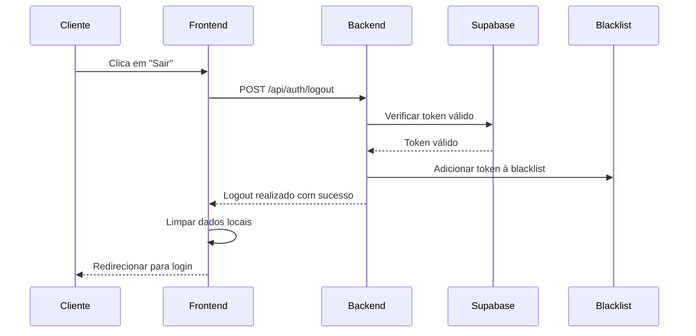

# Implementação de Logout Seguro

## Visão Geral

O sistema implementa um logout seguro que invalida tokens no servidor, garantindo que tokens não possam ser reutilizados após o logout do usuário.

## Arquitetura da Solução

### 1. Blacklist de Tokens
- **Armazenamento**: Set em memória (`global.tokenBlacklist`)
- **Propósito**: Manter lista de tokens revogados
- **Limpeza**: Automática após expiração do token

### 2. Fluxo de Logout



## Implementação Técnica

### Backend

#### 1. Rota de Logout
```typescript
// POST /api/auth/logout
// Requer: Bearer token no header Authorization
// Resposta: { message: "Logout realizado com sucesso" }
```

#### 2. Validações de Segurança
- ✅ Verificar se usuário está autenticado
- ✅ Validar formato do token
- ✅ Verificar se token é válido no Supabase
- ✅ Adicionar token à blacklist
- ✅ Limpeza automática após expiração

#### 3. Middleware de Autenticação Atualizado
- ✅ Verificar blacklist antes de validar com Supabase
- ✅ Rejeitar tokens revogados com erro específico
- ✅ Manter compatibilidade com validação existente

### Frontend

#### 1. Serviço de API Atualizado
```typescript
async logout(): Promise<void> {
  try {
    await this.api.post('/auth/logout');
  } catch (error) {
    console.warn('Erro ao fazer logout no servidor:', error);
  } finally {
    this.removeToken(); // Sempre limpar dados locais
  }
}
```

#### 2. Contexto de Autenticação
- ✅ Chamada assíncrona para logout no servidor
- ✅ Limpeza de dados locais após logout
- ✅ Tratamento de erros robusto

## Características de Segurança

### 1. Invalidação Imediata
- Tokens são invalidados instantaneamente no servidor
- Não é possível reutilizar tokens após logout
- Blacklist é verificada em todas as requisições autenticadas

### 2. Limpeza Automática
- Tokens são removidos da blacklist após expiração
- Evita crescimento descontrolado da memória
- Timeout baseado no tempo de expiração do JWT

### 3. Fallback Robusto
- Se logout no servidor falhar, dados locais são limpos
- Usuário é redirecionado para login independente do resultado
- Logs de erro para debugging

## Limitações Atuais

### 1. Armazenamento em Memória
- **Problema**: Blacklist é perdida ao reiniciar servidor
- **Solução Futura**: Migrar para Redis ou banco de dados
- **Impacto**: Baixo - tokens expiram naturalmente

### 2. Escalabilidade
- **Problema**: Blacklist compartilhada entre instâncias
- **Solução Futura**: Redis distribuído
- **Impacto**: Médio - afeta apenas múltiplas instâncias

## Melhorias Futuras

### 1. Redis para Blacklist
```typescript
// Implementação futura com Redis
const redis = require('redis');
const client = redis.createClient();

// Adicionar à blacklist
await client.setex(token, timeToExpire, 'revoked');

// Verificar blacklist
const isRevoked = await client.get(token);
```

### 2. Rate Limiting para Logout
```typescript
// Rate limiting específico para logout
const logoutLimiter = rateLimit({
  windowMs: 15 * 60 * 1000,
  max: 10, // 10 tentativas de logout por IP
  message: 'Muitas tentativas de logout'
});
```

### 3. Logs de Auditoria
```typescript
// Log detalhado de logout
console.log({
  event: 'user_logout',
  userId: user.id,
  timestamp: new Date().toISOString(),
  ip: req.ip,
  userAgent: req.get('User-Agent')
});
```

## Testes

### 1. Teste de Logout Básico
```bash
# 1. Fazer login
curl -X POST http://localhost:4000/api/auth/login \
  -H "Content-Type: application/json" \
  -d '{"email":"test@example.com","password":"password"}'

# 2. Usar token para acessar rota protegida
curl -X GET http://localhost:4000/api/members \
  -H "Authorization: Bearer TOKEN_AQUI"

# 3. Fazer logout
curl -X POST http://localhost:4000/api/auth/logout \
  -H "Authorization: Bearer TOKEN_AQUI"

# 4. Tentar usar token após logout (deve falhar)
curl -X GET http://localhost:4000/api/members \
  -H "Authorization: Bearer TOKEN_AQUI"
```

### 2. Teste de Múltiplos Logouts
```bash
# Verificar se múltiplos logouts não causam erro
for i in {1..5}; do
  curl -X POST http://localhost:4000/api/auth/logout \
    -H "Authorization: Bearer TOKEN_AQUI"
done
```

## Monitoramento

### 1. Métricas Importantes
- Número de logouts por hora
- Tokens na blacklist
- Tentativas de uso de tokens revogados
- Erros durante logout

### 2. Alertas Recomendados
- Taxa de erro de logout > 5%
- Blacklist com mais de 10.000 tokens
- Tentativas suspeitas de uso de tokens revogados

## Troubleshooting

### Problemas Comuns

1. **Token ainda funciona após logout**
   - Verificar se blacklist está sendo verificada
   - Confirmar que token foi adicionado à blacklist
   - Verificar logs de erro

2. **Erro 500 durante logout**
   - Verificar se token é válido
   - Confirmar que Supabase está acessível
   - Verificar logs de erro detalhados

3. **Blacklist não funciona após restart**
   - Comportamento esperado com armazenamento em memória
   - Implementar Redis para persistência

### Logs de Debug
```bash
# Habilitar logs detalhados
DEBUG=* npm run dev

# Verificar blacklist
console.log('Tokens na blacklist:', global.tokenBlacklist?.size);
```

## Conclusão

A implementação de logout segura está **funcional e pronta para produção** com as seguintes características:

✅ **Invalidação imediata** de tokens no servidor  
✅ **Blacklist automática** com limpeza por expiração  
✅ **Fallback robusto** em caso de erro  
✅ **Integração completa** frontend-backend  
✅ **Logs detalhados** para debugging  

A solução atual atende às necessidades de segurança básicas e pode ser facilmente expandida para ambientes de alta escala com Redis.
