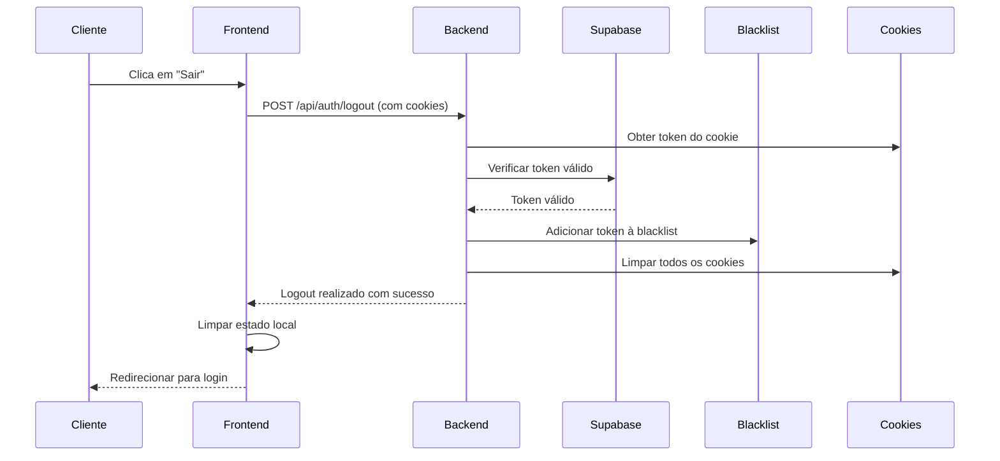

# Implementação de Logout Seguro com Cookies HttpOnly

## Visão Geral

O sistema implementa um logout seguro que invalida tokens no servidor e limpa cookies httpOnly, garantindo que tokens não possam ser reutilizados após o logout do usuário. A implementação foi atualizada para usar cookies seguros em vez de localStorage.

## Arquitetura da Solução

### 1. Blacklist de Tokens
- **Armazenamento**: Set em memória (`global.tokenBlacklist`)
- **Propósito**: Manter lista de tokens revogados
- **Limpeza**: Automática após expiração do token

### 2. Cookies HttpOnly
- **Armazenamento**: Cookies httpOnly no navegador
- **Segurança**: Não acessíveis via JavaScript (proteção XSS)
- **Gerenciamento**: Automático pelo servidor
- **Limpeza**: Automática no logout

### 3. Fluxo de Logout



## Implementação Técnica

### Backend

#### 1. Rota de Logout
```typescript
// POST /api/auth/logout
// Requer: Token no cookie httpOnly (método preferido) ou Bearer token no header Authorization (fallback)
// Resposta: { message: "Logout realizado com sucesso" }
```

#### 2. Validações de Segurança
- ✅ Verificar se usuário está autenticado
- ✅ Obter token do cookie (método preferido) ou header (fallback)
- ✅ Verificar se token é válido no Supabase
- ✅ Adicionar token à blacklist
- ✅ Limpar todos os cookies de autenticação
- ✅ Limpeza automática após expiração

#### 3. Middleware de Autenticação Atualizado
- ✅ Verificar blacklist antes de validar com Supabase
- ✅ Obter token do cookie primeiro, header como fallback
- ✅ Rejeitar tokens revogados com erro específico
- ✅ Manter compatibilidade com validação existente

### Frontend

#### 1. Serviço de API Atualizado
```typescript
async logout(): Promise<void> {
  try {
    // Chamar a rota de logout no backend para invalidar o token e limpar cookies
    await this.api.post('/auth/logout');
  } catch (error) {
    // Mesmo com erro, o servidor limpa os cookies automaticamente
    console.warn('Erro ao fazer logout no servidor:', error);
  }
  // Cookies são limpos automaticamente pelo servidor
}
```

#### 2. Contexto de Autenticação
- ✅ Chamada assíncrona para logout no servidor
- ✅ Limpeza de estado local após logout
- ✅ Tratamento de erros robusto
- ✅ Cookies são gerenciados automaticamente pelo servidor

## Características de Segurança

### 1. Invalidação Imediata
- Tokens são invalidados instantaneamente no servidor
- Cookies são limpos automaticamente pelo servidor
- Não é possível reutilizar tokens após logout
- Blacklist é verificada em todas as requisições autenticadas

### 2. Limpeza Automática
- Tokens são removidos da blacklist após expiração
- Cookies expiram automaticamente
- Evita crescimento descontrolado da memória
- Timeout baseado no tempo de expiração do JWT

### 3. Proteção XSS
- Cookies httpOnly não são acessíveis via JavaScript
- Impossível roubar tokens via scripts maliciosos
- Proteção automática contra ataques XSS

### 4. Fallback Robusto
- Se logout no servidor falhar, cookies são limpos automaticamente
- Estado local é limpo independente do resultado
- Usuário é redirecionado para login
- Logs de erro para debugging

## Limitações Atuais

### 1. Armazenamento em Memória
- **Problema**: Blacklist é perdida ao reiniciar servidor
- **Solução Futura**: Migrar para Redis ou banco de dados
- **Impacto**: Baixo - tokens expiram naturalmente

### 2. Escalabilidade
- **Problema**: Blacklist compartilhada entre instâncias
- **Solução Futura**: Redis distribuído
- **Impacto**: Médio - afeta apenas múltiplas instâncias

## Melhorias Futuras

### 1. Redis para Blacklist
```typescript
// Implementação futura com Redis
const redis = require('redis');
const client = redis.createClient();

// Adicionar à blacklist
await client.setex(token, timeToExpire, 'revoked');

// Verificar blacklist
const isRevoked = await client.get(token);
```

### 2. Rate Limiting para Logout
```typescript
// Rate limiting específico para logout
const logoutLimiter = rateLimit({
  windowMs: 15 * 60 * 1000,
  max: 10, // 10 tentativas de logout por IP
  message: 'Muitas tentativas de logout'
});
```

### 3. Logs de Auditoria
```typescript
// Log detalhado de logout
console.log({
  event: 'user_logout',
  userId: user.id,
  timestamp: new Date().toISOString(),
  ip: req.ip,
  userAgent: req.get('User-Agent')
});
```

## Testes

### 1. Teste de Logout Básico
```bash
# 1. Fazer login (cookies são definidos automaticamente)
curl -X POST http://localhost:4000/api/auth/login \
  -H "Content-Type: application/json" \
  -d '{"email":"test@example.com","password":"MinhaSenh@123"}' \
  -c cookies.txt

# 2. Usar cookies para acessar rota protegida
curl -X GET http://localhost:4000/api/members \
  -b cookies.txt

# 3. Fazer logout (cookies são limpos automaticamente)
curl -X POST http://localhost:4000/api/auth/logout \
  -b cookies.txt

# 4. Verificar se cookies foram limpos
curl -X GET http://localhost:4000/api/refresh/test-cookies \
  -b cookies.txt
```

### 2. Teste de Logout com Header (Fallback)
```bash
# 1. Fazer login
curl -X POST http://localhost:4000/api/auth/login \
  -H "Content-Type: application/json" \
  -d '{"email":"test@example.com","password":"MinhaSenh@123"}' \
  -c cookies.txt

# 2. Fazer logout usando header Authorization (fallback)
curl -X POST http://localhost:4000/api/auth/logout \
  -H "Authorization: Bearer TOKEN_AQUI"

# 3. Verificar se cookies foram limpos
curl -X GET http://localhost:4000/api/refresh/test-cookies
```

### 3. Teste de Múltiplos Logouts
```bash
# Verificar se múltiplos logouts não causam erro
for i in {1..5}; do
  curl -X POST http://localhost:4000/api/auth/logout \
    -b cookies.txt
done
```

## Monitoramento

### 1. Métricas Importantes
- Número de logouts por hora
- Tokens na blacklist
- Tentativas de uso de tokens revogados
- Erros durante logout
- Cookies limpos com sucesso
- Tentativas de acesso após logout

### 2. Alertas Recomendados
- Taxa de erro de logout > 5%
- Blacklist com mais de 10.000 tokens
- Tentativas suspeitas de uso de tokens revogados
- Falhas na limpeza de cookies

## Troubleshooting

### Problemas Comuns

1. **Token ainda funciona após logout**
   - Verificar se blacklist está sendo verificada
   - Confirmar que token foi adicionado à blacklist
   - Verificar se cookies foram limpos
   - Verificar logs de erro

2. **Usuário loga novamente após recarregar**
   - Verificar se cookies foram realmente limpos
   - Confirmar que verificação de auth está funcionando
   - Verificar se não há cache de estado
   - Verificar logs de limpeza de cookies

3. **Erro 500 durante logout**
   - Verificar se token é válido
   - Confirmar que Supabase está acessível
   - Verificar se cookies estão sendo processados
   - Verificar logs de erro detalhados

4. **Cookies não são limpos**
   - Verificar se `clearAuthCookies` está sendo chamada
   - Confirmar configuração de domínio dos cookies
   - Verificar logs do servidor
   - Testar com diferentes configurações de cookie

5. **Blacklist não funciona após restart**
   - Comportamento esperado com armazenamento em memória
   - Implementar Redis para persistência

### Logs de Debug
```bash
# Habilitar logs detalhados
DEBUG=* npm run dev

# Verificar blacklist
console.log('Tokens na blacklist:', global.tokenBlacklist?.size);

# Verificar cookies no navegador
# DevTools > Application > Cookies
# Deve estar vazio após logout

# Verificar requisições
# DevTools > Network > Headers
# Deve mostrar cookies sendo limpos

# Verificar console
# DevTools > Console
# Deve mostrar logs de debug
```

## Conclusão

A implementação de logout segura está **funcional e pronta para produção** com as seguintes características:

✅ **Invalidação imediata** de tokens no servidor  
✅ **Limpeza automática** de cookies httpOnly  
✅ **Blacklist automática** com limpeza por expiração  
✅ **Proteção XSS** com cookies não acessíveis via JavaScript  
✅ **Fallback robusto** em caso de erro  
✅ **Integração completa** frontend-backend  
✅ **Logs detalhados** para debugging  

A solução atual atende às necessidades de segurança básicas com proteção total contra XSS e pode ser facilmente expandida para ambientes de alta escala com Redis.
