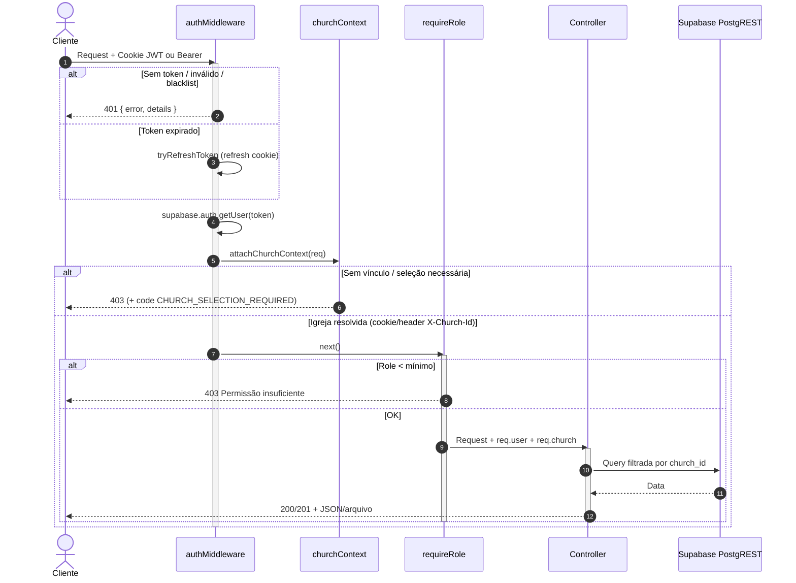

# API Design — Flock

> Contratos HTTP da API Express. Visão de sistema: [[03_arquitetura/visao-geral]] · Schema: [[03_arquitetura/banco-de-dados]].  
> Fonte: `backend/src/app.ts`, `routes/*.ts`, `middlewares/*`, `validators/*` (analisados em 2026-07-13).

---

## 1. 📋 Visão Geral da API

| Item | Valor |
| --- | --- |
| Tipo | **REST** sobre HTTP/JSON (sem GraphQL, tRPC ou gRPC) |
| Runtime | Express 4 · TypeScript · porta default `4000` |
| Base URL | `/api/*` (sem `/v1`; **sem versionamento** de path/header) |
| Formato | `application/json` (exceto webhook Stripe raw, uploads CSV, exports PDF/CSV) |
| Auth padrão | Cookie HttpOnly com access/refresh JWT Supabase; fallback `Authorization: Bearer <token>` |
| Tenant | Contexto de igreja via auth + cookie/sessão; header opcional `X-Church-Id` |
| OpenAPI/Swagger | **Não existe** |
| Testes de API | **Não encontrados** no backend (`*.test.ts` / `*.spec.ts` ausentes) |
| CORS | `FRONTEND_URL` + `LANDING_URL`; `credentials: true`; headers `Authorization`, `Cookie`, `X-Church-Id` |

**Rotas fora de `/api`:** `GET /health`, `GET /metrics` (token interno).

---

## 2. 📐 Convenções de Design

### Nomenclatura de Endpoints

| Padrão | Exemplo | Descrição |
| --- | --- | --- |
| `GET /recursos` | `GET /api/members` | Listar (frequentemente com query filters) |
| `POST /recursos` | `POST /api/members` | Criar |
| `GET /recursos/:id` | `GET /api/members/:id` | Buscar por ID |
| `PUT /recursos/:id` | `PUT /api/members/:id` | Atualizar (padrão dominante de update) |
| `PATCH /recursos/:id/...` | `PATCH /api/members/:id/status` | Update parcial / status / deactivate |
| `DELETE /recursos/:id` | `DELETE /api/members/:id` | Remover (geralmente **hard delete**) |
| Nested | `POST /api/groups/:id/members` | Sub-recursos |
| Actions | `POST /api/integration/:id/convert` | Verbo de domínio no path |
| Public tokens | `POST /api/public/registration/:token` | Capacidade via token na URL |
| Batch | `POST /api/members/batch` | Criação em lote |
| Export | `POST /api/export/members/list` | Body com filtros → arquivo |

**Notas:** plurais em inglês kebab/snake (`registration-links`, `church-users`). Mistura de nouns e action verbs (`activate-free-plan`, `sync-subscription`). **Não há prefixo `/v1`.**

### Formato de Resposta de Sucesso

Não há envelope único `{ data, meta }` em **todos** os endpoints. Padrões encontrados:

```typescript
// Lista paginada (ex.: members, integration)
{
  data: T[];
  pagination: {
    page: number;
    limit: number;
    total: number;
    totalPages: number;
    hasNextPage: boolean;
    hasPrevPage: boolean;
    nextPage: number | null;
    prevPage: number | null;
  };
  filters?: Record<string, unknown>;  // eco dos filtros aplicados (members)
  sorting?: { sort_by: string; sort_order: 'asc' | 'desc' };
}

// Recurso único / create — frequentemente o objeto direto
Member | { id: string; ... }

// Create
// HTTP 201 + body do recurso criado

// Mensagens simples / health
{ status: 'ok' }
{ message: string; ... }  // alguns fluxos
```

Exports PDF/CSV respondem com `Content-Type` de arquivo (stream/binário), não JSON.

### Formato de Resposta de Erro

Padrão dominante (não há `code` em todos os erros):

```typescript
{
  error: string;       // título curto em PT
  details?: string | object;  // mensagem ou detalhes de validação Joi
  code?: string;       // raro; ex.: "CHURCH_SELECTION_REQUIRED"
  memberships?: unknown[]; // só no fluxo de seleção de igreja
}
```

Handler global (`app.ts`):

```typescript
{ error: 'Erro interno do servidor', details?: string } // details só em development
```

Validação Joi tipicamente: `400` com `error` + `details` (array/objeto de Joi). Rate limit: `429` implícito do `express-rate-limit` com body `{ error, details }`.

### Códigos HTTP Utilizados

| Código | Quando usar (observado) |
| --- | --- |
| 200 | Sucesso com body |
| 201 | Recurso criado (`POST` members, batch, etc.) |
| 204 | Pouco usado (delete frequentemente retorna 200 + mensagem) |
| 400 | Validação, regra simples, erro Supabase de write |
| 401 | Sem token / inválido / revogado |
| 403 | Sem igreja, role insuficiente, `CHURCH_SELECTION_REQUIRED` |
| 404 | Recurso não encontrado; também **mascaramento** de rotas internas sem token |
| 429 | Rate limit |
| 500 | Erro interno / catch genérico |
| 503 | Health Stripe unhealthy |

`422` **não** é padrão consistente no código atual (regras de negócio costumam vir como `400`/`403`).

---

## 3. 🔐 Autenticação e Autorização na API

### Mecanismos

| Mecanismo | Uso |
| --- | --- |
| Cookie access + refresh (preferido) | App web autenticado |
| `Authorization: Bearer` | Fallback / clientes sem cookie |
| Refresh automático no middleware | Se access expirado, tenta `refreshSession` e reaplica cookies |
| Blacklist in-memory `global.tokenBlacklist` | Logout / revogação (não distribuída) |
| `authUserOnly` | JWT sem exigir igreja (`/church/memberships`, `/church/active`) |
| `authMiddleware` | JWT + `attachChurchContext` |
| `requireRole(minRole)` | Hierarquia `owner > admin > editor > reader` |
| `optionalAuth` | Checkout público ou autenticado |
| Token público na URL | Links de cadastro/integração |
| Stripe-Signature | Webhook |
| `x-internal-token` / `?token=` | `/metrics`, billing stats |
| Header `X-Church-Id` | Escolha de igreja quando há múltiplas memberships |

### Diagrama (fluxo real)



Papéis mínimos típicos: **reader** = GET; **editor** = write de domínio; **admin** = igreja/billing/usuários/logs; **owner** implica admin+.

---

## 4. 📚 Inventário de Endpoints

Legenda Auth: ❌ público · ✅ JWT (+ church) · 👤 JWT user-only · 🔓 opcional · 🍪 refresh/sessão · 🔗 token URL · 💳 Stripe · 🔑 interno  
Role: mínimo `requireRole`. Status: ✅ implementado.

### Health / Internos

| Método | Rota | Auth | Role | Descrição | Status |
| --- | --- | --- | --- | --- | --- |
| GET | `/health` | ❌ | — | Health básico | ✅ |
| GET | `/metrics` | 🔑 `METRICS_TOKEN` | — | Prometheus | ✅ |
| GET | `/api/internal/billing/stats` | 🔑 `INTERNAL_BILLING_TOKEN` | — | Stats billing | ✅ |
| GET | `/api/health/stripe` | 🔑 opcional `HEALTH_CHECK_TOKEN` | — | Health Stripe | ✅ |

### Auth (`/api/auth`)

| Método | Rota | Auth | Role | Descrição | Status |
| --- | --- | --- | --- | --- | --- |
| POST | `/api/auth/register` | ❌ | — | Registro (RL 10/15min) | ✅ |
| POST | `/api/auth/login` | ❌ | — | Login (RL 10/15min em falhas) | ✅ |
| POST | `/api/auth/logout` | ✅ | — | Logout | ✅ |
| POST | `/api/auth/callback` | ❌ | — | Confirmação de e-mail (RL 5/15min) | ✅ |

### Password (`/api/password`)

| Método | Rota | Auth | Role | Descrição | Status |
| --- | --- | --- | --- | --- | --- |
| POST | `/api/password/forgot` | ❌ | — | Solicitar reset (RL 5/h) | ✅ |
| POST | `/api/password/reset` | ❌ | — | Reset com token (RL 5/h) | ✅ |
| POST | `/api/password/change` | ✅ | — | Trocar senha logado (RL 5/15min) | ✅ |

### Refresh / sessão (`/api/refresh`)

| Método | Rota | Auth | Role | Descrição | Status |
| --- | --- | --- | --- | --- | --- |
| POST | `/api/refresh/refresh` | 🍪 | — | Renovar access (RL 20/15min) | ✅ |
| GET | `/api/refresh/check` | 🍪 | — | Estado da sessão (frontend) | ✅ |
| GET | `/api/refresh/test-cookies` | ❌ | — | Debug cookies | ✅ |
| POST | `/api/refresh/test-clear-cookies` | ❌ | — | Debug limpar cookies | ✅ |

### Church (`/api/church`) — RL router 50/15min

| Método | Rota | Auth | Role | Descrição | Status |
| --- | --- | --- | --- | --- | --- |
| GET | `/api/church/memberships` | 👤 | — | Listar memberships | ✅ |
| POST | `/api/church/active` | 👤 | — | Definir igreja ativa | ✅ |
| GET | `/api/church/` | ✅ | ≥ reader | Dados da igreja | ✅ |
| GET | `/api/church/member-limit` | ✅ | ≥ reader | Quota de membros | ✅ |
| PUT | `/api/church/` | ✅ | ≥ admin | Atualizar igreja | ✅ |

### Account (`/api/account`) — RL 20/15min + JWT

| Método | Rota | Auth | Role | Descrição | Status |
| --- | --- | --- | --- | --- | --- |
| GET | `/api/account/` | ✅ | — | Conta do usuário | ✅ |
| PUT | `/api/account/email` | ✅ | — | Alterar e-mail (RL sensível 5/h) | ✅ |
| PUT | `/api/account/password` | ✅ | — | Alterar senha (RL 5/h) | ✅ |
| PUT | `/api/account/phone` | ✅ | — | Alterar telefone | ✅ |
| DELETE | `/api/account/` | ✅ | — | Excluir conta (RL 5/h) | ✅ |
| POST | `/api/account/resend-confirmation` | ✅ | — | Reenviar confirmação | ✅ |
| GET | `/api/account/logs` | ✅ | ≥ admin | Audit logs | ✅ |

### Members (`/api/members`) — JWT + ≥ reader no router

| Método | Rota | Auth | Role | Descrição | Status |
| --- | --- | --- | --- | --- | --- |
| GET | `/api/members/` | ✅ | ≥ reader | Listar (paginação/filtros) | ✅ |
| GET | `/api/members/reports` | ✅ | ≥ reader | Relatórios (RL 10/min) | ✅ |
| GET | `/api/members/birthdays/count` | ✅ | ≥ reader | Contagem aniversariantes | ✅ |
| GET | `/api/members/birthdays/list` | ✅ | ≥ reader | Lista aniversariantes | ✅ |
| POST | `/api/members/import/validate` | ✅ | ≥ editor | Validar CSV | ✅ |
| POST | `/api/members/import` | ✅ | ≥ editor | Importar CSV | ✅ |
| GET | `/api/members/:id` | ✅ | ≥ reader | Detalhe | ✅ |
| POST | `/api/members/` | ✅ | ≥ editor | Criar | ✅ |
| POST | `/api/members/batch` | ✅ | ≥ editor | Criar lote | ✅ |
| PUT | `/api/members/:id` | ✅ | ≥ editor | Atualizar | ✅ |
| PATCH | `/api/members/:id/status` | ✅ | ≥ editor | Só `active` | ✅ |
| DELETE | `/api/members/:id` | ✅ | ≥ editor | **Hard delete** (comentário da rota diz soft — incorreto) | ✅ |

### Congregations (`/api/congregations`)

| Método | Rota | Auth | Role | Descrição | Status |
| --- | --- | --- | --- | --- | --- |
| GET | `/api/congregations/` | ✅ | ≥ reader | Listar | ✅ |
| GET | `/api/congregations/:id` | ✅ | ≥ reader | Detalhe | ✅ |
| POST | `/api/congregations/` | ✅ | ≥ editor | Criar | ✅ |
| POST | `/api/congregations/batch` | ✅ | ≥ editor | Lote | ✅ |
| PUT | `/api/congregations/:id` | ✅ | ≥ editor | Atualizar | ✅ |
| DELETE | `/api/congregations/:id` | ✅ | ≥ editor | Deletar | ✅ |

### Groups (`/api/groups`)

| Método | Rota | Auth | Role | Descrição | Status |
| --- | --- | --- | --- | --- | --- |
| GET | `/api/groups/` | ✅ | ≥ reader | Listar (filtros + `sort_by`/`sort_order`) | ✅ |
| GET | `/api/groups/:id` | ✅ | ≥ reader | Detalhe + membros | ✅ |
| GET | `/api/groups/:id/members` | ✅ | ≥ reader | Membros do grupo | ✅ |
| POST | `/api/groups/` | ✅ | ≥ editor | Criar | ✅ |
| PUT | `/api/groups/:id` | ✅ | ≥ editor | Atualizar | ✅ |
| DELETE | `/api/groups/:id` | ✅ | ≥ editor | Deletar | ✅ |
| POST | `/api/groups/:id/members` | ✅ | ≥ editor | Adicionar membro | ✅ |
| DELETE | `/api/groups/:id/members/:memberId` | ✅ | ≥ editor | Remover membro | ✅ |

### Integration (`/api/integration`)

| Método | Rota | Auth | Role | Descrição | Status |
| --- | --- | --- | --- | --- | --- |
| GET | `/api/integration/` | ✅ | ≥ reader | Listar (paginado) | ✅ |
| GET | `/api/integration/:id` | ✅ | ≥ reader | Detalhe | ✅ |
| POST | `/api/integration/` | ✅ | ≥ editor | Criar | ✅ |
| PUT | `/api/integration/:id` | ✅ | ≥ editor | Atualizar | ✅ |
| DELETE | `/api/integration/:id` | ✅ | ≥ editor | Deletar | ✅ |
| POST | `/api/integration/:id/convert` | ✅ | ≥ editor | Converter → member | ✅ |

### Calendar (`/api/calendar`) + participantes (`/api/...`)

| Método | Rota | Auth | Role | Descrição | Status |
| --- | --- | --- | --- | --- | --- |
| GET | `/api/calendar/` | ✅ | ≥ reader | Listar itens | ✅ |
| GET | `/api/calendar/groups` | ✅ | ≥ reader | Grupos com itens | ✅ |
| GET | `/api/calendar/export/pdf` | ✅ | ≥ reader | PDF mensal | ✅ |
| GET | `/api/calendar/:id` | ✅ | ≥ reader | Detalhe | ✅ |
| POST | `/api/calendar/` | ✅ | ≥ editor | Criar | ✅ |
| PUT | `/api/calendar/:id` | ✅ | ≥ editor | Atualizar | ✅ |
| DELETE | `/api/calendar/:id` | ✅ | ≥ editor | Deletar | ✅ |
| GET | `/api/calendar-items/:calendarItemId/participants` | ✅ | ≥ reader | Listar participantes | ✅ |
| POST | `/api/calendar-items/:calendarItemId/participants` | ✅ | ≥ editor | Adicionar | ✅ |
| POST | `/api/calendar-items/:calendarItemId/participants/bulk` | ✅ | ≥ editor | Bulk | ✅ |
| DELETE | `/api/calendar-items/:calendarItemId/participants/:participantId` | ✅ | ≥ editor | Remover | ✅ |

### Export (`/api/export`)

| Método | Rota | Auth | Role | Descrição | Status |
| --- | --- | --- | --- | --- | --- |
| GET | `/api/export/member/:id/pdf` | ✅ | ≥ reader | PDF membro | ✅ |
| GET | `/api/export/integration/:id/pdf` | ✅ | ≥ reader | PDF integrante | ✅ |
| GET | `/api/export/dashboard/pdf` | ✅ | ≥ reader | PDF dashboard | ✅ |
| POST | `/api/export/members/list` | ✅ | ≥ reader | Lista membros PDF | ✅ |
| POST | `/api/export/members/list/csv` | ✅ | ≥ reader | Lista membros CSV | ✅ |
| POST | `/api/export/group/members/list` | ✅ | ≥ reader | PDF membros do grupo | ✅ |
| POST | `/api/export/integration/list` | ✅ | ≥ reader | Lista integração | ✅ |
| POST | `/api/export/groups/list` | ✅ | ≥ reader | PDF grupos | ✅ |
| POST | `/api/export/congregations/list` | ✅ | ≥ reader | PDF congregações | ✅ |

### Links públicos gerenciados

| Método | Rota | Auth | Role | Descrição | Status |
| --- | --- | --- | --- | --- | --- |
| GET | `/api/registration-links/` | ✅ | ≥ reader | Listar | ✅ |
| GET | `/api/registration-links/:id` | ✅ | ≥ reader | Detalhe | ✅ |
| POST | `/api/registration-links/` | ✅ | ≥ editor | Criar | ✅ |
| PUT | `/api/registration-links/:id` | ✅ | ≥ editor | Atualizar | ✅ |
| PATCH | `/api/registration-links/:id/deactivate` | ✅ | ≥ editor | Soft disable | ✅ |
| DELETE | `/api/registration-links/:id` | ✅ | ≥ editor | Hard delete | ✅ |
| GET | `/api/integration-links/` | ✅ | ≥ reader | Listar | ✅ |
| GET | `/api/integration-links/:id` | ✅ | ≥ reader | Detalhe | ✅ |
| POST | `/api/integration-links/` | ✅ | ≥ editor | Criar | ✅ |
| PUT | `/api/integration-links/:id` | ✅ | ≥ editor | Atualizar | ✅ |
| PATCH | `/api/integration-links/:id/deactivate` | ✅ | ≥ editor | Soft disable | ✅ |
| DELETE | `/api/integration-links/:id` | ✅ | ≥ editor | Hard delete | ✅ |

### Public (token na URL)

| Método | Rota | Auth | Role | Descrição | Status |
| --- | --- | --- | --- | --- | --- |
| GET | `/api/public/registration/:token` | 🔗 | — | Validar link | ✅ |
| GET | `/api/public/registration/:token/groups` | 🔗 | — | Grupos para form | ✅ |
| POST | `/api/public/registration/:token` | 🔗 | — | Criar membro (RL 15/15min) | ✅ |
| GET | `/api/public/integration/:token` | 🔗 | — | Validar link | ✅ |
| POST | `/api/public/integration/:token` | 🔗 | — | Criar integrante (RL 15/15min) | ✅ |

### Plans / Waitlist

| Método | Rota | Auth | Role | Descrição | Status |
| --- | --- | --- | --- | --- | --- |
| GET | `/api/plans/` | ❌ | — | Todos os planos | ✅ |
| GET | `/api/plans/paid` | ❌ | — | Planos pagos | ✅ |
| GET | `/api/plans/:planType` | ❌ | — | Detalhe do plano | ✅ |
| POST | `/api/waitlist/` | ❌ | — | Lead landing | ✅ |

### Stripe (`/api/stripe`)

| Método | Rota | Auth | Role | Descrição | Status |
| --- | --- | --- | --- | --- | --- |
| POST | `/api/stripe/webhook` | 💳 | — | Webhook raw (RL 300/min) | ✅ |
| POST | `/api/stripe/create-checkout-session` | 🔓 | admin se auth | Checkout (público RL 10/h) | ✅ |
| POST | `/api/stripe/create-portal-session` | ✅ | ≥ admin | Customer portal | ✅ |
| POST | `/api/stripe/sync-subscription` | ✅ | ≥ admin | Sync Stripe↔DB | ✅ |
| POST | `/api/stripe/change-plan` | ✅ | ≥ admin | Trocar plano | ✅ |
| POST | `/api/stripe/activate-free-plan` | ✅ | ≥ admin | Plano free | ✅ |
| GET | `/api/stripe/checkout-status` | ✅ | ≥ admin | Status session | ✅ |
| GET | `/api/stripe/subscription-events` | ✅ | ≥ admin | Histórico eventos | ✅ |

### Church users (`/api/church-users`) — JWT + ≥ admin em todas

| Método | Rota | Auth | Role | Descrição | Status |
| --- | --- | --- | --- | --- | --- |
| GET | `/api/church-users/` | ✅ | ≥ admin | Listar usuários | ✅ |
| POST | `/api/church-users/` | ✅ | ≥ admin | Convidar/adicionar | ✅ |
| PATCH | `/api/church-users/:id` | ✅ | ≥ admin | Papel/status | ✅ |
| DELETE | `/api/church-users/:id` | ✅ | ≥ admin | Remover vínculo | ✅ |

**Total aproximado:** ~112 endpoints HTTP.

### Validação (schemas)

Validadores **Joi** em `backend/src/validators/` (não Zod no backend): `memberValidator`, `congregationValidator`, `groupValidator`, `calendarValidator`, `calendarParticipantValidator`, `integrationMemberValidator`, `registrationLinkValidator`, `churchValidator`, `accountValidator`, `passwordValidator`, `waitlistValidator`, `reportValidator`, `cnpjValidator` / `cnpjSchema`. Controllers chamam `validate*` manualmente (não há pipeline central único tipo `validate(schema)` em todas as rotas).

---

## 5. 📄 Paginação

| Aspecto | Valor |
| --- | --- |
| Estratégia | **Offset** (`page` × `limit`) via Supabase `.range(offset, offset+limit-1)` |
| Query params | `page` (default 1), `limit` (default 10 em members/integration) |
| Max `limit` | **100** (members/integration rejeitam fora de 1–100) |
| Envelope | `data` + `pagination` (ver §2) |
| Cursor / keyset | **Não adotado** |
| Stripe events | `limit` + `offset` (não `page`) |

Nem toda listagem é paginada (ex.: congregations/groups podem retornar listas completas do tenant — verificar controller ao evoluir).

---

## 6. 🔍 Filtros e Ordenação

### Members (referência mais rica)

Query params: `search`, `active`, `congregation_id`, `gender`, `marital_status`, `nationality`, `occupation`, `city`, `state`, ranges `*_date_from`/`*_date_to`, `age_from`/`age_to`, `sort_by`, `sort_order`.

`sort_by` whitelist: `name`, `birth`, `created_at`, `updated_at`, `admission_date`, `city`, `state` (default `name` asc).

`search`: filtro textual ILike aplicado no controller (não é Postgres FTS/`tsvector` dedicado).

### Outros módulos

Integration: page/limit + filtros de status/nome (ver controller).  
Groups: filtros `congregation_id`, `type`, `status`, `search` + ordenação `sort_by`/`sort_order` (whitelist `name|type|created_at|updated_at|status`; default `name` asc; fallback silencioso; resposta array sem eco de `sorting`).  
Calendar: filtros por query específicos do domínio. Account logs: page/limit.

Resposta de members ecoa `filters` e `sorting` aplicados.

---

## 7. 📤 Upload e Arquivos

| Item | Detalhe |
| --- | --- |
| Endpoints multipart | `POST /api/members/import/validate`, `POST /api/members/import` |
| Middleware | `uploadCSV.single('file')` (`multer` memory storage) |
| Tipos | CSV (`text/csv`, `application/vnd.ms-excel`, extensão `.csv`) |
| Tamanho máx. | **10 MB** |
| Destino | **Memória** do processo → parse in-process; **não** S3/R2 |
| Downloads | PDFKit / CSV gerados sob demanda nas rotas `/api/export/*` e calendário PDF |

---

## 8. 🔔 Webhooks e Eventos

| Evento | Trigger | Payload | Destino |
| --- | --- | --- | --- |
| Stripe webhooks | Stripe → `POST /api/stripe/webhook` | JSON raw + `Stripe-Signature` | Controllers Stripe; persistido em `processed_webhook_events` / atualiza `churches` |
| Crons internos | `node-cron` no processo API | N/A (jobs locais) | Limpeza pending, webhooks, integridade, downgrade, e-mails de expiração |

Não há webhooks **outbound** do Flock para clientes terceiros.

---

## 9. 📝 Convenções para Agentes

1. **Só REST JSON** sob `/api` — não introduzir GraphQL/tRPC sem ADR.
2. **Sem `/v1` por enquanto** — mudanças breaking exigem coordenação com o app Next; se versionar, documentar aqui.
3. **Validar com Joi** no padrão dos validators existentes (backend); frontend pode usar Zod.
4. **Auth:** rotas de domínio = `authMiddleware` + `requireRole`; rotas pré-igreja = `authUserOnly`; públicos = middleware de token de link.
5. **Sempre filtrar por `req.church.churchId`** em queries — service_role não isola tenant.
6. **Erros:** `{ error, details? }` em PT; usar `code` só quando o frontend precisa branchar (ex.: `CHURCH_SELECTION_REQUIRED`).
7. **Listas grandes:** preferir `page`/`limit` (max 100) + envelope `pagination`; não devolver dumps massivos sem paginação.
8. **PUT vs PATCH:** PUT = update completo; PATCH = status/deactivate/papel.
9. **Não confiar no comentário “soft delete”** da rota de members — delete atual é físico; inativação = `PATCH .../status` com `active: false`.
10. **Rate limit:** respeitar limiters existentes; endpoints sensíveis (auth, password, public POST, reports, webhook) devem ter RL dedicado além do geral (1000/15min).
11. **Webhook Stripe** registra **antes** de `express.json()` e usa body raw.
12. **Uploads:** apenas CSV via multer memory ≤10MB no fluxo de import; não inventar storage externo sem design.
13. **Header `X-Church-Id`:** preservar suporte multi-membership.
14. **Sem OpenAPI hoje** — ao criar endpoint, atualizar este inventário e os validators; se adicionar Swagger, amarrar aos schemas Joi.
15. **Testes:** preferir contract tests HTTP para novos endpoints (hoje há lacuna).

---

## Apêndice — Mapa rápido de arquivos

| Camada | Paths |
| --- | --- |
| Mount | `backend/src/app.ts` |
| Routes | `backend/src/routes/*.ts` (20 arquivos) |
| Auth/RBAC | `middlewares/auth.ts`, `requireRole.ts`, `services/churchContext.ts` |
| Public links | `publicRegistrationAuth.ts`, `publicIntegrationAuth.ts`, `publicPostLimiter.ts` |
| Stripe | `routes/stripe.ts`, `middlewares/stripeSecurity.ts` |
| Upload | `middlewares/upload.ts` |
| Validators | `backend/src/validators/*.ts` |
| Controllers | `backend/src/controllers/*` |
