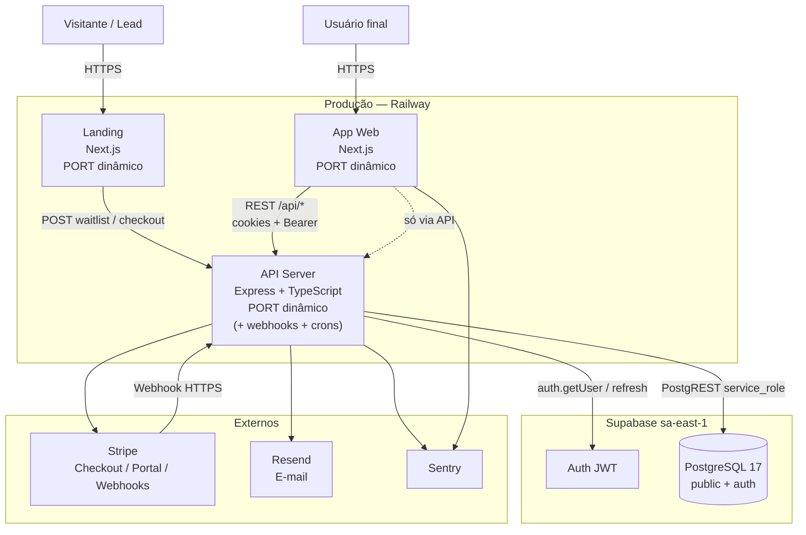
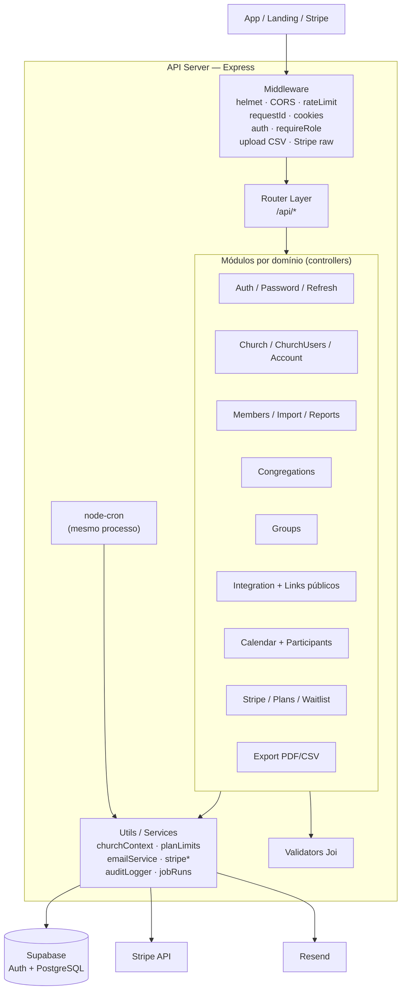
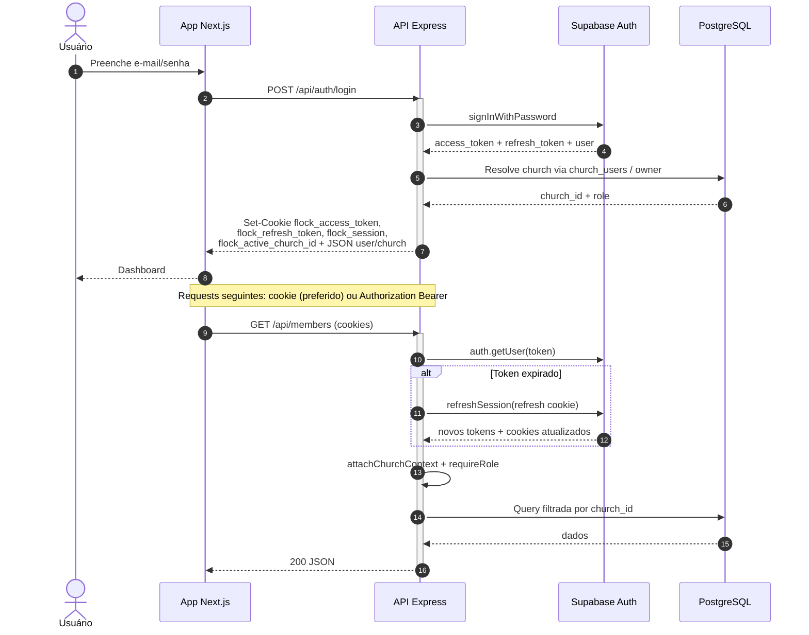
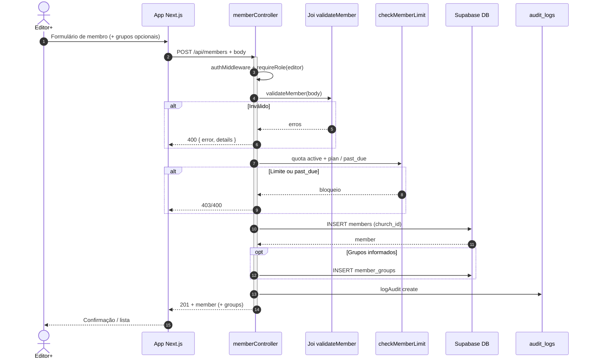
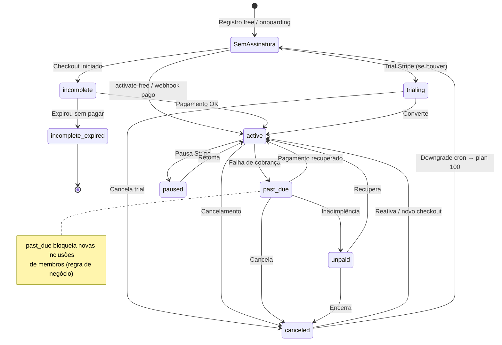
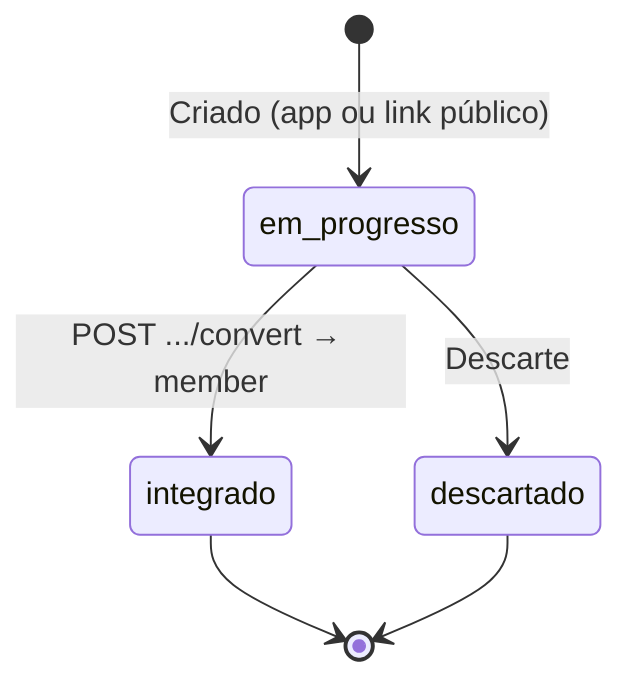
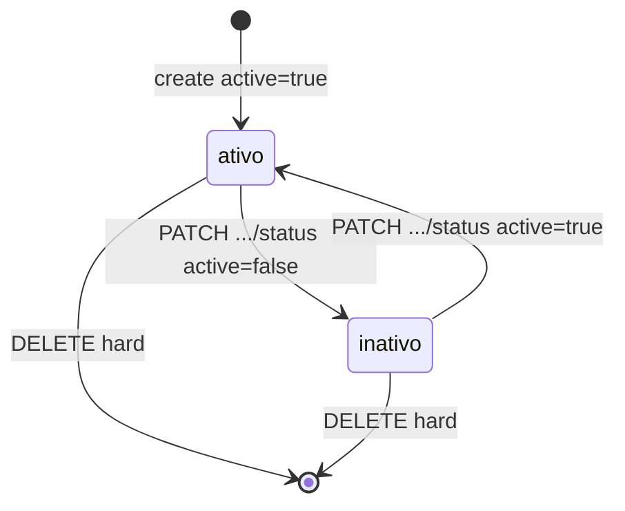
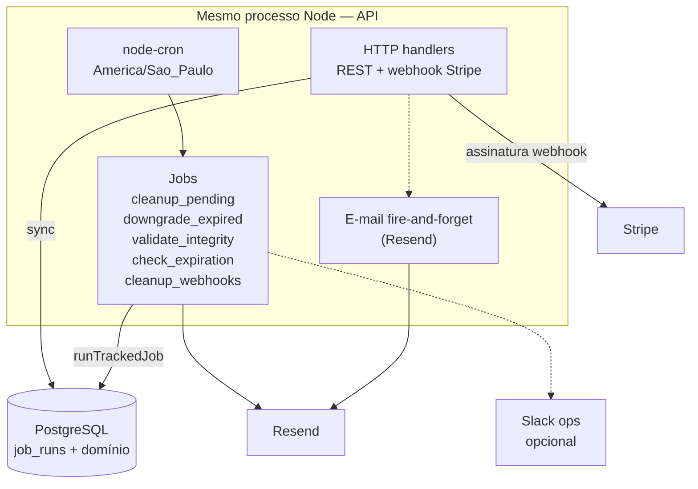

# Diagrama de Sistema — Flock

> Documento **visual**. Complementa [[03_arquitetura/visao-geral]] e [[03_arquitetura/banco-de-dados]].  
> Stack real: monorepo Express + Next.js ×2 · Supabase · Stripe · Resend · Railway · **sem** Redis/Bull/NestJS.

---

## 1. 🗺️ C4 Nível 2 — Containers

**Ausentes de propósito:** Redis, worker separado, object storage próprio, CDN dedicada.

---

## 2. 📦 C4 Nível 3 — Componentes da API

Controllers falam com Supabase direto (sem camada Repository formal).

---

## 3. 🔑 Sequência — Autenticação (email/senha)

Não há OAuth redirect no código; fluxo é formulário → API → Supabase Auth → cookies HttpOnly.

Seleção de igreja (multi-membership futuro / header): `GET /api/church/memberships` + `POST /api/church/active` com `authUserOnly`.

---

## 4. 🚀 Sequência — Criação de Membro

Operação CRUD central do domínio pastoral.

Variantes: `POST /batch`, import CSV, `POST /api/public/registration/:token` (auth por token de link, mesma quota).

---

## 5. 🔄 Estados — Assinatura da Igreja (`churches`)

Entidade com mais transições de lifecycle no SaaS (espelha Stripe + regras locais).  
`plan_type`: `100` | `200` | `500` | `800` | `custom`.

### Complemento — Integrante (`integration_members.status`)

### Complemento — Membro (`members.active`)

---

## 6. 🔃 Processamento periódico (sem fila)

Não há Redis/Bull. Work assíncrono = **cron no processo da API** + e-mail fire-and-forget + webhook Stripe síncrono no request.

Schedules (resumo): 02h pending · 03h downgrade · 05h integridade · 09h e-mails expiração · domingo 04h cleanup webhooks.

---

## Referências cruzadas

| Diagrama | Documentos |
| --- | --- |
| Containers | [[03_arquitetura/visao-geral]] · [[03_arquitetura/infraestrutura]] |
| Componentes API | [[03_arquitetura/api-design]] |
| Auth / RBAC | [[03_arquitetura/seguranca]] · [[01_produto/personas-e-usuarios]] |
| Schema / FKs | [[03_arquitetura/banco-de-dados]] |
| Billing / membros | [[02_regras-de-negocio/regras-por-modulo/billing]] · [[02_regras-de-negocio/regras-por-modulo/membros]] |
| Performance dos jobs | [[03_arquitetura/performance-e-escalabilidade]] |
