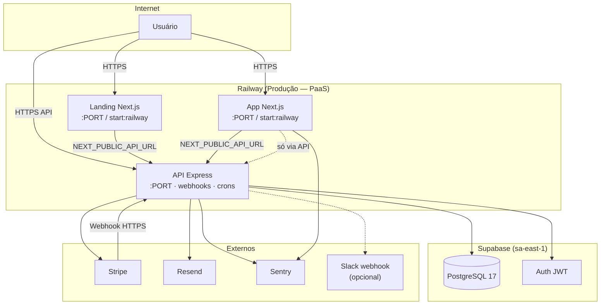
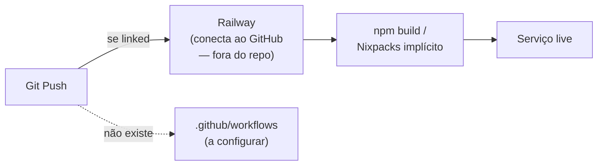

# Infraestrutura — Flock

> Como o sistema é hospedado, configurado e observado.  
> Visão de sistema: [[03_arquitetura/visao-geral]] · API: [[03_arquitetura/api-design]] · DB: [[03_arquitetura/banco-de-dados]].  
> Fontes: `docker-compose.yml`, `backend/Dockerfile`, scripts de deploy, README/SETUP Railway, env usage no código, docs legadas.

---

## 1. 🌍 Visão Geral da Infraestrutura

| Item | Valor encontrado |
| --- | --- |
| Cloud / PaaS app | **Railway** (docs + `start:railway`, trust proxy no Express) |
| Banco / Auth | **Supabase** (PostgreSQL 17 gerenciado + Auth) — projeto `flock-app-01`, região `sa-east-1` |
| Modelo de deploy | **PaaS Node** (build npm no Railway) e/ou **Docker** local; frontend `output: 'standalone'` comentado (deploy preferido **sem Dockerfile** no Railway) |
| CDN / Edge / Cloudflare | **Não configurado** no repo (a configurar) |
| CI/CD GitHub/GitLab | **Ausente** — sem `.github/workflows/`, sem `.gitlab-ci.yml`, sem `railway.toml`/`railway.json` versionados |
| Serviços em produção (esperado) | **3 apps Railway**: API Express, App Next.js, Landing Next.js + **1 datastore externo** Supabase (+ Stripe, Resend, Sentry) |
| Worker separado | **Não** — crons (`node-cron`) rodam **no mesmo processo** da API |
| Redis / filas | **Não** |
| Staging formal | Mencionado em docs (`NODE_ENV=staging`) — **infra dedicada não documentada/encontrada** |

---

## 2. 🗺️ Diagrama de Infraestrutura



**Notas:** sem CDN/edge documentada; sem Redis; Postgres não é um serviço Railway — é Supabase. Domínios de exemplo na docs: `flock.com.br` / `app.flock.com.br` / `api.flock.com.br` (podem divergir dos `*.up.railway.app` reais).

---

## 3. 🏗️ Ambientes

| Ambiente | Propósito | URL (docs / padrão) | Branch | Auto-deploy |
| --- | --- | --- | --- | --- |
| **development** | Dev local | landing `:3000`, app `:3001`, API `:4000` | — | — |
| **staging** | Homologação | (a configurar) — citado só via `NODE_ENV=staging` | (a configurar) | ❌ pipeline não encontrado |
| **production** | Produção | Docs: `https://flock.com.br`, `https://app.flock.com.br`, `https://api.flock.com.br/api`; Railway: `*.up.railway.app` | tipicamente `main` (não codificado) | Railway GitHub connect (doc) — **sem workflow no repo** |

**Local (Docker Compose):** backend `:4000`, frontend mapeado `:3000` (atenção: porta Compose ≠ `npm run dev` do front em `:3001`).

---

## 4. 🐳 Containerização

### Backend (`backend/Dockerfile`) — ativo

- Base: `node:20-alpine`
- **Multi-stage:** `builder` (`npm ci` + `tsc`) → runtime (`node dist/app.js`)
- Copia templates de e-mail para `dist/templates/emails`
- User não-root `nodejs`
- `EXPOSE 4000` · `NODE_ENV=production`

### Frontend

| Arquivo | Status |
| --- | --- |
| `frontend/Dockerfile` | **Ausente** (compose referencia, mas não existe) |
| `frontend/Dockerfile.backup` | Multi-stage standalone Next.js + Railway `PORT`/`HOSTNAME` |
| `frontend/Dockerfile.simple.backup` | Variante simples |

`frontend/next.config.ts`: `output: 'standalone'` **comentado** (“deploy sem Dockerfile no Railway”).

### Landing

Sem Dockerfile próprio; deploy Railway via `npm run build` + `npm run start:railway`.

### `docker-compose.yml` (v3.8) — local/produção local

| Serviço | Porta host | Notas |
| --- | --- | --- |
| `backend` | 4000 | Build `./backend/Dockerfile`; health → `GET /health` |
| `frontend` | 3000 | Build `./frontend/Dockerfile` (**quebrado** sem o arquivo); `depends_on: service_healthy` |
| Rede | `flock-network` (bridge) | — |
| Volumes | Nenhum persistente | Dados no Supabase externo |
| Postgres/Redis no Compose | **Não** | — |

```bash
# Comandos (scripts/deploy.sh espelha o menu)
docker-compose build
docker-compose up -d
docker-compose up -d --build
docker-compose down
docker-compose logs -f
docker-compose down -v --rmi all   # rebuild completo do script
```

Scripts: `scripts/deploy.sh`, `scripts/deploy.ps1` — assistentes locais Docker, **não** deploy Railway cloud.

---

## 5. 🔄 Pipeline de CI/CD

**Nenhum pipeline versionado no repositório.**



O que **existe**: scripts manuais Docker + documentação de setup Railway (root directory por pasta, build/start commands).  
O que **falta**: lint/test gates, approve staging→prod, healthcheck pós-deploy automatizado, migrations no deploy.

Diagrama “ideal vs real”: gates de qualidade e approve manual **estão a configurar**.

---

## 6. 🔧 Variáveis de Ambiente

Não há `.env.example` commitado visível (script tenta copiar `backend/.env.example` / `frontend/.env.example`). Lista abaixo = **uso no código + docs** (`docs/ENVIRONMENT-VARIABLES.md`, `EMAIL_CONFIG.md`).

### Database / Auth (Supabase)

| Variável | Ambiente | Obrigatória | Descrição | Exemplo |
| --- | --- | --- | --- | --- |
| `SUPABASE_URL` | Backend | ✅ | Project URL | `https://xxx.supabase.co` |
| `SUPABASE_KEY` | Backend | ✅ | Anon key (auth client) | `eyJ...` |
| `SUPABASE_SERVICE_ROLE_KEY` | Backend | ✅ | Service role (bypass RLS) | `eyJ...` |

### App config

| Variável | Ambiente | Obrigatória | Descrição | Exemplo |
| --- | --- | --- | --- | --- |
| `PORT` | Todos apps | ⚙️ | Porta runtime (Railway injeta) | `4000` / dinâmica |
| `NODE_ENV` | Todos | ⚙️ | `development` / `staging` / `production` | `production` |
| `FRONTEND_URL` | Backend | ⚙️ | CORS, redirects, e-mails | `http://localhost:3001` |
| `LANDING_URL` | Backend | ⚙️ | CORS + checkout success URLs | `http://localhost:3000` |
| `ENABLE_CRON_JOBS` | Backend | ⚙️ | Default on; `false` desliga | `true` |
| `NEXT_PUBLIC_API_URL` | Front + Landing | ✅ | Base API com `/api` | `http://localhost:4000/api` |
| `NEXT_PUBLIC_FRONTEND_URL` | Landing | ⚙️ | Links para o app | `http://localhost:3001` |
| `NEXT_PUBLIC_LANDING_URL` | Frontend | ⚙️ | Link pricing no login | `http://localhost:3000` |
| `NEXT_PUBLIC_SITE_URL` | Landing | ⚙️ | SEO/sitemap | `https://flockapp.com.br` |
| `CI` | Front build | ⚙️ | Usado pelo Sentry webpack | — |

### Stripe

| Variável | Ambiente | Obrigatória | Descrição |
| --- | --- | --- | --- |
| `STRIPE_SECRET_KEY` | Backend | ✅ | `sk_test_` / `sk_live_` |
| `STRIPE_WEBHOOK_SECRET` | Backend | ✅ | `whsec_...` |
| `STRIPE_PRICE_ID_M200` | Backend | ✅ | Price plano 200 |
| `STRIPE_PRICE_ID_M500` | Backend | ✅ | Price plano 500 |
| `STRIPE_PRICE_ID_M800` | Backend | ✅ | Price plano 800 |

> Plan type `100` / `custom` existem no schema; **não há** `STRIPE_PRICE_ID_M100` no código de preços.

### E-mail (Resend)

| Variável | Ambiente | Obrigatória | Descrição |
| --- | --- | --- | --- |
| `RESEND_API_KEY` | Backend | ⚙️* | Sem ela, e-mails não saem (warn) |
| `RESEND_FROM_EMAIL` | Backend | ⚙️ | Default `contato@flockapp.com.br` |
| `RESEND_FROM_NAME` | Backend | ⚙️ | Default `Flock App` |
| `ADMIN_EMAIL` | Backend | ⚙️ | Notificações admin / reply-to |

\*Funcionalidades que dependem de e-mail degradam sem a key.

### Observabilidade / Ops

| Variável | Ambiente | Obrigatória | Descrição |
| --- | --- | --- | --- |
| `SENTRY_DSN` | Backend | ⚙️ | Init Sentry billing/ops |
| `SENTRY_ENABLED` | Backend | ⚙️ | Default on se DSN set; `false` desliga |
| `SENTRY_TRACES_SAMPLE_RATE` | Backend | ⚙️ | Default `0.1` |
| `NEXT_PUBLIC_SENTRY_DSN` | Frontend | ⚙️ | Sentry browser/server |
| `NEXT_PUBLIC_SENTRY_ENABLED` | Frontend | ⚙️ | Gate |
| `NEXT_PUBLIC_SENTRY_TRACES_SAMPLE_RATE` | Frontend | ⚙️ | Default `0.1` |
| `SENTRY_ORG` / `SENTRY_PROJECT` | Front build | ⚙️ | `withSentryConfig` |
| `METRICS_TOKEN` | Backend | ⚙️ | Protege `GET /metrics` |
| `INTERNAL_BILLING_TOKEN` | Backend | ⚙️ | Protege `/api/internal/billing/stats` |
| `HEALTH_CHECK_TOKEN` | Backend | ⚙️ | Protege `/api/health/stripe` (404 se inválido) |
| `OPS_ALERTS_ENABLED` | Backend | ⚙️ | Default on; `false` silencia |
| `SLACK_OPS_WEBHOOK_URL` | Backend | ⚙️ | Alertas billing → Slack |

### Agrupamento rápido

| Grupo | Variáveis |
| --- | --- |
| Database/Auth | `SUPABASE_*` |
| App | `PORT`, `NODE_ENV`, `*_URL`, `ENABLE_CRON_JOBS`, `NEXT_PUBLIC_*` |
| Stripe | `STRIPE_*` |
| Email | `RESEND_*`, `ADMIN_EMAIL` |
| Observability | `SENTRY_*`, `NEXT_PUBLIC_SENTRY_*`, tokens métricas/health, Slack |

---

## 7. 🏥 Health Checks e Monitoramento

### Health

| Endpoint | Proteção | Retorno |
| --- | --- | --- |
| `GET /health` | Público; **fora** do rate limit geral | `{ status: 'ok' }` |
| `GET /api/health/stripe` | Opcional `HEALTH_CHECK_TOKEN` (`x-health-token` / `?token=`) | healthy / unhealthy / 404 |
| Compose healthcheck | Node HTTP para `:4000/health` | interval 30s, start_period 40s |

Não há `/ping` ou `/status` genéricos além dos acima.

### Monitoring

| Ferramenta | Onde | Status |
| --- | --- | --- |
| **Sentry** | Backend (`@sentry/node`, foco billing) + Frontend (`@sentry/nextjs`) | Configurado via env DSN |
| **Prometheus** | `GET /metrics` (`prom-client` / billing metrics) | Token interno |
| **Stats billing** | `GET /api/internal/billing/stats` | Token interno |
| **Ops alerts** | E-mail admin + Slack opcional (`opsAlertService`) | Fire-and-forget |
| Datadog / New Relic / APM full | — | **Não encontrado** |
| Alertas Sentry formalizados | — | (a configurar / fora do repo) |

### Logs

- App: `console` / `morgan('dev')` + loggers util (`structuredLogger`, billing)
- Produção: **logs do Railway** (retenção conforme plano Railway — a documentar operacionalmente)
- Correlation: header `X-Request-Id` (`requestIdMiddleware`)

---

## 8. 🔄 Processo de Deploy

### Local / Docker (scripts)

1. Criar `backend/.env` e `frontend/.env.local`
2. `docker-compose build` / `up -d --build`
3. Validar `curl localhost:4000/health`
4. Frontend depende do backend healthy

### Railway (documentado, não automatizado no repo)

1. Conectar repo GitHub ao projeto Railway (**fora do git**)
2. **Três serviços** no mesmo projeto Railway:
   - **Backend** — root `backend/` · build `npm`/`tsc` · start `npm start` / `node dist/app.js` · `trust proxy = 1`
   - **Frontend** — root `frontend/` · `npm run build` · `npm run start:railway` (`0.0.0.0`, `PORT`)
   - **Landing** — root `landing/` · build + `start:railway`
3. Configurar Variables no painel Railway (Stripe, Supabase, Resend, URLs cruzadas)
4. Configurar domínio público e webhook Stripe → `https://<api>/api/stripe/webhook`
5. **Migrations:** **não** rodam no deploy da API — aplicadas no Supabase (Dashboard/MCP) à parte
6. Health pós-deploy: `GET /health` (+ Stripe health se token)
7. **Rollback:** mecanismo Railway (redeploy versão anterior) — **não** scripted no repo

---

## 9. ⚠️ Pontos de Atenção

1. **Sem CI/CD versionado** — qualidade e deploy dependem de processo manual / config Railway externa.
2. **`docker-compose` aponta para `frontend/Dockerfile` inexistente** — Compose quebrado até restaurar Dockerfile ou ajustar serviço.
3. **Crons + webhooks no mesmo processo da API** — reinício/deploy cancela jobs em andamento; sem HA de worker.
4. **Blacklist de JWT em memória** — multi-réplica Railway invalidaria logout de forma inconsistente (a configurar sticky/single instance ou store compartilhado).
5. **Sem staging dedicado documentado** — risco de testar Stripe live/migrations direto em prod.
6. **Docs de env desatualizadas vs código** — faltam Resend, Sentry, tokens internos, Slack, `NEXT_PUBLIC_*` extras no `ENVIRONMENT-VARIABLES.md`.
7. **Sem `.env.example` commitado** (script assume existência) — onboarding frágil.
8. **Frontend Dockerfile backups** vs Railway Nixpacks — duas estratégias; `standalone` desligado.
9. **Sem CDN/WAF** — assets e DDoS dependem só de Railway + rate limit Express.
10. **Migrations manuais** — risco de drift API × schema (já visto com dump local vs live).
11. **Domínios mistos** nas docs (`flock.com.br` vs `flockapp.com.br` vs `*.railway.app`) — alinhar DNS oficial.
12. **Segredos** (`SERVICE_ROLE`, Stripe) só via Variables Railway — nunca no frontend; service_role já corretamente só no backend.

---

## Apêndice — Artefatos no repositório

| Artefato | Função |
| --- | --- |
| `docker-compose.yml` | Orquestração local backend+frontend |
| `backend/Dockerfile` | Imagem API multi-stage |
| `frontend/Dockerfile*.backup` | Referência histório Next standalone |
| `scripts/deploy.sh` / `.ps1` | Menu Docker local |
| `docs/ENVIRONMENT-VARIABLES.md` | Catálogo parcial de envs |
| `docs/EMAIL_CONFIG.md` | Resend + Railway Variables |
| `landing/README.md` / `SETUP.md` | Receita deploy landing no Railway |
| `frontend/package.json` → `start:railway` | Bind `0.0.0.0` + `PORT` |
| `landing/package.json` → `start:railway` | Idem porta 3000 default |
