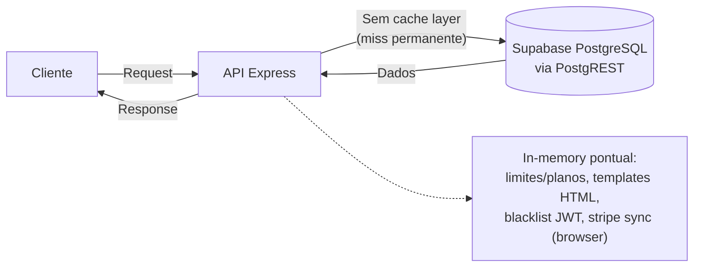

# Performance e Escalabilidade — Flock

> Como o sistema se comporta sob carga hoje e onde escalar.  
> Visão: [[03_arquitetura/visao-geral]] · DB: [[03_arquitetura/banco-de-dados]] · Infra: [[03_arquitetura/infraestrutura]] · API: [[03_arquitetura/api-design]].

---

## 1. 📊 Métricas-Alvo

Nenhum SLO/SLA formal (P95, bundle budget) foi encontrado no código ou na KB.

| Métrica | Target | Atual (se conhecido) |
| --- | --- | --- |
| Latência P95 de API | (a definir) | — (sem APM com SLOs; Sentry traces sample 0.1) |
| Tempo de build | (a definir) | — |
| Tamanho do bundle JS | (a definir) | — (sem bundle analyzer) |
| Export PDF | (a definir) | Síncrono no request — risco sob lista grande |
| Import CSV | (a definir) | Síncrono; multer ≤ 10 MB em memória |

Observabilidade disponível (não é “target”): Prometheus billing em `/metrics`, Sentry traces, tabela `job_runs`.

---

## 2. ⚡ Estratégia de Cache

### Gap: sem cache de dados/application Redis

Não há Redis, ioredis, node-cache, HTTP `Cache-Control` na API, nem `unstable_cache` no frontend app. Throughput de leitura depende do Supabase/PostgREST + Railway.

*(Diagrama desejável com Redis **não** descreve o estado atual — ver gap abaixo.)*

### Inventário de cache identificado

| Chave / store | Dados | TTL | Invalidação | Onde |
| --- | --- | --- | --- | --- |
| `limitWarningCache` `"churchId:threshold"` | Anti-spam e-mail de quota | Reenvio após **7 dias** + purge diário | Map local | `utils/planLimits.ts` |
| `expirationWarningCache` `"churchId:threshold"` | Anti-spam e-mails D-7/D-3/D-1 | Reenvio **30 dias** + purge diário | Map local | `jobs/checkSubscriptionExpiration.ts` |
| `templateCache` | HTML de e-mails | Processo | Sem TTL | `templates/templateLoader.ts` |
| `global.tokenBlacklist` | Access tokens revogados | Até exp do JWT | `setTimeout` | `authController.ts` |
| `stripe_sync_cache:${churchId}` | Sync Stripe no browser | **5 min** | localStorage | `frontend/.../stripeSyncCache.ts` |
| Landing `plans` fetch | Planos via API | **ISR revalidate 3600s** | Next fetch cache | `landing/src/services/plans.ts` |
| Landing images | CDN Next image cache | `minimumCacheTTL: 60` | Config Next | `landing/next.config.ts` |

🔴 **Gap importante:** leituras quentes (membros, congregações, igreja, planos) **não** têm cache de aplicação. Escalar leitura = escalar Railway + quotas Supabase.

---

## 3. 📬 Processamento Assíncrono (Filas)

**Bull / BullMQ / RabbitMQ / SQS / agenda: ausentes.**

### Jobs existentes = crons no processo da API (`node-cron`)

| Job (`job_runs.job_name`) | Fila | Trigger | Prioridade | Retries | Timeout | Descrição |
| --- | --- | --- | --- | --- | --- | --- |
| `cleanup_pending_subscriptions` | — (cron) | `0 2 * * *` SP | — | 1× via cron | Processo | Limpa pending expirados |
| `downgrade_expired_subscriptions` | — | `0 3 * * *` | — | — | — | Downgrade plano → `100` |
| `validate_subscription_integrity` | — | `0 5 * * *` | — | — | — | RPC integridade + alerta |
| `check_subscription_expiration` | — | `0 9 * * *` | — | — | — | E-mails pré-expiração |
| `cleanup_webhook_events` | — | `0 4 * * 0` | — | — | — | RPC limpa webhooks >90d |

Tracking: `runTrackedJob` → `job_runs` (status/duration/`rows_affected`).  
Gate: `ENABLE_CRON_JOBS !== 'false'`.

### Falha de job

- Catch no scheduler loga erro; registro em `job_runs` como failed (via util)
- **Sem DLQ / backoff / retries de fila**
- Alertas: `sendOpsAlert` (e-mail/Slack) em alguns fluxos de billing — não genérico para todo job

### Operações síncronas que deveriam ser assíncronas (candidatas a fila)

| Operação | Hoje | Sugestão |
| --- | --- | --- |
| Export PDF/CSV grandes | Handler HTTP + PDFKit | Fila + download/polling |
| Import CSV membros | Request + N queries | Job + progresso |
| Webhook Stripe pesado | Request API | Já idempotente; fila reduz P95 |
| E-mails em massa | Parte fire-and-forget, parte await | Sempre fila/outbox |
| Relatórios `/members/reports` | Sync + rate 10/min | Pré-cálculo / cache / job |

---

## 4. 🗄️ Otimizações de Banco de Dados

### Índices críticos

| Tabela | Campos / índice | Tipo | Motivo |
| --- | --- | --- | --- |
| `members` | `(church_id, congregation_id, active)` parcial | B-Tree | Listagens/quota ativos |
| `members` | `children` | GIN | JSONB filhos |
| `churches` / `pending_*` | Stripe IDs UNIQUE parcial | B-Tree | Webhooks / anti-dup |
| `processed_webhook_events` | `stripe_event_id` UNIQUE | B-Tree | Idempotência |
| `church_users` | `user_id` UNIQUE | B-Tree | Resolve tenant |
| `public_*_links` | `token` UNIQUE | B-Tree | Lookup público |
| `integration_members` | `lower(name)` | B-Tree | Busca |
| `audit_logs` | `(church_id, created_at DESC)` | B-Tree | Timeline |
| `job_runs` | `(job_name, started_at DESC)` | B-Tree | Ops |

Detalhes: [[03_arquitetura/banco-de-dados]].

### Paginação

| Aspecto | Valor |
| --- | --- |
| Tipo | **Offset** (`page` + `limit` → `.range`) |
| Max típico | **100** (members, integration, account) |
| Stripe events | `limit` max **50** + `offset` |
| Calendário | max **2000** (default 50) — 🟡 exceção |
| Cursor / keyset | **Não** |

Path especial: filtro por **idade** em members carrega o conjunto na API e pagina **em memória**.

### Connection pooling

| Item | Valor |
| --- | --- |
| Config na API | **Nenhuma** (`pg` Pool inexistente) |
| Cliente | `@supabase/supabase-js` HTTP → PostgREST |
| Pool min/max | Gerenciado pelo Supabase (fora do app) |

### Queries de risco

| Query / padrão | Problema | Arquivo | Sugestão |
| --- | --- | --- | --- |
| Count de membros por grupo em loop | N+1 | `exportController.ts` (~1636, ~2342) | Agregar com `.in('group_id')` como em `groupController` |
| `getUserById` por usuário | N+1 Auth Admin | `churchUserController.ts` | Batch/list users API se disponível |
| `checkDuplicate` por linha CSV | Re-SELECT membros | `memberImportService.ts` | Carregar set de docs/emails uma vez |
| Filtro idade members | Full load + slice | `memberController.ts` | Filtrar por `birth` no SQL |
| Bulk calendar participants | Loop await | `calendarParticipantController.ts` | Insert batch + validações set-based |
| Listagens sem página (congregações/grupos) | Pode crescer | Controllers respectivos | Paginar quando volume ↑ |

🟢 Contraste: `groupController` já faz count em batch com `.in('group_id', groupIds)`.

---

## 5. 🌐 Performance do Frontend

| Técnica | Implementada | Detalhes |
| --- | --- | --- |
| Code Splitting (`next/dynamic` / `React.lazy`) | ❌ | Não encontrado no `frontend/src` |
| Image Optimization (`next/image`) | 🟡 | **Landing** sim; **app frontend** não |
| Font Optimization (`next/font`) | ✅ | Inter em `frontend` e `landing` |
| Bundle Analysis | ❌ | Sem `@next/bundle-analyzer` |
| Lazy Loading rotas/modais | ❌ | Páginas `'use client'` com imports pesados síncronos |
| React Query | 🟡 | Em `package.json`, **sem** `useQuery`/`QueryClient` no código |
| CDN / Edge | ❌ | Railway origin; sem Cloudflare/Vercel Edge config |
| ISR / fetch cache | 🟡 | Landing plans `revalidate: 3600`; app sem ISR de domínio |

---

## 6. 📈 Estratégia de Escalabilidade

| Componente | Escalabilidade | Estratégia atual | Limitante atual |
| --- | --- | --- | --- |
| API Server | Horizontal (Railway) **frágil** | Réplicas possíveis | Crons duplicados; rate-limit in-memory; `tokenBlacklist` in-memory; PDF CPU no request |
| App / Landing Next | Horizontal | Serviços Railway separados | Bundle não split; sem CDN |
| Database | Vertical (+ plano Supabase) | Single writer gerenciado | Quotas PostgREST; sem read replicas documentadas |
| Workers | — | **Inexistentes** | Jobs no processo API |
| Cache | — | Maps locais | Perde no restart; não compartilhado |
| Webhooks Stripe | Vertical no API | Sync + idempotência DB | Picos competem com HTTP/crons |

---

## 7. 🔍 Pontos de Atenção de Performance

| Severidade | Problema | Localização | Impacto | Sugestão |
| --- | --- | --- | --- | --- |
| 🔴 Alto | PDFs/CSV/import síncronos no request | `exportController`, `calendarController`, `memberImport*`, `upload.ts` | CPU/mem alta; timeouts; bloqueio event loop | Fila + worker; streaming/chunk |
| 🔴 Alto | Sem fila/Redis; tudo no runtime API | `app.ts`, `package.json` | Não isola picos webhook/export/cron | Extrair worker + broker |
| 🔴 Alto | N+1 em exports de grupos | `exportController.ts` | Latência O(n) DB | Query agregada |
| 🔴 Alto | Import CSV: duplicate check por linha | `memberImportService.ts` | Import lento / timeouts | Cache de unicidade em Set |
| 🟡 Médio | Blacklist + rate limit só memória | auth + `express-rate-limit` | Multi-réplica inconsistente | Redis store |
| 🟡 Médio | Filter idade in-memory | `memberController.ts` | RAM + latência | Filtro SQL por birth |
| 🟡 Médio | Calendar `limit` até 2000 | `calendarValidator.ts` | Payloads grandes | Cap alinhado (100–200) |
| 🟡 Médio | Crons multi-réplica | `app.ts` | Jobs duplicados | Leader election / cron externo |
| 🟡 Médio | Front sem code-split + RQ ocioso | `frontend/src` | TTI maior | `dynamic()` modais; wire React Query |
| 🟡 Médio | Sem CDN | Infra | TTFA assets | Cloudflare / asset host |
| 🟢 Baixo | Paginação members ≤100 | Controllers | OK hoje | Manter + cursor se offset doer |
| 🟢 Baixo | Índices billing/tokens | Schema live | Lookups O(1) | Manter disciplina de migration |
| 🟢 Baixo | Sentry 10% + Prometheus | Observability | Base | Definir SLOs e alertas |

---

## 8. 📝 Diretrizes de Performance para Agentes

Backend e Frontend Engineers devem seguir:

1. **Listas autenticadas:** preferir `page`/`limit` (máx. 100, salvo ADR). Não retornar dumps de tenant “para sempre”.
2. **Evitar N+1:** um `.in(...)` / join / select aninhado Supabase > loop `await` por id. Espelhar o padrão de `groupController`.
3. **Sem `SELECT *` em listagens pesadas** quando possível — projetar campos usados na UI/PDF.
4. **Operações > ~1–2s ou CPU-bound (PDF, import grande):** não expandir no request; propor job/fila (mesmo que ainda não exista infra — documentar ADR).
5. **Não inventar Redis/Bull** no código sem decision record; se adicionar cache, definir chave, TTL e invalidação por `church_id`.
6. **Filtros pesados (idade, texto):** empurrar para o banco (índice + `birth` range), não paginar em memória.
7. **Calendário:** não elevar `limit` acima do necessário; 2000 é exceção a reduzir.
8. **Frontend:** novos modais/páginas pesadas via `next/dynamic`; preferir `next/image` para bitmaps; ativar React Query em vez de refetch ad hoc se estado de lista for compartilhado.
9. **Landing:** manter `revalidate` consciente; app operacional não deve depender de ISR para dados mutáveis autenticados.
10. **Multi-instância:** lembrar que rate limit, blacklist e Maps de warning **não** são compartilhados — não assumir single-node ao “otimizar” só com memória.
11. **Crons:** alterações em jobs devem atualizar `job_runs` e considerar idempotência (duplicata de réplica).
12. **Medir antes de otimizar:** usar `/metrics`, Sentry traces e timings de export em staging com volume realista.

---

## Apêndice — Mapa rápido

| Tema | Evidência |
| --- | --- |
| Sem Redis/filas | `backend/package.json`, docs infra/DB |
| Crons | `backend/src/app.ts`, `backend/src/jobs/*` |
| Paginação | `memberController`, `integrationController`, `api-design.md` |
| Cache pontual | `planLimits.ts`, `templateLoader.ts`, landing `plans.ts` |
| Front | `frontend/src/app/layout.tsx` (font), ausência de `dynamic`/`next/image` |
| APM | `sentryBilling.ts`, `billingMetrics.ts` |
