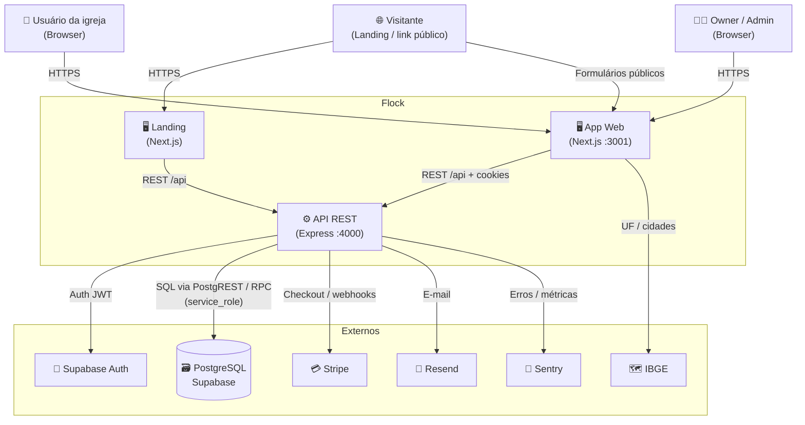

# Visão Geral da Arquitetura — Flock

> Documento âncora técnico. Responde: **como o sistema está estruturado e por quê.**  
> Produto: [[01_produto/visao-do-produto]] · Módulos de negócio: [[02_regras-de-negocio/regras-por-modulo/index]]

---

## 🧭 Resumo Executivo

O Flock é um **monorepo de três aplicações** (API Express, app Next.js, landing Next.js) no padrão **SPA/BFF-like + API REST monolítica**, com persistência em **PostgreSQL via Supabase** (sem ORM). O multi-tenant por `church_id` vive na aplicação. Esta escolha é adequada a um SaaS de gestão eclesiástica ainda coeso: um time pequeno itera rápido, deploy é simples e o domínio cabe em um processo Node. **Trade-offs:** menos isolamento de falhas que microserviços; jobs cron e webhooks Stripe no mesmo runtime da API; sem fila/Redis — processamento assíncrono limitado a cron e fire-and-forget (e-mail).

---

## 🛠️ Stack Tecnológico Completo

| Categoria | Tecnologia | Versão | Papel |
| --- | --- | --- | --- |
| Runtime | Node.js | 18+ (Docker 20) | Backend / Next apps |
| Linguagem | TypeScript | ^5.x | Tipagem |
| API | Express | ^4.18 | REST `/api/*` |
| App / Landing | Next.js + React | ^15.5 / ^19 | App (:3001) e marketing |
| UI / CSS | Tailwind + Headless UI | ^4 | Interface |
| Banco / Auth | PostgreSQL + Supabase | gerenciado | Dados + JWT Auth |
| Cliente DB | `@supabase/supabase-js` | ^2.38 | anon auth + `service_role` (`db`) |
| ORM | — | — | Sem Prisma/Drizzle |
| Validação | Joi (API) · Zod+RHF (UI) | ^17 / ^3 | Schemas |
| Pagamentos | Stripe | ^20 | Checkout, portal, webhooks |
| E-mail / PDF | Resend · PDFKit | ^3.5 / ^0.17 | Transacional / export |
| Cron / obs. | node-cron · Sentry · prom-client | ^4 / ^10 / ^15 | Jobs + monitoramento |
| Cliente HTTP | Axios | ^1.10 | App → API |
| Segurança | helmet, cors, rate-limit | — | Hardening HTTP |
| Deploy | Docker Compose · Railway | 3.8 | Local / prod (a confirmar) |
| Geo | API IBGE | — | UF/cidades |

**Ausentes:** Redis, filas Bull, GraphQL/tRPC, NestJS, workspaces npm na raiz.

---

## 🏗️ Padrão Arquitetural

**Nome:** Monólito modular de API (Express) + clientes Next.js em monorepo (não workspace npm unificado).

**Como se manifesta:** Domínios por feature (`routes` / `controllers` / `validators`); services para integrações (Stripe, e-mail, Supabase); multi-tenant e RBAC na borda (`auth` + `requireRole` + filtro `church_id`). Frontends consomem a API REST; a landing também chama waitlist/plans/checkout.

**Por quê (inferido):** Produto único, equipe enxuta, forte acoplamento dados↔UI pastoral; Supabase reduz ops de Postgres/Auth. ADR formal: _(ainda não indexado em `07_decisoes-tecnicas/` — a confirmar)_.

---

## 📐 Camadas da Aplicação

| Camada | Responsabilidade | Localização | Tecnologia |
| --- | --- | --- | --- |
| Apresentação (Web) | Páginas, shell, forms | `frontend/src/app`, `components` | Next.js 15 / React 19 |
| Apresentação (Marketing) | Aquisição | `landing/src` | Next.js 15 |
| API / Rotas | Contratos HTTP | `backend/src/routes` | Express Router |
| Controllers | Orquestração request/response | `backend/src/controllers` | TypeScript |
| Validação | Schemas de entrada | `backend/src/validators` | Joi |
| Middleware | Auth, roles, upload, rate limit | `backend/src/middlewares` | Express |
| Serviços de integração | Stripe, e-mail, church context, import | `backend/src/services` | supabase-js, Stripe SDK |
| Dados | Queries PostgREST / RPC | Controllers + `services/supabase.ts` | `db` / `supabaseAdmin` |
| Jobs | Tarefas periódicas de billing | `backend/src/jobs` + `app.ts` | node-cron |
| Types / Domain shapes | Contratos TS | `backend/src/types`, `frontend/src/types` | TypeScript |

Não há camada `repositories/` dedicada: acesso a dados misturado em controllers/services.

---

## 🗺️ Diagrama de Contesto (C4 — Nível 1)

---

## 📦 Módulos e Domínios Principais

| Módulo | Responsabilidade | Complexidade |
| --- | --- | --- |
| Auth / Onboarding | Sessão e criação de tenant (igreja+owner) | Alta |
| Membros / Integração | Rol oficial e funil de pré-membros | Alta |
| Congregações / Grupos / Calendário | Estrutura e agenda | Média |
| Relatórios | Painel e PDF | Média |
| Igreja-config | Igreja, conta, equipe, audit | Alta |
| Billing | Planos, Stripe, cron de assinatura | Alta |
| Aquisição / Tutoriais | Waitlist e guias in-app | Baixa |

Regras: [[02_regras-de-negocio/regras-por-modulo/index]].

---

## 🔄 Fluxo de Dados Principal

Browser → Next (Axios + cookies/`X-Church-Id`) → Express (CORS/rate-limit → auth → `requireRole` → Joi) → controller (regras + limites de plano) → Supabase PostgREST/`rpc` → side-effects (audit, Resend, Stripe) → JSON → UI.

## ⚙️ Processos do Sistema

| Processo | Tipo | Trigger | Responsabilidade |
| --- | --- | --- | --- |
| API Express (`app.ts`) | HTTP | Start `:4000` | REST, webhook Stripe, health/metrics |
| Cron (mesmo processo) | Scheduled | `node-cron` se `ENABLE_CRON_JOBS≠false` | cleanup pending, downgrade, expiration, integrity, webhook purge |
| Frontend / Landing Next | HTTP | `:3001` / `:3000` | App autenticado e marketing |

Sem workers/filas. Crons no processo da API podem duplicar em multi-réplica (a confirmar mitigação).

## 🔗 Dependências Externas Críticas

| Serviço | Papel | Se cair | Fallback |
| --- | --- | --- | --- |
| Supabase Auth+DB | Login e dados | Sistema parado | Não |
| Stripe | Assinatura | Sem upgrades; plano atrasado | Jobs compensatórios (parcial) |
| Resend | E-mail | Onboarding/avisos degradam | Best-effort |
| IBGE | Geo BR | Cadastro piora | Fallback FE parcial (a confirmar) |
| Sentry | Observabilidade | Cegueira ops | App segue |

---

## 📚 Documentos Relacionados

- Diagrama detalhado: [[03_arquitetura/diagrama-de-sistema]]
- Banco de dados: [[03_arquitetura/banco-de-dados]]
- API: [[03_arquitetura/api-design]]
- Infraestrutura: [[03_arquitetura/infraestrutura]]
- Segurança: [[03_arquitetura/seguranca]]
- Performance: [[03_arquitetura/performance-e-escalabilidade]]
- Regras gerais: [[02_regras-de-negocio/regras-gerais]]
- Políticas SaaS: [[02_regras-de-negocio/politicas-e-restricoes]]

---

## Arquivos analisados

`README.md`, `docker-compose.yml`, `backend/Dockerfile`, `backend/package.json`, `frontend/package.json`, `landing/package.json`, `backend/src/app.ts`, `backend/src/services/supabase.ts`, `docs/03_arquitetura/infraestrutura.md`, `docs/06_integracoes/`, `docs/02_regras-de-negocio/regras-por-modulo/`. Sem `ARCHITECTURE.md` / `CONTRIBUTING.md` / `.env.example` na raiz (env documentado em infra + integrações).
