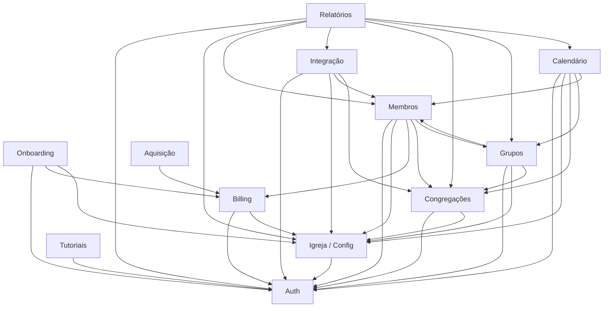

# Índice de Módulos

> Ponto de entrada da seção `docs/04_modulos/`.  
> Regras detalhadas: [[02_regras-de-negocio/regras-por-modulo/index]] · Arquitetura: [[03_arquitetura/visao-geral]] · API: [[03_arquitetura/api-design]].

---

## Visão Geral

O Flock **não** usa NestJS modules nem pasta `domain/`. A modularização é **por domínio de negócio**, espelhada em:

- **Backend:** `routes/` + `controllers/` (+ validators/services por assunto)
- **Frontend app:** rotas em `frontend/src/app/(main|auth|public|subscription)/`
- **Landing:** aquisição (`landing/`)
- **KB de regras:** já particionada em **12** módulos em `02_regras-de-negocio/regras-por-modulo/`

Este catálogo alinha o mesmo recorte de 12 módulos para documentação técnica futura em `04_modulos/[nome].md`. Utilitários (`middlewares/`, `utils/`, `jobs/` transversais) **não** são módulos de negócio.

---

## Mapa de Módulos

---

## Catálogo de Módulos

| Módulo | Responsabilidade | Complexidade | Status | Depende de | Ops≈ |
| --- | --- | --- | --- | --- | ---: |
| **auth** | Login, sessão, cookies JWT, senha, confirmação de e-mail | Alta | Ativo | — | ~12 |
| **onboarding** | Registro de igreja/owner e funil plano (free ou pós-checkout) | Alta | Ativo | auth, billing, igreja-config | ~6 |
| **membros** | Rol oficial: CRUD, status, import CSV, links/autocadastro | Alta | Ativo | auth, igreja-config, billing, congregacoes, grupos | ~18 |
| **integracao** | Pré-membros, conversão, links públicos de integração | Alta | Ativo | auth, igreja-config, membros, congregacoes | ~14 |
| **congregacoes** | Unidades locais (CRUD + batch) | Baixa | Ativo | auth, igreja-config | ~6 |
| **grupos** | Ministérios/células e vínculos membro↔grupo | Média | Ativo | auth, igreja-config, congregacoes, membros | ~8 |
| **calendario** | Agenda (itens, recorrência, participantes) | Alta | Ativo | auth, igreja-config, congregacoes, grupos, membros | ~11 |
| **relatorios** | Relatórios agregados e exportações PDF/CSV | Alta | Ativo | auth, igreja-config, membros, integracao, congregacoes, grupos, calendario | ~12 |
| **igreja-config** | Igreja, conta do usuário, equipe (`church_users`), audit logs | Alta | Ativo | auth | ~16 |
| **billing** | Planos, Stripe (checkout/portal/webhooks), quotas, crons | Alta | Ativo | auth, igreja-config | ~14 |
| **aquisicao** | Landing, waitlist, entrada de leads/checkout público | Baixa | Ativo | billing | ~5 |
| **tutoriais** | Guias in-app (conteúdo front) | Baixa | Ativo | auth | ~1 |

**Total:** **12** módulos · ~**123** operações HTTP de domínio (aprox.; inclui públicos/billing; exclui health/metrics internos).

---

## Convenções desta Seção

- Cada módulo terá arquivo `docs/04_modulos/[nome].md` (nomes = slugs da tabela).
- Fluxos, contratos e operações do módulo ficam **no próprio** `04_modulos/[nome].md`.
- Regras de negócio numeradas permanecem em [[02_regras-de-negocio/regras-por-modulo/index]].
- Nomes de pasta/arquivo alinhados aos slugs de regras: `auth`, `onboarding`, `membros`, `integracao`, `congregacoes`, `grupos`, `calendario`, `relatorios`, `igreja-config`, `billing`, `aquisicao`, `tutoriais`.

---

## Índice de Links

- [[04_modulos/auth]] — Autenticação e sessão
- [[04_modulos/onboarding]] — Registro de igreja e funil de plano
- [[04_modulos/membros]] — Rol de membros e importação
- [[04_modulos/integracao]] — Pipeline de integração
- [[04_modulos/congregacoes]] — Congregações
- [[04_modulos/grupos]] — Grupos e ministérios
- [[04_modulos/calendario]] — Calendário e participantes
- [[04_modulos/relatorios]] — Relatórios e exportações
- [[04_modulos/igreja-config]] — Igreja, conta e equipe
- [[04_modulos/billing]] — Planos, Stripe e limites
- [[04_modulos/aquisicao]] — Landing e waitlist
- [[04_modulos/tutoriais]] — Tutoriais in-app

> Arquivos individuais ainda a criar (Prompt 2 por módulo).
