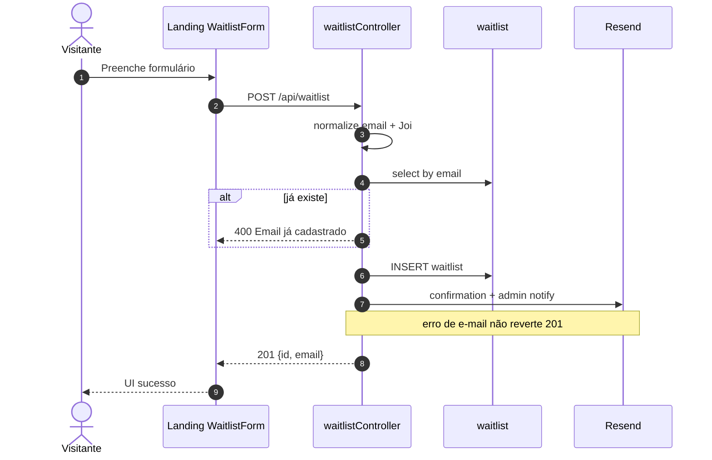
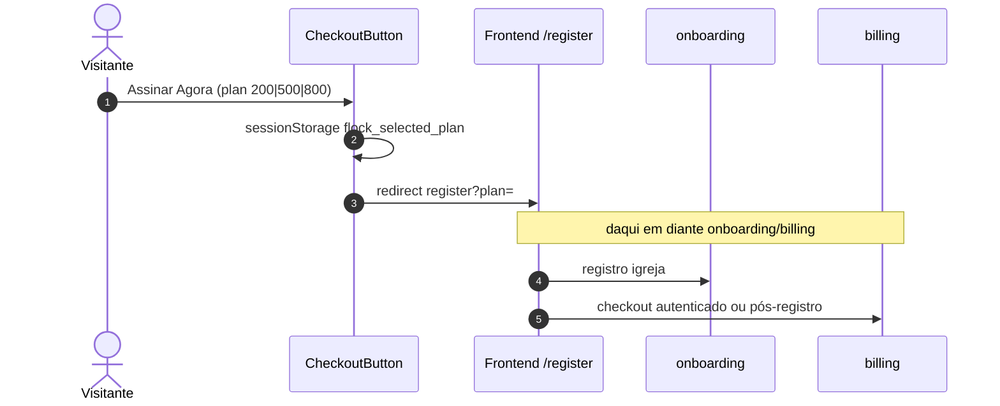
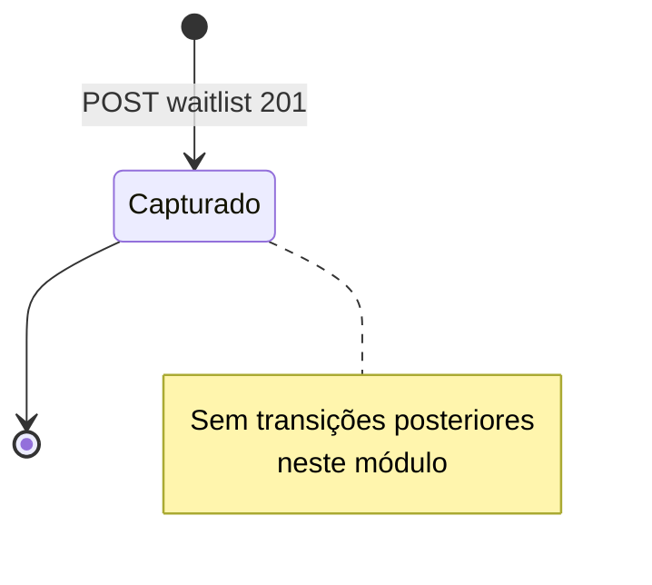
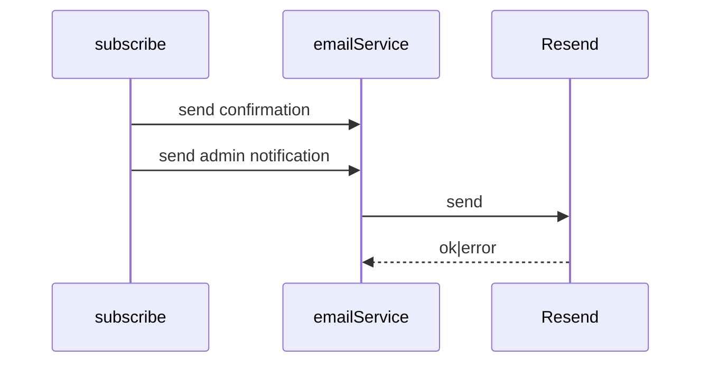
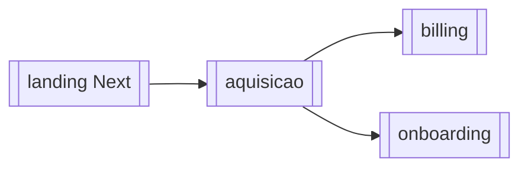

# Módulo — Aquisição

> Captação comercial pré-produto: site **landing** (`landing/` na porta :3000), formulário de **waitlist** e funil de plano (CTA → app `/register` ou `/login?redirect=/checkout`).  
> Backend próprio: **somente** `POST /api/waitlist`. Catálogo de planos e Checkout Stripe vivem em [[04_modulos/billing]]; registro da igreja em [[04_modulos/onboarding]].  
> Regras: [[02_regras-de-negocio/regras-por-modulo/aquisicao]] · Índice: [[04_modulos/index]].

---

## 1. 📌 Visão Geral

Converte visitantes em leads (waitlist) ou em tráfego qualificado para o funil de assinatura/cadastro do app.

Resolve a ausência de CRM de marketing no app logado: captura interesse (incl. plano “personalizado”) e encaminha planos pagos/free para o frontend de registro.

No sistema, é a **porta de entrada** pública; não gerencia tenant nem Auth.  
Produto: [[01_produto/visao-do-produto]].

---

## 2. ⚖️ Bounded Context

### ✅ Este módulo É responsável por:

- App Next.js `landing/` (marketing, pricing, waitlist UI, SEO)
- `POST /api/waitlist` — validar, unicidade de e-mail, persistir lead
- E-mails best-effort: confirmação ao lead + notificação `ADMIN_EMAIL`
- Pré-seleção de plano na waitlist via query/hash (`?plan=` / hash)
- Funil UX: persistir plano em `sessionStorage` e redirecionar para `FRONTEND_URL/register?plan=`
- Consumir `GET /api/plans` (billing) para preços na home (com fallback local)

### ❌ Este módulo NÃO é responsável por:

- Criar sessão Stripe Checkout (API em [[04_modulos/billing]]; landing **não** chama mais `/create-checkout-session` no botão atual)
- Criar igreja/user Auth (→ [[04_modulos/onboarding]])
- CRUD/admin da tabela waitlist (não há GET/list/delete autenticado)
- Login/sessão do produto
- Cleanup de leads antigos (sem job)

---

## 3. 📁 Estrutura de Arquivos

```
backend/src/
├── routes/waitlist.ts                    → POST /
├── controllers/waitlistController.ts     → subscribe
├── validators/waitlistValidator.ts       → Joi
└── templates/
    ├── emailTemplates.ts                 → getWaitlistConfirmation/Notification
    └── emails/waitlist-*.html            → (se usados via templates)

landing/                                  → Next.js :3000
├── src/app/
│   ├── page.tsx                          → Home marketing
│   ├── waitlist/page.tsx                 → Formulario waitlist
│   ├── layout.tsx / sitemap.ts           → SEO
├── src/components/
│   ├── Pricing.tsx / CheckoutButton.tsx  → CTAs plano
│   ├── WaitlistForm.tsx
│   ├── Hero, Features, CTA, …
├── src/services/
│   ├── waitlist.ts                       → POST API
│   └── plans.ts                          → GET /api/plans
├── src/utils/
│   ├── planFunnel.ts                     → register/login URLs + sessionStorage
│   ├── waitlistPlan.ts                   → parse plan URL
│   └── formatWaitlistError.ts
└── src/hooks/useIbgeData.ts              → UFs/cidades IBGE

app.ts: app.use('/api/waitlist', waitlistRoutes)
CORS: LANDING_URL incluso

Testes: inexistentes.
Migrations: tabela waitlist no Supabase (sem pasta local dedicada).
```

---

## 4. 🗄️ Entidades e Models

### waitlist

Lead captado pela landing.

| Campo | Tipo | Nullable | Default | Descrição |
| --- | --- | --- | --- | --- |
| id | uuid | NOT NULL | gen_random_uuid() | PK |
| name | varchar | NOT NULL | — | Nome do contato |
| email | varchar | NOT NULL | — | UNIQUE (normalizado lower) |
| phone | varchar | NOT NULL | — | 10–11 dígitos |
| church_name | varchar | NOT NULL | — | Igreja (body: `churchName`) |
| city | varchar | NOT NULL | — | Cidade |
| state | varchar | NOT NULL | — | UF 2 letras |
| plan | varchar | NOT NULL | — | `200\|500\|800\|personalizado` |
| message | text | NULL | — | ≤1000 |
| created_at / updated_at | timestamptz | NULL | now() | Auditoria |

**Relacionamentos:** nenhum FK — lead isolado.  
**Soft delete:** não.  
**Auditoria:** timestamps apenas (sem `audit_logs` nesta operação).

```typescript
// Body API (camelCase) → colunas snake_case
{
  name, email, phone, churchName, city, state, plan, message?
}
```

Nenhuma outra entidade é escrita por este módulo. `pending_subscriptions` / Checkout são [[04_modulos/billing]].

---

## 5. 🌐 Interface Pública

### Backend (próprio)

| Método | Rota | Auth | Role | Descrição |
| --- | --- | --- | --- | --- |
| POST | `/api/waitlist/` | ❌ | público | Cadastrar lead |

**Total owned:** **1** endpoint.

Operações de superfície (não são rotas backend deste módulo, mas fazem parte do produto aquisição):

| Superfície | Descrição |
| --- | --- |
| Landing `/` | Marketing + pricing |
| Landing `/waitlist` | Formulário |
| CTA pago | Redirect `FRONTEND_URL/register?plan=200\|500\|800` |
| CTA free | Redirect `…/register?plan=100` |
| CTA login checkout | `…/login?redirect=/checkout?plan=` |
| `GET /api/plans` | Consumido da API billing (público) |

Catálogo KB ≈**5** (waitlist + superfícies de funil/consumo de plans).

### Contrato — `POST /api/waitlist`

```typescript
// Request:
{
  name: string;          // 2–255
  email: string;         // válido; salvo trim+lower
  phone: string;         // ^[0-9]{10,11}$
  churchName: string;    // 2–255 → church_name
  city: string;          // 2–100
  state: string;         // length 2, uppercase
  plan: '200'|'500'|'800'|'personalizado';
  message?: string|null; // max 1000
}

// Response 201:
{
  message: 'Cadastro realizado com sucesso',
  data: { id: string, email: string }
}

// Erros:
// 400 — Dados inválidos (details[]) | Email já cadastrado
// 500 — check/insert/DB/interno
```

Sem auth, sem rate limit dedicado nesta rota (diferente do checkout público do billing).

---

## 6. ⚙️ Regras de Negócio

Detalhe: [[02_regras-de-negocio/regras-por-modulo/aquisicao]] (**5** regras).

| ID | Declaração curta |
| --- | --- |
| BR-ACQ-001 | Campos obrigatórios waitlist (name…plan) |
| BR-ACQ-002 | plan ∈ 200\|500\|800\|personalizado |
| BR-ACQ-003 | E-mail único (normalizado) |
| BR-ACQ-004 | message opcional ≤1000 |
| BR-ACQ-005 | E-mails confirmação + admin pós-INSERT (best-effort) |

**Inferida (UX):** plano pré-selecionado via `?plan=` ou hash na página waitlist.

---

## 7. 🔄 Fluxos do Módulo

### Fluxo: Cadastro waitlist



### Fluxo: CTA plano pago (funil atual)



### Estados

N/A — lead waitlist **não** tem status machine (só insert). Sem lifecycle “contacted/converted” no código.



---

## 8. 🔗 Integrações

### Supabase PostgreSQL

- Propósito: persistir `waitlist`  
- Falha insert/check → 500/400  
- Config: `SUPABASE_*` service_role no backend

### Resend (via `emailService`)

- Propósito: confirmação lead + notificação admin  
- Falha: catch + log; **201 mantido**  
- Config: Resend + `ADMIN_EMAIL` (default `contato@flockapp.com.br`)



### IBGE API (só front landing)

- Propósito: UFs/cidades no WaitlistForm (`useIbgeData`)  
- Falha: UI mostra erro de load; não afeta backend  
- Sem env próprio (API pública IBGE)

### Indiretas (outros módulos)

- **Billing** `GET /api/plans` — preços na Pricing  
- **Frontend app** — destino do funil register/checkout  

Este módulo **não** chama Stripe diretamente no código atual do `CheckoutButton`.

---

## 9. ⚙️ Operações em Background

N/A — este módulo não possui jobs/cron.  
(Pending Stripe cleanup é [[04_modulos/billing]], não waitlist.)

---

## 10. 🚨 Tratamento de Erros

| Situação | HTTP | `error` | Quando |
| --- | --- | --- | --- |
| Validação Joi | 400 | `Dados inválidos` | campos/plan |
| E-mail duplicado | 400 | `Email já cadastrado` | UNIQUE app+DB |
| Erro check email | 500 | `Erro ao verificar email` | PostgREST ≠ not found |
| Erro insert | 500 | `Erro ao cadastrar…` | DB |
| Catch | 500 | `Erro interno` | exception |
| E-mail Resend | — | (log only) | não altera HTTP |

Front: `formatWaitlistError` traduz axios errors para toast.

---

## 11. 🔐 Segurança e Autorização

| Controle | Detalhe |
| --- | --- |
| Auth | Nenhuma — rota pública |
| Rate limit | **Não** há limiter em `/api/waitlist` (risco de flood) |
| CORS | origem da landing (`LANDING_URL`) permitida |
| PII | nome, e-mail, telefone, igreja, cidade — dados de lead |
| Admin notify | e-mail com PII do lead para `ADMIN_EMAIL` |

Sem CSRF token dedicado; confia em CORS + same-site browser flows.

---

## 12. 🧪 Testes

| Tipo | Arquivo | Cobertura | O que testa |
| --- | --- | --- | --- |
| — | — | 0% | Nenhum teste dedicado |

**Gaps:** validação Joi; e-mail duplicado; e-mail falha ainda 201; plan personalizado; CORS; ausência de rate limit; parse URL plan no form.

---

## 13. 🔗 Dependências

**Consome:**

- [[04_modulos/billing]] — `GET /api/plans`; funil comercial eventualmente checkout no app  
- [[04_modulos/onboarding]] — destino `/register`  

**Dependem deste:**

- Ops/comercial (leads na tabela `waitlist`) — sem módulo interno consumidor de API  
- Marketing (única entrada waitlist)



---

## 14. ⚠️ Pontos de Atenção

1. **Sem rate limit** em POST waitlist — fácil spam/DB flood; consider RL + captcha.  
2. Unicidade checada com `.single()` + insert — race possível sob concorrência (UNIQUE DB é a rede de segurança).  
3. `CheckoutButton` **não** inicia Stripe; nome/ícone sugerem pagamento, mas só redireciona para register — evitar documentar como “cria checkout”.  
4. Plano waitlist `personalizado` ≠ plan_type billing `custom` — nomenclaturas diferentes.  
5. Sem painel admin para listar/exportar waitlist no código app.  
6. IBGE só no client — offline/quebra API deixa estados vazios.  
7. Templates e-mail em `emailTemplates.ts` (HTML helpers) — manter sync com copy.

---

## 15. 📝 Histórico de Mudanças

| Data | Versão | Descrição | Issue |
| --- | --- | --- | --- |
| 2026-07-14 | 1.0 | Documentação inicial do módulo aquisição | — |

---

## Confirmação

| Item | Valor |
| --- | --- |
| Módulo documentado | **aquisicao** ✅ |
| Endpoints backend próprios | **1** (`POST /api/waitlist`) |
| Superfícies funil (≈ catálogo) | landing + CTAs + consumo plans |
| Regras BR-ACQ | **5** |
| Entidades | `waitlist` |
| Integrações | Supabase, Resend, IBGE (front) |
| Jobs | Nenhum |
| Testes | Nenhum dedicado |
| Stripe direto neste módulo | **Não** (funil → app/billing) |
