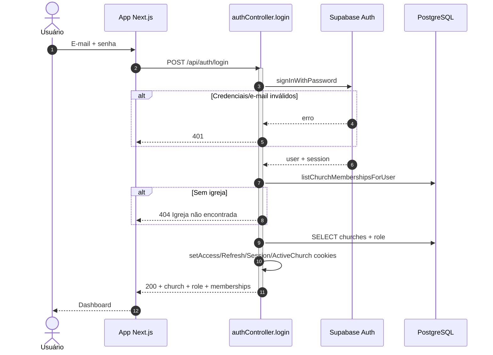
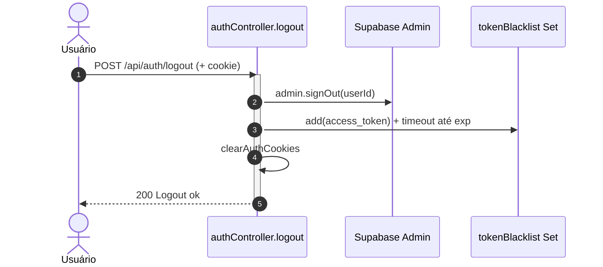
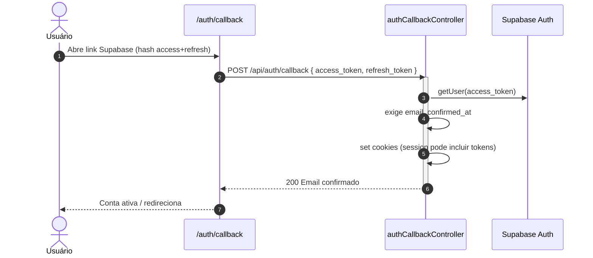
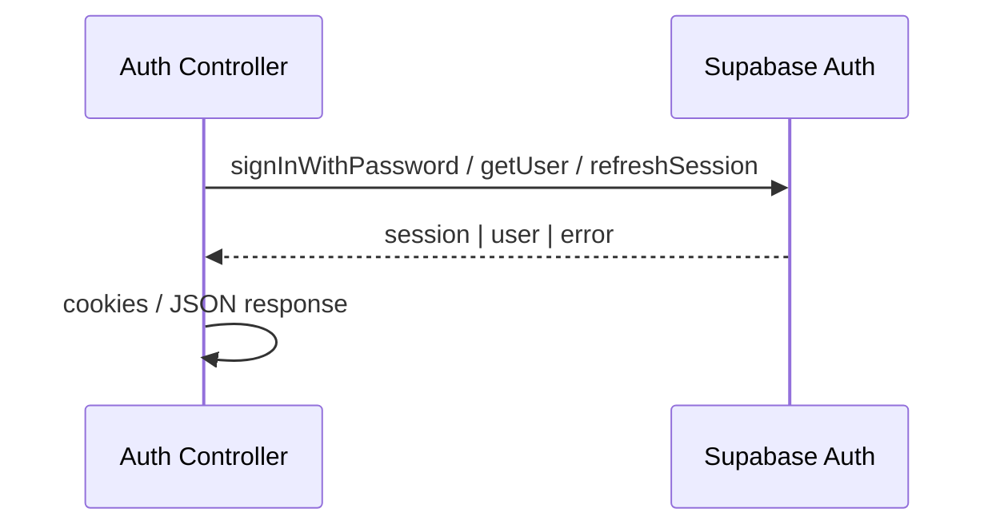
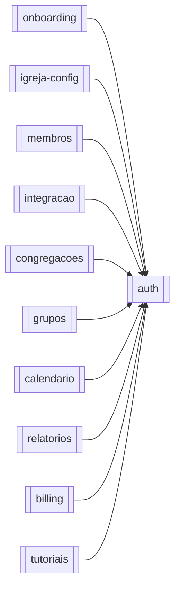

# Módulo — Auth

> Autenticação, sessão (cookies JWT), senha e confirmação de e-mail.  
> Regras: [[02_regras-de-negocio/regras-por-modulo/auth]] · Segurança: [[03_arquitetura/seguranca]] · Índice: [[04_modulos/index]].

---

## 1. 📌 Visão Geral

Responsável por **provar identidade**, **estabelecer sessão HTTP** (cookies HttpOnly) e **gerenciar ciclo de senha/confirmação** via Supabase Auth.

Existe para que qualquer pastor/admin/equipe acesse o app multi-tenant com segurança, sem tokens no `localStorage`.

No sistema, é a **porta de entrada** de quase todos os módulos autenticados: sem sessão válida (+ contexto de igreja), o restante da API não opera.  
Produto: [[01_produto/visao-do-produto]].

> `POST /api/auth/register` vive nas rotas de auth, mas a criação de igreja/planos é domínio de [[04_modulos/onboarding]] / [[04_modulos/billing]]. Este doc cobre o que é identidade e sessão; o funil de registro é referência cruzada.

---

## 2. ⚖️ Bounded Context

### ✅ Este módulo É responsável por:

- Login e-mail/senha (`signInWithPassword`)
- Logout (signOut admin + blacklist + limpar cookies)
- Refresh de access token e `GET /check` de sessão
- Callback pós-confirmação de e-mail (hash → cookies)
- Forgot / reset / change password
- Middleware de autenticação (`authMiddleware`, `authUserOnly`, `optionalAuth`)
- Emissão/consumo de cookies `flock_*`
- Rate limits específicos de auth/password/refresh/callback
- E-mails de senha alterada / (no register) boas-vindas via Resend — best-effort

### ❌ Este módulo NÃO é responsável por:

- CRUD de `church_users` / papéis (→ [[04_modulos/igreja-config]])
- Regras de plano, Stripe, quotas (→ [[04_modulos/billing]])
- Conteúdo pastoral (membros, grupos, calendário)
- OAuth social / MFA / SAML (não implementados)
- RLS Postgres (usa service_role no backend)
- Persistência de senha em tabelas `public` (só Auth Supabase)

---

## 3. 📁 Estrutura de Arquivos

```
backend/src/
├── routes/
│   ├── auth.ts                 → POST register/login/logout (+ rate limit)
│   ├── password.ts             → POST forgot/reset/change
│   ├── refresh.ts              → POST refresh, GET check (+ rotas de teste)
│   └── authCallback.ts         → POST callback
├── controllers/
│   ├── authController.ts       → register, login, logout
│   ├── passwordController.ts   → forgot, change, reset
│   ├── refreshController.ts    → refreshToken, checkAuth
│   └── authCallbackController.ts → handleAuthCallback
├── middlewares/
│   └── auth.ts                 → authMiddleware, authUserOnly, optionalAuth
├── validators/
│   └── passwordValidator.ts    → Joi change/reset password
├── utils/
│   └── cookieUtils.ts          → nomes, flags, set/clear cookies
├── services/
│   ├── supabase.ts             → clients anon + admin
│   ├── churchContext.ts        → memberships / igreja ativa (usado no login/check)
│   └── emailService.ts         → Resend
└── templates/                  → welcome / password-changed / admin notify

frontend/src/
├── app/(auth)/
│   ├── login/
│   ├── forgot-password/
│   ├── reset-password/
│   ├── create-password/
│   └── register/               → UI; domínio onboarding
├── app/auth/callback/          → lê hash tokens → POST /api/auth/callback
└── context/AuthContext.tsx     → estado de sessão no client
└── services/api.ts             → Axios withCredentials

Testes backend dedicados: inexistentes.
Migrations: schema Auth gerenciado pelo Supabase (não pasta migrations local para auth.users).
```

---

## 4. 🗄️ Entidades e Models

Não há Entity/ORM própria. Identidade vive em **`auth.users`** (Supabase). Sessão Flock = cookies.

### Auth User (Supabase `auth.users`)

Usuário de login do produto (não confundir com `members`).

| Campo (relevante) | Tipo | Nullable | Default | Descrição |
| --- | --- | --- | --- | --- |
| id | uuid | NOT NULL | auto | PK usada em `churches.user_id` / `church_users.user_id` |
| email | text | — | — | Login |
| encrypted_password | — | — | — | Hash gerenciado pelo Auth |
| email_confirmed_at | timestamptz | NULL | null | Confirmação obrigatória para login |
| phone | text | NULL | — | Opcional no signUp |

**Relacionamentos (domínio Flock):**

- Pode ser **owner** de igreja via `churches.user_id`
- Tem **membership** via `church_users` (1 user → no máx. 1 igreja — unique)

**Comportamentos:** soft delete N/A no app; exclusão de conta em igreja-config/account.

### Sessão (cookies) — contrato de runtime

| Cookie | Conteúdo | maxAge | Flags |
| --- | --- | --- | --- |
| `flock_access_token` | JWT access | 15 min | HttpOnly; secure+SameSite=None em prod |
| `flock_refresh_token` | Refresh | 7 dias | idem |
| `flock_session` | JSON user (+ às vezes tokens no callback) | 24 h | idem |
| `flock_active_church_id` | UUID igreja | 30 dias | idem |
| `flock_pending_link_token` | Token checkout→register | 7 dias | usado no register |

```typescript
// Não há Prisma model — exemplo conceitual
// auth.users { id, email, email_confirmed_at, ... }
// session cookies: flock_access_token | flock_refresh_token | flock_session
```

---

## 5. 🌐 Interface Pública

| Método | Rota | Auth | Role | Descrição |
| --- | --- | --- | --- | --- |
| POST | `/api/auth/register` | ❌ | — | Registro (Auth user + igreja) — ver onboarding |
| POST | `/api/auth/login` | ❌ | — | Login e-mail/senha |
| POST | `/api/auth/logout` | ✅ | qualquer | Encerra sessão |
| POST | `/api/auth/callback` | ❌ | — | Confirma e-mail → cookies |
| POST | `/api/password/forgot` | ❌ | — | Envia e-mail de reset |
| POST | `/api/password/reset` | ❌ | — | Redefine com token |
| POST | `/api/password/change` | ✅ | qualquer | Troca senha (com senha atual) |
| POST | `/api/refresh/refresh` | 🍪 refresh | — | Renova access |
| GET | `/api/refresh/check` | 🍪 | — | Estado autenticação (FE) |
| GET | `/api/refresh/test-cookies` | ❌ | — | 🚨 Debug — dump cookies |
| POST | `/api/refresh/test-clear-cookies` | ❌ | — | 🚨 Debug — limpa cookies |

**Total documentado neste módulo:** **11** endpoints (9 produção + 2 debug).

### Contrato principal — `POST /api/auth/login`

```typescript
// Request Body:
{
  email: string;     // obrigatório
  password: string;  // obrigatório
}

// Response 200:
{
  message: string;
  church: object;          // sanitizado por role
  role: 'owner' | 'admin' | 'editor' | 'reader';
  email: string;
  memberships: Array<{ churchId: string; role: string; /* ... */ }>;
  activeChurchId: string;
}
// + Set-Cookie: flock_access_token, flock_refresh_token, flock_session, flock_active_church_id

// Erros:
// 401 — Credenciais inválidas
// 401 — Email não confirmado
// 404 — Igreja não encontrada (sem membership)
// 429 — Rate limit (10/15min em falhas)
// 500 — Erro interno
```

### `POST /api/password/change`

```typescript
// Request (autenticado):
{ currentPassword: string; newPassword: string } // newPassword: ≥8, [a-z][A-Z][0-9]

// 200: { message, details }
// 400: validação / senha atual incorreta
// 401: não autenticado
```

### `POST /api/auth/callback`

```typescript
// Request:
{ access_token: string; refresh_token: string }

// 200: { message, details, user: { id, email, email_confirmed_at } } + cookies
// 400: tokens ausentes/inválidos / e-mail não confirmado
```

---

## 6. ⚙️ Regras de Negócio

Detalhe completo: [[02_regras-de-negocio/regras-por-modulo/auth]] (14 regras).

| ID | Declaração curta |
| --- | --- |
| BR-AUTH-001 | Senha ≥8 com maiúscula, minúscula e número |
| BR-AUTH-002 | Change exige senha atual correta |
| BR-AUTH-003 | Login exige e-mail confirmado |
| BR-AUTH-004 | Login exige ≥1 vínculo de igreja |
| BR-AUTH-005 | Múltiplas igrejas sem ativa → `CHURCH_SELECTION_REQUIRED` |
| BR-AUTH-006 | Credenciais válidas obrigatórias |
| BR-AUTH-007 | Token na blacklist → 401 |
| BR-AUTH-008 | Refresh só com cookie de refresh válido |
| BR-AUTH-009 | Callback exige tokens + `email_confirmed_at` |
| BR-AUTH-010 | Reset só com token válido |
| BR-AUTH-011 | Forgot exige e-mail válido |
| BR-AUTH-012 | Após change/reset, e-mail Resend (não bloqueia) |
| BR-AUTH-013 | Logout blacklista access + limpa cookies |
| BR-AUTH-014 | Rate limits auth/password/refresh |

---

## 7. 🔄 Fluxos do Módulo

### Fluxo: Login



### Fluxo: Logout



### Fluxo: Confirmação de e-mail



### Estados — Conta Auth (visão app)

```mermaid
stateDiagram-v2
  [*] --> PendenteConfirmacao: signUp / register
  PendenteConfirmacao --> Ativa: callback + email_confirmed_at
  PendenteConfirmacao --> [*]: nunca confirma (stale)

  Ativa --> SessaoComCookies: login / callback / refresh
  SessaoComCookies --> Ativa: logout (cookies limpos; user permanece)
  Ativa --> Ativa: change/reset password

  note right of SessaoComCookies
    Access JWT ~15min cookie
    Refresh até 7 dias
    Blacklist access no logout (memória)
  end note
```



---

## 8. 🔗 Integrações

### Supabase Auth

- **Propósito:** identidade, JWT, reset de senha, confirmação de e-mail, signOut admin  
- **Operações:** `signUp`, `signInWithPassword`, `getUser`, `refreshSession`, `resetPasswordForEmail`, `updateUser`, `admin.updateUserById`, `admin.signOut`  
- **Falha:** 4xx mapeados (`error`/`details`); reset retorna 503 se admin client ausente  
- **Config:** `SUPABASE_URL`, `SUPABASE_KEY` (anon), `SUPABASE_SERVICE_ROLE_KEY` (admin)



### Resend (via `emailService`)

- **Propósito:** notificar troca/reset de senha; no register, welcome + admin notify  
- **Falha:** log + fluxo principal segue (BR-AUTH-012)  
- **Config:** `RESEND_API_KEY`, `RESEND_FROM_*`, `ADMIN_EMAIL`

### Stripe (só no `register`)

- Resolve `link_token` / pending subscription — domínio onboarding/billing; não usado em login/password.

---

## 9. ⚙️ Operações em Background

Este módulo **não** possui cron/jobs próprios.

- E-mails: fire-and-forget / try-catch não bloqueante  
- Blacklist: `setTimeout` em memória para remover token após `exp`  
- Crons de billing em `app.ts` **não** pertencem a auth

| Operação | Tipo | Trigger | Frequência | Descrição |
| --- | --- | --- | --- | --- |
| N/A | — | — | — | Sem workers dedicados |

---

## 10. 🚨 Tratamento de Erros

Não há classes `*Exception` tipadas — respostas JSON ad hoc.

| Situação | HTTP | “Código” / error string | Quando |
| --- | --- | --- | --- |
| Credenciais inválidas | 401 | `Credenciais inválidas` | login |
| E-mail não confirmado | 401 | `Email não confirmado` | login |
| Token ausente/inválido/revogado | 401 | `Token não fornecido` / `inválido` / `revogado` | middleware / logout |
| Refresh inválido | 401 | `Refresh token inválido` | refresh |
| Sem igreja | 404 | `Igreja não encontrada` | login / check |
| Seleção de igreja | 403 | `CHURCH_SELECTION_REQUIRED` | middleware / refresh check |
| Validação senha/DTO | 400 | `Dados inválidos` | change/reset |
| Senha atual errada | 400 | `Senha atual incorreta` | change |
| Token reset inválido | 400 | `Token inválido ou expirado` | reset |
| Service role ausente (reset) | 503 | `Serviço temporariamente indisponível` | reset |
| Rate limit | 429 | mensagem do limiter | rotas auth |
| Erro inesperado | 500 | `Erro interno do servidor` | catch |

---

## 11. 🔐 Segurança e Autorização

| Controle | Detalhe |
| --- | --- |
| Guards | `authMiddleware` (logout, change); rotas públicas: login/forgot/reset/callback/refresh |
| RBAC | Auth em si não exige role além de “autenticado”; role vem no login para o FE |
| Rate limit | Login 10/15min (só falhas); register 10/15min; forgot/reset 5/h; change 5/15min; refresh 20/15min; callback 5/15min |
| Dados sensíveis | senhas (nunca logar); JWT cookies; e-mail; session cookie |
| Blacklist | access token em `global.tokenBlacklist` — **não** distribuída |
| Headers | Helmet/CORS globais |

🚨 Rotas `/api/refresh/test-cookies` e `test-clear-cookies` sem auth — ver [[03_arquitetura/seguranca]].  
🚨 Callback grava tokens dentro de `flock_session`.  
🚨 `SameSite=None` + cookies cross-site sem CSRF app-level.

---

## 12. 🧪 Testes

| Tipo | Arquivo | Cobertura | O que testa |
| --- | --- | --- | --- |
| Unit | — | 0% | N/A |
| Integration | — | 0% | N/A |
| E2E | — | 0% | N/A |

**Casos críticos que deveriam existir:**

- [ ] Login com e-mail não confirmado → 401  
- [ ] Login sem membership → 404  
- [ ] Logout impede reuse do access (blacklist)  
- [ ] Refresh com cookie inválido limpa sessão  
- [ ] Reset com token expirado → 400  
- [ ] Change com senha atual errada → 400  
- [ ] Rate limit login → 429  

**Gaps:** suite Jest declarada no backend (`npm test`) sem specs de auth encontradas.

---

## 13. 🔗 Dependências

**Módulos internos consumidos:** nenhum módulo de negócio obrigatório no grafo “depende_de” do index — usa infra (`supabase`, `churchContext` compartilhado com igreja-config).

**Módulos que dependem deste:**

- [[04_modulos/onboarding]] — register + confirmação  
- [[04_modulos/igreja-config]], [[04_modulos/membros]], [[04_modulos/integracao]], [[04_modulos/congregacoes]], [[04_modulos/grupos]], [[04_modulos/calendario]], [[04_modulos/relatorios]], [[04_modulos/billing]], [[04_modulos/tutoriais]] — todos usam `authMiddleware` / sessão  



---

## 14. ⚠️ Pontos de Atenção

1. **Blacklist em memória** — restart/multi-réplica invalida logout (TODO no código → Redis/tabela).  
2. **Rotas de teste de cookies** — remover ou proteger em produção.  
3. **Register acoplado** a church + Stripe pending no mesmo controller — fronteira com onboarding/billing.  
4. **`updateUser` no change password** usa client anon — depende da sessão implícita pós `signInWithPassword`; frágil se o client compartilhado não guardar sessão.  
5. **Sem MFA/OAuth** — roadmap eventual fora do módulo atual.  
6. **Não logar** body de login/password nem JWTs.  
7. Front: tokens só em cookies (`withCredentials`); `localStorage` só para church id ativo.

---

## 15. 📝 Histórico de Mudanças

| Data | Versão | Descrição | Issue |
| --- | --- | --- | --- |
| 2026-07-14 | 1.0 | Documentação inicial do módulo auth | — |

---

## Confirmação

| Item | Valor |
| --- | --- |
| Módulo documentado | **auth** ✅ |
| Endpoints | **11** (9 prod + 2 debug) |
| Regras BR-AUTH | **14** |
| Integrações | Supabase Auth, Resend (+ Stripe só via register) |
| Jobs/cron | Nenhum dedicado |
| Testes | Nenhum dedicado encontrado |
