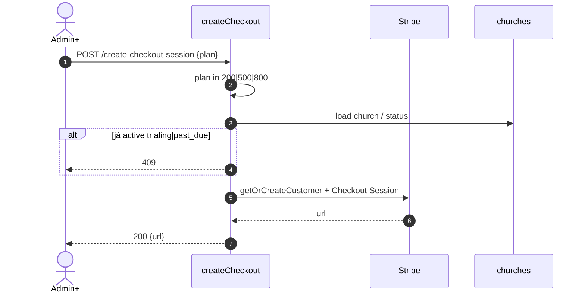
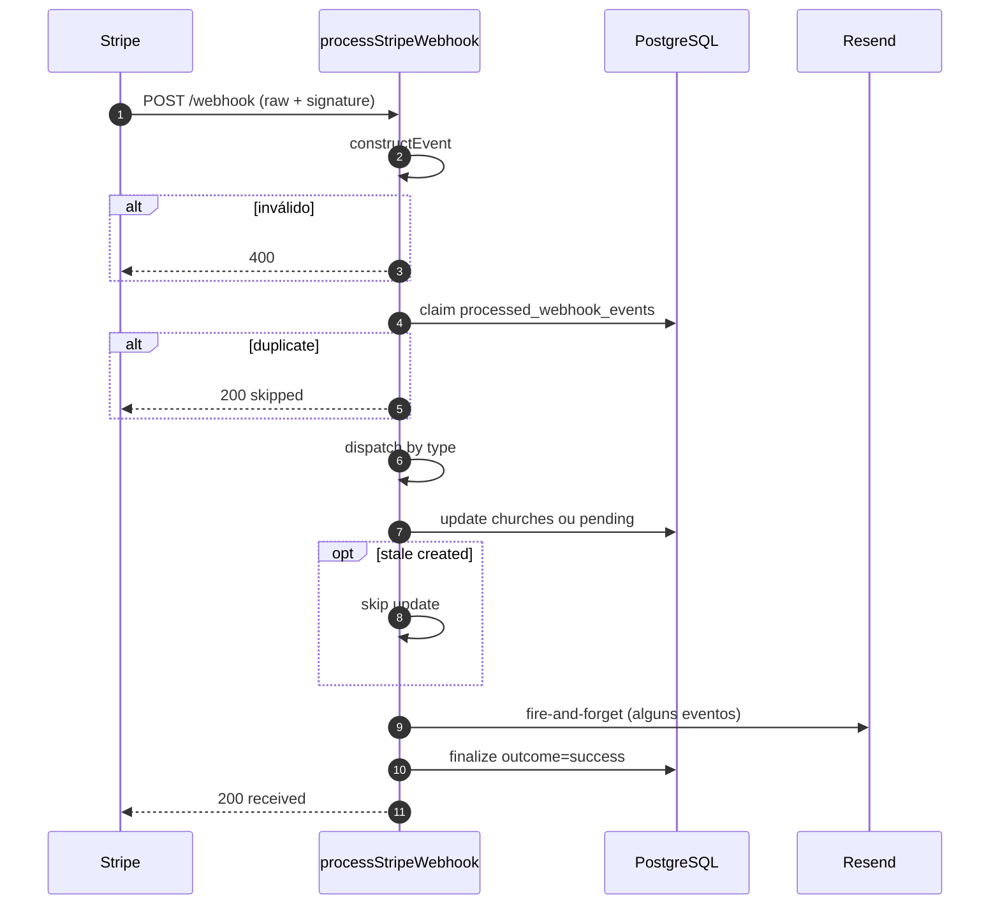
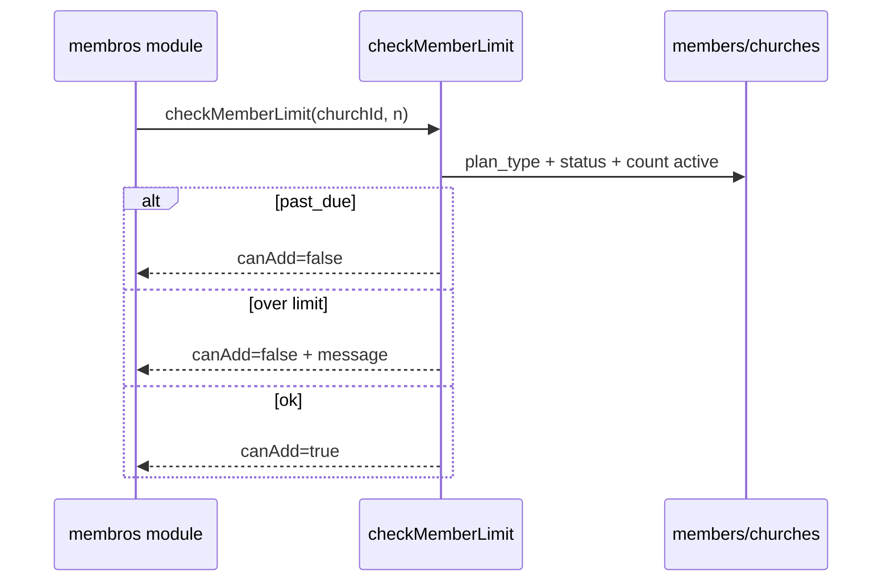
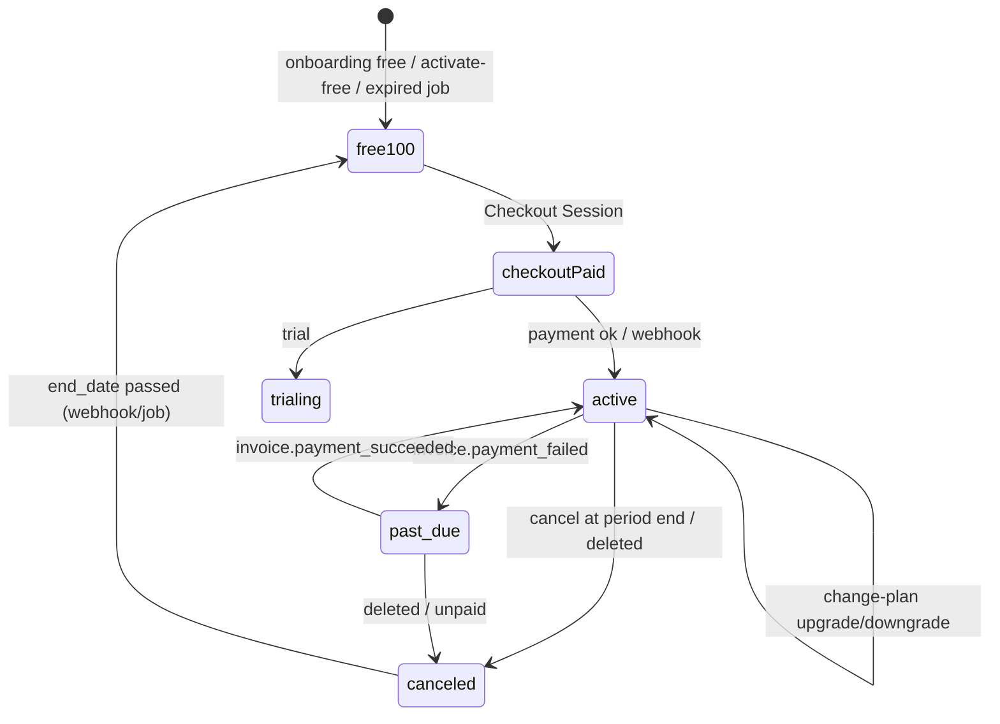
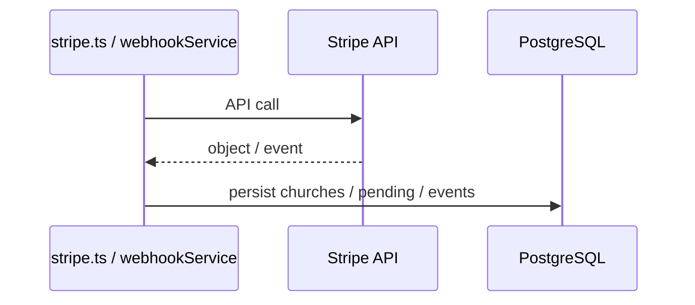
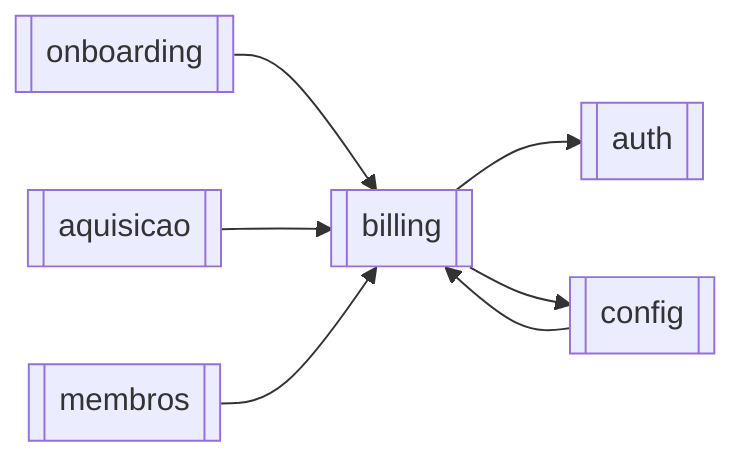

# Módulo — Billing

> Monetização por plano (100/200/500/800): Checkout Session, Customer Portal, webhooks Stripe, quotas de membros, pending pré-igreja, crons de expiração/downgrade/cleanup e ops (stats/health).  
> Regras: [[02_regras-de-negocio/regras-por-modulo/billing]] · Políticas: [[02_regras-de-negocio/politicas-e-restricoes]] · Índice: [[04_modulos/index]].  
> Cadastro pós-checkout: [[04_modulos/onboarding]] · Landing/checkout público: [[04_modulos/aquisicao]] · Snapshot quota na UI: `GET /api/church/member-limit` ([[04_modulos/config]]).

---

## 1. 📌 Visão Geral

Cobra planos pagos via Stripe, sincroniza estado em `churches` (+ `pending_subscriptions` antes do tenant) e aplica tetos de membros ativos.

Existe para sustentar o modelo freemium (100 grátis) e upgrades 200/500/800 sem cartão no próprio DB.

É a fonte de verdade comercial da igreja; webhooks e jobs compensam falhas de entrega.  
Produto: [[01_produto/visao-do-produto]].

---

## 2. ⚖️ Bounded Context

### ✅ Este módulo É responsável por:

- Catálogo hardcoded `PLAN_CONFIG` + rotas `/api/plans`
- Checkout Session autenticado (admin+) e público (landing, rate limit)
- Portal do cliente, change-plan, activate-free (cancela Stripe → plan 100)
- Sync manual Stripe → DB; histórico `church_subscription_events`
- Webhook assinado (`constructEvent`) com claim idempotente + stale skip
- Eventos: `checkout.session.completed`, `customer.subscription.*`, `invoice.payment_*`
- `checkMemberLimit` / avisos 80/90/100% (e-mail)
- Crons: cleanup pending, downgrade vencido, integrity RPC, avisos 7/3/1, cleanup webhooks 90d
- Ops: `/api/health/stripe`, `/api/internal/billing/stats`, métricas Prometheus

### ❌ Este módulo NÃO é responsável por:

- Cadastro de igreja/owner (onboarding só **vincula** pending)
- CRUD de membros (só conta `active=true` para quota)
- Waitlist de leads (→ [[04_modulos/aquisicao]])
- Remoção automática de membros excedentes no downgrade
- UI do portal Stripe (hosted)

---

## 3. 📁 Estrutura de Arquivos

```
backend/src/
├── routes/
│   ├── stripe.ts                 → webhook + checkout/portal/change/sync/...
│   └── plans.ts                  → catálogo público
├── controllers/
│   ├── stripeController.ts       → HTTP handlers billing
│   ├── plansController.ts
│   └── billingStatsController.ts → /internal/billing/stats
├── services/
│   ├── stripe.ts                 → SDK, prices, customer, checkout, portal, retry
│   ├── stripeWebhookService.ts   → claim + handlers eventos
│   ├── stripeTenantService.ts    → asserts customer↔church
│   ├── emailService.ts           → Resend
│   └── opsAlertService.ts        → alertas integrity/downgrade
├── config/plans.ts               → PLAN_CONFIG fonte de verdade preços/tetos
├── utils/
│   ├── planLimits.ts             → checkMemberLimit + warnings
│   ├── billingMetrics.ts
│   └── sentryBilling.ts
├── middlewares/stripeSecurity.ts → RL webhook/public checkout + admin checkout
├── jobs/
│   ├── cleanupPendingSubscriptions.ts      → 02h
│   ├── downgradeExpiredSubscriptions.ts    → 03h
│   ├── validateSubscriptionIntegrity.ts    → 05h
│   ├── checkSubscriptionExpiration.ts      → 09h
│   └── cleanupWebhookEvents.ts             → dom 04h
├── templates/emails/             → plan-changed, cancel, expiring, reactivated
└── types/stripe.ts

app.ts:
  /api/stripe ANTES do express.json() (raw body webhook)
  /api/plans
  /api/health/stripe
  /api/internal/billing/stats
  crons se ENABLE_CRON_JOBS !== 'false'

Testes: inexistentes no backend.
```

---

## 4. 🗄️ Entidades e Models

### churches (campos de billing)

Estado comercial do tenant (entidade também de [[04_modulos/config]]).

| Campo | Tipo | Nullable | Descrição |
| --- | --- | --- | --- |
| plan_type | varchar | NULL | `100\|200\|500\|800\|custom` |
| stripe_customer_id | varchar | NULL | `cus_*` |
| stripe_subscription_id | varchar | NULL | `sub_*` |
| subscription_status | varchar | NULL | Status Stripe |
| subscription_start_date / end_date / updated_at | timestamptz | NULL | Período |
| last_stripe_event_created | bigint | NULL | Anti-stale (unix) |

---

### pending_subscriptions

Assinatura paga **antes** de existir igreja (checkout landing → link no onboarding).

| Campo | Tipo | Nullable | Default | Descrição |
| --- | --- | --- | --- | --- |
| id | uuid | NOT NULL | gen_random_uuid() | PK |
| email | varchar | NOT NULL | — | E-mail checkout |
| stripe_customer_id / stripe_subscription_id | varchar | NOT NULL | — | IDs Stripe |
| plan_type | varchar | NOT NULL | — | 200/500/800/custom (**sem 100**) |
| subscription_status | varchar | NOT NULL | — | Status |
| subscription_start_date | timestamptz | NULL | — | Início |
| expires_at | timestamptz | NULL | now()+7d | Purge cron |
| last_stripe_event_created | bigint | NULL | — | Anti-stale |
| link_token | uuid | NULL | — | Vínculo onboarding |
| created_at | timestamptz | NULL | now() | Criação |

---

### processed_webhook_events

Idempotência + telemetria de webhooks.

| Campo | Tipo | Nullable | Default | Descrição |
| --- | --- | --- | --- | --- |
| id | uuid | NOT NULL | gen… | PK |
| stripe_event_id | varchar | NOT NULL | — | UNIQUE `evt_*` |
| event_type | varchar | NOT NULL | — | Tipo |
| processed_at / created_at | timestamptz | NULL | now() | Timestamps |
| church_id | uuid | NULL | — | Se resolvida |
| processing_ms | int4 | NULL | — | Latência |
| outcome | text | NULL | processing | processing/success/released/failed |

---

### church_subscription_events

Histórico imutável de transições (API + webhook + jobs).

| Campo | Tipo | Nullable | Default | Descrição |
| --- | --- | --- | --- | --- |
| id | uuid | NOT NULL | gen… | PK |
| church_id | uuid | NULL | — | FK |
| event_type | text | NOT NULL | — | Ex.: activate_free, sync… |
| old_plan / new_plan | text | NULL | — | Planos |
| old_status / new_status | text | NULL | — | Status |
| stripe_event_id | text | NULL | — | Origem |
| payload | jsonb | NULL | — | Snapshot |
| source | text | NOT NULL | webhook | webhook/api/manual |
| created_at | timestamptz | NOT NULL | now() | Quando |

---

### job_runs

Telemetria dos crons (`runTrackedJob`).

**Soft delete:** N/A nas tabelas de billing (eventos são append/claim).  
**Quota em memória:** `limitWarningCache` / expiration cache (Map), não tabela.

```typescript
// PLAN_CONFIG keys
'100' | '200' | '500' | '800'
// Stripe prices: STRIPE_PRICE_ID_M200|M500|M800
```

---

## 5. 🌐 Interface Pública

### Stripe — `/api/stripe`

| Método | Rota | Auth | Role | Descrição |
| --- | --- | --- | --- | --- |
| POST | `/webhook` | Stripe sig | — | Webhook (raw body, RL 300/min) |
| POST | `/create-checkout-session` | optional | admin+ se authed | Checkout 200/500/800 |
| POST | `/create-portal-session` | ✅ | ≥ admin | Customer Portal |
| POST | `/sync-subscription` | ✅ | ≥ admin | Sync Stripe→DB |
| POST | `/change-plan` | ✅ | ≥ admin | Troca preço subscription |
| POST | `/activate-free-plan` | ✅ | ≥ admin | Cancela pago → 100 |
| GET | `/checkout-status` | ✅ | ≥ admin | Status pós-checkout |
| GET | `/subscription-events` | ✅ | ≥ admin | Histórico UI |

Checkout público: RL **10/h** por IP. Autenticado: `requireAdminForPaidCheckout`.

### Planos — `/api/plans` (público, sem auth)

| Método | Rota | Auth | Descrição |
| --- | --- | --- | --- |
| GET | `/` | ❌ | Todos os planos |
| GET | `/paid` | ❌ | Só pagos |
| GET | `/:planType` | ❌ | Um plano |

### Ops

| Método | Rota | Auth | Descrição |
| --- | --- | --- | --- |
| GET | `/api/health/stripe` | público* | Health SDK + last webhook |
| GET | `/api/internal/billing/stats` | `INTERNAL_BILLING_TOKEN` | Views + jobs + integrity |

\* health é endpoint HTTP aberto — não expõe secrets; use com cautela em prod.

**Total documentado:** **13** rotas HTTP deste módulo (+ `/metrics` com série billing se `METRICS_TOKEN`). Catálogo ≈**14**.

### Contrato — `POST /api/stripe/create-checkout-session`

```typescript
// Body:
{ plan: '200' | '500' | '800' }
// Autenticado: usa req.church; proíbe body.church_id
// Público: cria customer pending + link_token; success → landing/onboarding

// Response 200: { url: string, sessionId?: string, ... }
// 400 plano inválido | 409 assinatura já active|trialing|past_due
// 403 admin required (authed) | 429 public RL
```

### Contrato — `POST /change-plan` / `activate-free-plan`

```typescript
// change-plan: { plan: '200'|'500'|'800' }
// Downgrade: exige count(active members) ≤ limite destino → senão 400
// activate-free: cancela subscription no Stripe (immediate) + plan_type=100
//                 mesma regra de capacidade vs 100
```

### Webhook

```typescript
// Header: stripe-signature
// Body: raw Buffer
// 400 invalid signature | 200 { received: true, skipped? | ignored? }
```

---

## 6. ⚙️ Regras de Negócio

Detalhe: [[02_regras-de-negocio/regras-por-modulo/billing]] (**16** regras).

| ID | Declaração curta |
| --- | --- |
| BR-BILL-001 | Catálogo 100/200/500/800 em `PLAN_CONFIG` |
| BR-BILL-002 | Checkout só planos 200\|500\|800 |
| BR-BILL-003 | Sem checkout se already active\|trialing\|past_due |
| BR-BILL-004 | Portal/change/sync/activate/events: admin+ |
| BR-BILL-005 | Portal exige `stripe_customer_id` |
| BR-BILL-006 | Downgrade só se ativos ≤ teto destino |
| BR-BILL-007 | Activate free cancela Stripe imediato → 100 |
| BR-BILL-008 | `past_due` → `canAdd=false` |
| BR-BILL-009 | `active\|trialing` = hasActiveSubscription |
| BR-BILL-010 | Webhook idempotente via `processed_webhook_events` |
| BR-BILL-011 | `event.created` < `last_stripe_event_created` → skip |
| BR-BILL-012 | canceled + período vencido ⇒ plan 100 |
| BR-BILL-013 | Cron 03h downgrade compensatório |
| BR-BILL-014 | Avisos e-mail 7/3/1 dias antes do fim |
| BR-BILL-015 | Purge pending expiradas (7d) |
| BR-BILL-016 | Purge webhooks >90d |

Extras de código: `plan_type` null/`custom` → limite Infinity; avisos de quota 80/90/100%.

---

## 7. 🔄 Fluxos do Módulo

### Fluxo: Checkout autenticado



### Fluxo: Webhook



### Fluxo: Quota ao adicionar membro (consumidor)



### Estados — subscription_status / plan



---

## 8. 🔗 Integrações

### Stripe

- **Propósito:** customers, Checkout, Portal, subscriptions, invoices, webhooks  
- **Ops:** `customers.create/retrieve`, `checkout.sessions.create`, `billingPortal.sessions.create`, `subscriptions.retrieve/update/cancel`, `webhooks.constructEvent`  
- **Retry:** `withRetry` (3x, backoff; sem retry 4xx/Card/InvalidRequest)  
- **Falha checkout/API:** 500 formatado; webhook assinatura → 400; infra claim → release + retries Stripe  
- **Env:** `STRIPE_SECRET_KEY`, `STRIPE_WEBHOOK_SECRET`, `STRIPE_PRICE_ID_M200|M500|M800` (obrigatórios no boot), `LANDING_URL`/`FRONTEND_URL`



### Supabase PostgreSQL (+ RPCs)

- Tabelas billing + `cleanup_old_webhook_events`, `validate_subscription_integrity`  
- Views ops: `vw_webhook_stats`, `vw_subscription_status`

### Resend

- Avisos limite / expiração / plan-changed / canceled / reactivated  
- Best-effort (`fireAndForgetEmail` no webhook)

---

## 9. ⚙️ Operações em Background

| Operação | Tipo | Trigger | Frequência (America/Sao_Paulo) | Descrição |
| --- | --- | --- | --- | --- |
| cleanup_pending_subscriptions | Cron | Schedule | Diário 02:00 | Delete pending `expires_at` passado |
| downgrade_expired_subscriptions | Cron | Schedule | Diário 03:00 | Força plan 100 se end_date+status elegível |
| validate_subscription_integrity | Cron | Schedule | Diário 05:00 | RPC drift Stripe↔DB + ops alert |
| check_subscription_expiration | Cron | Schedule | Diário 09:00 | E-mails 7/3/1 dias |
| cleanup_webhook_events | Cron | Schedule | Dom 04:00 | Purge >90d |

Disable: `ENABLE_CRON_JOBS=false`.  
Tracking: `job_runs` via `runTrackedJob`.  
**Retries cron:** não há fila; próximo schedule. Stripe reenvia webhooks em 5xx.

### Downgrade job — detalhes

- **Entrada:** scan `churches` com `subscription_end_date < now` e `plan_type ≠ 100`  
- **Filtro status:** canceled, past_due, unpaid, incomplete_expired  
- **Efeito:** `plan_type=100`, status canceled, event insert; **não** apaga membros excedentes  
- **Falha:** log + ops alert parcial

### Expiration emails

- **Entrada:** cache in-memory por `churchId:daysBefore`  
- **Efeito:** e-mail owner (`churches.user_id`)  
- **Falha:** log; não bloqueia job

---

## 10. 🚨 Tratamento de Erros

| Situação | HTTP | Quando |
| --- | --- | --- |
| Plano inválido | 400 | checkout/change |
| Assinatura já ativa | 409 | checkout authed |
| Sem customer | 400 | portal |
| Downgrade não cabe | 400 | change / activate-free |
| Cancel Stripe fail | 500 | activate-free |
| Admin required | 403 | rotas billing / checkout authed |
| Church selection | 403 | `CHURCH_SELECTION_REQUIRED` |
| Webhook sig inválida | 400 | constructEvent |
| Webhook duplicate | 200 skipped | claim |
| Stripe health down | 503 | `/health/stripe` |
| Price ID missing | 500 | boot ou runtime |
| Internal token | 401 | stats/metrics |

---

## 11. 🔐 Segurança e Autorização

| Controle | Detalhe |
| --- | --- |
| Webhook | HMAC Stripe + raw body; montado **antes** de `express.json()` |
| Billing mutações | admin+ |
| Checkout authed | admin+; sem `church_id` no body |
| Checkout público | sem auth; RL 10/h; sem `church_id` |
| Webhook RL | 300/min |
| Ops | `INTERNAL_BILLING_TOKEN` / `METRICS_TOKEN` |
| Secrets | nunca logar full customer/subscription payloads sensíveis |
| Sanitize | campos Stripe ocultos a editor/reader no GET church ([[04_modulos/config]]) |

---

## 12. 🧪 Testes

| Tipo | Arquivo | Cobertura | O que testa |
| --- | --- | --- | --- |
| — | — | 0% | Nenhum teste dedicado no repo |

**Gaps:** constructEvent + claim race; stale event; downgrade capacity; past_due canAdd; pending→link onboarding; cron eligibility; change-plan proration.

---

## 13. 🔗 Dependências

**Consome:**

- [[04_modulos/auth]] — optionalAuth / authMiddleware / roles  
- [[04_modulos/config]] — tenant `churches`, membership context  

**Dependem deste:**

- [[04_modulos/onboarding]] — link pending após registro  
- [[04_modulos/aquisicao]] — checkout público / landing  
- [[04_modulos/membros]] — `checkMemberLimit` em creates/import  
- [[04_modulos/config]] — delete account bloqueia se pago ativo; member-limit UI  



---

## 14. ⚠️ Pontos de Atenção

1. **Webhook deve permanecer antes do JSON parser** — quebrar isso invalida assinatura.  
2. Boot **falha** se faltar qualquer env Stripe price/secret.  
3. Downgrade job **não** remove membros acima do teto 100 — produto assume ação manual.  
4. Caches de warning/expiration são **in-memory** (perdidos no restart → possível reenvio).  
5. `plan_type` null/custom = Infinity — risco se dados sujos.  
6. Sync sobe `last_stripe_event_created` para “now” — webhooks atrasados são ignorados (intencional SL07).  
7. Proration/comportamento detalhado do `updateSubscription` — conferir `stripe.ts` ao mudar planos.  
8. Owner e-mail nos jobs usa `churches.user_id` (legado), não necessariamente admin ativo em `church_users`.  
9. Sem suite de testes — mudanças em webhook são alto risco.

---

## 15. 📝 Histórico de Mudanças

| Data | Versão | Descrição | Issue |
| --- | --- | --- | --- |
| 2026-07-14 | 1.0 | Documentação inicial do módulo billing | — |

---

## Confirmação

| Item | Valor |
| --- | --- |
| Módulo documentado | **billing** ✅ |
| Endpoints HTTP | **~13–14** (8 stripe + 3 plans + health + internal stats) |
| Regras BR-BILL | **16** |
| Entidades | campos billing em `churches`, `pending_subscriptions`, `processed_webhook_events`, `church_subscription_events`, `job_runs` |
| Integrações | **Stripe**, Supabase, Resend |
| Jobs cron | **5** |
| Testes | Nenhum dedicado |
