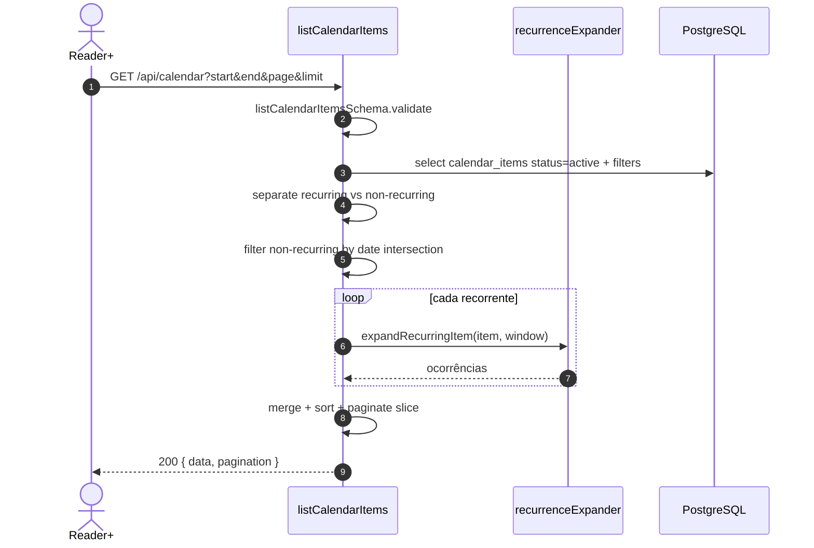
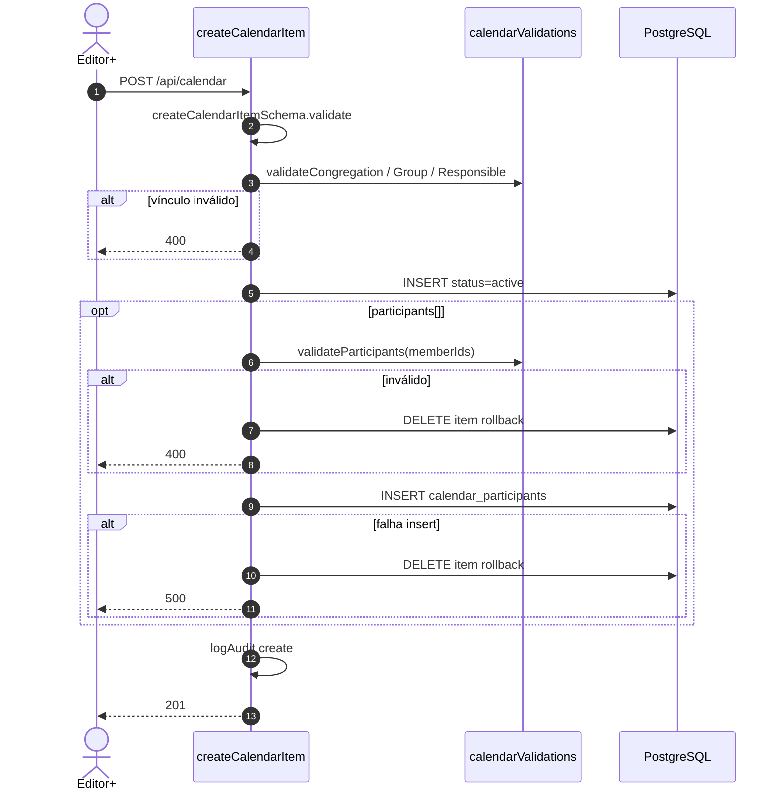
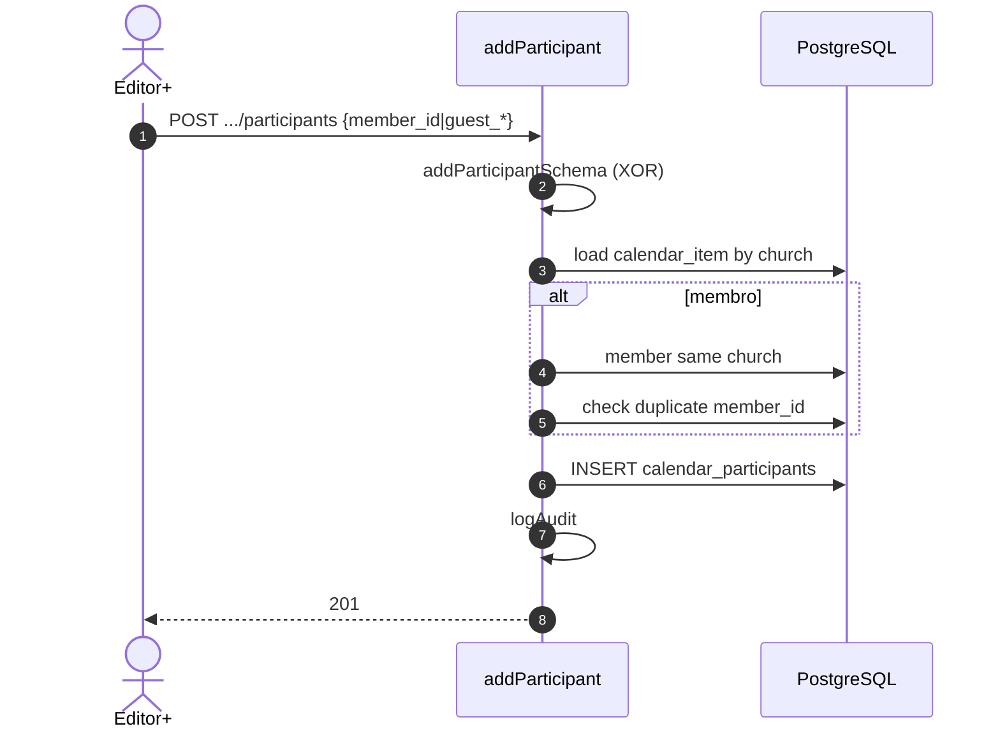
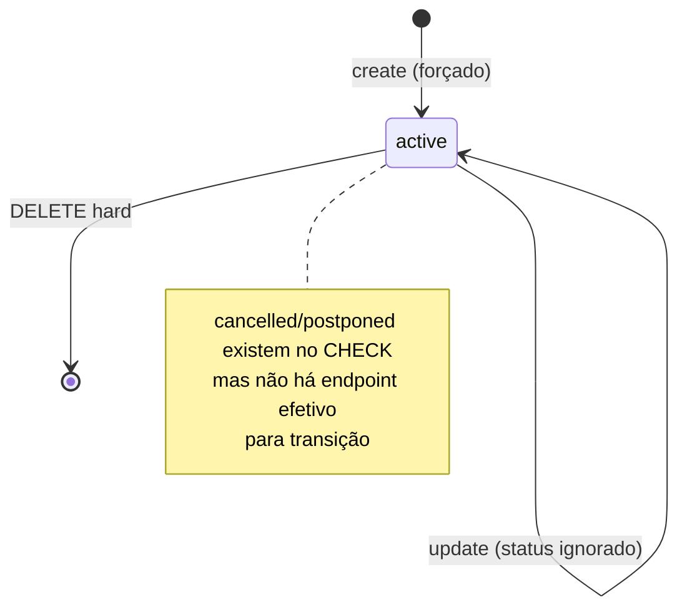
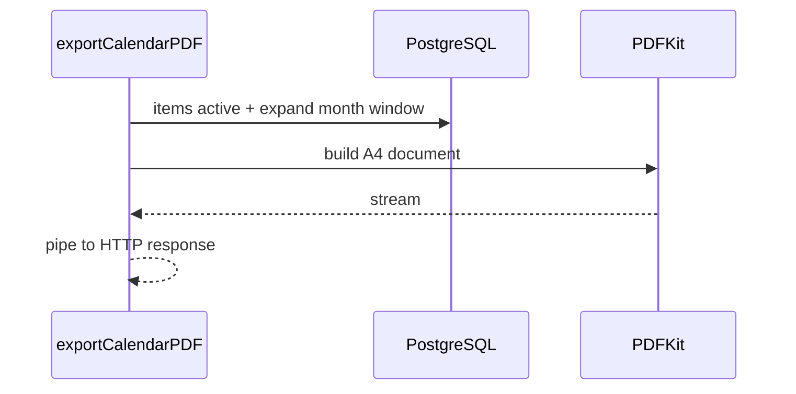
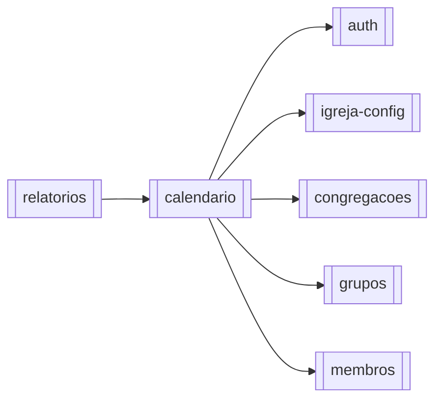

# Módulo — Calendário

> Agenda da igreja: itens (`calendar_items`) com tipos Programação/Evento/Encontro/Reunião, recorrência weekly/monthly expandida na listagem, participantes (membro XOR convidado) e export PDF mensal.  
> Regras: [[02_regras-de-negocio/regras-por-modulo/calendario]] · Índice: [[04_modulos/index]] · Schema: [[03_arquitetura/banco-de-dados]].

---

## 1. 📌 Visão Geral

Centraliza a programação operacional da igreja (cultos, reuniões, eventos) com escopo opcional por congregação/grupo, responsável do rol e lista de participantes (membros ou convidados externos).

Existe para substituir planilhas/agenda informal e alimentar visão mensal no app + PDF exportável.

No sistema, é módulo de domínio com lógica mais densa (expansão de recorrência em memória). Consome congregações, grupos e membros; é consumido por relatórios/UX.  
Produto: [[01_produto/visao-do-produto]].

---

## 2. ⚖️ Bounded Context

### ✅ Este módulo É responsável por:

- CRUD de `calendar_items` no tenant
- Validação de tipo, datas, recorrência (weekly/monthly) e vínculos alinhados (cong./grupo/responsável)
- Forçar `status = 'active'` na criação; **não aplicar** mudança de status no PUT
- Listagem com expansão de ocorrências recorrentes no intervalo + paginação pós-expansão
- Filtros: type, congregation (UUID; `sede` rejeitado), group, janela de datas
- Participantes: XOR membro/guest; add; list; remove; bulk; opcional no create do item
- Export PDF mensal (PDFKit, síncrono) dos itens ativos com expansão
- Helper `GET /api/calendar/groups` — grupos que têm itens no calendário
- Auditoria create/update/delete (item e participantes)

### ❌ Este módulo NÃO é responsável por:

- CRUD de membros/grupos/congregações
- Lembretes por e-mail/WhatsApp ou sync Google/Outlook
- Jobs de geração prévia de ocorrências (expansão é **on-read**)
- Mudança efetiva para `cancelled`/`postponed` pela API atual (valores no schema/CHECK, mas write path força/ignora)
- Aniversários (UI `BirthdaysModal` usa dados de membros, não endpoints deste módulo)
- Relatórios agregados gerais (→ [[04_modulos/relatorios]]); PDF mensal de agenda **é** deste módulo

---

## 3. 📁 Estrutura de Arquivos

```
backend/src/
├── routes/
│   ├── calendar.ts                      → /api/calendar (7 rotas)
│   └── calendarParticipants.ts          → /api/calendar-items/.../participants (4)
├── controllers/
│   ├── calendarController.ts            → CRUD, list expandida, PDF, groups helper
│   └── calendarParticipantController.ts → add/list/remove/bulk
├── validators/
│   ├── calendarValidator.ts             → create/update/list Joi
│   └── calendarParticipantValidator.ts  → add participant XOR
├── utils/
│   ├── calendarValidations.ts           → cong./grupo/responsável/participantes
│   ├── recurrenceExpander.ts            → expand weekly/monthly (date-fns)
│   └── auditLogger.ts
└── types/index.ts                       → CalendarItem*, CalendarParticipant*

frontend/src/
├── app/(main)/calendar/page.tsx
└── components/calendar/                 → mês, lista, form, participantes, filtros

app.ts mounts:
  app.use('/api/calendar', calendarRoutes)
  app.use('/api', calendarParticipantsRoutes)

Testes: inexistentes.
Migrations: schema Supabase (sem pasta local dedicada).
```

---

## 4. 🗄️ Entidades e Models

### calendar_items

Programação/evento/encontro/reunião da igreja (única linha = série se recorrente).

| Campo | Tipo | Nullable | Default | Descrição |
| --- | --- | --- | --- | --- |
| id | uuid | NOT NULL | gen_random_uuid() | PK |
| church_id | uuid | NOT NULL | — | Tenant CASCADE |
| title | text | NOT NULL | — | Título 2–100 |
| type | text | NOT NULL | — | Programação \| Evento \| Encontro \| Reunião |
| description | text | NULL | — | ≤5000 no validator |
| start_date | timestamptz | NOT NULL | — | Início (ou data-base da série YYYY-MM-DD se recorrente) |
| end_date | timestamptz | NULL | — | Fim (não recorrente: > start) |
| is_recurring | boolean | NULL | false | Flag recorrência |
| recurrence_pattern | text | NULL | — | weekly \| monthly (`custom` no CHECK DB; API só weekly/monthly) |
| recurrence_end_date | timestamptz | NULL | — | Fim da série |
| recurrence_time | time | NULL | — | HH:mm obrigatório se recorrente |
| recurrence_duration_minutes | int4 | NULL | — | Duração ocorrência |
| recurrence_day_of_week | int4 | NULL | — | 0–6 (Dom–Sáb); obrigatório weekly |
| recurrence_day_of_month | int4 | NULL | — | 1–31 (modo mensal A) |
| recurrence_week_of_month | int4 | NULL | — | -1…4 (modo mensal B com day_of_week) |
| location | text | NULL | — | Local ≤255 |
| congregation_id | uuid | NULL | — | Opcional; sem sentinel Sede |
| group_id | uuid | NULL | — | Grupo opcional |
| responsible_member_id | uuid | NULL | — | Membro responsável |
| created_by | uuid | NULL | — | auth.users |
| status | text | NOT NULL | `'active'` | CHECK active/cancelled/postponed — **API write só active** |
| created_at / updated_at | timestamptz | NOT NULL | now() | Auditoria |

**Relacionamentos:**

- Pertence a: `churches`; opcionalmente `congregations`, `groups`, `members` (responsável)
- Tem muitos: `calendar_participants` CASCADE

**Soft delete:** não — DELETE hard (+ CASCADE participantes). Status cancelado/adiado não é usado pela API atual.  
**Auditoria:** timestamps + `audit_logs` entity `calendar_item`.

```typescript
// types (conceitual) — ocorrência expandida reusa CalendarItem
interface CalendarItem {
  id: string;
  church_id: string;
  title: string;
  type: CalendarItemType;
  start_date: Date;
  end_date?: Date | null;
  is_recurring: boolean;
  recurrence_pattern?: RecurrencePattern | null;
  // ... demais recurrence_* / location / FKs
  status: CalendarStatus; // efetivamente 'active' nas writes
}
```

---

### calendar_participants

Participante de um item: **membro XOR convidado**.

| Campo | Tipo | Nullable | Default | Descrição |
| --- | --- | --- | --- | --- |
| id | uuid | NOT NULL | uuid_generate_v4() | PK |
| calendar_item_id | uuid | NOT NULL | — | FK CASCADE |
| member_id | uuid | NULL | — | Membro; UNIQUE (item, member) |
| guest_name | varchar | NULL | — | Nome convidado |
| guest_email | varchar | NULL | — | E-mail convidado |
| guest_phone | varchar | NULL | — | Telefone |
| guest_whatsapp | varchar | NULL | — | WhatsApp |
| created_at / updated_at | timestamptz | NULL | now() | Auditoria |

**CHECK DB:** `(member_id NOT NULL ∧ guest_name NULL) ∨ (member_id NULL ∧ guest_name NOT NULL)`.

**Soft delete:** não.  
**Auditoria:** `audit_logs` nas ops de participante.

```typescript
interface CalendarParticipant {
  id: string;
  calendar_item_id: string;
  member_id?: string | null;
  guest_name?: string | null;
  guest_email?: string | null;
  guest_phone?: string | null;
  guest_whatsapp?: string | null;
}
```

---

## 5. 🌐 Interface Pública

Auth: `authMiddleware` + `requireRole('reader')`; mutações `editor+`.

### Itens — `/api/calendar`

| Método | Rota | Auth | Role | Descrição |
| --- | --- | --- | --- | --- |
| GET | `/api/calendar/` | ✅ | ≥ reader | Lista expandida + paginação |
| GET | `/api/calendar/groups` | ✅ | ≥ reader | Grupos com itens no calendário |
| GET | `/api/calendar/export/pdf` | ✅ | ≥ reader | PDF mensal |
| GET | `/api/calendar/:id` | ✅ | ≥ reader | Detalhe (+ participantes) |
| POST | `/api/calendar/` | ✅ | ≥ editor | Criar (+ participants opcional) |
| PUT | `/api/calendar/:id` | ✅ | ≥ editor | Atualizar (status ignorado) |
| DELETE | `/api/calendar/:id` | ✅ | ≥ editor | Remover (204) |

### Participantes — `/api/...`

| Método | Rota | Auth | Role | Descrição |
| --- | --- | --- | --- | --- |
| GET | `/api/calendar-items/:calendarItemId/participants` | ✅ | ≥ reader | Listar |
| POST | `/api/calendar-items/:calendarItemId/participants` | ✅ | ≥ editor | Adicionar um |
| POST | `/api/calendar-items/:calendarItemId/participants/bulk` | ✅ | ≥ editor | Bulk |
| DELETE | `/api/calendar-items/:calendarItemId/participants/:participantId` | ✅ | ≥ editor | Remover |

**Total:** **11** endpoints.

### Query — `GET /api/calendar/`

| Param | Default | Notas |
| --- | --- | --- |
| `type` | — | string ou array dos 4 tipos |
| `congregation_id` | — | uuid (`sede` rejeitado) |
| `group_id` | — | uuid |
| `start_date` / `end_date` | ano atual | ISO; define janela de expansão |
| `page` | 1 | pós-expansão |
| `limit` | 50 | max **2000** |

```typescript
// Response 200:
{
  data: CalendarItem[], // ocorrências (recorrentes clonadas com datas da ocorrência)
  pagination: { page, limit, total, totalPages }
}
```

Só retorna `status = 'active'`.

### Contrato — `POST /api/calendar/`

```typescript
// Request (createCalendarItemSchema) — campos principais:
{
  title: string;              // 2–100
  type: 'Programação'|'Evento'|'Encontro'|'Reunião';
  description?: string;       // ≤5000
  start_date: string;         // ISO date-time se !recurring; YYYY-MM-DD se recurring
  end_date?: string | null;   // se !recurring e informado: > start_date
  is_recurring?: boolean;     // default false
  recurrence_pattern?: 'weekly'|'monthly';  // obrigatório se recurring
  recurrence_time?: string;                 // HH:mm obrigatório se recurring
  recurrence_end_date?: string | null;
  recurrence_duration_minutes?: number | null;
  recurrence_day_of_week?: 0|1|2|3|4|5|6; // obrigatório weekly
  recurrence_day_of_month?: 1..31;          // monthly XOR
  recurrence_week_of_month?: -1|1|2|3|4;    // monthly XOR c/ day_of_week
  location?: string;
  congregation_id?: string | null;
  group_id?: string | null;
  responsible_member_id?: string | null;
  participants?: Array<{
    member_id?: string;
    guest_name?: string;
    guest_email?: string;
    guest_phone?: string;
    guest_whatsapp?: string;
  }>; // cada um: membro XOR guest
}

// Persistido sempre com status: 'active'
// Response 201: calendar_item (+ joins congregação/grupo/responsável)

// Se participants inválidos → rollback delete do item + 400/500
```

### PDF — `GET /api/calendar/export/pdf`

```typescript
// Query: month (1–12), year, congregation_id?, group_id?
// Response: application/pdf attachment calendario-YYYY-MM.pdf
```

### Bulk participantes

```typescript
// POST body: { participants: CreateParticipantData[] }
// Response: { success, errors, duplicates } (processamento parcial)
```

---

## 6. ⚙️ Regras de Negócio

Detalhe: [[02_regras-de-negocio/regras-por-modulo/calendario]] (**16** regras).

| ID | Declaração curta |
| --- | --- |
| BR-CAL-001 | type ∈ Programação\|Evento\|Encontro\|Reunião |
| BR-CAL-002 | Título 2–100; descrição ≤5000; local ≤255 |
| BR-CAL-003 | Create força `status=active` |
| BR-CAL-004 | Recorrente: pattern weekly\|monthly + `recurrence_time` HH:mm |
| BR-CAL-005 | weekly exige `recurrence_day_of_week` 0–6 |
| BR-CAL-006 | monthly: dia do mês **OU** (semana+dia), XOR |
| BR-CAL-007 | Não recorrente: `end_date` > `start_date` se informado |
| BR-CAL-008 | PUT **não** aplica status do body |
| BR-CAL-009 | Congregação/grupo/responsável da igreja e coerentes |
| BR-CAL-010 | Escrita editor+; leitura reader+ |
| BR-CAL-011 | Participante membro XOR guest_name |
| BR-CAL-012 | Membro participante válido (igreja; alinhamento cong. no create com participants) |
| BR-CAL-013 | Sem duplicar mesmo `member_id` no item |
| BR-CAL-014 | Isolamento por `church_id` |
| BR-CAL-015 | List expande recorrência; só active; limit ≤2000 |
| BR-CAL-016 | PDF mensal: ativos + filtros + expansão |

---

## 7. 🔄 Fluxos do Módulo

### Fluxo: Listar (expansão de recorrência)



### Fluxo: Criar item (+ participantes opcionais)



### Fluxo: Adicionar participante



### Estados do item

Schema permite `active | cancelled | postponed`, mas a API atual **só escreve/lista active**:



---

## 8. 🔗 Integrações

Não há Stripe/Resend/Google Calendar. Persistência + PDF local.

### Supabase PostgreSQL

- Propósito: CRUD `calendar_items` / `calendar_participants` + joins  
- Falha: 400/404/500 com `{ error, details }`  
- Config: `SUPABASE_URL`, `SUPABASE_SERVICE_ROLE_KEY`

### PDFKit (biblioteca in-process)

- Propósito: gerar PDF mensal streamado na response (`exportCalendarPDF`)  
- Operações: `new PDFDocument` → `doc.pipe(res)`  
- Falha: 400 params / 400 query / 500 catch  
- Sem variável de ambiente própria



---

## 9. ⚙️ Operações em Background

N/A — sem jobs/cron. Recorrência é expandida **sincronamente** na listagem/PDF (não materializa linhas futuras).

---

## 10. 🚨 Tratamento de Erros

| Situação | HTTP | `error` típico | Quando |
| --- | --- | --- | --- |
| Sem auth | 401 | `Não autorizado` | handlers |
| Role | 403 | requireRole | mutações |
| Query list inválida | 400 | `Parâmetros inválidos` | GET list |
| Body Joi | 400 | `Dados inválidos` | create/update/participant |
| Cong./grupo/responsável | 400 | invalidação específica | create/update |
| Membros participants | 400 | `Membros inválidos` | create (+ rollback) |
| Insert participants fail | 500 | `Erro ao adicionar participantes` | create (+ rollback) |
| Mês PDF inválido | 400 | `Parâmetros inválidos` | export |
| Item não encontrado | 404 | `Item do calendário não encontrado` | get/update/delete/participants |
| Membro participante | 404 | membro não encontrado | add member |
| Duplicata membro | 400 | já participante | add |
| Erro query/insert | 400/500 | operacional | Catch / PostgREST |

Sem códigos internos tipados — padrão `{ error, details }`.

---

## 11. 🔐 Segurança e Autorização

| Controle | Detalhe |
| --- | --- |
| Auth | JWT + `req.church.churchId` |
| Leitura / PDF | reader+ |
| Escrita item e participantes | editor+ |
| Tenant | filtros `church_id` em todas as ops |
| Vínculos | validate* impedem FK de outra igreja / cong. desalinhada |
| Dados | títulos/locais públicos no tenant; guest_email/phone/whatsapp = PII de convidados |

Isolamento RLS bypassado pelo service_role — confiança no filtro aplicacional.

---

## 12. 🧪 Testes

| Tipo | Arquivo | Cobertura | O que testa |
| --- | --- | --- | --- |
| — | — | 0% | Nenhum teste dedicado |

**Gaps críticos:**

- Expansão weekly/monthly (bordas, week_of_month=-1, DST)
- Paginação pós-expansão (limit 2000, default ano inteiro)
- XOR participante e UNIQUE membro
- Rollback create quando participants falham
- Status dead path (cancelled/postponed)
- PDF params e filtros por congregação (UUID)
- Isolamento cross-tenant

---

## 13. 🔗 Dependências

**Consome:**

- [[04_modulos/auth]] — sessão/RBAC  
- [[04_modulos/igreja-config]] — nome da igreja no PDF + tenant  
- [[04_modulos/congregacoes]] — escopo por UUID  
- [[04_modulos/grupos]] — vínculo opcional + helper `/groups`  
- [[04_modulos/membros]] — responsável e participantes  

**Dependem deste:**

- [[04_modulos/relatorios]] — visão/exports que cruzam agenda (quando aplicável)  
- Frontend calendar + guia tutorial `calendario.ts`



---

## 14. ⚠️ Pontos de Atenção

1. **Status morto na API** — CHECK/`CalendarStatus` incluem cancelled/postponed, mas create força active e update ignora body; list/PDF só active. DELETE é o caminho real de “remover”.  
2. **Expansão em memória** — list busca **todos** items active do tenant (filtros type/cong/group), depois filtra/expande; janela default = **ano inteiro**. Pode pesar em igrejas com muitas séries.  
3. Ocorrências expandidas **não** são IDs distintos no DB — editar/apagar atua no template (`calendar_items.id`); UI deve tratar isso.  
4. `recurrence_pattern` `custom` no schema DB **não** é aceito pelo Joi da API.  
5. Add participant avulso valida membro na igreja, mas o alinhamento fino à congregação do item é mais estrito no **create com participants** (`validateParticipants`) do que no add avulso (só church).  
6. Bulk retorna sucesso parcial (`success`/`errors`/`duplicates`) — não é all-or-nothing.  
7. Ordem de rotas: `/groups` e `/export/pdf` **antes** de `/:id` — não reordenar.  
8. Biblioteca **date-fns** no expander e **pdfkit** no export — dependências do backend.

---

## 15. 📝 Histórico de Mudanças

| Data | Versão | Descrição | Issue |
| --- | --- | --- | --- |
| 2026-07-14 | 1.0 | Documentação inicial do módulo calendário | — |

---

## Confirmação

| Item | Valor |
| --- | --- |
| Módulo documentado | **calendario** ✅ |
| Endpoints | **11** (7 itens + 4 participantes) |
| Regras BR-CAL | **16** |
| Entidades | `calendar_items`, `calendar_participants` |
| Integrações | Supabase PostgreSQL + PDFKit (local) |
| Jobs | Nenhum (expansão síncrona) |
| Testes | Nenhum dedicado |
