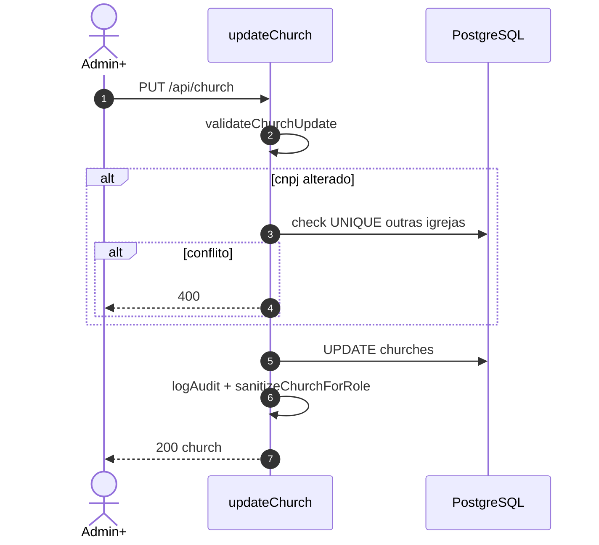
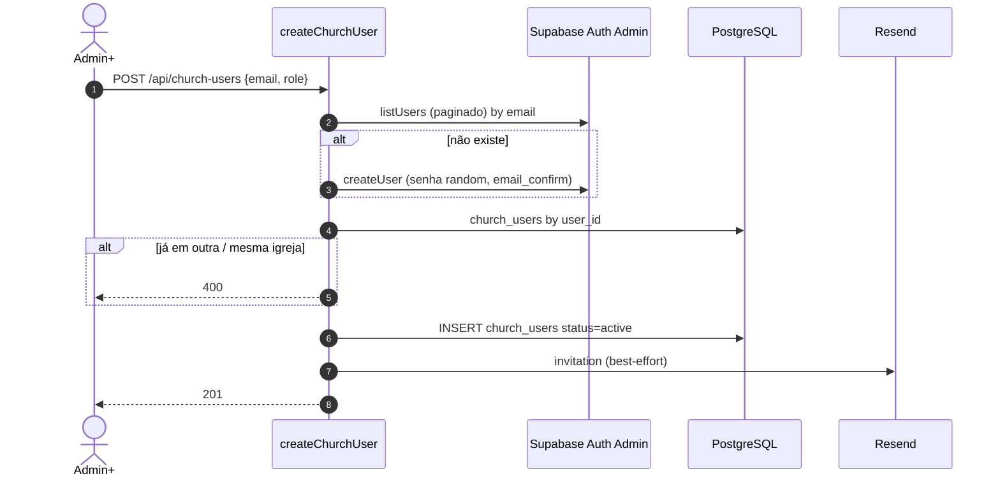
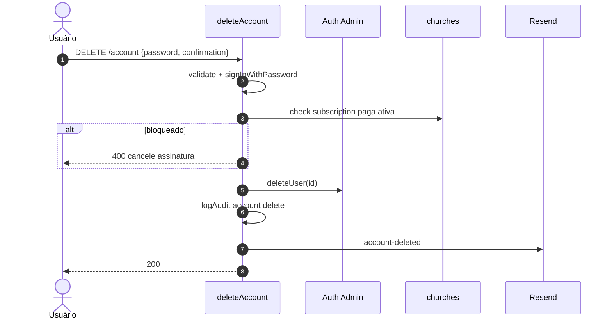
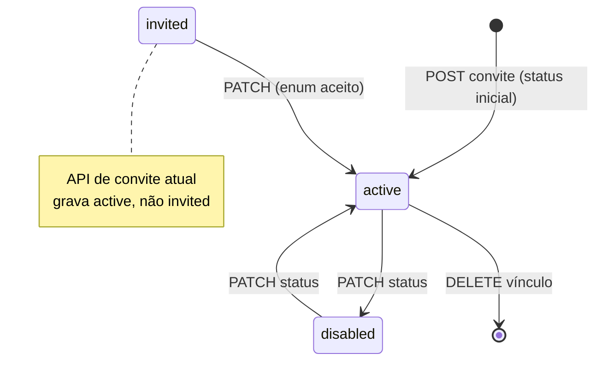
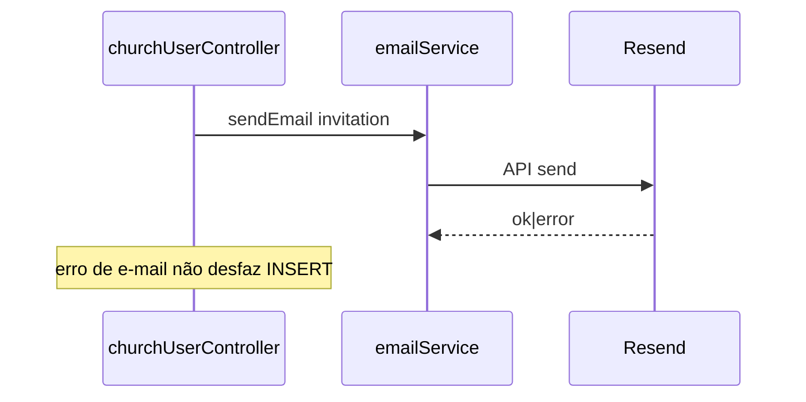
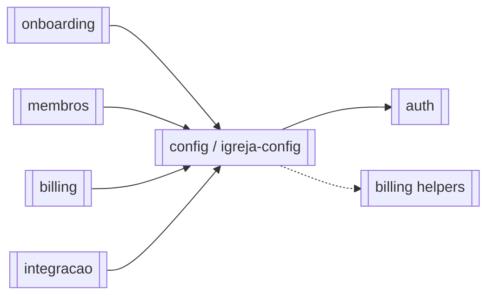

# Módulo — Config (Igreja, Conta e Equipe)

> Administra o tenant (`churches`), a conta Auth do usuário (`/api/account`), a equipe (`church_users`) e a leitura de `audit_logs`.  
> No catálogo da KB o slug é **igreja-config** ([\[\[04_modulos/igreja-config\]\]](./igreja-config.md)); IDs de regra: **BR-CFG-***.  
> Regras: [[02_regras-de-negocio/regras-por-modulo/igreja-config]] · Índice: [[04_modulos/index]].  
> Criação inicial da igreja/owner: [[04_modulos/onboarding]] · Planos/Stripe: [[04_modulos/billing]].

---

## 1. 📌 Visão Geral

Centraliza configurações pós-login: dados cadastrais da igreja, perfil Auth (e-mail/senha/telefone), convite/gestão de usuários com papéis, seletor de igreja ativa (memberships) e auditoria.

Resolve governança multi-usuário do tenant sem misturar com billing nem com o rol pastoral.

É pré-requisito transversal: quase todos os módulos dependem do `church_id` / role resolvidos a partir daqui + auth.  
Produto: [[01_produto/visao-do-produto]].

---

## 2. ⚖️ Bounded Context

### ✅ Este módulo É responsável por:

- GET/PUT dados da igreja ativa (`/api/church`)
- Sanitize de campos Stripe no GET para roles `editor`/`reader`
- Unicidade de CNPJ no update
- Quota snapshot via `GET /member-limit` (`checkMemberLimit`)
- Listar memberships + set active church cookie/contexto (`authUserOnly`)
- Conta: GET perfil, change email/password/phone, resend confirmation, delete account
- Equipe: CRUD `church_users` (admin+); convite cria Auth user se necessário
- Owner imutável nas rotas de users
- Uma igreja por `user_id` (UNIQUE)
- Histórico de atividades paginado (`GET /account/logs`, admin+) — UI Configurações → Histórico
- E-mails best-effort (convite, exclusão, confirmações de mudança sensível)
- Rate limits em church/account

### ❌ Este módulo NÃO é responsável por:

- Registro inicial igreja+owner (→ [[04_modulos/onboarding]])
- Checkout Stripe, webhooks, portal (→ [[04_modulos/billing]])
- Login/refresh/cookies JWT genéricos (→ [[04_modulos/auth]]; este módulo **usa** middlewares)
- CRUD de membros/congregações/grupos
- Wipe completo de todos os dados da igreja ao deletar conta (só `deleteUser` Auth + e-mail; cascades DB dependem de FKs)

---

## 3. 📁 Estrutura de Arquivos

```
backend/src/
├── routes/
│   ├── church.ts              → /api/church (5 rotas) + rate limit 50/15min
│   ├── account.ts             → /api/account (7 rotas) + RL conta/sensível
│   └── churchUsers.ts         → /api/church-users (4 rotas, admin+)
├── controllers/
│   ├── churchController.ts    → get/update/limit/memberships/active
│   ├── accountController.ts   → conta + audit logs + delete
│   └── churchUserController.ts→ equipe
├── validators/
│   ├── churchValidator.ts     → register (onboarding) + update
│   ├── accountValidator.ts    → email/password/delete
│   └── cnpjSchema.ts
├── utils/
│   ├── churchDto.ts           → sanitizeChurchForRole
│   └── auditLogger.ts
├── services/
│   ├── churchContext.ts       → resolve membership / active church
│   ├── emailService.ts        → Resend
│   └── memberLimit (billing helper usado em getMemberLimit)
└── templates/emails/
    ├── church-user-invitation.html
    └── account-deleted.html

app.ts:
  /api/church, /api/account, /api/church-users

frontend: (main)/settings/ (+ subscription page → billing)

Testes: inexistentes.
```

---

## 4. 🗄️ Entidades e Models

### churches

Tenant raiz (dados cadastrais + campos de assinatura geridos sobretudo pelo billing).

| Campo | Tipo | Nullable | Default | Descrição |
| --- | --- | --- | --- | --- |
| id | uuid | NOT NULL | gen_random_uuid() | PK |
| user_id | uuid | NOT NULL | — | Owner histórico (auth.users CASCADE) |
| name | text | NOT NULL | — | Nome |
| denomination | text | NOT NULL | — | Denominação |
| address / city / state | text | NOT NULL | — | Endereço |
| cnpj | varchar | NOT NULL | — | UNIQUE |
| email_church / phone_church | varchar | NULL | — | Contato |
| stripe_* / subscription_* / plan_type | — | NULL | — | Billing (omitidos no GET p/ editor/reader) |
| created_at | timestamptz | NULL | now() | Criação |

**Relacionamentos:** pai de quase todo o domínio; `church_users` N:N lógica.  
**Soft delete:** não.  
**Auditoria update:** `logAudit` entity church.

Campos Stripe removidos no sanitize para não-admin:

`stripe_customer_id`, `stripe_subscription_id`, `subscription_status`, `subscription_start_date`, `subscription_end_date`, `subscription_updated_at`, `last_stripe_event_created`.

---

### church_users

Papel do usuário Auth na igreja.

| Campo | Tipo | Nullable | Default | Descrição |
| --- | --- | --- | --- | --- |
| id | uuid | NOT NULL | gen_random_uuid() | PK |
| church_id | uuid | NOT NULL | — | FK CASCADE |
| user_id | uuid | NOT NULL | — | UNIQUE global → 1 igreja |
| role | enum | NOT NULL | — | owner \| admin \| editor \| reader |
| status | enum | NOT NULL | active | active \| invited \| disabled |
| access_all_congregations | boolean | NOT NULL | false | Acesso dinâmico a todas as congregações |
| created_at / updated_at | timestamptz | NOT NULL | now() | Auditoria |

**Convite API:** roles permitido `admin|editor|reader` (nunca `owner`). Status no insert: `active`.  
Para `reader`/`editor`: body exige `accessAllCongregations: true` **ou** `congregationIds: string[]` (≥1). Admin força all.  
**Relacionado:** tabela `church_user_congregations` (N:N) quando não é “todas”.  
**Soft delete:** DELETE remove o vínculo (não desativa por default — update pode set `disabled`).
---

### audit_logs

Trilha aplicacional do tenant (escrita por vários módulos via `logAudit`; **listagem** neste módulo).  
Na UI do app: **Histórico de atividades** (Configurações → Histórico), voltada a Owner/Admin.

| Campo | Tipo | Nullable | Default | Descrição |
| --- | --- | --- | --- | --- |
| id | uuid | NOT NULL | gen_random_uuid() | PK |
| created_at | timestamptz | NOT NULL | now() | Quando |
| user_id | uuid | NOT NULL | — | Ator |
| church_id | uuid | NOT NULL | — | Tenant |
| entity / entity_id | text / uuid | NOT NULL | — | Alvo |
| action | text | NOT NULL | — | create/update/delete/convert/import/export/deactivate |
| changes_before / after | jsonb | NULL | — | Diff |
| ip / user_agent | text | NULL | — | Contexto (gravado; **não** exposto no GET do app) |

**Listagem (`GET /account/logs`):** enriquece cada item com `actor` (`id`, `email`, `displayName`); omite `ip`/`user_agent`. Exclui logs legados de geração de relatório (`church`+`import` com `summary`). Import/export de lista de membros usam um log genérico (`list_type: 'members'`).

---

### Conta Auth (Supabase)

Sem tabela local dedicada — `auth.users` + user_metadata.phone. GET `/account` monta DTO a partir do JWT/user + metadados.

---

## 5. 🌐 Interface Pública

**Total:** **16** endpoints.

### `/api/church` — rate limit 50 / 15 min / IP

| Método | Rota | Auth | Role | Descrição |
| --- | --- | --- | --- | --- |
| GET | `/api/church/memberships` | ✅ user-only | — | Lista igrejas do user + activeId |
| POST | `/api/church/active` | ✅ user-only | — | Define igreja ativa (membership) |
| GET | `/api/church/` | ✅ | ≥ reader | Dados igreja (sanitizados) |
| GET | `/api/church/member-limit` | ✅ | ≥ reader | Quota membros |
| PUT | `/api/church/` | ✅ | ≥ admin | Atualiza cadastro |

```typescript
// PUT /api/church (validateChurchUpdate — todos opcionais)
{
  name?, denomination?, address?, city?, state?, // UF 2
  cnpj?, email_church?, phone_church?
}
// 400 CNPJ já cadastrado | Dados inválidos
// Response: church sanitize para role do requester
```

```typescript
// POST /api/church/active
{ churchId: string } // membership obrigatória → senão 403
```

### `/api/account` — RL 20/15min; sensíveis 5/hora

| Método | Rota | Auth | Role | Descrição |
| --- | --- | --- | --- | --- |
| GET | `/api/account/` | ✅ | auth | Perfil conta |
| PUT | `/api/account/email` | ✅ | + sensitive RL | Troca e-mail |
| PUT | `/api/account/password` | ✅ | + sensitive RL | Troca senha |
| PUT | `/api/account/phone` | ✅ | auth | Troca telefone |
| DELETE | `/api/account/` | ✅ | + sensitive RL | Exclui Auth user |
| POST | `/api/account/resend-confirmation` | ✅ | auth | Reenvia confirmação |
| GET | `/api/account/logs` | ✅ | ≥ admin | Histórico de atividades (`audit_logs` + `actor`) |

```typescript
// PUT /email { newEmail, password }
// PUT /password { currentPassword, newPassword } // 8+ upper+lower+digit
// PUT /phone — valida senha + telefone (controller)
// DELETE / { password, confirmation: 'EXCLUIR CONTA' }
// Bloqueia se subscription ativa paga sem end_date (plan ≠ '100')
```

```typescript
// GET /logs?page&limit≤100&entity&action&member_status_change=activate|deactivate
// Response: { data: [{ …, actor: { id, email, displayName } }], pagination }
// Sem ip / user_agent no payload do app
```

### `/api/church-users` — todo o router `requireRole('admin')`

| Método | Rota | Auth | Role | Descrição |
| --- | --- | --- | --- | --- |
| GET | `/api/church-users/` | ✅ | ≥ admin | Lista equipe (+ escopo) |
| POST | `/api/church-users/` | ✅ | ≥ admin | Convida/cria vínculo + escopo |
| PATCH | `/api/church-users/:id` | ✅ | ≥ admin | role/status/escopo |
| DELETE | `/api/church-users/:id` | ✅ | ≥ admin | Remove vínculo |

```typescript
// POST { email, role: 'admin'|'editor'|'reader',
//        accessAllCongregations?: boolean,
//        congregationIds?: string[] }
// reader/editor: all=true XOR congregationIds.length >= 1
// 201 { data: church_user + email + roleLabel + accessAllCongregations + congregationIds }
// 400 já na igreja / email em outra igreja / papel inválido / escopo inválido
```

---

## 6. ⚙️ Regras de Negócio

Detalhe: [[02_regras-de-negocio/regras-por-modulo/igreja-config]] (**18** regras).

| ID | Declaração curta |
| --- | --- |
| BR-CFG-001 | Update igreja admin+ |
| BR-CFG-002 | CNPJ único no update |
| BR-CFG-003 | GET omite Stripe p/ editor/reader |
| BR-CFG-004 | Active church só com membership |
| BR-CFG-005 | Change e-mail: senha + e-mail ≠ atual |
| BR-CFG-006 | Change senha: atual + nova forte |
| BR-CFG-007 | Change telefone: senha correta |
| BR-CFG-008 | CRUD church-users admin+ |
| BR-CFG-009 | Convite só admin\|editor\|reader |
| BR-CFG-010 | Um user_id → uma igreja |
| BR-CFG-011 | Owner imutável (PATCH/DELETE users) |
| BR-CFG-012 | Delete conta: senha + EXCLUIR CONTA; bloqueia assinatura paga ativa |
| BR-CFG-013 | Histórico de atividades (audit logs) admin+ na church ativa |
| BR-CFG-014 | E-mail convite best-effort |
| BR-CFG-015 | E-mail pós-exclusão de conta |
| BR-CFG-016 | Escopo de congregação obrigatório p/ reader/editor |
| BR-CFG-017 | Admin/owner = acesso a todas as congregações |
| BR-CFG-018 | Promoção limpa escopo; rebaixamento exige seleção |

---

## 7. 🔄 Fluxos do Módulo

### Fluxo: Atualizar igreja



### Fluxo: Convidar usuário



### Fluxo: Excluir conta



### Estados — church_users.status



---

## 8. 🔗 Integrações

### Supabase PostgreSQL

- CRUD `churches`, `church_users`, leitura `audit_logs`  
- Config: `SUPABASE_URL`, service_role

### Supabase Auth Admin

- Propósito: list/create/delete users; update e-mail/senha/telefone via client Auth  
- Falha: 400/500 com details

### Resend (via `emailService`)

- Propósito: convite equipe, conta excluída, e-mails de alteração sensível  
- Falha: best-effort (usuário/vínculo já persistido)  
- Config: chaves Resend / FROM (ver serviço de e-mail)



---

## 9. ⚙️ Operações em Background

N/A — sem jobs/cron deste módulo. E-mails são síncronos best-effort na request.

---

## 10. 🚨 Tratamento de Erros

| Situação | HTTP | Quando |
| --- | --- | --- |
| Auth / role | 401/403 | middlewares |
| Rate limit church/account | 429 | limiters |
| Validação Joi | 400 | update/account |
| CNPJ duplicado | 400 | PUT church |
| Sem membership | 403 | POST active |
| Papel inválido / owner mutação | 400 | church-users |
| E-mail em outra igreja | 400 | POST users |
| Senha incorreta | 400 | change*/delete |
| Assinatura paga ativa | 400 | DELETE account |
| Service role ausente | 500 | deleteUser |
| Igreja/user não achado | 404 | GET/update |
| Logs query fail | 500 | getAuditLogs |

---

## 11. 🔐 Segurança e Autorização

| Controle | Detalhe |
| --- | --- |
| Church mutação | admin+ |
| Equipe | admin+ em todas as rotas |
| Logs | admin+ |
| Conta | próprio usuário + reauth por senha em ops sensíveis |
| Billing leakage | sanitize GET church |
| Rate limits | church 50/15m; account 20/15m; email/password/delete 5/h |
| PII | CNPJ, e-mails, telefones, metadados Auth |
| Convite | `listUsers` Admin API paginado (custo/privacidade) |

---

## 12. 🧪 Testes

| Tipo | Arquivo | Cobertura | O que testa |
| --- | --- | --- | --- |
| — | — | 0% | Nenhum teste dedicado |

**Gaps:** sanitize role; CNPJ unique; owner imutável; 1 igreja/user; bloqueio delete com Stripe ativo; active church cookie; audit filters activate/deactivate; e-mail falha vs 201.

---

## 13. 🔗 Dependências

**Consome:**

- [[04_modulos/auth]] — middlewares, cookie igreja ativa, JWT  
- Helpers de [[04_modulos/billing]] — `checkMemberLimit` no GET member-limit (sem ser dono do billing)

**Dependem deste (tenant/role):**

- Quase todos: membros, integração, congregações, grupos, calendário, relatórios, billing, onboarding (cria church)



---

## 14. ⚠️ Pontos de Atenção

1. **`listUsers` paginado** no convite — O(n) Auth users; frágil em escala.  
2. Convite seta `status: 'active'` e `email_confirm: true` com senha aleatória — usuário precisa reset de senha (fluxo Auth), não “invited” formal.  
3. **Delete conta** remove Auth user; escopo de cascade da igreja inteira vs só membership **não** está unificado na request — risco de orfandade/legado `churches.user_id`.  
4. `user_id` em churches é legado; autorização moderna é `church_users`.  
5. GET member-limit expõe status de assinatura a reader+ — alinhado a quota UX, mas não sanitiza como GET church.  
6. Dual path memberships (`authUserOnly`) vs rotas com church context — não chamar setActive sem cookie jar no client.  
7. Templates HTML de e-mail precisam ficar em sync com copy de produto.

---

## 15. 📝 Histórico de Mudanças

| Data | Versão | Descrição | Issue |
| --- | --- | --- | --- |
| 2026-07-14 | 1.0 | Documentação inicial (config / igreja-config) | — |
| 2026-07-20 | 1.1 | Histórico de atividades: UI legível + `actor` no GET; action `export`; sem log em relatório | DEV-16 |

---

## Confirmação

| Item | Valor |
| --- | --- |
| Módulo documentado | **config** (alias catálogo **igreja-config**) ✅ |
| Endpoints | **16** (5 church + 7 account + 4 church-users) |
| Regras BR-CFG | **15** |
| Entidades | `churches`, `church_users`, `audit_logs` (list) |
| Integrações | Supabase DB + Auth Admin + Resend |
| Jobs | Nenhum |
| Testes | Nenhum dedicado |
