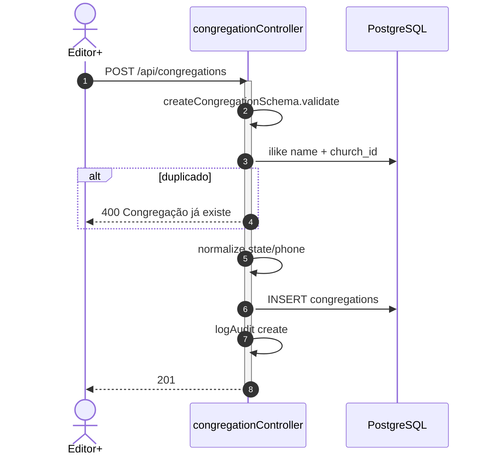
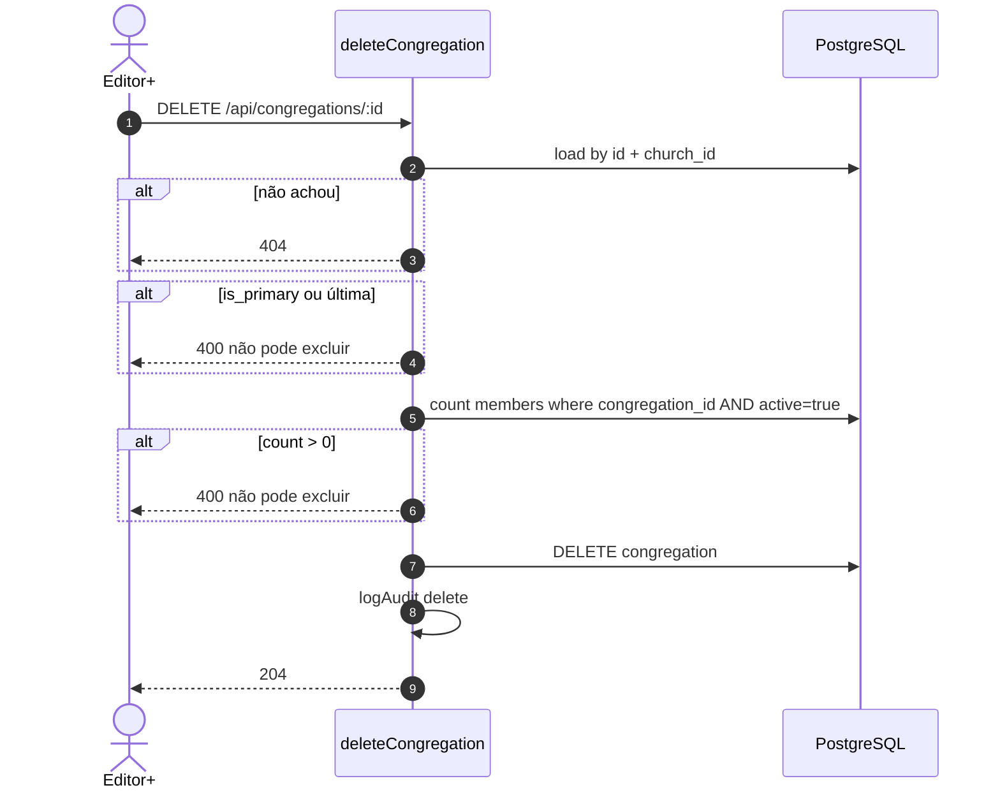
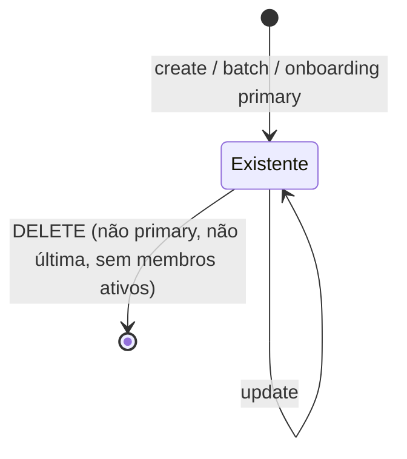
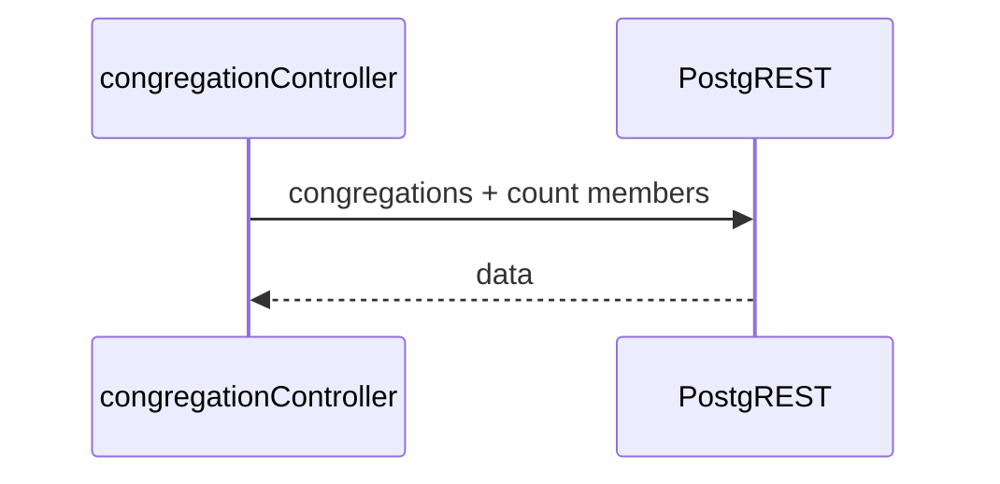
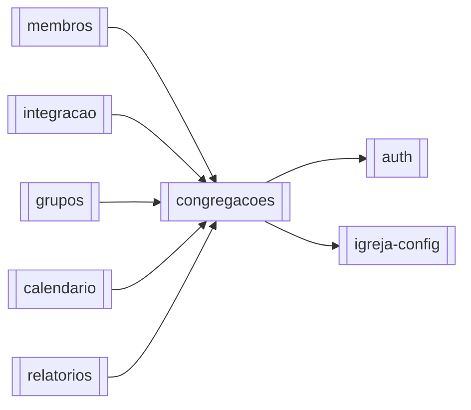

# Módulo — Congregações

> Unidades locais da igreja: CRUD + batch, congregação principal (`is_primary`), isolamento por `church_id`, contagem de membros ativos.  
> Regras: [[02_regras-de-negocio/regras-por-modulo/congregacoes]] · Índice: [[04_modulos/index]] · Schema: [[03_arquitetura/banco-de-dados]].

---

## 1. 📌 Visão Geral

Organiza a estrutura geográfica/pastoral do tenant: cada congregação tem nome completo único na igreja, abreviação opcional (nome popular curto), endereço e dados opcionais de líder/telefone.

Toda igreja tem exatamente uma **congregação principal** (`is_primary=true`), criada no onboarding com o nome/endereço da igreja. Membros e grupos referenciam congregações reais por UUID — não existe mais sentinel “Sede” / `null`.

É entidade de apoio: leve em regras, mas amplamente referenciada.  
Produto: [[01_produto/visao-do-produto]] · Glossário: [[01_produto/glossario]].

---

## 2. ⚖️ Bounded Context

### ✅ Este módulo É responsável por:

- CRUD de `congregations` no tenant autenticado
- Batch create com unicidade intra-lote e vs existentes (`is_primary: false` em creates manuais)
- Flag `is_primary` (única por igreja; unique parcial no banco)
- Unicidade de nome case-insensitive por igreja
- Abreviação opcional (`abbreviation`), única por igreja quando preenchida (case-insensitive; unique parcial no banco)
- Normalização UF (uppercase), telefone (só dígitos) e abreviação (trim; `''` → `NULL`)
- Listagem com `search` em nome **ou** abreviação e `activeMembersCount` (membros `active=true`)
- Bloquear DELETE se houver membros ativos, se for principal, ou se for a última congregação
- Auditoria create/update/delete
- UI: labels Nome completo / Abreviação; display compacto via `getCongregationDisplayName` nos consumidores

### ❌ Este módulo NÃO é responsável por:

- Criação da primary no register (→ [[04_modulos/onboarding]] / `authController` + `primaryCongregation.ts`)
- CRUD de membros/grupos/calendário/links (só é FK consumida)
- Soft delete / campo `active` na própria congregação (**não existe** no schema)
- Paginação da lista (retorna conjunto do tenant)
- Export PDF (→ [[04_modulos/relatorios]])
- Geocoding (IBGE no front de formulários é UX, não deste módulo)

---

## 3. 📁 Estrutura de Arquivos

```
backend/src/
├── routes/
│   └── congregations.ts           → 6 rotas REST
├── controllers/
│   └── congregationController.ts  → create, list, get, update, delete, batch
├── validators/
│   └── congregationValidator.ts   → Joi create/update
├── utils/
│   ├── congregationValidation.ts  → helpers usados por membros/integração/público
│   ├── primaryCongregation.ts     → get/create primary + resolveCongregationFilter
│   └── auditLogger.ts
└── types/index.ts                 → interface Congregation (inclui is_primary)

frontend/src/app/(main)/congregations/  → UI (badge Principal; delete bloqueado)
frontend/src/utils/congregation.ts     → getPrimaryCongregationId + getCongregationDisplayName

Testes: inexistentes.
Migrations: `congregations_is_primary_and_backfill`, `congregations_add_abbreviation` (Supabase).
```

---

## 4. 🗄️ Entidades e Models

### congregations

Unidade local da igreja.

| Campo | Tipo | Nullable | Default | Descrição |
| --- | --- | --- | --- | --- |
| id | uuid | NOT NULL | uuid_generate_v4() | PK |
| church_id | uuid | NOT NULL | — | Tenant (CASCADE) |
| name | text | NOT NULL | — | Nome completo (único por igreja, app-level) |
| abbreviation | text | NULL | — | Nome popular curto (opcional; único por igreja quando preenchido) |
| address | text | NOT NULL | — | Endereço |
| city | text | NOT NULL | — | Cidade |
| state | text | NOT NULL | — | UF 2 letras |
| leader | text | NULL | — | Líder |
| phone | text | NULL | — | Telefone (dígitos) |
| is_primary | boolean | NOT NULL | false | Congregação principal do tenant |
| created_at | timestamptz | NOT NULL | timezone utc now | Criação |
| updated_at | timestamptz | NOT NULL | timezone utc now | Atualização |

**Relacionamentos:**

- Pertence a: `churches` (`church_id`)
- Tem muitos (FKs em outros módulos): `members.congregation_id` (**NOT NULL**, FK **RESTRICT**), `groups`, `calendar_items`, `integration_members.expected_congregation_id`, `public_registration_links.default_congregation_id`

**Soft delete:** **não**. DELETE físico, bloqueado se houver membros ativos, se `is_primary`, ou se for a última congregação.  
**Auditoria:** `created_at`/`updated_at` + `audit_logs` entity `congregation`.

```typescript
// types Congregation (conceitual)
{
  id: string;
  church_id: string;
  name: string;
  abbreviation?: string | null;
  address: string;
  city: string;
  state: string;
  leader?: string | null;
  phone?: string | null;
  is_primary: boolean;
  created_at: Date;
  updated_at: Date;
  // list/get enriquecido:
  activeMembersCount?: number;
}
```

---

## 5. 🌐 Interface Pública

Router: `authMiddleware` + `requireRole('reader')`; mutações `editor+`.

| Método | Rota | Auth | Role | Descrição |
| --- | --- | --- | --- | --- |
| GET | `/api/congregations/` | ✅ | ≥ reader | Lista (+ search, contagem ativos) |
| GET | `/api/congregations/:id` | ✅ | ≥ reader | Detalhe + contagem |
| POST | `/api/congregations/` | ✅ | ≥ editor | Criar |
| POST | `/api/congregations/batch` | ✅ | ≥ editor | Criar lote |
| PUT | `/api/congregations/:id` | ✅ | ≥ editor | Atualizar |
| DELETE | `/api/congregations/:id` | ✅ | ≥ editor | Remover (204) |

**Total:** **6** endpoints.

### Contrato — `POST /api/congregations/`

```typescript
// Request (createCongregationSchema):
{
  name: string;            // 2–100, obrigatório (nome completo)
  abbreviation?: string;   // max 20, opcional; '' → NULL
  address: string;         // 5–255
  city: string;            // 2–100
  state: string;           // length 2 → salvo UPPERCASE
  leader?: string;         // max 100, '' ok
  phone?: string;          // 10–11 dígitos (formatação permitida no input)
}

// Response 201: Congregation row

// Erros:
// 400 — Dados inválidos / Congregação já existe / Abreviação já existe / erro insert
// 403 — role
// 500 — verificação ou interno
```

### Listagem — `GET /api/congregations/?search=`

```typescript
// Response 200: Congregation[] ordenado por name
// cada item inclui abbreviation? e activeMembersCount: number
// search filtra name OU abbreviation (ilike)
// Sem paginação page/limit
```

### Delete — `DELETE /api/congregations/:id`

```typescript
// 204 No Content
// 400 — membros ativos associados | congregação principal | última congregação
// 404 — não encontrada nesta church
```

---

## 6. ⚙️ Regras de Negócio

Detalhe: [[02_regras-de-negocio/regras-por-modulo/congregacoes]] (**14** regras).

| ID | Declaração curta |
| --- | --- |
| BR-CON-001 | Campos obrigatórios + abreviação opcional (limites Joi) |
| BR-CON-002 | Nome completo único na igreja (ilike) |
| BR-CON-003 | Batch: array; sem dup nome/abbr no lote nem vs DB; `is_primary: false` |
| BR-CON-004 | UF uppercase; telefone só dígitos; abbr trim / ''→NULL |
| BR-CON-005 | PUT não pode esvaziar name/address/city/state (abbr pode limpar) |
| BR-CON-006 | Escrita editor+; leitura reader+ |
| BR-CON-007 | DELETE proibido com membros `active=true` |
| BR-CON-008 | Isolamento por `church_id` do contexto |
| BR-CON-009 | Contagem só membros ativos |
| BR-CON-010 | Register cria primary (nome/endereço da igreja; sem abbr) |
| BR-CON-011 | DELETE proibido se `is_primary` ou última |
| BR-CON-012 | No máximo uma `is_primary` por igreja |
| BR-CON-013 | Abreviação opcional; única por igreja quando preenchida |
| BR-CON-014 | UI compacta prefere abbr; PDF usa nome completo |

---

## 7. 🔄 Fluxos do Módulo

### Fluxo: Criar congregação



### Fluxo: Excluir



### Estados

N/A — **sem máquina de status**. Congregação existe ou é removida.  
A principal (`is_primary`) não pode ser excluída; demais congregações só se não tiverem membros ativos.



---

## 8. 🔗 Integrações

Este módulo não possui integrações externas diretas (Stripe/Resend/S3).

### Supabase PostgreSQL

- CRUD + contagens em `members`  
- **Config:** `SUPABASE_*` (service_role no backend)



---

## 9. ⚙️ Operações em Background

N/A — sem jobs/cron deste módulo.

---

## 10. 🚨 Tratamento de Erros

| Situação | HTTP | error | Quando |
| --- | --- | --- | --- |
| Validação Joi | 400 | `Dados inválidos` | create/update |
| Nome duplicado | 400 | `Congregação já existe` | create/update/batch |
| Batch inválido / dup no lote | 400 | mensagens específicas | batch |
| Campos obrigatórios esvaziados | 400 | update | PUT |
| Membros ativos | 400 | não excluir | DELETE |
| Não encontrada | 404 | — | get/update/delete |
| Sem permissão | 403 | requireRole | mutações |
| Erro interno / check | 500 | — | catch / verify |

---

## 11. 🔐 Segurança e Autorização

| Controle | Detalhe |
| --- | --- |
| Auth | JWT + church context |
| Leitura | reader+ |
| Escrita | editor+ |
| Tenant | sempre filtra `church_id` |
| Dados | endereço/telefone — PII leve |

---

## 12. 🧪 Testes

| Tipo | Arquivo | Cobertura | O que testa |
| --- | --- | --- | --- |
| — | — | 0% | Nenhum teste dedicado |

**Gaps:** unicidade nome; delete com ativos; batch dups; update esvaziar obrigatórios; isolamento cross-tenant.

---

## 13. 🔗 Dependências

**Consome:**

- [[04_modulos/auth]] — sessão/RBAC  
- [[04_modulos/igreja-config]] — tenant `church_id`  

**Dependem deste:**

- [[04_modulos/membros]] — `congregation_id`  
- [[04_modulos/integracao]] — expected congregation / mentor alignment  
- [[04_modulos/grupos]] — escopo opcional  
- [[04_modulos/calendario]] — local opcional  
- [[04_modulos/relatorios]] — listagens/export  



---

## 14. ⚠️ Pontos de Atenção

1. **Sem paginação** — lista completa do tenant; OK se poucas unidades; revisar se crescer.  
2. Contagem no list: implementação afirma anti-N+1 — validar que continua batch (`.in`) ao alterar.  
3. Formúlaris públicos às vezes filtram `.eq('active', true)` em congregations — **coluna não existe**; bug potencial nos módulos consumidores, não neste CRUD.  
4. DELETE seta FKs SET NULL em members/groups/etc. — só após passar o gate de ativos.  
5. Unicidade de **nome** é **aplicacional** (não UNIQUE DB composto church_id+name) — race possível sob concorrência. Unicidade de **abreviação** tem unique parcial no banco.  
6. Export PDF de congregações não vive aqui; PDF usa **nome completo** (não abreviação).

---

## 15. 📝 Histórico de Mudanças

| Data | Versão | Descrição | Issue |
| --- | --- | --- | --- |
| 2026-07-14 | 1.0 | Documentação inicial do módulo congregações | — |
| 2026-07-16 | 1.1 | Campo `abbreviation` + regras BR-CON-013/014 + display compacto | DEV-20 |

---

## Confirmação

| Item | Valor |
| --- | --- |
| Módulo documentado | **congregacoes** ✅ |
| Endpoints | **6** |
| Regras BR-CON | **14** |
| Integrações | Só Supabase PostgreSQL |
| Jobs | Nenhum |
| Testes | Nenhum dedicado |
