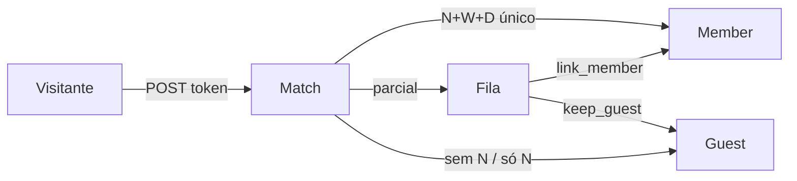

# Módulo — Ensino

> Programas → Turmas → Inscritos → Aulas/Chamada, com match N/W/D ao rol, fila de possível membro e link público da turma.  
> Regras: [[02_regras-de-negocio/regras-por-modulo/ensino]] · Índice: [[04_modulos/index]] · Schema: [[03_arquitetura/banco-de-dados]].

---

## 1. 📌 Visão Geral

Organiza ciclos formativos da igreja (**EBD**, cursos, estudos, treinamentos): catálogo de **Programas**, **Turmas** por congregação, **matrículas** (membro, convidado ou possível membro), **cronograma de aulas** (avulsas e séries) e **chamada** por encontro.

Resolve o problema de gerenciar ofertas formativas, inscrição e presença sem planilha — e sem misturar com **Grupos** (estrutura permanente, tipo `Classe`) nem com **Calendário** (agenda global; Ensino tem calendário próprio da turma).

Consome [[04_modulos/membros]] e [[04_modulos/congregacoes]]; **não** cria `members` para convidados (fora da cota).  
Produto: [[01_produto/visao-do-produto]] · Glossário: Programa / Turma / Aluno / Aula · Jornada [[01_produto/jornadas-de-usuario]] J13.

---

## 2. ⚖️ Bounded Context

### ✅ Este módulo É responsável por:

- CRUD de `teaching_programs` e `teaching_classes` no tenant
- Escopo de congregação do programa (uma unidade **ou** todas) e consistência com a turma
- Responsável (1) + professores (0..N) via `teaching_class_teachers`
- Matrículas `teaching_enrollments` (`member` | `guest` | `possible_member`)
- Match servidor N/W/D (`teachingMatchService`) e fila de possível membro
- Políticas de skip/dismiss de fila (`teachingEnrollmentPolicy`)
- Link público da turma (`teaching_public_links`) + GET/POST `/api/public/teaching/:token`
- Cronograma de aulas (`teaching_lessons` / `teaching_lesson_series`) com recorrência materializada e escopos `single` \| `following`
- Chamada por aula (`teaching_lesson_attendance`) com elegibilidade temporal da matrícula
- Listagens autenticadas com filtros/paginação (classes, enrollments, lessons, attendance) e seletor de visão por congregação
- Permissões: GET ≥ reader; mutações ≥ editor

### ❌ Este módulo NÃO é responsável por:

- CRUD de membros/congregações (só consome FKs)
- Converter convidado → Integrante/Membro (fase futura)
- PDF de chamada, capacidade/lista de espera, LMS, certificados/materiais (Issues filhas)
- Sync turma/aulas → Calendário global; migrar GroupType `Classe` → Ensino
- Login do professor / app do aluno; billing / feature flag por plano

---

## 3. 📁 Estrutura de Arquivos

```
backend/src/
├── routes/
│   └── teaching.ts                 → programs / classes / lessons / attendance / enrollments / public-link
├── controllers/
│   ├── teachingProgramController.ts
│   ├── teachingClassController.ts
│   ├── teachingLessonController.ts
│   ├── teachingEnrollmentController.ts
│   └── teachingPublicLinkController.ts
├── services/
│   ├── teachingMatchService.ts
│   ├── teachingEnrollmentPolicy.ts
│   ├── teachingLessonRecurrenceService.ts
│   └── teachingAttendanceEligibility.ts
├── validators/
│   └── teachingValidator.ts
└── (público) rotas em router public + rate limit

frontend/src/
├── app/(main)/teaching/
│   ├── page.tsx                    → hub
│   ├── [programId]/page.tsx
│   └── [programId]/[classId]/page.tsx
├── app/public/teaching/[token]/page.tsx
└── components/teaching/            → UI, filtros, detalhe (abas), inscritos, aulas/chamada, modais

Testes: match, enrollment policy, validators, recurrence, attendance eligibility
Schema: Supabase live + espelho parcial em `backend/bd-structure.sql` (seção Ensino)
RPCs (service_role): create/update/delete lesson series scope, save attendance
```

---

## 4. 🗄️ Entidades e Models

### teaching_programs

Catálogo formativo (ex.: “EBD 2026”).

| Campo | Tipo | Nullable | Default | Descrição |
| --- | --- | --- | --- | --- |
| id | uuid | NOT NULL | gen_random_uuid() | PK |
| church_id | uuid | NOT NULL | — | Tenant CASCADE |
| name | text | NOT NULL | — | 2–100 |
| description | text | NULL | — | Opcional |
| congregation_id | uuid | NULL | — | null = todas; UUID = escopo |
| created_at / updated_at | timestamptz | NOT NULL | now() | Auditoria |

**Relacionamentos:** N turmas (`teaching_classes`, CASCADE).

### teaching_classes (Turma)

Edição com matrícula.

| Campo | Tipo | Nullable | Default | Descrição |
| --- | --- | --- | --- | --- |
| id | uuid | NOT NULL | gen_random_uuid() | PK |
| church_id | uuid | NOT NULL | — | Tenant |
| program_id | uuid | NOT NULL | — | FK programa CASCADE |
| congregation_id | uuid | NOT NULL | — | Onde a aula acontece |
| name | text | NOT NULL | — | 2–100 |
| location / schedule | text | NULL | — | Local / horário (texto livre) |
| status | text | NOT NULL | `draft` | draft\|open\|in_progress\|closed\|archived |
| responsible_id | uuid | NOT NULL | — | Membro responsável RESTRICT |
| start_date | date | NOT NULL | — | Início |
| end_date | date | NULL | — | Fim ≥ start se presente |
| created_at / updated_at | timestamptz | NOT NULL | now() | Auditoria |

### teaching_class_teachers

PK `(class_id, member_id)`; CASCADE com turma. Membros distintos do responsável (validação app).

### teaching_enrollments

| Campo | Tipo | Nullable | Default | Descrição |
| --- | --- | --- | --- | --- |
| id | uuid | NOT NULL | gen_random_uuid() | PK |
| church_id / class_id | uuid | NOT NULL | — | Tenant + turma CASCADE |
| kind | text | NOT NULL | — | member\|guest\|possible_member |
| member_id | uuid | NULL | — | Obrigatório se member; UNIQUE parcial por turma |
| full_name / whatsapp / birth_date | — | NULL* | — | Obrigatórios se guest/possible_member |
| email | text | NULL | — | Fora do match |
| match_meta | jsonb | NULL | — | Sinais/candidatos (não expor no público) |
| attendance_eligible_from | date | NULL* | — | Início inclusivo da elegibilidade à chamada (obrigatório se member/guest) |
| removed_at | timestamptz | NULL | — | Soft-remove; histórico de presença anterior permanece |
| display_name_snapshot | text | NULL | — | Nome congelado para chamada após remoção |
| created_at / updated_at | timestamptz | NOT NULL | now() | Auditoria |

### teaching_lesson_series

Regra de recorrência materializada (`weekly` \| `monthly` \| `interval_days`) com `starts_on` / `ends_on`, weekdays / day_of_month / interval_days conforme o tipo.

### teaching_lessons

Ocorrência de aula (avulsa ou da série). Campos: `lesson_date`, `start_time`, `title`, `description`, `series_id` + `occurrence_key` (ambos null se avulsa; ambos NOT NULL se recorrente). UNIQUE `(class_id, lesson_date, start_time)` e `(series_id, occurrence_key)`.

### teaching_lesson_attendance

Presença por aula × matrícula. `status`: `unregistered` \| `present` \| `absent`. UNIQUE `(lesson_id, enrollment_id)`.

### teaching_public_links

Um link por turma (`UNIQUE class_id`); `token` UNIQUE; `expires_at`, `max_uses`, `current_uses`, `is_active`, `created_by`.

**Soft delete:** matrícula usa `removed_at` (histórico de chamada preservado); aulas/séries usam hard delete via RPC de escopo.  
**Auditoria:** timestamps; mutações sensíveis via `audit_logs` (entidades de aula/série/presença).

---

## 5. 🌐 Interface Pública (API)

Router autenticado: `authMiddleware` + `requireRole('reader')`; mutações `editor+`.

| Método | Rota | Role | Descrição |
| --- | --- | --- | --- |
| GET/POST | `/api/teaching/programs` | reader / editor | Lista (+ `class_count`) / cria |
| GET/PATCH/DELETE | `/api/teaching/programs/:id` | reader / editor | Detalhe / atualiza / remove (cascade) |
| GET/POST | `/api/teaching/classes` | reader / editor | Lista paginada / cria |
| GET/PATCH/DELETE | `/api/teaching/classes/:id` | reader / editor | Detalhe (+ teachers) / atualiza / remove |
| PUT | `/api/teaching/classes/:id/teachers` | editor | Substitui conjunto de professores |
| GET/POST | `/api/teaching/classes/:id/enrollments` | reader / editor | Lista `{ data, queue, pagination }` / cria |
| PATCH | `/api/teaching/enrollments/:id/resolve` | editor | `link_member` \| `keep_guest` |
| DELETE | `/api/teaching/enrollments/:id` | editor | Soft-remove matrícula (`removed_at`) |
| GET | `/api/teaching/classes/:id/lessons` | reader | Lista por intervalo (`from`/`to`, máx. 366 dias) |
| POST | `/api/teaching/classes/:id/lessons` | editor | Cria aula avulsa |
| POST | `/api/teaching/classes/:id/lesson-series/preview` | editor | Prévia de recorrência (datas, conflitos, meses ignorados) |
| POST | `/api/teaching/classes/:id/lesson-series` | editor | Materializa série |
| PATCH | `/api/teaching/lessons/:lessonId` | editor | Edita `scope=single\|following` |
| DELETE | `/api/teaching/lessons/:lessonId` | editor | Exclui com escopo; confirma presença se necessário |
| GET | `/api/teaching/lessons/:lessonId/attendance` | reader | Chamada paginada + resumo |
| PUT | `/api/teaching/lessons/:lessonId/attendance` | editor | Salva mudanças / marcar não registradas presentes |
| GET/POST/PATCH | `/api/teaching/classes/:id/public-link` | reader*/editor | Meta / gerar / ativar-desativar |

\* GET do link: autenticado reader+ (token não é secreto no Painel; POST público usa o token).

| Método | Rota | Auth | Descrição |
| --- | --- | --- | --- |
| GET | `/api/public/teaching/:token` | token | Meta turma/igreja (sem PII de match) |
| POST | `/api/public/teaching/:token` | token + rate limit | Inscrição; `{ outcome: confirmed\|submitted }` |

**Busca:** filtros `ilike` sanitizados (`buildIlikeContainsOrFilter`) — evita quebra PostgREST com caracteres especiais.

---

## 6. 🔁 Fluxos principais

1. **CRUD Programa/Turma** — editor+; seletor de congregação no hub filtra visão.
2. **Matrícula Painel** — vincular membro ou criar convidado; remoção lógica preserva presença passada.
3. **Link público** — visitante preenche form único → match → `confirmed` ou `submitted`.
4. **Fila** — editor+ vê candidatos (contato completo + máscara auxiliar), Vincular ou Manter convidado; skip/dismiss se já inscrito.
5. **Aulas** — criar avulsa ou série (prévia obrigatória); editar/excluir `single` \| `following`; calendário/lista mensal na aba Aulas.
6. **Chamada** — estados Não registrada / Presente / Ausente; marcar todos presentes (sobrescrita de ausentes com confirmação); dirty guard na UI.



---

## 7. 🖥️ Frontend

| Rota | Papel |
| --- | --- |
| `/teaching` | Hub (programas / turmas + seletor congregação) |
| `/teaching/[programId]` | Contexto do programa |
| `/teaching/[programId]/[classId]` | Detalhe da turma: aside (Sobre / Equipe / Link) + abas **Inscritos**, **Aulas**, **Materiais**, **Certificados** (`?tab=`) |
| `/public/teaching/[token]` | Form público brand full-bleed |

Nav: label **Ensino**, ícone `GraduationCap`, entre Calendário e Configurações.  
UI: matrículas e fila ficam na aba **Inscritos** (termo de negócio **Aluno** = matrícula; ver glossário). Aba **Aulas** cobre calendário/lista, detalhe e chamada (`?tab=aulas&lessonId=`). Materiais/Certificados permanecem placeholders (DEV-112 / DEV-110).

---

## 8. 🔐 Segurança e multi-tenant

- Todas as queries autenticadas filtram `church_id`.
- Público: sem `match_meta`, sem lista do rol; mensagens genéricas se link/turma inválidos.
- Rate limit no POST público (padrão dos outros links).
- Escopo de congregação do usuário respeitado nos listadores (padrão Grupos/Relatórios).
- RPCs de série/presença: `SECURITY INVOKER`, execute só `service_role`; gate de congregação/role no controller.

---

## 9. 🧪 Testes

| Suite | Foco |
| --- | --- |
| `teachingMatchService.test.ts` | Normalização nome/WhatsApp; matriz N/W/D |
| `teachingEnrollmentPolicy.test.ts` | Skip fila; dismiss `already_enrolled` |
| `teachingValidator.test.ts` | Status, datas, nomes, aulas/presença |
| `teachingLessonRecurrenceService.test.ts` | Expand weekly/monthly/interval + teto |
| `teachingAttendanceEligibility.test.ts` | Lifecycle + filtro PostgREST same-day |

---

## 10. 📝 Notas para Agentes

- Código EN (`teaching_*`); UI PT (**Ensino / Programa / Turma / Inscritos / Aulas / Chamada**).
- Não confundir Turma com GroupType **Classe**.
- Convidado **nunca** vira `members` neste módulo.
- Calendário de Ensino **não** sincroniza com o módulo Calendário global.
- Em edição `single` de série, a **data** da ocorrência não é alterável (`occurrence_key` permanece alinhado).
- Documentar mudanças permanentes em `BR-ENS-*` + este arquivo + glossário/jornadas.
- Dump: seção Ensino em `backend/bd-structure.sql`; fonte de verdade = Supabase live.
