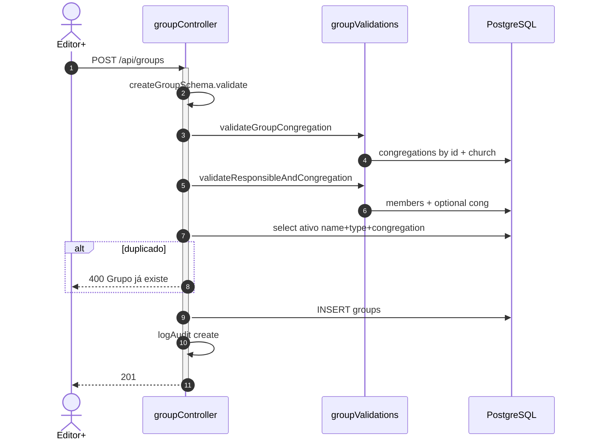
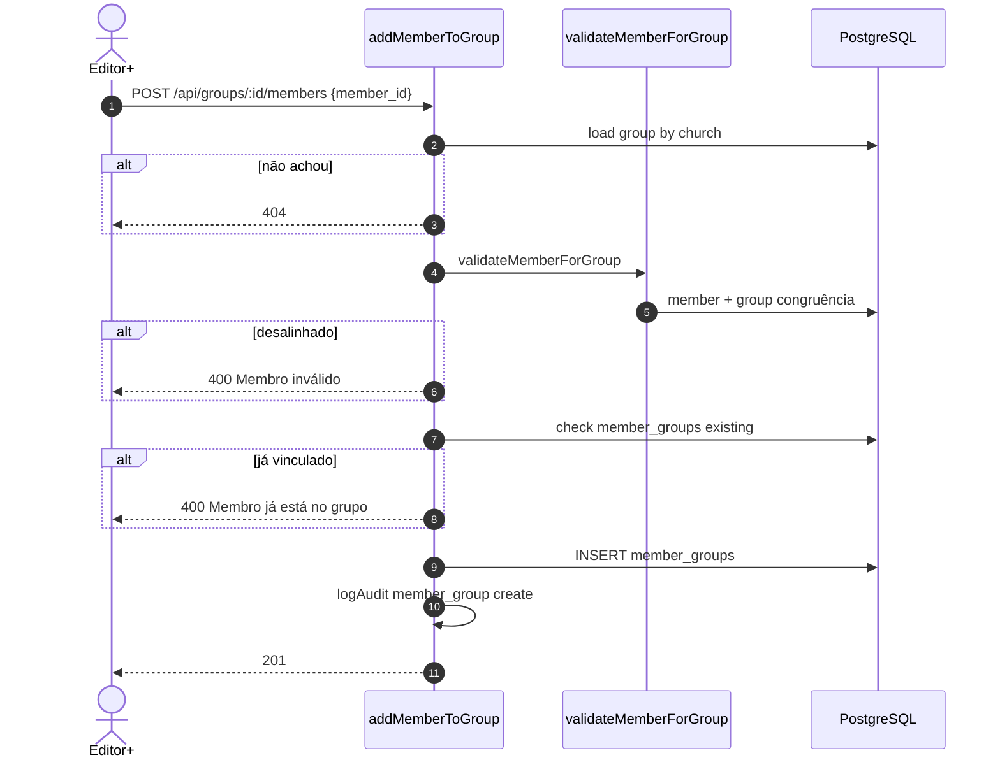
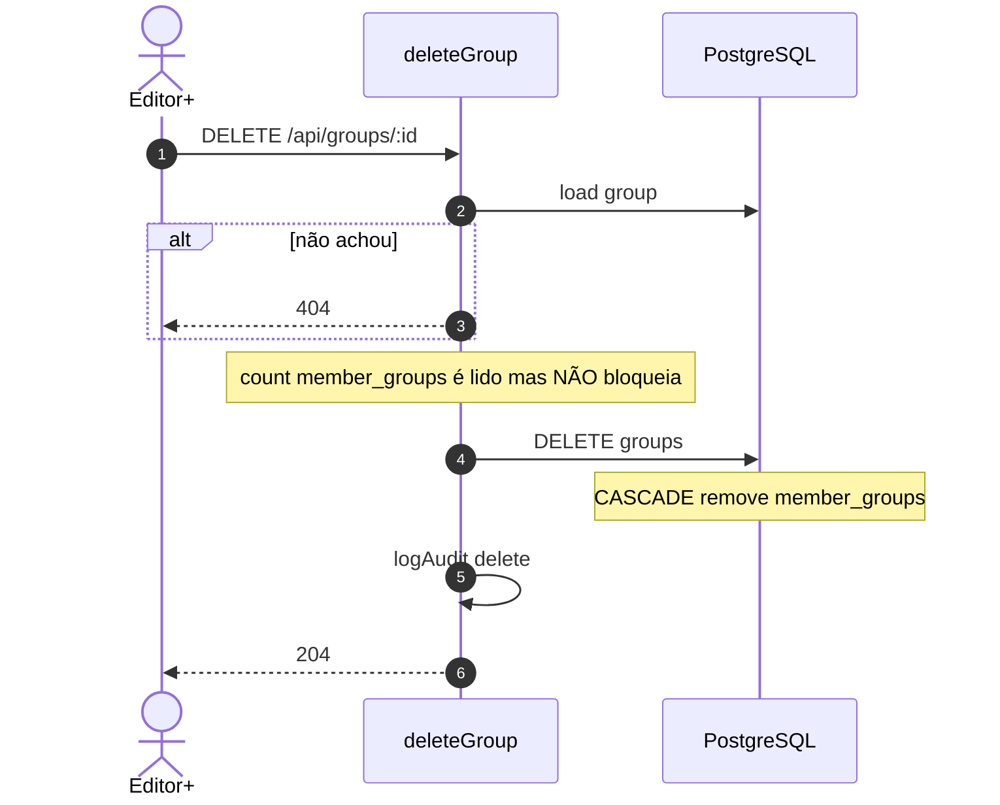
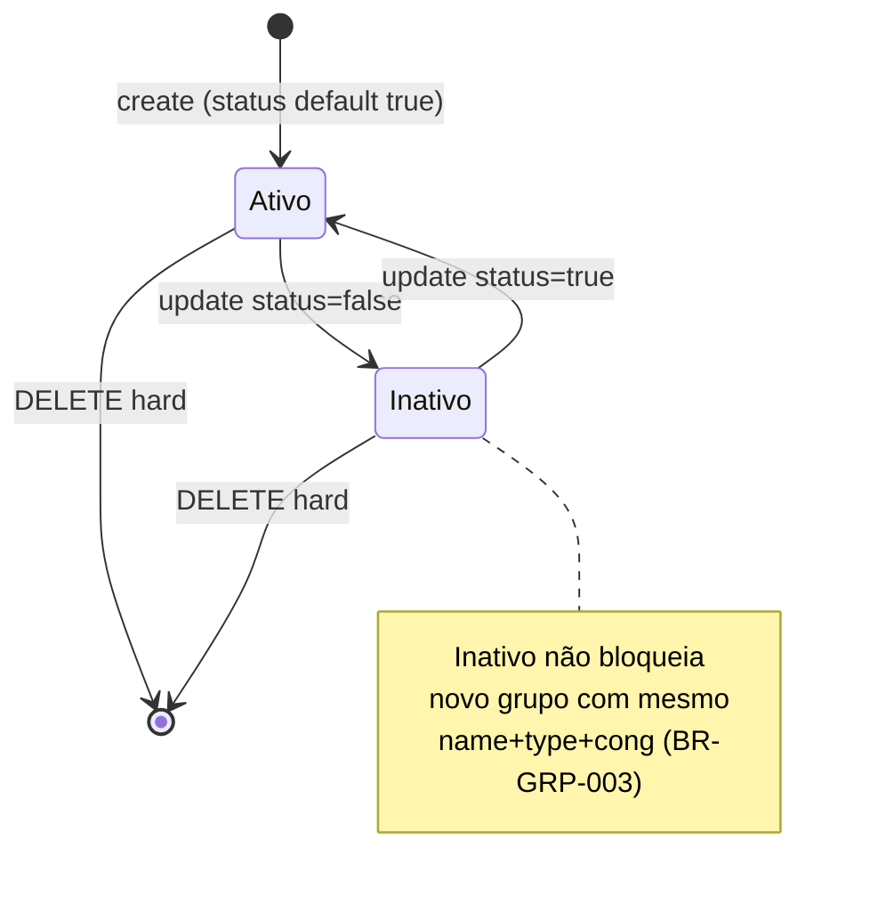
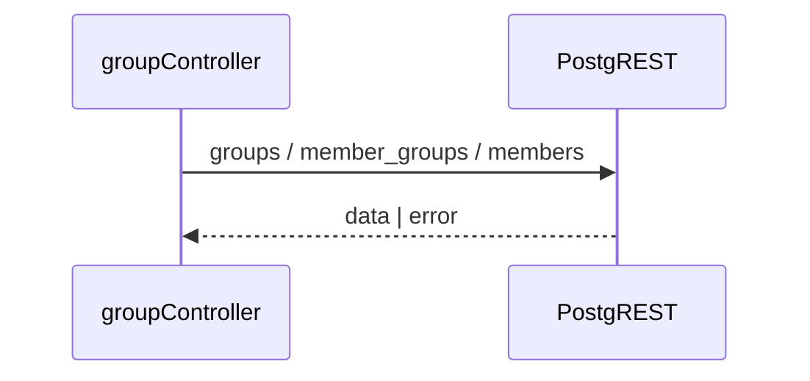
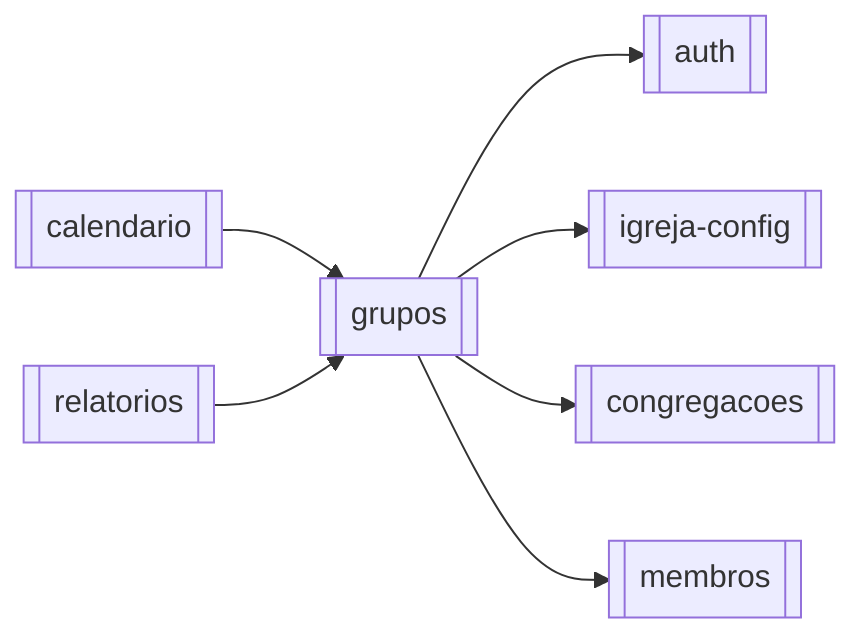

# Módulo — Grupos

> Ministérios, células, equipes e demais tipos: CRUD de `groups` + vínculo N:N `member_groups`, com alinhamento por congregação (UUID).  
> Regras: [[02_regras-de-negocio/regras-por-modulo/grupos]] · Índice: [[04_modulos/index]] · Schema: [[03_arquitetura/banco-de-dados]].

---

## 1. 📌 Visão Geral

Organiza membros em estruturas pastorais e operacionais (Ministério, Célula, Equipe, etc.), com responsável opcional, escopo de congregação (UUID obrigatório na API) e status ativo/inativo.

Resolve o problema de segmentar o rol além da congregação geográfica — um membro pode participar de vários grupos.

É entidade de domínio intermediária: consome [[04_modulos/membros]] e [[04_modulos/congregacoes]]; é consumida por calendário e relatórios.  
Produto: [[01_produto/visao-do-produto]].

---

## 2. ⚖️ Bounded Context

### ✅ Este módulo É responsável por:

- CRUD de `groups` no tenant autenticado
- Tipos restringidos (`GroupType` enum PT)
- Unicidade de grupo **ativo** por `name + type + congregation_id` (UUID)
- Validação de `congregation_id` obrigatório e pertencente à igreja
- Validação de `responsible_id` (membro da igreja, mesma congregação do grupo)
- Vínculos N:N via `member_groups` (add/list/remove)
- Alinhamento membro↔grupo na mesma congregação
- Impedir membro duplicado no mesmo grupo
- Listagem com filtros (`congregation_id` UUID, `type`, `status`, `search`) + `memberCount`
- Soft-flag `status` (ativo/inativo); hard delete do grupo (CASCADE em `member_groups`)
- Auditoria create/update/delete (grupo e vínculo)

### ❌ Este módulo NÃO é responsável por:

- CRUD de membros ou congregações (só consome FKs)
- Cargo/função do membro no grupo (vínculo sem role)
- Export PDF/CSV de membros do grupo (UI chama [[04_modulos/relatorios]])
- Agenda/recorrência (→ [[04_modulos/calendario]], `group_id` opcional)
- Quota de plano / billing
- Bloquear DELETE por quantidade de membros (cascata permite)

---

## 3. 📁 Estrutura de Arquivos

```
backend/src/
├── routes/
│   └── groups.ts                    → 8 rotas REST
├── controllers/
│   └── groupController.ts           → list/get/create/update/delete + members
├── validators/
│   └── groupValidator.ts            → Joi create/update (GroupType)
├── utils/
│   ├── groupValidations.ts          → cong./responsável/membro alinhados
│   └── auditLogger.ts
└── types/index.ts                   → GroupType, Group, MemberGroup

frontend/src/
├── app/(main)/groups/page.tsx
└── components/groups/               → list, form, filters, export modal

Testes: inexistentes no backend.
Migrations: schema no Supabase (ver banco-de-dados).
```

---

## 4. 🗄️ Entidades e Models

### groups

Ministério / célula / equipe da igreja.

| Campo | Tipo | Nullable | Default | Descrição |
| --- | --- | --- | --- | --- |
| id | uuid | NOT NULL | gen_random_uuid() | PK |
| church_id | uuid | NOT NULL | — | Tenant (CASCADE) |
| congregation_id | uuid | NULL* | — | Escopo; **API create/update exige UUID** (*coluna ainda nullable no schema) |
| type | varchar | NOT NULL | — | GroupType (CHECK) |
| name | varchar | NOT NULL | — | Nome |
| description | text | NULL | — | Descrição ≤5000 no validator |
| responsible_id | uuid | NULL | — | Membro responsável (SET NULL) |
| status | boolean | NOT NULL | true | Ativo/inativo |
| created_at | timestamptz | NOT NULL | now() | Criação |
| updated_at | timestamptz | NOT NULL | now() | Atualização |

**GroupType (lista fixa):**  
`Ministério`, `Departamento`, `Grupo`, `Equipe`, `Time`, `Comissão`, `Célula`, `Grupo de Crescimento`, `Pequeno Grupo`, `Discipulado`, `Classe`, `Núcleo`, `Região`.

**Relacionamentos:**

- Pertence a: `churches` (`church_id`); `congregations` (`congregation_id`, obrigatório na API)
- Tem muitos: `member_groups` (CASCADE)
- Tem um (opcional): `members` via `responsible_id`
- Referenciado por: `calendar_items.group_id` (fora deste módulo)

**Soft delete:** **não** — usa `status` boolean; DELETE é hard delete.  
**Auditoria:** timestamps + `audit_logs` entity `group` / `member_group`.

```typescript
// types/index.ts (conceitual)
interface Group {
  id: string;
  church_id: string;
  congregation_id: string; // UUID obrigatório na API
  type: GroupType;
  name: string;
  description?: string | null;
  responsible_id?: string | null;
  status: boolean;
  created_at: Date;
  updated_at: Date;
  // list enriquecido:
  memberCount?: number;
  congregations?: { id: string; name: string };
  members?: { id: string; name: string }; // join do responsável
}
```

---

### member_groups

Vínculo N:N membro ↔ grupo.

| Campo | Tipo | Nullable | Default | Descrição |
| --- | --- | --- | --- | --- |
| id | uuid | NOT NULL | gen_random_uuid() | PK |
| member_id | uuid | NOT NULL | — | FK members CASCADE |
| group_id | uuid | NOT NULL | — | FK groups CASCADE |
| created_at | timestamptz | NOT NULL | now() | Data do vínculo |

**Relacionamentos:** UNIQUE `(member_id, group_id)`.  
**Soft delete:** não.  
**Auditoria:** `created_at` + `audit_logs` nas ops add/remove.

```typescript
interface MemberGroup {
  id: string;
  member_id: string;
  group_id: string;
  created_at: Date;
}
```

---

## 5. 🌐 Interface Pública

Router: `authMiddleware` + `requireRole('reader')`; mutações `editor+`.

| Método | Rota | Auth | Role | Descrição |
| --- | --- | --- | --- | --- |
| GET | `/api/groups/` | ✅ | ≥ reader | Lista (+ filtros, `memberCount`) |
| GET | `/api/groups/:id` | ✅ | ≥ reader | Detalhe + `responsible` + `membersList` |
| GET | `/api/groups/:id/members` | ✅ | ≥ reader | Só membros do grupo |
| POST | `/api/groups/` | ✅ | ≥ editor | Criar |
| PUT | `/api/groups/:id` | ✅ | ≥ editor | Atualizar |
| DELETE | `/api/groups/:id` | ✅ | ≥ editor | Remover (204, CASCADE vínculos) |
| POST | `/api/groups/:id/members` | ✅ | ≥ editor | Adicionar membro |
| DELETE | `/api/groups/:id/members/:memberId` | ✅ | ≥ editor | Remover membro (204) |

**Total:** **8** endpoints.

### Query — `GET /api/groups/`

| Param | Valores | Efeito |
| --- | --- | --- |
| `congregation_id` | uuid | Filtra congregação (`sede` rejeitado) |
| `type` | GroupType | Filtra tipo |
| `status` | `active` \| `inactive` \| `all` (default) | `status` boolean |
| `search` | string | `ilike` no name |

Sem paginação — retorna todos do tenant filtrados.

### Contrato — `POST /api/groups/`

```typescript
// Request (createGroupSchema):
{
  name: string;                 // 2–100, obrigatório
  type: GroupType;              // obrigatório
  description?: string;         // max 5000, '' ok
  congregation_id: string;      // UUID obrigatório
  responsible_id?: string | null;  // uuid membro
  status?: boolean;             // default true
}

// Response 201: Group row

// Erros:
// 400 — Dados inválidos / Congregação inválida / Responsável inválido / Grupo já existe
// 401/403 — auth/role
// 500 — catch
```

### Contrato — `POST /api/groups/:id/members`

```typescript
// Request:
{ member_id: string } // obrigatório

// Response 201: MemberGroup { id, member_id, group_id, created_at }

// Erros:
// 400 — member_id ausente / Membro inválido (cong.) / Membro já está no grupo
// 404 — grupo não encontrado no tenant
```

### Detalhe — `GET /api/groups/:id`

```typescript
// Response 200:
{
  // campos do group...
  responsible: { id, name, email, phone, whatsapp } | null,
  membersList: Array<Member & { memberGroupId: string; addedAt: string }>
}
```

---

## 6. ⚙️ Regras de Negócio

Detalhe: [[02_regras-de-negocio/regras-por-modulo/grupos]] (**10** regras).

| ID | Declaração curta |
| --- | --- |
| BR-GRP-001 | `type` ∈ GroupType permitido |
| BR-GRP-002 | Nome 2–100; descrição ≤5000 |
| BR-GRP-003 | Sem outro **ativo** com mesmo name+type+congregation |
| BR-GRP-004 | Create defaulta `status=true` |
| BR-GRP-005 | `responsible_id` membro da mesma congregação do grupo |
| BR-GRP-006 | `congregation_id` UUID obrigatório e da igreja |
| BR-GRP-007 | Mutações editor+; leitura reader+ |
| BR-GRP-008 | Add membro: mesma igreja e mesma congregação do grupo |
| BR-GRP-009 | Membro único por grupo |
| BR-GRP-010 | DELETE remove grupo e CASCADE `member_groups` |

**Alinhamento (BR-GRP-005/008):** responsável e membro devem pertencer à mesma congregação do grupo (sem coringa null/Sede).

---

## 7. 🔄 Fluxos do Módulo

### Fluxo: Criar grupo



### Fluxo: Adicionar membro ao grupo



### Fluxo: Excluir grupo



### Estados do grupo



---

## 8. 🔗 Integrações

Este módulo não possui integrações externas diretas (Stripe/Resend/S3).

### Supabase PostgreSQL

- Propósito: persistência de `groups` / `member_groups` e joins com members/congregations  
- Operações: select/insert/update/delete via supabase-js + service_role  
- Falha: 400/500 com `details`  
- Config: `SUPABASE_URL`, `SUPABASE_SERVICE_ROLE_KEY`



---

## 9. ⚙️ Operações em Background

N/A — este módulo não possui operações assíncronas (jobs/cron).

---

## 10. 🚨 Tratamento de Erros

| Situação | HTTP | Mensagem típica (`error`) | Quando |
| --- | --- | --- | --- |
| Sem auth | 401 | `Não autorizado` | handlers sem `req.user` |
| Role insuficiente | 403 | requireRole | mutações |
| Joi inválido | 400 | `Dados inválidos` | create/update |
| Congregação inválida | 400 | `Congregação inválida` | create/update |
| Responsável inválido | 400 | `Responsável inválido` | create/update |
| Nome+tipo+cong ativo | 400 | `Grupo já existe` | create/update |
| Membro desalinhado | 400 | `Membro inválido` | add member |
| Já no grupo | 400 | `Membro já está no grupo` | add member |
| member_id ausente | 400 | `Dados inválidos` | add member |
| Grupo inexistente | 404 | `Grupo não encontrado` | get/update/delete/members |
| Erro query/insert | 400/500 | mensagem operacional | catch / PostgREST |

Não há enum de `código interno` padronizado — responses usam `{ error, details }`.

---

## 11. 🔐 Segurança e Autorização

| Controle | Detalhe |
| --- | --- |
| Auth | JWT + contexto `req.church.churchId` |
| Leitura | reader+ |
| Escrita (grupo e vínculos) | editor+ |
| Tenant | todas as queries filtram `church_id` |
| Crosstalk cong. | validado em responsible/member helpers |
| Dados | nomes/contatos de membros no detalhe do grupo (PII do rol) |

Sem policy RLS efetiva: isolamento é **aplicacional** (service_role).

---

## 12. 🧪 Testes

| Tipo | Arquivo | Cobertura | O que testa |
| --- | --- | --- | --- |
| — | — | 0% | Nenhum teste dedicado |

**Gaps críticos:**

- Unicidade só entre ativos (e case-sensitive no `eq('name')`)
- Alinhamento membro/responsável ↔ congregação do grupo
- Duplicata no `member_groups` / UNIQUE DB
- DELETE com CASCADE (não bloqueia)
- Filtros list (UUID, rejeição de `sede`, status, search)
- Isolamento cross-tenant

---

## 13. 🔗 Dependências

**Consome:**

- [[04_modulos/auth]] — sessão e RBAC  
- [[04_modulos/igreja-config]] — tenant  
- [[04_modulos/congregacoes]] — escopo `congregation_id` (UUID)  
- [[04_modulos/membros]] — `responsible_id` e vínculos  

**Dependem deste:**

- [[04_modulos/calendario]] — item pode referenciar grupo  
- [[04_modulos/relatorios]] — charts/export de grupos  
- [[04_modulos/membros]] — UI/associação inversa de grupos do membro (leitura de `member_groups`)



---

## 14. ⚠️ Pontos de Atenção

1. **DELETE não bloqueia por membros** — `memberCount` é consultado em `deleteGroup` mas **não usado** para gate; CASCADE apaga vínculos. Diferente de congregações.  
2. Unicidade é **case-sensitive** (`eq('name')`), ao contrário de congregações (`ilike`).  
3. Unicidade só considera `status=true` — reativar/duplicar inativos exige cuidado.  
4. Lista **sem paginação**; `memberCount` carrega todos os `member_groups` dos IDs listados (ok para volumes típicos, revisar se escalar).  
5. Responsável **não** é auto-inserido em `member_groups` — só FK `responsible_id`.  
6. Remover membro: se vínculo inexistente, delete “silencia” e ainda pode retornar 204 (sem 404 explícito de vínculo).  
7. Export no front (`ExportGroupMembersModal`) não faz parte deste módulo de API.

---

## 15. 📝 Histórico de Mudanças

| Data | Versão | Descrição | Issue |
| --- | --- | --- | --- |
| 2026-07-14 | 1.0 | Documentação inicial do módulo grupos | — |

---

## Confirmação

| Item | Valor |
| --- | --- |
| Módulo documentado | **grupos** ✅ |
| Endpoints | **8** |
| Regras BR-GRP | **10** |
| Entidades | `groups`, `member_groups` |
| Integrações | Só Supabase PostgreSQL |
| Jobs | Nenhum |
| Testes | Nenhum dedicado |
