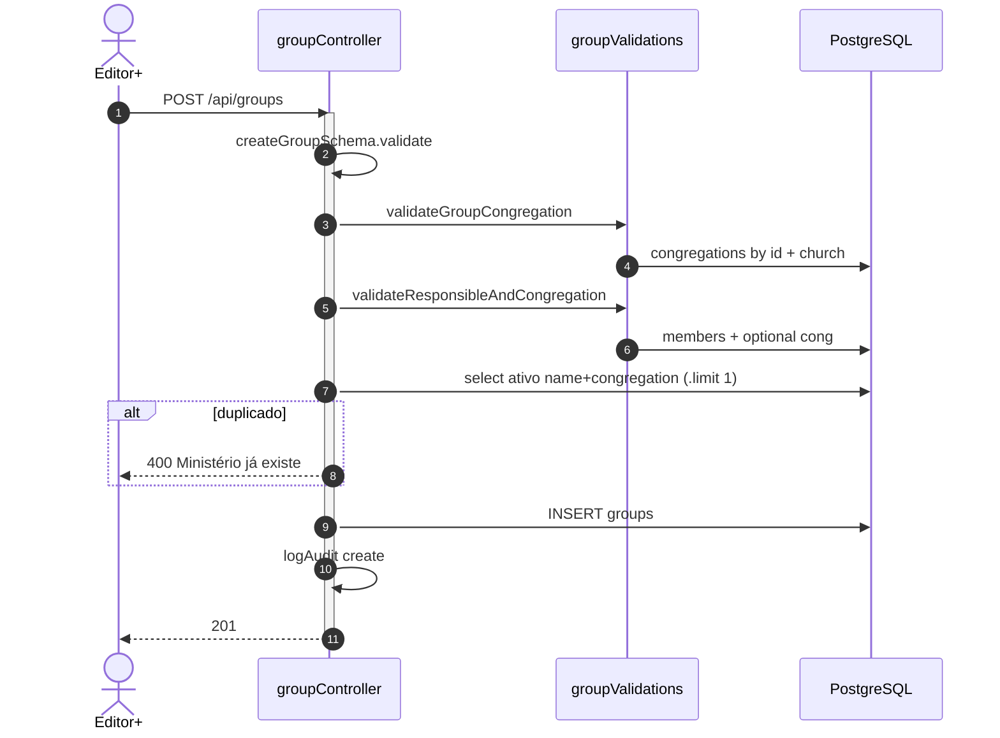
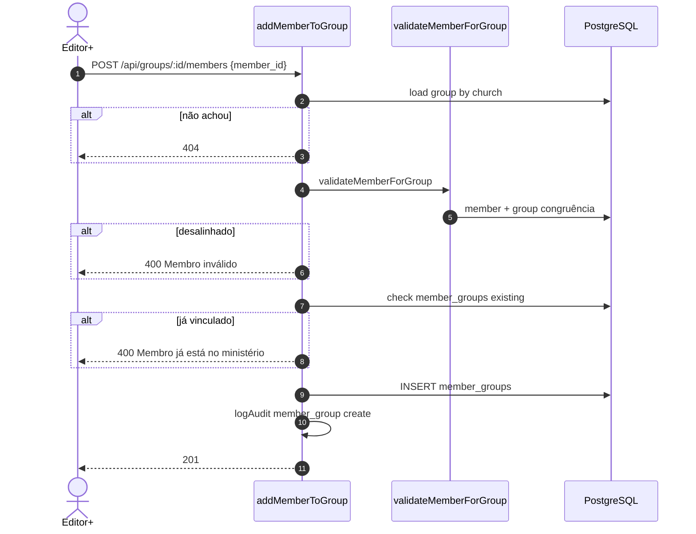
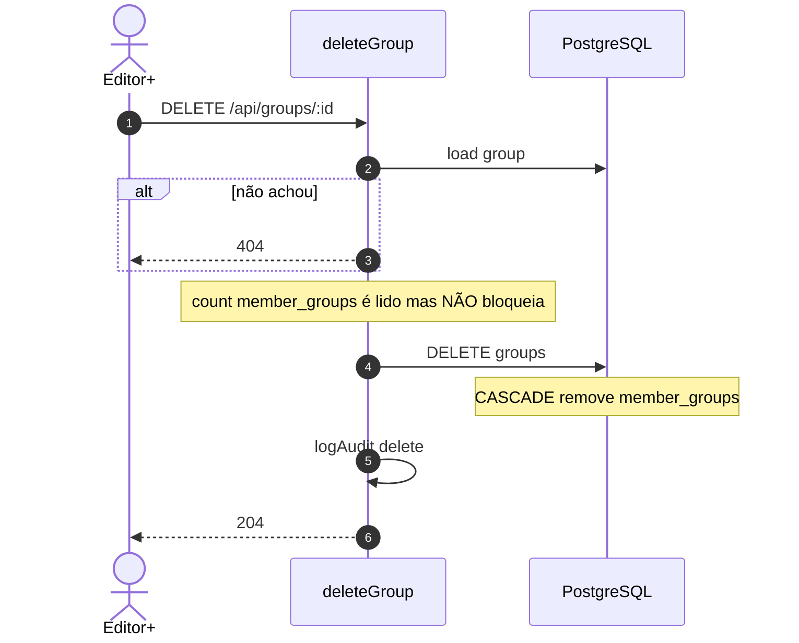
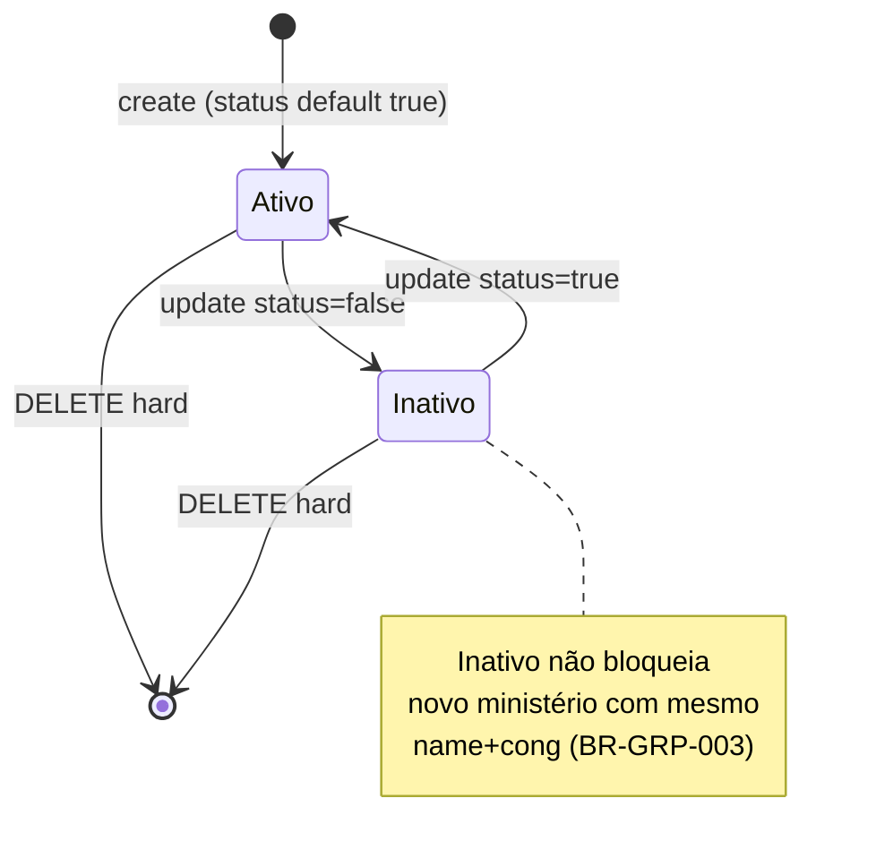
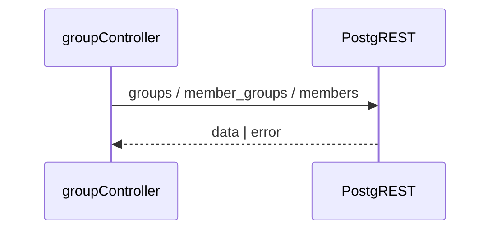
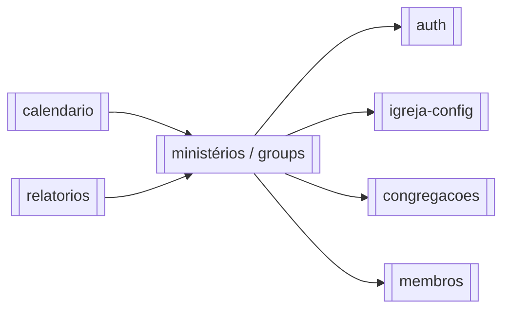

# Módulo — Ministérios

> Áreas de serviço da igreja: CRUD de `groups` + vínculo N:N `member_groups`, com alinhamento por congregação (UUID).  
> Produto: **Ministérios** (não células/classes/equipes). API e tabelas permanecem `groups` / `member_groups`.  
> Regras: [[02_regras-de-negocio/regras-por-modulo/grupos]] · Índice: [[04_modulos/index]] · Schema: [[03_arquitetura/banco-de-dados]].

---

## 1. 📌 Visão Geral

Organiza membros em **ministérios** (áreas de serviço), com responsável opcional, escopo de congregação (UUID obrigatório na API) e status ativo/inativo.

Resolve o problema de segmentar o rol além da congregação geográfica — um membro pode participar de vários ministérios.

É entidade de domínio intermediária: consome [[04_modulos/membros]] e [[04_modulos/congregacoes]]; é consumida por calendário e relatórios.  
Produto: [[01_produto/visao-do-produto]].

**DEV-115:** coluna `type` / enum `GroupType` removidos; entidade de produto é só Ministério; migração one-time apagou linhas que não eram `Ministério`.

---

## 2. ⚖️ Bounded Context

### ✅ Este módulo É responsável por:

- CRUD de `groups` no tenant autenticado (produto: ministérios)
- Unicidade de ministério **ativo** por `name + congregation_id` (UUID); check com `.limit(1)`
- Validação de `congregation_id` obrigatório e pertencente à igreja
- Validação de `responsible_id` (membro da igreja, mesma congregação do ministério)
- Vínculos N:N via `member_groups` (add/list/remove) — sem cargo/função no link
- Alinhamento membro↔ministério na mesma congregação
- Impedir membro duplicado no mesmo ministério
- Listagem com filtros (`congregation_id` UUID, `status`, `search`), ordenação (`sort_by` / `sort_order` com whitelist **sem** `type`) + `memberCount`
- Soft-flag `status` (ativo/inativo); hard delete do ministério (CASCADE em `member_groups`)
- Auditoria create/update/delete (ministério e vínculo)
- Mensagens de API/UI em português com “ministério” (não “grupo”)

### ❌ Este módulo NÃO é responsável por:

- CRUD de membros ou congregações (só consome FKs)
- Cargo/função do membro no ministério (vínculo sem role)
- Tipos de estrutura (célula, classe, equipe, etc.) — removidos
- Export **PDF** de membros do ministério (não há CSV; UI chama [[04_modulos/relatorios]])
- Agenda/recorrência (→ [[04_modulos/calendario]], `group_id` opcional)
- Quota de plano / billing
- Bloquear DELETE por quantidade de membros (cascata permite)

---

## 3. 📁 Estrutura de Arquivos

```
backend/src/
├── routes/
│   └── groups.ts                    → 8 rotas REST (/api/groups)
├── controllers/
│   └── groupController.ts           → list/get/create/update/delete + members
├── validators/
│   └── groupValidator.ts            → Joi create/update (sem type)
├── utils/
│   ├── groupValidations.ts          → cong./responsável/membro alinhados
│   └── auditLogger.ts
└── types/index.ts                   → Group, MemberGroup (sem GroupType)

frontend/src/
├── app/(main)/ministries/page.tsx   → hub UI
├── app/(main)/ministries/[id]/     → detalhe (`MinistryDetailView`)
├── app/(main)/groups/               → redirect → /ministries
├── components/groups/               → list, form, filters, export, `MinistryDetailView`
└── components/entity-detail/        → shell aside + tabs compartilhado

Testes:
- backend: `groupValidator.test.ts`
- calendar PDF filters (cobertura relacionada a filtros sem type)

Migrations: schema no Supabase; DEV-115 removeu `type` e linhas não-Ministério (one-time).
```

---

## 4. 🗄️ Entidades e Models

### groups

Ministério (área de serviço) da igreja. Nome de tabela/código permanece `groups` / `Group`.

| Campo | Tipo | Nullable | Default | Descrição |
| --- | --- | --- | --- | --- |
| id | uuid | NOT NULL | gen_random_uuid() | PK |
| church_id | uuid | NOT NULL | — | Tenant (CASCADE) |
| congregation_id | uuid | NULL* | — | Escopo; **API create/update exige UUID** (*coluna ainda nullable no schema) |
| name | varchar | NOT NULL | — | Nome |
| description | text | NULL | — | Descrição ≤5000 no validator |
| responsible_id | uuid | NULL | — | Membro responsável (SET NULL) |
| status | boolean | NOT NULL | true | Ativo/inativo |
| created_at | timestamptz | NOT NULL | now() | Criação |
| updated_at | timestamptz | NOT NULL | now() | Atualização |

> **Removido (DEV-115):** coluna `type` e enum `GroupType`.

**Relacionamentos:**

- Pertence a: `churches` (`church_id`); `congregations` (`congregation_id`, obrigatório na API)
- Tem muitos: `member_groups` (CASCADE)
- Tem um (opcional): `members` via `responsible_id`
- Referenciado por: `calendar_items.group_id` (fora deste módulo)

**Soft delete:** **não** — usa `status` boolean; DELETE é hard delete.  
**Auditoria:** timestamps + `audit_logs` entity `group` / `member_group`.

```typescript
// types/index.ts (conceitual)
interface Group {
  id: string;
  church_id: string;
  congregation_id: string; // UUID obrigatório na API
  name: string;
  description?: string | null;
  responsible_id?: string | null;
  status: boolean;
  created_at: Date;
  updated_at: Date;
  // list enriquecido:
  memberCount?: number;
  congregations?: { id: string; name: string };
  members?: { id: string; name: string }; // join do responsável
}
```

---

### member_groups

Vínculo N:N membro ↔ ministério (sem role/função).

| Campo | Tipo | Nullable | Default | Descrição |
| --- | --- | --- | --- | --- |
| id | uuid | NOT NULL | gen_random_uuid() | PK |
| member_id | uuid | NOT NULL | — | FK members CASCADE |
| group_id | uuid | NOT NULL | — | FK groups CASCADE |
| created_at | timestamptz | NOT NULL | now() | Data do vínculo |

**Relacionamentos:** UNIQUE `(member_id, group_id)`.  
**Soft delete:** não.  
**Auditoria:** `created_at` + `audit_logs` nas ops add/remove.

```typescript
interface MemberGroup {
  id: string;
  member_id: string;
  group_id: string;
  created_at: Date;
}
```

---

## 5. 🌐 Interface Pública

Router: `authMiddleware` + `requireRole('reader')`; mutações `editor+`.  
Paths de API: **`/api/groups`** (legado estável). Hub UI: **`/ministries`** (`/groups` redireciona).

| Método | Rota | Auth | Role | Descrição |
| --- | --- | --- | --- | --- |
| GET | `/api/groups/` | ✅ | ≥ reader | Lista (+ filtros, ordenação, `memberCount`) |
| GET | `/api/groups/:id` | ✅ | ≥ reader | Detalhe + `responsible` + `membersList` |
| GET | `/api/groups/:id/members` | ✅ | ≥ reader | Só membros do ministério |
| POST | `/api/groups/` | ✅ | ≥ editor | Criar |
| PUT | `/api/groups/:id` | ✅ | ≥ editor | Atualizar |
| DELETE | `/api/groups/:id` | ✅ | ≥ editor | Remover (204, CASCADE vínculos) |
| POST | `/api/groups/:id/members` | ✅ | ≥ editor | Adicionar membro |
| DELETE | `/api/groups/:id/members/:memberId` | ✅ | ≥ editor | Remover membro (204) |

**Total:** **8** endpoints neste router.

### Query — `GET /api/groups/`

| Param | Valores | Efeito |
| --- | --- | --- |
| `congregation_id` | uuid | Filtra congregação (`sede` rejeitado) |
| `status` | `active` \| `inactive` \| `all` (default) | `status` boolean |
| `search` | string | `ilike` no name |
| `sort_by` | `name` \| `created_at` \| `updated_at` \| `status` | Whitelist (BR-GRP-011); inválido → fallback `name` |
| `sort_order` | `asc` \| `desc` | Direção; valor ≠ `desc` → `asc` |

**Default:** `sort_by=name`, `sort_order=asc`, com desempate estável por `id` asc.  
Sem paginação — retorna todos do tenant filtrados (array; não ecoa `sorting` no body).  
**Sem** filtro `type` (removido).

### Contrato — `POST /api/groups/`

```typescript
// Request (createGroupSchema):
{
  name: string;                 // 2–100, obrigatório
  description?: string;         // max 5000, '' ok
  congregation_id: string;      // UUID obrigatório
  responsible_id?: string | null;  // uuid membro
  status?: boolean;             // default true
}

// Response 201: Group row

// Erros:
// 400 — Dados inválidos / Congregação inválida / Responsável inválido / Ministério já existe
// 401/403 — auth/role
// 500 — catch
```

### Contrato — `POST /api/groups/:id/members`

```typescript
// Request:
{ member_id: string } // obrigatório

// Response 201: MemberGroup { id, member_id, group_id, created_at }

// Erros:
// 400 — member_id ausente / Membro inválido (cong.) / Membro já está no ministério
// 404 — ministério não encontrado no tenant
```

### Detalhe — `GET /api/groups/:id`

```typescript
// Response 200:
{
  // campos do group...
  responsible: { id, name, email, phone, whatsapp } | null,
  membersList: Array<Member & { memberGroupId: string; addedAt: string }>
}
```

### Export (módulo relatórios)

`POST /api/export/groups/list` — filtros opcionais: `search`, `congregation_id`, `status` apenas. **Não** exige `filters.types` (BR-REL-010 removida).

---

## 6. ⚙️ Regras de Negócio

Detalhe: [[02_regras-de-negocio/regras-por-modulo/grupos]] (**13** regras; BR-GRP-001 removida).

| ID | Declaração curta |
| --- | --- |
| BR-GRP-001 | ~~`type` ∈ GroupType~~ — **Removido** (DEV-115) |
| BR-GRP-002 | Nome 2–100; descrição ≤5000 |
| BR-GRP-003 | Sem outro **ativo** com mesmo name+congregation (`.limit(1)`) |
| BR-GRP-004 | Create defaulta `status=true` |
| BR-GRP-005 | `responsible_id` membro da mesma congregação do ministério |
| BR-GRP-006 | `congregation_id` UUID obrigatório e da igreja |
| BR-GRP-007 | Mutações editor+; leitura reader+ |
| BR-GRP-008 | Add membro: mesma igreja e mesma congregação do ministério |
| BR-GRP-009 | Membro único por ministério |
| BR-GRP-010 | DELETE remove ministério e CASCADE `member_groups` |
| BR-GRP-011 | Ordenação: whitelist `name`, `created_at`, `updated_at`, `status` (sem `type`) |
| BR-GRP-012 | Entidade de produto é só Ministério |
| BR-GRP-013 | Migração one-time: apagar linhas não-Ministério |

**Alinhamento (BR-GRP-005/008):** responsável e membro devem pertencer à mesma congregação do ministério (sem coringa null/Sede).

---

## 7. 🔄 Fluxos do Módulo

### Fluxo: Criar ministério


```mermaid
sequenceDiagram
  autonumber
  actor U as Editor+
  participant API as groupController
  participant VAL as groupValidations
  participant DB as PostgreSQL

  U->>API: POST /api/groups
  activate API
  API->>API: createGroupSchema.validate
  API->>VAL: validateGroupCongregation
  VAL->>DB: congregations by id + church
  API->>VAL: validateResponsibleAndCongregation
  VAL->>DB: members + optional cong
  API->>DB: select ativo name+congregation (.limit 1)
  alt duplicado
    API-->>U: 400 Ministério já existe
  end
  API->>DB: INSERT groups
  API->>API: logAudit create
  API-->>U: 201
  deactivate API
```

### Fluxo: Adicionar membro ao ministério


```mermaid
sequenceDiagram
  autonumber
  actor U as Editor+
  participant API as addMemberToGroup
  participant VAL as validateMemberForGroup
  participant DB as PostgreSQL

  U->>API: POST /api/groups/:id/members {member_id}
  API->>DB: load group by church
  alt não achou
    API-->>U: 404
  end
  API->>VAL: validateMemberForGroup
  VAL->>DB: member + group congruência
  alt desalinhado
    API-->>U: 400 Membro inválido
  end
  API->>DB: check member_groups existing
  alt já vinculado
    API-->>U: 400 Membro já está no ministério
  end
  API->>DB: INSERT member_groups
  API->>API: logAudit member_group create
  API-->>U: 201
```

### Fluxo: Excluir ministério


```mermaid
sequenceDiagram
  autonumber
  actor U as Editor+
  participant API as deleteGroup
  participant DB as PostgreSQL

  U->>API: DELETE /api/groups/:id
  API->>DB: load group
  alt não achou
    API-->>U: 404
  end
  Note over API: count member_groups é lido mas NÃO bloqueia
  API->>DB: DELETE groups
  Note over DB: CASCADE remove member_groups
  API->>API: logAudit delete
  API-->>U: 204
```

### Estados do ministério


```mermaid
stateDiagram-v2
  [*] --> Ativo: create (status default true)
  Ativo --> Inativo: update status=false
  Inativo --> Ativo: update status=true
  Ativo --> [*]: DELETE hard
  Inativo --> [*]: DELETE hard
  note right of Inativo
    Inativo não bloqueia
    novo ministério com mesmo
    name+cong (BR-GRP-003)
  end note
```

### UI — hub e detalhe (`/ministries`, `/ministries/[id]`)

Hub autenticado em `frontend/src/app/(main)/ministries/page.tsx` + `components/groups/*`.  
Rota legada `/groups` redireciona para `/ministries`.

**Responsividade (mobile/tablet):** header com label curta em `<sm`; busca + filtros fazem wrap; summary bar e cards com wrap/`min-w-0` e alvos touch `min-h-11`. Create/Edit/Delete e exports usam o `Modal` compartilhado em sheet inferior no mobile. Detalhe é **página** (`MinistryDetailView` + `EntityDetailLayout`).

- **Detalhe:** aside (nome, congregação, responsável, status, contagem) + aba **Membros** (`?tab=membros`, default). Gestão add/remove na aba. Export PDF de membros / Editar / Excluir no header da página. Aside empilha acima do painel em `<md`.
- **Create/Edit:** CTAs no `footer` do Modal (fora do scroll do formulário). Sem campo de tipo.
- **Exports:** lista via `POST /api/export/groups/list` (filtros search/congregation/status); membros do ministério via modal de campos no detalhe (PDF). **Sem** `ExportGroupsTypesModal`.

Desktop (≥`md`/`sm` conforme componente) permanece equivalente. Sem rota pública neste módulo (form público de membros consome listagem via outro router).

---

## 8. 🔗 Integrações

Este módulo não possui integrações externas diretas (Stripe/Resend/S3).

### Supabase PostgreSQL

- Propósito: persistência de `groups` / `member_groups` e joins com members/congregations  
- Operações: select/insert/update/delete via supabase-js + service_role  
- Falha: 400/500 com `details`  
- Config: `SUPABASE_URL`, `SUPABASE_SERVICE_ROLE_KEY`


```mermaid
sequenceDiagram
  participant CTL as groupController
  participant DB as PostgREST
  CTL->>DB: groups / member_groups / members
  DB-->>CTL: data | error
```

---

## 9. ⚙️ Operações em Background

N/A — este módulo não possui operações assíncronas (jobs/cron).

---

## 10. 🚨 Tratamento de Erros

| Situação | HTTP | Mensagem típica (`error`) | Quando |
| --- | --- | --- | --- |
| Sem auth | 401 | `Não autorizado` | handlers sem `req.user` |
| Role insuficiente | 403 | requireRole | mutações |
| Joi inválido | 400 | `Dados inválidos` | create/update |
| Congregação inválida | 400 | `Congregação inválida` | create/update |
| Responsável inválido | 400 | `Responsável inválido` | create/update |
| Nome+cong ativo | 400 | `Ministério já existe` | create/update |
| Membro desalinhado | 400 | `Membro inválido` | add member |
| Já no ministério | 400 | `Membro já está no ministério` | add member |
| member_id ausente | 400 | `Dados inválidos` | add member |
| Ministério inexistente | 404 | `Ministério não encontrado` | get/update/delete/members |
| Erro query/insert | 400/500 | mensagem operacional | catch / PostgREST |

Não há enum de `código interno` padronizado — responses usam `{ error, details }`.

---

## 11. 🔐 Segurança e Autorização

| Controle | Detalhe |
| --- | --- |
| Auth | JWT + contexto `req.church.churchId` |
| Leitura | reader+ |
| Escrita (ministério e vínculos) | editor+ |
| Tenant | todas as queries filtram `church_id` |
| Crosstalk cong. | validado em responsible/member helpers |
| Dados | nomes/contatos de membros no detalhe (PII do rol) |

Sem policy RLS efetiva: isolamento é **aplicacional** (service_role).

---

## 12. 🧪 Testes

| Tipo | Arquivo | Cobertura | O que testa |
| --- | --- | --- | --- |
| Unit | `groupValidator.test.ts` | schemas create/update/export list | Joi sem `type`; export filters sem `types` |
| Relacionado | testes de calendar PDF filters | filtros de export | ausência de type/types onde aplicável |

**Gaps / atenção:**

- Unicidade só entre ativos (e case-sensitive no `eq('name')`); check com `.limit(1)`
- Alinhamento membro/responsável ↔ congregação
- Duplicata no `member_groups` / UNIQUE DB
- DELETE com CASCADE (não bloqueia)
- Filtros list (UUID, rejeição de `sede`, status, search) — sem `type`
- Isolamento cross-tenant

---

## 13. 🔗 Dependências

**Consome:**

- [[04_modulos/auth]] — sessão e RBAC  
- [[04_modulos/igreja-config]] — tenant  
- [[04_modulos/congregacoes]] — escopo `congregation_id` (UUID)  
- [[04_modulos/membros]] — `responsible_id` e vínculos  

**Dependem deste:**

- [[04_modulos/calendario]] — item pode referenciar ministério (`group_id`)  
- [[04_modulos/relatorios]] — charts/export de ministérios  
- [[04_modulos/membros]] — UI/associação inversa (leitura de `member_groups`)


```mermaid
graph LR
  GRP[[ministérios / groups]]
  GRP --> AUTH[[auth]]
  GRP --> CFG[[igreja-config]]
  GRP --> CON[[congregacoes]]
  GRP --> MEM[[membros]]
  CAL[[calendario]] --> GRP
  REL[[relatorios]] --> GRP
```

---

## 14. ⚠️ Pontos de Atenção

1. **Produto ≠ código:** UI/copy = Ministérios; API/tabelas = `groups` / `member_groups` / `Group`.  
2. **DELETE não bloqueia por membros** — `memberCount` é consultado mas **não** gate; CASCADE apaga vínculos.  
3. Unicidade é **case-sensitive** (`eq('name')`), ao contrário de congregações (`ilike`).  
4. Unicidade só considera `status=true` — reativar/duplicar inativos exige cuidado.  
5. Lista **sem paginação**; `memberCount` carrega vínculos dos IDs listados.  
6. Responsável **não** é auto-inserido em `member_groups` — só FK `responsible_id`.  
7. Remover membro: se vínculo inexistente, delete pode retornar 204 sem 404 de vínculo.  
8. Export de lista **não** usa modal de tipos (`ExportGroupsTypesModal` removido).  
9. Migração DEV-115 foi **one-time** (BR-GRP-013) — não reexecutar como rotina.

---

## 15. 📝 Histórico de Mudanças

| Data | Versão | Descrição | Issue |
| --- | --- | --- | --- |
| 2026-09-17 | 2.1 | Detalhe em página `/ministries/[id]` (aside + aba Membros); remove modal de view | DEV-121 |
| 2026-09-15 | 2.0 | Ministérios: remove GroupType/`type`; unicidade name+cong; UI `/ministries`; copy ministério; BR-GRP-012/013 | DEV-115 |
| 2026-08-25 | 1.3 | Inventário: export de membros do grupo é só PDF (sem CSV) | DEV-49 |
| 2026-07-31 | 1.2 | UX mobile/tablet: hub wrap, view stack, Modal footer sticky Create/Edit/View, exports via Modal | DEV-31 |
| 2026-07-16 | 1.1 | Ordenação na listagem (`sort_by` / `sort_order` + whitelist; default `name` asc) | DEV-13 |
| 2026-07-14 | 1.0 | Documentação inicial do módulo grupos | — |

---

## Confirmação

| Item | Valor |
| --- | --- |
| Produto | **Ministérios** ✅ |
| Módulo / arquivo wiki | `grupos` (links `[[04_modulos/grupos]]`) |
| API | `/api/groups` (8 endpoints) |
| UI hub | `/ministries` (`/groups` → redirect) |
| Regras BR-GRP | **13** (001 removida; 012–013 novas) |
| Entidades | `groups`, `member_groups` |
| Integrações | Só Supabase PostgreSQL |
| Jobs | Nenhum |
| Testes | `groupValidator.test.ts` (+ calendar PDF filters) |
