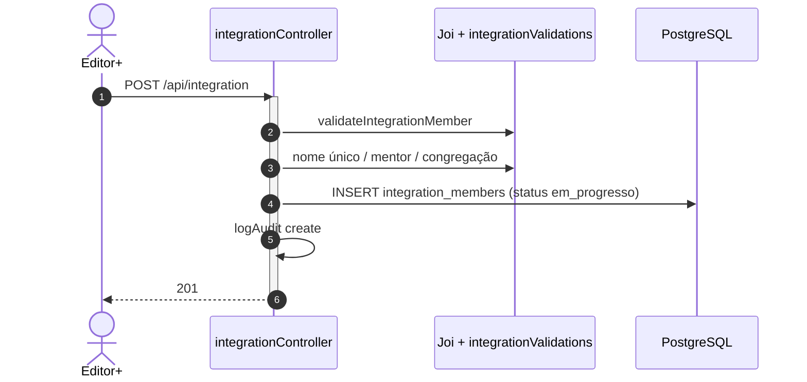
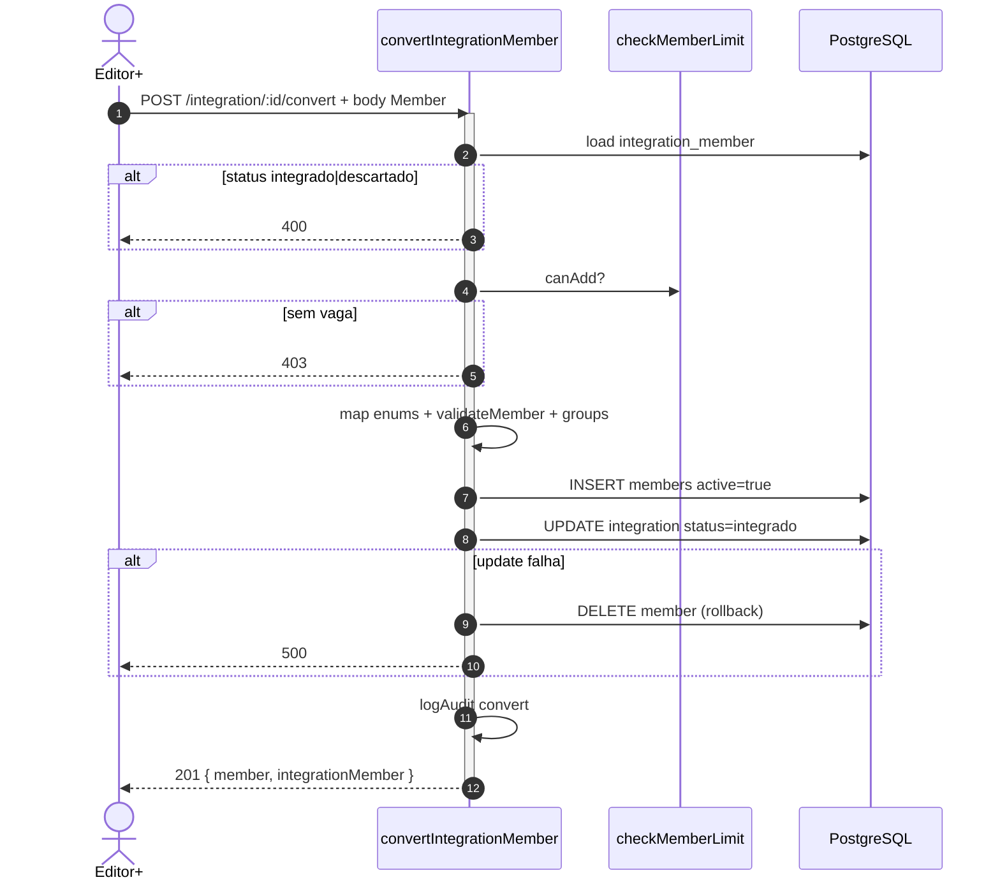
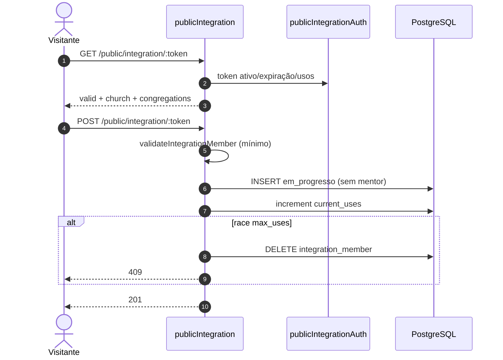
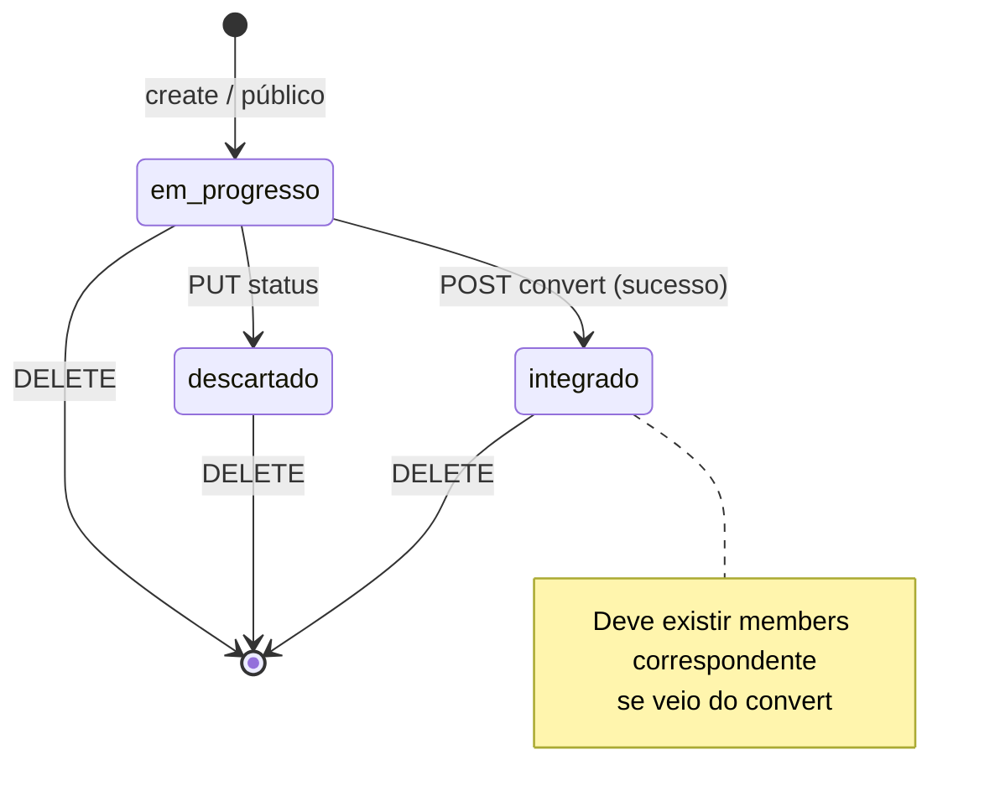
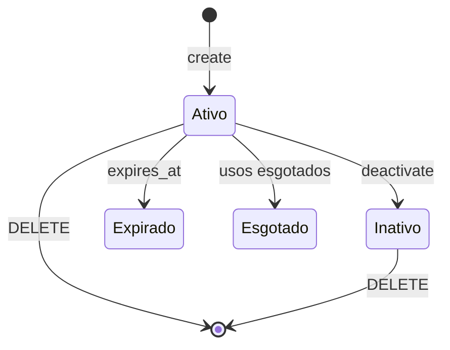
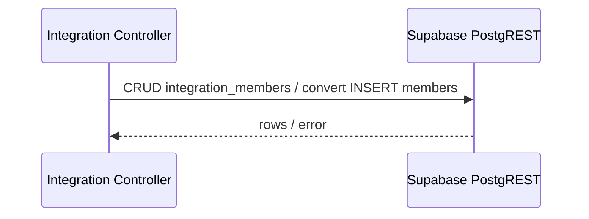
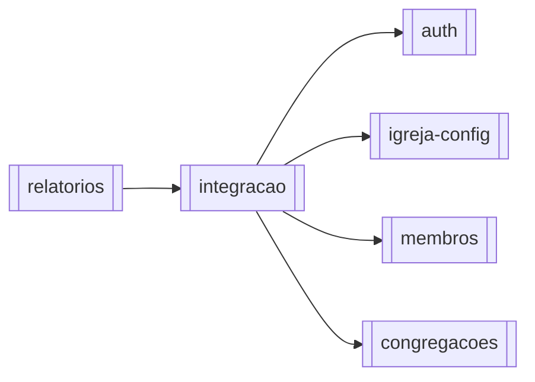

# Módulo — Integração

> Pipeline de **pré-membros** (`integration_members`): qualificar, acompanhar (mentor/congregação prevista) e **converter** ao rol oficial ou descartar; inclui links de autocadastro público.  
> Regras: [[02_regras-de-negocio/regras-por-modulo/integracao]] · Índice: [[04_modulos/index]] · Membros: [[04_modulos/membros]].

---

## 1. 📌 Visão Geral

É o funil pastoral **antes** da pessoa entrar na cota de membros: cadastros leves (enums em minúsculo), status `em_progresso` → `integrado` | `descartado`, e operação `POST .../convert` que materializa um `members` completo via `validateMember`.

Resolve o gap entre interesse/visitante e rol oficial (sem consumir vaga do plano até a conversão).

No sistema, alimenta depois o módulo membros; usa congregações e mentores-membro; exports PDF de integrante ficam em [[04_modulos/relatorios]].  
Produto: [[01_produto/visao-do-produto]].

---

## 2. ⚖️ Bounded Context

### ✅ Este módulo É responsável por:

- CRUD de `integration_members` (tenant-scoped)
- Validação de mentor e congregação prevista
- Unicidade de nome (case-insensitive) entre integrantes da igreja
- Conversão → `members` (mapeamento de enums + `validateMember` + quota)
- Status `em_progresso` / `integrado` / `descartado`
- Links `public_integration_links` e `GET/POST /api/public/integration/:token`
- Listagem paginada/filtros (status, mentor, congregação)
- Auditoria em create/update/delete/convert

### ❌ Este módulo NÃO é responsável por:

- Rol oficial `members` além do convert (→ [[04_modulos/membros]])
- Autocadastro direto no rol (`/public/registration` → membros)
- Billing/Stripe (só `checkMemberLimit` na conversão)
- Export PDF (→ relatórios)
- Auth de usuários do sistema

---

## 3. 📁 Estrutura de Arquivos

```
backend/src/
├── routes/
│   ├── integration.ts              → CRUD + convert
│   ├── integrationLinks.ts         → links autenticados
│   └── public.ts                   → /integration/:token (parte)
├── controllers/
│   ├── integrationController.ts    → núcleo + convert
│   ├── integrationLinkController.ts
│   └── publicIntegrationController.ts
├── validators/
│   └── integrationMemberValidator.ts  → Joi (enums minúsculos)
├── middlewares/
│   ├── publicIntegrationAuth.ts
│   └── publicPostLimiter.ts
├── utils/
│   ├── integrationValidations.ts   → nome único, mentor, cong.
│   ├── planLimits.ts               → só no convert
│   └── auditLogger.ts
└── types/index.ts                  → IntegrationMember

frontend/src/app/
├── (main)/integration/             → UI pipeline
└── public/integration/[token]/    → form público

Testes dedicados: inexistentes.
```

---

## 4. 🗄️ Entidades e Models

### integration_members

Pré-membro em acompanhamento.

| Campo | Tipo | Nullable | Default | Descrição |
| --- | --- | --- | --- | --- |
| id | uuid | NOT NULL | gen_random_uuid() | PK |
| church_id | uuid | NOT NULL | — | Tenant |
| name | text | NOT NULL | — | Nome |
| birth | date | NULL | — | Nascimento (não futuro se informado) |
| gender | gender_enum | NULL | — | `masculino` \| `feminino` |
| marital_status | marital_status_enum | NULL | — | solteiro…outro |
| phone / whatsapp | text | NULL | — | Contato |
| expected_admission_type | admission_type_enum | NULL | — | batismo / transferencia / … |
| expected_congregation_id | uuid | NULL | — | Congregação prevista (SET NULL) |
| mentor_id | uuid | NULL | — | FK → members (SET NULL) |
| notes | text | NULL | — | ≤5000 chars (Joi) |
| status | integration_status_enum | NOT NULL | `em_progresso` | Pipeline |
| created_at / updated_at | timestamptz | NOT NULL | utc now | Audit row |

**Relacionamentos:**

- Pertence a: `churches`, opcionalmente `congregations`, `members` (mentor)
- Não há `member_groups` nesta tabela — grupos só no convert (payload → members)

**Soft delete:** não. Descarte = `status=descartado`. **DELETE = hard delete.**  
**Auditoria:** `audit_logs` entity `integration_member` (action convert incluída).

> **Não conta** em `checkMemberLimit` até virar `members.active`.

### public_integration_links

Espelho dos registration links (sem `default_congregation_id`).

| Campo | Tipo | Default | Descrição |
| --- | --- | --- | --- |
| id | uuid | uuid_generate_v4() | PK |
| church_id | uuid | — | Tenant |
| token | text | UNIQUE | Segredo URL |
| expires_at | timestamptz | — | Expiração |
| max_uses / current_uses | int | null / 0 | Limite |
| is_active | boolean | true | Soft disable |
| created_by | uuid | null | Auth user |
| notes | text | null | — |
| created_at / updated_at | timestamptz | now() | Audit |

```typescript
// Conceitual
// integration_members { id, church_id, name, status, mentor_id, expected_congregation_id, ...enums }
// public_integration_links { token, expires_at, max_uses, is_active }
```

**Atenção de domínio:** labels de gender/marital **diferem** de `members` (minúsculo vs Title Case PT). Convert usa `mapGenderToMember` / `mapMaritalStatusToMember`.

---

## 5. 🌐 Interface Pública

### `/api/integration` — JWT + reader; mutações editor+

| Método | Rota | Auth | Role | Descrição |
| --- | --- | --- | --- | --- |
| GET | `/api/integration/` | ✅ | ≥ reader | Lista paginada + filtros |
| GET | `/api/integration/:id` | ✅ | ≥ reader | Detalhe |
| POST | `/api/integration/` | ✅ | ≥ editor | Criar (`em_progresso`) |
| PUT | `/api/integration/:id` | ✅ | ≥ editor | Atualizar (incl. status) |
| DELETE | `/api/integration/:id` | ✅ | ≥ editor | Hard delete |
| POST | `/api/integration/:id/convert` | ✅ | ≥ editor | → member |

### `/api/integration-links`

| Método | Rota | Auth | Role | Descrição |
| --- | --- | --- | --- | --- |
| GET | `/` | ✅ | ≥ reader | Listar |
| GET | `/:id` | ✅ | ≥ reader | Detalhe |
| POST | `/` | ✅ | ≥ editor | Criar |
| PUT | `/:id` | ✅ | ≥ editor | Atualizar |
| PATCH | `/:id/deactivate` | ✅ | ≥ editor | Soft disable |
| DELETE | `/:id` | ✅ | ≥ editor | Hard delete |

### `/api/public/integration`

| Método | Rota | Auth | Role | Descrição |
| --- | --- | --- | --- | --- |
| GET | `/:token` | 🔗 | — | Validar link |
| POST | `/:token` | 🔗 | — | Criar integrante mínimo (RL 15/15min) |

**Total:** **14** endpoints.

### Contrato — `POST /api/integration/`

```typescript
// Request (Joi integrationMemberValidator):
{
  name: string;                          // obrigatório
  birth?: string | Date | null;
  gender?: 'masculino' | 'feminino' | null;
  marital_status?: 'solteiro'|'casado'|'divorciado'|'viuvo'|'outro'|null;
  phone?: string; whatsapp?: string;
  expected_admission_type?: 'batismo'|'transferencia'|'profissao de fe'|'outro'|null;
  expected_congregation_id?: string | null;  // uuid
  mentor_id?: string | null;                 // uuid member mesma igreja
  notes?: string | null;
  status?: 'em_progresso'|'integrado'|'descartado'; // default create: em_progresso
}

// Response 201: IntegrationMember (+ joins opcionais)

// Erros: 400 validação/nome/mentor/cong.; 401/403; 500
```

### Contrato — `POST /api/integration/:id/convert`

```typescript
// Request body: campos Member (validateMember) + groups?: string[]
// Completa dados ausentes a partir do integrante (name, birth, phone, admission map, cong.)
// active forçado true

// Response 201:
{ member: Member; integrationMember: IntegrationMember /* status integrado */ }

// Erros:
// 400 — já integrado / descartado / validateMember / grupos
// 403 — limite de membros / past_due
// 404 — integrante não encontrado
// 500 — falha update status (com rollback do member criado)
```

### Listagem — query

`page`, `limit` (1–100), `status`, `expected_congregation_id`, `mentor_id`, `search`, `sort_by` whitelist (`created_at|updated_at|name|birth|status`), `sort_order`.

Envelope: `{ data, pagination, filters }` (padrão similar a members).

---

## 6. ⚙️ Regras de Negócio

Detalhe: [[02_regras-de-negocio/regras-por-modulo/integracao]] (**15** regras).

| ID | Declaração curta |
| --- | --- |
| BR-INT-001 | Create autenticado default `em_progresso` |
| BR-INT-002 | Nome único na igreja (ilike) |
| BR-INT-003 | Campos/enums/fones validados |
| BR-INT-004 | Público: sem mentor/admission/notes forçados |
| BR-INT-005 | Mentor = membro da mesma igreja |
| BR-INT-006 | Mentor na cong. prevista; se `expected_congregation_id` null, qualquer cong. |
| BR-INT-007 | `expected_congregation_id` da mesma igreja |
| BR-INT-008 | Mutações editor+; leitura reader+ |
| BR-INT-009 | Convert bloqueado se integrado/descartado |
| BR-INT-010 | Convert exige vaga no plano |
| BR-INT-011 | Convert atômico (rollback member se status falhar) |
| BR-INT-012 | Payload convert passa `validateMember` |
| BR-INT-013 | DELETE permanente |
| BR-INT-014 | Link público: ativo, expiração, usos |
| BR-INT-015 | Race max_uses → delete integrante + 409 |

**Inferido:** PUT pode ir a `descartado`/`integrado` sem passar pelo convert — confirmar produto (risco de `integrado` sem row em `members`).

---

## 7. 🔄 Fluxos do Módulo

### Fluxo: Criar integrante (app)



### Fluxo: Converter → membro



### Fluxo: Cadastro público



### Estados — `integration_members.status`



### Estados — link público



---

## 8. 🔗 Integrações

Este módulo **não** chama Stripe/Resend/S3 diretamente.

### Supabase PostgreSQL (service_role)

- Persistência de `integration_members` / `public_integration_links` / insert em `members` no convert  
- **Config:** `SUPABASE_URL`, `SUPABASE_SERVICE_ROLE_KEY`



---

## 9. ⚙️ Operações em Background

N/A — **sem** jobs/cron específicos deste módulo. Convert e público são síncronos no request.

| Operação | Tipo | Trigger | Frequência | Descrição |
| --- | --- | --- | --- | --- |
| — | — | — | — | Sem fila/worker dedicado |

---

## 10. 🚨 Tratamento de Erros

| Situação | HTTP | error | Quando |
| --- | --- | --- | --- |
| Validação Joi / mentor / nome | 400 | detalhes | create/update |
| Já integrado / descartado | 400 | mensagens específicas | convert |
| validateMember no convert | 400 | Dados inválidos | convert |
| Limite plano | 403 | Limite de membros | convert |
| Sem role / igreja | 403 | Permissão / Igreja | rotas |
| Não encontrado | 404 | Integrante/link | get/delete/público |
| Race max_uses | 409 | limite usos | público POST |
| Rate público | 429 | publicPostLimiter | POST público |
| Rollback convert | 500 | falha ao marcar integrado | convert |
| Erro interno | 500 | genérico | catch |

---

## 11. 🔐 Segurança e Autorização

| Controle | Detalhe |
| --- | --- |
| Router | `authMiddleware` + `requireRole('reader')` |
| Mutações / convert | `requireRole('editor')` |
| Público | token capability + rate limit POST |
| Tenant | `church_id` do contexto / do link |
| PII | name, phone, whatsapp, notes — cuidado em logs/export |
| Mentores | não pode apontar member de outra igreja |

---

## 12. 🧪 Testes

| Tipo | Arquivo | Cobertura | O que testa |
| --- | --- | --- | --- |
| Unit/Integration/E2E | — | 0% | N/A |

**Gaps:**

- [ ] Nome duplicado  
- [ ] Mentor fora da congregação prevista  
- [ ] Convert bloqueado integrado/descartado  
- [ ] Convert sem vaga → 403  
- [ ] Rollback se update status falha  
- [ ] Público max_uses race → 409 + delete  
- [ ] PUT status=`integrado` sem member (se permitido)  

---

## 13. 🔗 Dependências

**Consome:**

- [[04_modulos/auth]] — sessão/RBAC  
- [[04_modulos/igreja-config]] — tenant  
- [[04_modulos/membros]] — mentor FK + convert cria Member + quota  
- [[04_modulos/congregacoes]] — expected_congregation  

**Dependem deste:**

- [[04_modulos/relatorios]] — export PDF/listas de integração  
- (indireto) [[04_modulos/membros]] — entrada via convert  



---

## 14. ⚠️ Pontos de Atenção

1. **Enums ≠ members** — mapear sempre no convert; UI deve usar minúsculos no form de integração.  
2. **Integrantes não consomem quota** — crescimento livre de `em_progresso` até convert.  
3. **PUT `status: integrado` sem convert** — possível inconsistência se produto não restringir.  
4. **Convert** exige formulário Member completo (obrigatórios Joi de membros); incompleto no integrante ≠ pronto.  
5. Query `.eq('active', true)` em congregations no público — coluna `active` pode não existir (mesmo risco do módulo membros).  
6. Soft disable de link ≠ delete; DELETE de integrante é permanente.  
7. Export PDF não está neste módulo.

---

## 15. 📝 Histórico de Mudanças

| Data | Versão | Descrição | Issue |
| --- | --- | --- | --- |
| 2026-07-14 | 1.0 | Documentação inicial do módulo integração | — |

---

## Confirmação

| Item | Valor |
| --- | --- |
| Módulo documentado | **integracao** ✅ |
| Endpoints | **14** |
| Regras BR-INT | **15** |
| Integrações externas | Supabase PostgreSQL apenas |
| Jobs/cron | Nenhum |
| Testes | Nenhum dedicado |
