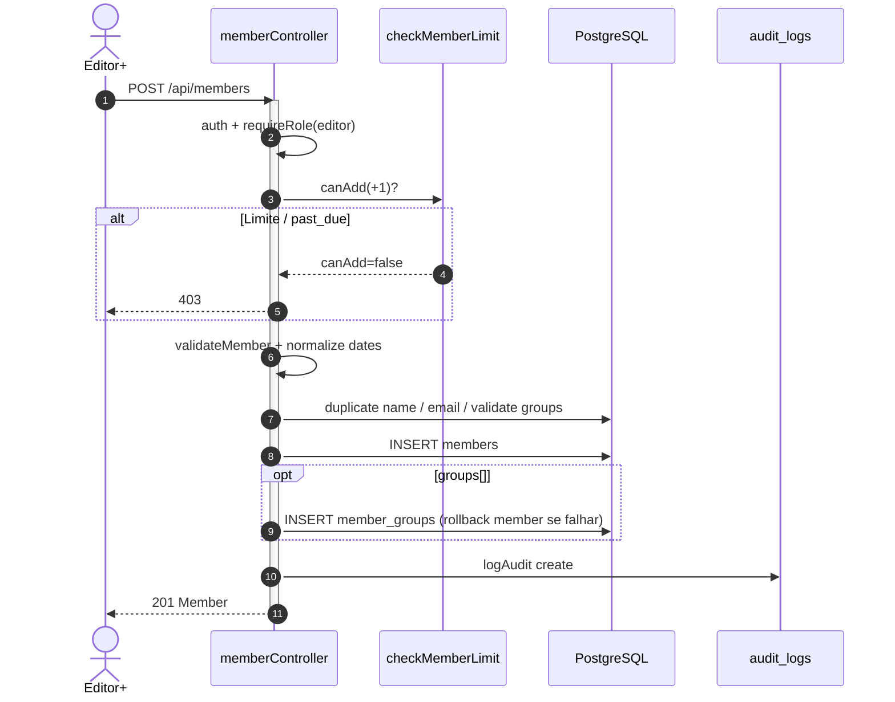
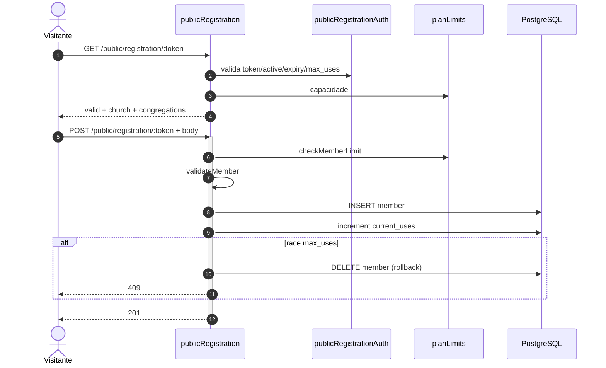
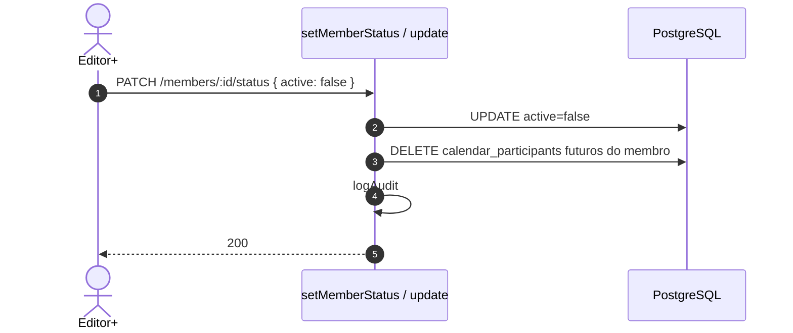
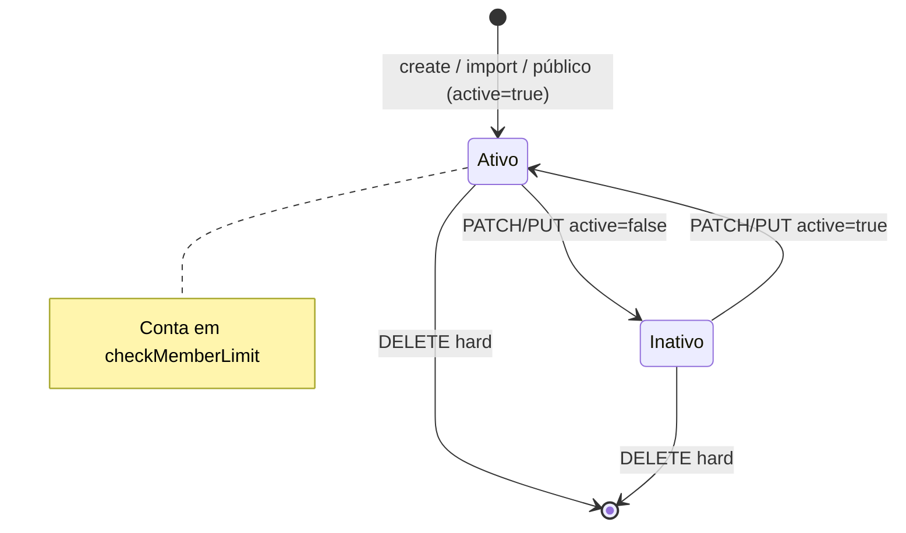
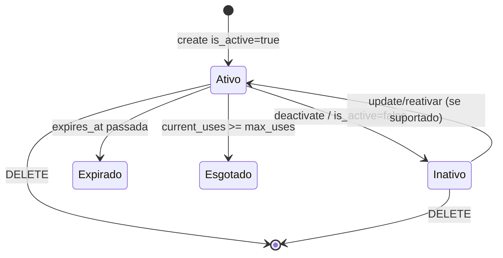
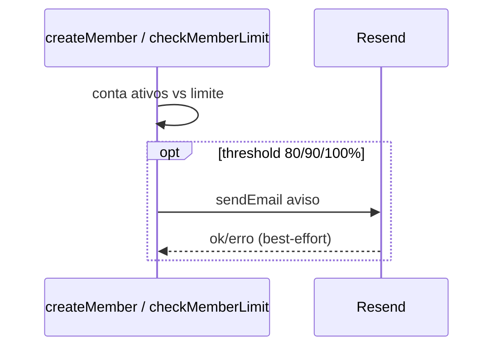
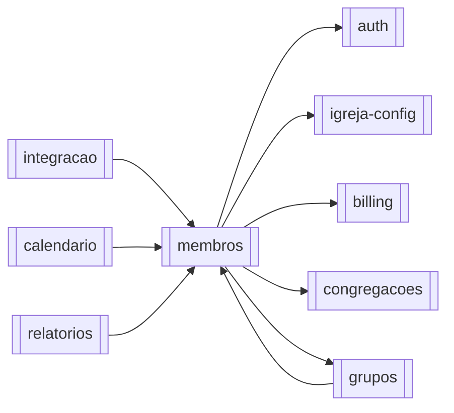

# Módulo — Membros

> Rol oficial de membros da igreja: CRUD, status, import CSV, links de autocadastro e consultas (listagem, aniversários, reports).  
> Regras: [[02_regras-de-negocio/regras-por-modulo/membros]] · Índice: [[04_modulos/index]] · Schema: [[03_arquitetura/banco-de-dados]].

---

## 1. 📌 Visão Geral

Gerencia o **cadastro pastoral/administrativo** de pessoas no tenant (`church_id`): quem entra no rol, quem fica ativo (conta no plano), quem é inativado ou removido, e como a igreja escala o cadastro (batch, CSV, link público).

Existe porque a proposta do Flock é operação eclesiástica multi-tenant com **quota por plano** e isolamento por igreja — o “membro” é a entidade de negócio central (≠ usuário de login).

No sistema, alimenta grupos, calendário (responsável/participantes), integração (mentor/conversão), relatórios/export e o contador de billing.  
Produto: [[01_produto/visao-do-produto]].

---

## 2. ⚖️ Bounded Context

### ✅ Este módulo É responsável por:

- CRUD de `members` (tenant-scoped)
- `PATCH .../status` (`active`) e efeitos (ex.: limpar agenda futura)
- Batch create e import CSV (validate + import)
- Unicidade de nome/e-mail na igreja; validação Joi do formulário
- `checkMemberLimit` no create/batch/import/público
- Links `public_registration_links` (CRUD autenticado + deactivate)
- Autocadastro `GET/POST /api/public/registration/:token` (+ groups do form)
- Listagem paginada/filtros, aniversários, `GET /members/reports`
- Auditoria `logAudit` em create/update/delete/status
- Aviso de proximidade de limite (e-mail Resend via `planLimits`)

### ❌ Este módulo NÃO é responsável por:

- Usuários Auth / papéis da equipe (→ [[04_modulos/auth]], [[04_modulos/igreja-config]])
- Pipeline pré-membro `integration_members` (→ [[04_modulos/integracao]])
- CRUD de congregações/grupos em si (só valida/associa)
- Export PDF/CSV de listas (`/api/export/*` → [[04_modulos/relatorios]])
- Stripe checkout/webhooks (só consome quota via `plan_type` / `past_due`)

---

## 3. 📁 Estrutura de Arquivos

```
backend/src/
├── routes/
│   ├── members.ts                 → CRUD + import + reports + birthdays
│   ├── registrationLinks.ts       → links públicos gerenciados
│   └── public.ts                  → registration/:token (parte membros)
├── controllers/
│   ├── memberController.ts        → núcleo CRUD/list/status/batch/reports
│   ├── memberImportController.ts  → validate/import HTTP
│   ├── publicRegistrationController.ts
│   └── registrationLinkController.ts
├── services/ (import)
│   └── memberImportService.ts     → parse CSV, skipDuplicates, inserts
├── validators/
│   ├── memberValidator.ts         → Joi create/update
│   └── registrationLinkValidator.ts
├── middlewares/
│   ├── upload.ts                  → multer CSV ≤10MB
│   ├── publicRegistrationAuth.ts
│   └── publicPostLimiter.ts       → 15/15min POST público
├── utils/
│   ├── planLimits.ts              → checkMemberLimit + warning e-mail
│   ├── memberValidations.ts       → email único, grupos válidos
│   ├── dateNormalizer.ts
│   └── auditLogger.ts
└── types/index.ts                 → interface Member

frontend/src/app/
├── (main)/members/                → UI rol
└── public/register/[token]/      → form autocadastro

Testes dedicados: inexistentes.
Migrations: colunas eclesiásticas (`add_member_form_fields_v2` etc.) no Supabase — sem pasta local.
```

---

## 4. 🗄️ Entidades e Models

### members

Cadastro oficial do membro no tenant.

| Campo | Tipo | Nullable | Default | Descrição |
| --- | --- | --- | --- | --- |
| id | uuid | NOT NULL | gen_random_uuid() | PK |
| church_id | uuid | NOT NULL | — | Tenant |
| congregation_id | uuid | NOT NULL | — | Congregação (obrigatória; FK RESTRICT) |
| name | text | NOT NULL | — | Nome completo |
| birth | date | NOT NULL | — | Nascimento (não futuro) |
| gender | text | NULL* | — | Masculino/Feminino (*Joi exige; CHECK DB) |
| marital_status | text | NULL* | — | Solteiro… União Estável |
| nationality | text | NULL | — | legado |
| document | text | NULL | — | CPF/CNPJ se informado |
| address*, cep, city, state, … | text | NULL | — | Endereço / contato |
| email, phone, whatsapp | text | NULL | — | Contato |
| spouse, wedding_date, *_is_member | … | NULL | — | Família |
| father_name, mother_name | text | NULL | — | Filiação |
| children | jsonb | NULL | `[]` | `[{name,birth}]` |
| baptism_*, admission*, occupation | … | NULL | — | Eclesiástico / admissão |
| years_evangelical, evangelical_family, is_baptized, baptism_type, … | … | NULL | — | Form v2 |
| sunday_attendance, weekly_activities* | … | NULL | — | Frequência |
| active | boolean | NULL | `true` | Conta na quota se true |
| created_at | timestamptz | NULL | now() | Criação |

\*Tipos TS incluem `updated_at`; **coluna `updated_at` não existe no schema live** — não filtrar/ordenar por ela no SQL.

**Relacionamentos:**

- Pertence a: `churches` (`church_id`), `congregations` (`congregation_id`, **RESTRICT**)
- Tem muitos: `member_groups`; referenciado por grupos (responsible), calendário, integração (mentor)

**Soft delete:** **não** via `deleted_at`. Inativação = `active=false`. **DELETE = hard delete.**  
**Auditoria:** `audit_logs` (entity `member`) + `created_at` na row.

### member_groups

N:N membro↔grupo (escrito no create/update de membros).

| Campo | Tipo | Default | Descrição |
| --- | --- | --- | --- |
| id | uuid | gen_random_uuid() | PK |
| member_id / group_id | uuid | — | FKs CASCADE |
| created_at | timestamptz | now() | Vínculo |

UNIQUE `(member_id, group_id)`.

### public_registration_links

Capability de autocadastro.

| Campo | Tipo | Default | Descrição |
| --- | --- | --- | --- |
| id | uuid | uuid_generate_v4() | PK |
| church_id | uuid | — | Tenant |
| token | text | UNIQUE | Segredo URL |
| expires_at | timestamptz | — | Expiração |
| max_uses / current_uses | int | null / 0 | Limite |
| is_active | boolean | true | Soft disable |
| default_congregation_id | uuid | null | Prefill |
| created_by | uuid | null | Auth user |
| notes | text | null | — |
| created_at / updated_at | timestamptz | now() | Audit |

```typescript
// Conceitual (sem Prisma)
// members { id, church_id, name, birth, active, ...form fields }
// member_groups { member_id, group_id }
// public_registration_links { token, expires_at, max_uses, is_active }
```

---

## 5. 🌐 Interface Pública

### `/api/members` — JWT + reader no router; mutações editor+

| Método | Rota | Auth | Role | Descrição |
| --- | --- | --- | --- | --- |
| GET | `/api/members/` | ✅ | ≥ reader | Lista paginada + filtros |
| GET | `/api/members/reports` | ✅ | ≥ reader | Relatórios (RL 10/min) |
| GET | `/api/members/birthdays/count` | ✅ | ≥ reader | Contagem aniversariantes |
| GET | `/api/members/birthdays/list` | ✅ | ≥ reader | Lista aniversariantes |
| POST | `/api/members/import/validate` | ✅ | ≥ editor | Valida CSV |
| POST | `/api/members/import` | ✅ | ≥ editor | Importa CSV |
| GET | `/api/members/:id` | ✅ | ≥ reader | Detalhe |
| POST | `/api/members/` | ✅ | ≥ editor | Criar |
| POST | `/api/members/batch` | ✅ | ≥ editor | Lote |
| PUT | `/api/members/:id` | ✅ | ≥ editor | Atualizar |
| PATCH | `/api/members/:id/status` | ✅ | ≥ editor | Só `active` |
| DELETE | `/api/members/:id` | ✅ | ≥ editor | Hard delete |

### `/api/registration-links`

| Método | Rota | Auth | Role | Descrição |
| --- | --- | --- | --- | --- |
| GET | `/` | ✅ | ≥ reader | Listar |
| GET | `/:id` | ✅ | ≥ reader | Detalhe |
| POST | `/` | ✅ | ≥ editor | Criar link |
| PUT | `/:id` | ✅ | ≥ editor | Atualizar |
| PATCH | `/:id/deactivate` | ✅ | ≥ editor | `is_active=false` |
| DELETE | `/:id` | ✅ | ≥ editor | Hard delete link |

### `/api/public` (registration)

| Método | Rota | Auth | Role | Descrição |
| --- | --- | --- | --- | --- |
| GET | `/registration/:token` | 🔗 | — | Validar link |
| GET | `/registration/:token/groups` | 🔗 | — | Grupos do form |
| POST | `/registration/:token` | 🔗 | — | Criar membro (RL 15/15min) |

**Total aprox.:** **21** endpoints do domínio membros.

### Contrato principal — `POST /api/members/`

```typescript
// Request (resumo — Joi memberValidator + groups opcional):
{
  name: string;                 // obrigatório, único na church (ilike)
  birth: string | Date;         // YYYY-MM-DD, não futuro
  gender: 'Masculino' | 'Feminino';
  marital_status: 'Solteiro' | 'Casado' | 'Divorciado' | 'Viúvo' | 'Outro' | 'União Estável';
  address?: string; city?: string; state?: string; // exigidos pelo Joi de negócio
  admission?: string; admission_date?: string;
  email?: string;               // único na church se informado
  document?: string;            // CPF/CNPJ se informado
  congregation_id: string;      // UUID obrigatório (BR-MEM-017)
  groups?: string[];            // UUIDs de groups da igreja
  children?: Array<{ name: string; birth: string }>;
  // + campos eclesiásticos form v2 (baptism_type, sunday_attendance, …)
  active?: boolean;             // create força/assume true (BR-MEM-005)
}

// Response 201: Member (+ groups hidratados se associados)

// Erros:
// 401 — não autenticado
// 403 — Limite de membros / past_due (planLimits)
// 400 — duplicidade nome/email, grupos inválidos, validação Joi, erro DB
// 500 — erro interno
```

### Listagem — `GET /api/members/?page=&limit=`

```typescript
// Query: page (default 1), limit (1–100), search, active, congregation_id,
// gender, marital_status, city, state, date ranges, age_from/to,
// sort_by whitelist, sort_order

// 200:
{
  data: Member[];
  pagination: { page, limit, total, totalPages, hasNextPage, hasPrevPage, nextPage, prevPage };
  filters: { ... };
  sorting: { sort_by, sort_order };
}
```

---

## 6. ⚙️ Regras de Negócio

Detalhe: [[02_regras-de-negocio/regras-por-modulo/membros]] (**17** regras).

| ID | Declaração curta |
| --- | --- |
| BR-MEM-001 | Create só se caber no plano e ≠ `past_due` |
| BR-MEM-002 | Nome único na igreja (case-insensitive) |
| BR-MEM-003 | E-mail único na igreja |
| BR-MEM-004 | Campos obrigatórios / formatos (Joi) |
| BR-MEM-005 | Novo membro nasce `active=true` |
| BR-MEM-006 | Grupos devem pertencer à igreja |
| BR-MEM-007 | Import respeita capacidade restante |
| BR-MEM-008 | Import: skipDuplicates (padrão) por nome |
| BR-MEM-009 | Mutações exigem editor+ |
| BR-MEM-010 | DELETE = hard delete + audit |
| BR-MEM-011 | Inativar remove participações futuras no calendário |
| BR-MEM-012 | Quota conta só `active=true` |
| BR-MEM-013 | Link público: token ativo, não expirado, usos OK |
| BR-MEM-014 | Público também checa plano |
| BR-MEM-015 | Race max_uses → rollback membro + 409 |
| BR-MEM-016 | Link: expires futuro ≤1 ano; max_uses 1–10000 |
| BR-MEM-017 | `congregation_id` UUID obrigatório (sem Sede/null) |

**Inferido:** reativar via PATCH pode **não** revalidar limite do plano.

---

## 7. 🔄 Fluxos do Módulo

### Fluxo: Criar membro (app)



### Fluxo: Autocadastro por link



### Fluxo: Inativar



### Estados — `members.active`



### Estados — link de registro



---

## 8. 🔗 Integrações

### Supabase PostgreSQL (via service_role)

- **Propósito:** persistência de members / links / member_groups / audit  
- **Ops:** `.from('members'|…)` insert/update/delete/select; sem ORM  
- **Falha:** mapeada para 400/404/500  
- **Config:** `SUPABASE_URL`, `SUPABASE_SERVICE_ROLE_KEY`

### Resend (indireto via `planLimits`)

- **Propósito:** e-mail de aviso ao owner quando igreja se aproxima do limite (thresholds)  
- **Falha:** log; create do membro não é bloqueado pelo e-mail  
- **Config:** `RESEND_*`



Sem Stripe direto neste módulo.

---

## 9. ⚙️ Operações em Background

Este módulo **não** possui cron/job dedicado.

| Operação | Tipo | Trigger | Frequência | Descrição |
| --- | --- | --- | --- | --- |
| Aviso de limite | Fire-and-forget | Dentro de `checkMemberLimit` | On-demand | E-mail se threshold |
| Import CSV | Sync no request | POST import | On-demand | Parse + inserts (pesado) |

Falha de import = resposta HTTP com relatório parcial (linhas skip/erro); sem fila/retry automático.

---

## 10. 🚨 Tratamento de Erros

| Situação | HTTP | error | Quando |
| --- | --- | --- | --- |
| Não autenticado | 401 | `Não autorizado` | sem user |
| Sem role | 403 | `Permissão insuficiente` | requireRole |
| Limite / past_due | 403 | `Limite de membros atingido` (+ detalhes quota) | create/import/público |
| Nome duplicado | 400 | `Membro já cadastrado` | create |
| E-mail duplicado | 400 | mensagem validação | create/update |
| Grupos inválidos | 400 | `Erro ao validar grupos` | create/update |
| Validação Joi / query | 400 | `Dados inválidos` / página/limite | vários |
| Não encontrado | 404 | `Membro não encontrado` / link | get/delete/público |
| Link inválido/expirado | 403/404 | conforme middleware | público |
| Race max_uses | 409 | limite de usos | público POST |
| Relatórios flooding | 429 | rate reports | GET reports |
| Público flooding | 429 | publicPostLimiter | POST registration |
| Erro interno | 500 | `Erro interno do servidor` | catch |

---

## 11. 🔐 Segurança e Autorização

| Controle | Detalhe |
| --- | --- |
| Router members/links | `authMiddleware` + `requireRole('reader')` |
| Mutações | `requireRole('editor')` |
| Público | token capability; POST rate-limited |
| Tenant | sempre `church_id` do contexto / do link |
| PII | document, email, phones, address, children — não logar em claro |
| Upload | CSV only, 10MB memory |
| Sort whitelist | evita sort em colunas sensíveis (ACHADO 07) |

---

## 12. 🧪 Testes

| Tipo | Arquivo | Cobertura | O que testa |
| --- | --- | --- | --- |
| Unit/Integration/E2E | — | 0% | N/A |

**Gaps:**

- [ ] Create bloqueado em `past_due` / no limite  
- [ ] Nome e e-mail duplicados  
- [ ] Inativar limpa participantes futuros  
- [ ] DELETE hard + audit  
- [ ] Import skipDuplicates + limite  
- [ ] Público: token expirado, max_uses race rollback  
- [ ] Paginação limit > 100 → 400  

---

## 13. 🔗 Dependências

**Consome:**

- [[04_modulos/auth]] — sessão/RBAC  
- [[04_modulos/igreja-config]] — tenant church  
- [[04_modulos/billing]] — `plan_type` / `past_due` via `planLimits`  
- [[04_modulos/congregacoes]] — `congregation_id`  
- [[04_modulos/grupos]] — `groups[]` / `member_groups`  

**Dependem deste:**

- [[04_modulos/integracao]] — mentor / convert→member  
- [[04_modulos/calendario]] — responsável / participantes  
- [[04_modulos/grupos]] — membros do grupo  
- [[04_modulos/relatorios]] — exports sobre members  



---

## 14. ⚠️ Pontos de Atenção

1. **Comentário da rota `DELETE` diz soft delete — mentira;** implementação é hard delete (BR-MEM-010).  
2. **Reativação pode ignorar quota** — validar produto.  
3. **Filtro por idade** carrega membros na app e pagina em memória — perf.  
4. **Import:** `checkDuplicate` por linha pode re-consultar; CSV ≤10MB sync no event loop.  
5. **`updated_at` no type TS sem coluna DB** — não usar em sort SQL.  
6. **Reports** na rota members; PDFs em `/export` (outro módulo) — não misturar.  
7. Query pública de congregações com `.eq('active', true)` — tabelas `congregations` **pode não ter** `active` (verificar schema live).  
8. Após hard delete, FKs SET NULL / CASCADE (calendar, groups) — familiarizar-se com efeitos.

---

## 15. 📝 Histórico de Mudanças

| Data | Versão | Descrição | Issue |
| --- | --- | --- | --- |
| 2026-07-14 | 1.0 | Documentação inicial do módulo membros | — |

---

## Confirmação

| Item | Valor |
| --- | --- |
| Módulo documentado | **membros** ✅ |
| Endpoints | **~21** (12 members + 6 links + 3 public registration) |
| Regras BR-MEM | **16** |
| Integrações | Supabase DB, Resend (avisos de limite) |
| Jobs/cron | Nenhum dedicado |
| Testes | Nenhum dedicado |
