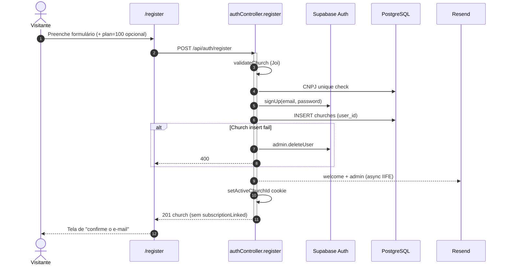
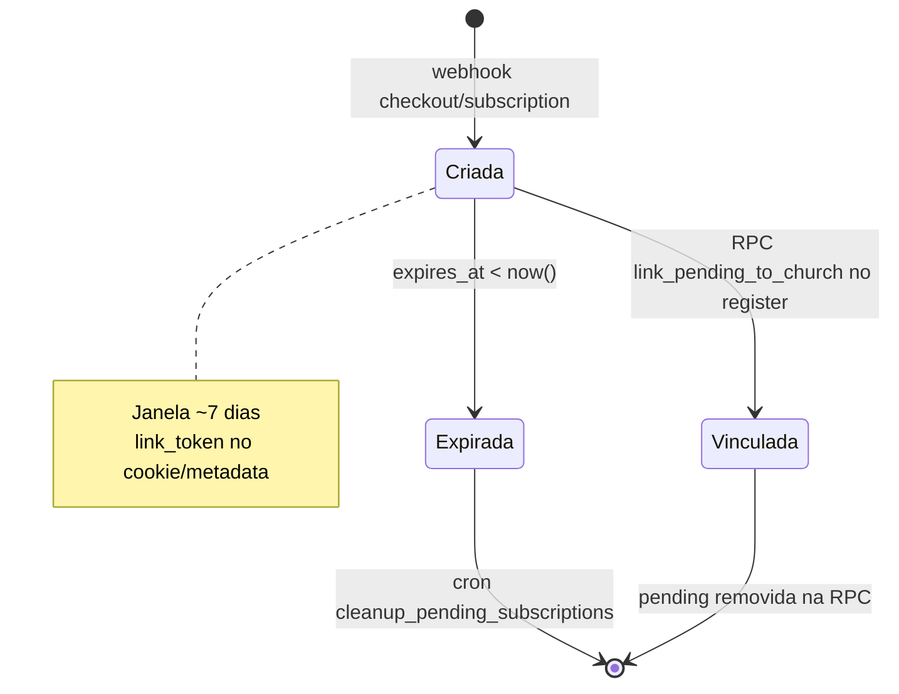
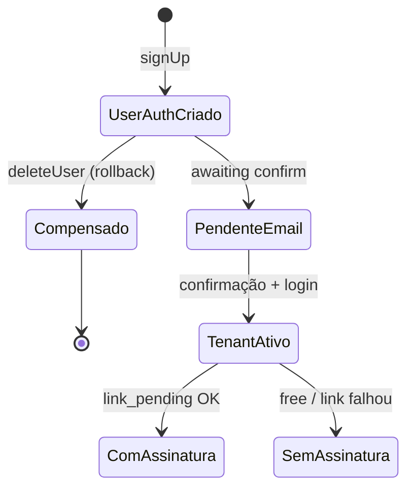
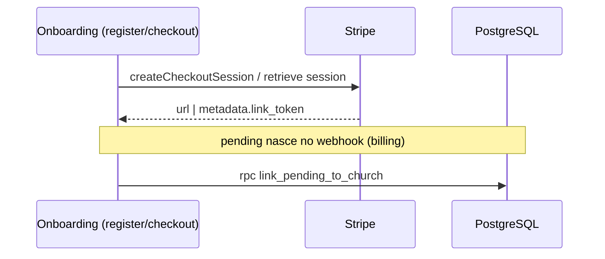
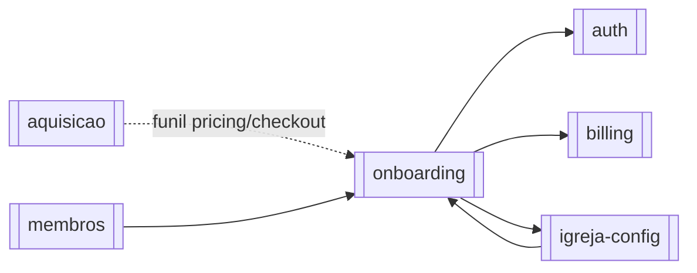

# Módulo — Onboarding

> Converter visitante em **tenant** (igreja + owner Auth) e opcionalmente vincular plano pago pré-pago via checkout → `pending_subscriptions`.  
> Regras: [[02_regras-de-negocio/regras-por-modulo/onboarding]] · Índice: [[04_modulos/index]] · Auth: [[04_modulos/auth]] · Billing: [[04_modulos/billing]].

---

## 1. 📌 Visão Geral

É o **funil de aquisição→ativação**: da landing/checkout (ou registro free) até existir uma `churches` com `user_id` = owner e, se houver pagamento prévio, assinatura Stripe colada na igreja.

Resolve o problema de “como nasce um cliente Flock” sem exigir operador manual: validação de CNPJ, identidade Auth, compensação se insert falhar, e vínculo atômico pending→igreja.

No sistema, fecha o ciclo iniciado por [[04_modulos/aquisicao]] / pricing e entrega um tenant utilizável pelos demais módulos.  
Produto: [[01_produto/visao-do-produto]].

**Nota de fronteira:** o código de registro vive em `authController.register` e o checkout público em `stripeController.createCheckout`. Este módulo documenta o **domínio de onboarding**; persistência contínua de assinatura/webhooks é billing.

---

## 2. ⚖️ Bounded Context

### ✅ Este módulo É responsável por:

- Payload e validação do registro de igreja + credenciais do owner
- Criação do usuário Auth + insert de `churches` (owner via `user_id`)
- Rollback (`deleteUser`) se a igreja não puder ser criada
- Match e-mail registro ↔ checkout (`link_token` / pending)
- Chamada RPC `link_pending_to_church` no register
- Cookie `flock_pending_link_token` e query `session_id` / `link_token` / `plan`
- Checkout **público** (sem login): e-mail + nome + plano 200/500/800 + `link_token`
- Success URLs pós-checkout → landing/register
- E-mails de boas-vindas + notify admin no register (best-effort)
- Rate limit do register

### ❌ Este módulo NÃO é responsável por:

- Login / logout / refresh cotidianos (→ [[04_modulos/auth]])
- Webhook Stripe completo, portal, change-plan, sync (→ [[04_modulos/billing]])
- Waitlist da landing (→ [[04_modulos/aquisicao]])
- Gestão posterior de equipe/`church_users` (→ [[04_modulos/igreja-config]])
- CRUD de membros/congregações após o tenant existir
- Autocadastro público de membros (`/public/register/:token` — módulo membros)

---

## 3. 📁 Estrutura de Arquivos

Não há pasta `modules/onboarding`. Superfície espalhada:

```
backend/src/
├── routes/
│   ├── auth.ts                     → POST /register (+ registerLimiter)
│   ├── stripe.ts                   → POST /create-checkout-session (optionalAuth)
│   └── plans.ts                    → GET planos (apoio ao funil)
├── controllers/
│   ├── authController.ts           → register (núcleo do módulo)
│   └── stripeController.ts         → createCheckout (ramo público)
├── validators/
│   ├── churchValidator.ts          → Joi registro (email, senha, igreja, CNPJ)
│   └── cnpjSchema.ts               → dígitos verificadores
├── services/
│   ├── stripe.ts / stripeWebhookService.ts  → pending + webhooks (billing overlap)
│   ├── emailService.ts
│   └── supabase.ts
├── utils/
│   ├── cookieUtils.ts              → pending link token + activeChurchId
│   ├── billingMetrics.ts           → register_subscription_link_failed
│   └── structuredLogger.ts
├── jobs/
│   └── cleanupPendingSubscriptions.ts  → limpa pending expirado (apoio)
└── config/plans.ts                 → catálogo de planos (UI)

frontend/src/
├── app/(auth)/register/page.tsx    → form Zod + session_id / plan / link_token
├── app/(auth)/checkout/page.tsx    → escolha de plano (autenticado; free vs pago)
└── utils/planFunnel.ts             → persistência de plano no funil

landing/src/
├── utils/planFunnel.ts             → deep-link para /register?plan=
└── components/*Pricing* / Checkout → inicia checkout público

Testes dedicados: inexistentes.
Migrations: pending_subscriptions / RPC link_pending (Supabase); sem pasta migrations no repo.
```

---

## 4. 🗄️ Entidades e Models

### churches (criada no register)

Tenant raiz criado no onboarding.

| Campo | Tipo | Nullable | Default | Descrição |
| --- | --- | --- | --- | --- |
| id | uuid | NOT NULL | gen_random_uuid() | PK |
| user_id | uuid | NOT NULL | — | Owner Auth (`auth.users`) |
| name, denomination, address, city, state | text | NOT NULL | — | Dados cadastrais |
| cnpj | varchar | NOT NULL | UNIQUE | Identidade legal |
| email_church, phone_church | varchar | NULL | — | Contato opcional |
| stripe_* / plan_type / subscription_* | — | NULL | — | Preenchidos se link pending OK ou depois via billing |

**Relacionamentos:** pertence a `auth.users` via `user_id`. Tem muitos membros/config após o onboarding.

**Soft delete:** não. **Auditoria:** `created_at`; eventos de vínculo em `church_subscription_events` (`link_pending`).

### pending_subscriptions (pré-tenant)

Assinatura Stripe aguardando igreja.

| Campo | Tipo | Nullable | Default | Descrição |
| --- | --- | --- | --- | --- |
| id | uuid | PK | gen_random_uuid() | Identificador |
| email | varchar | NOT NULL | — | E-mail do checkout |
| stripe_customer_id / stripe_subscription_id | varchar | NOT NULL | — | IDs Stripe |
| plan_type | varchar | NOT NULL | — | 200/500/800/custom |
| subscription_status | varchar | NOT NULL | — | Status Stripe |
| link_token | uuid | NULL | — | Capability cookie/metadata |
| expires_at | timestamptz | NULL | now()+7 days | Janela de vínculo |
| last_stripe_event_created | bigint | NULL | — | Ordenação webhook |
| created_at | timestamptz | NULL | now() | Criação |

**Relacionamentos:** sem FK a church até o RPC. Webhook (billing) cria/atualiza; register consome.

**Soft delete:** hard delete no vínculo ou limpeza por expiração.

### auth.users (owner)

Criado via `signUp` no register; compensado com `admin.deleteUser` se igreja ou e-mail mismatch falhar.

### church_users

⚠️ **BR-ONB-005** declara membership `owner` em `church_users`, mas **`authController.register` não faz INSERT em `church_users`**. O owner operacional hoje é **legado** via `churches.user_id` + resolução em `churchContext` (`listChurchMembershipsForUser` inclui owner legado). Tratar insert explícito em `church_users` como **gap** a confirmar/corrigir.

```typescript
// Conceitual (sem Prisma)
// churches { id, user_id, cnpj, name, ... stripe fields? }
// pending_subscriptions { id, email, link_token, expires_at, plan_type, stripe_* }
```

---

## 5. 🌐 Interface Pública

| Método | Rota | Auth | Role | Descrição |
| --- | --- | --- | --- | --- |
| POST | `/api/auth/register` | ❌ | — | Criar Auth user + igreja (+ vínculo pending) |
| POST | `/api/stripe/create-checkout-session` | 🔓 opcional | admin+ se autenticado | Checkout; ramo **público** = onboarding |
| GET | `/api/plans` | ❌ | — | Catálogo (apoio UI funil) |
| GET | `/api/plans/paid` | ❌ | — | Só planos pagos |
| GET | `/api/plans/:planType` | ❌ | — | Detalhe de plano |

**Endpoints nucleares do módulo:** **2** (`register` + checkout público). Plans = apoio. Checkout autenticado / activate-free / webhooks → billing.

### Contrato principal — `POST /api/auth/register`

```typescript
// Request Body (ChurchRegistrationData + Joi churchValidator):
{
  email: string;           // obrigatório, único Auth
  password: string;        // ≥8, [a-z][A-Z][0-9]
  phone: string;           // 10–11 dígitos numéricos
  name: string;            // igreja
  denomination: string;
  address: string;
  city: string;
  state: string;           // UF 2 chars
  cnpj: string;            // válido + único
  email_church?: string;
  phone_church?: string;
  link_token?: string;     // cookie flock_pending_link_token ou body
  checkout_session_id?: string; // resolve metadata.link_token via Stripe
}

// Response 201:
{
  message: 'Igreja registrada com sucesso';
  church: { /* row churches */ };
  subscriptionLinked: boolean;
  subscriptionLinkFailed: boolean;
  activeChurchId: string;
}
// + cookie flock_active_church_id; limpa pending link token
// Nota: sessão JWT completa só após confirmação de e-mail + login (auth)

// Erros:
// 400 — Dados inválidos / CNPJ já cadastrado / Email já cadastrado /
//       Erro ao criar usuário|igreja / Email não corresponde ao checkout
// 429 — Rate limit registro (10/15min)
// 500 — Erro interno
```

### Checkout público — `POST /api/stripe/create-checkout-session`

```typescript
// Sem req.user:
{ plan: '200'|'500'|'800'; email: string; name: string }

// 200: { session_id, url } + Set-Cookie flock_pending_link_token
// success_url → LANDING/register?session_id={CHECKOUT_SESSION_ID}
// 400 — plano inválido / email e nome obrigatórios
```

---

## 6. ⚙️ Regras de Negócio

Detalhe: [[02_regras-de-negocio/regras-por-modulo/onboarding]] (**12** regras).

| ID | Declaração curta |
| --- | --- |
| BR-ONB-001 | Payload completo (credenciais + igreja + CNPJ) |
| BR-ONB-002 | CNPJ válido e único |
| BR-ONB-003 | E-mail Auth único |
| BR-ONB-004 | Falha na igreja → delete Auth user |
| BR-ONB-005 | Owner no onboarding — ⚠️ hoje via `churches.user_id`; insert `church_users` não visto |
| BR-ONB-006 | Checkout público exige e-mail e nome |
| BR-ONB-007 | Checkout pago só planos 200/500/800 |
| BR-ONB-008 | Pending expira ~7 dias |
| BR-ONB-009 | E-mail register = e-mail pending |
| BR-ONB-010 | RPC `link_pending_to_church`; falha não desfaz registro |
| BR-ONB-011 | E-mails welcome + admin (best-effort) |
| BR-ONB-012 | Register ≤10/IP/15min |

---

## 7. 🔄 Fluxos do Módulo

### Fluxo A: Registro free (sem pending)



### Fluxo B: Landing checkout → register pago

```mermaid
sequenceDiagram
  autonumber
  actor U as Visitante
  participant L as Landing
  participant API as stripe + auth
  participant ST as Stripe
  participant WH as Webhook
  participant DB as PostgreSQL

  U->>L: Escolhe plano 200/500/800
  L->>API: POST /create-checkout-session {plan,email,name}
  API->>API: link_token = randomUUID + cookie
  API->>ST: Checkout Session (metadata.link_token)
  ST-->>U: Página de pagamento
  ST->>WH: checkout/subscription events
  WH->>DB: UPSERT pending_subscriptions (expires_at +7d)
  U->>L: success → /register?session_id=...
  U->>API: POST /register (+ link_token cookie ou session_id)
  API->>ST: sessions.retrieve (se só session_id)
  API->>SA: signUp + INSERT church
  API->>DB: pending by link_token + email match
  API->>DB: rpc link_pending_to_church
  alt RPC ok
    API-->>U: 201 subscriptionLinked=true
  else RPC fail
    API-->>U: 201 subscriptionLinked=false, subscriptionLinkFailed=true
    Note over API: ops alert + métrica; registro permanece
  end
```

### Estados — pending_subscriptions (visão onboarding)



### Estados — tenant após register



---

## 8. 🔗 Integrações

### Supabase Auth

- **Propósito:** criar owner; compensar falhas  
- **Ops:** `signUp`, `admin.deleteUser`  
- **Falha signUp:** 400 (e-mail já cadastrado etc.)  
- **Config:** `SUPABASE_*`

### Stripe

- **Propósito:** checkout público; resolver `link_token` via `checkout.sessions.retrieve`  
- **Ops:** Create Checkout Session; retrieve session; Customer create (pending)  
- **Falha:** 500 formatado; registro ainda pode ocorrer free  
- **Config:** `STRIPE_SECRET_KEY`, `STRIPE_PRICE_ID_M200|500|800`, `LANDING_URL`, `FRONTEND_URL`



### Resend

- Welcome user + notify `ADMIN_EMAIL`  
- Falha não bloqueia 201  
- `RESEND_*`, `ADMIN_EMAIL`

---

## 9. ⚙️ Operações em Background

| Operação | Tipo | Trigger | Frequência | Descrição |
| --- | --- | --- | --- | --- |
| E-mails pós-register | Fire-and-forget | Após 201 path | On-demand | Welcome + admin |
| `cleanup_pending_subscriptions` | Cron | `0 2 * * *` SP | Diário | Delete pending com `expires_at` passado |
| Webhook → pending | Sync HTTP | Stripe events | On-demand | Cria/atualiza pending (**billing**) |

**Cron cleanup:** entrada = rows expiradas; efeito = DELETE; retries = próxima execução diária; falha = log (sem DLQ).

---

## 10. 🚨 Tratamento de Erros

| Situação | HTTP | error (string) | Quando |
| --- | --- | --- | --- |
| Validação Joi | 400 | `Dados inválidos` | register |
| CNPJ duplicado | 400 | `CNPJ já cadastrado` | register |
| E-mail Auth duplicado | 400 | `Email já cadastrado` | register |
| Falha insert church | 400 | `Erro ao criar igreja` (+ deleteUser) | register |
| E-mail ≠ checkout | 400 | `Email não corresponde ao checkout` (+ deleteUser) | register + pending |
| Plano checkout inválido | 400 | `Plano inválido` | checkout |
| Sem e-mail/nome público | 400 | `Email e nome são obrigatórios` | checkout público |
| Assinatura já ativa (auth) | 409 | `Assinatura já ativa` | checkout autenticado (billing) |
| Rate limit | 429 | register limiter | register |
| Link pending falhou | 201 + flags | `subscriptionLinkFailed: true` | register (não é erro HTTP) |
| Erro interno | 500 | `Erro interno do servidor` | catch |

---

## 11. 🔐 Segurança e Autorização

| Controle | Detalhe |
| --- | --- |
| Register | Público + rate 10/15min |
| Checkout público | `optionalAuth`; sem user → exige email/nome; gera `link_token` UUID |
| Checkout autenticado | exige admin+ (`requireAdminForPaidCheckout`) — fora do núcleo free onboarding |
| Segredos | CNPJ, e-mail, senha, tokens Stripe/link — não logar senha |
| Validação | Joi + CNPJ check digits; Zod no front register |
| Cookie pending | HttpOnly; 7 dias |

---

## 12. 🧪 Testes

| Tipo | Arquivo | Cobertura | O que testa |
| --- | --- | --- | --- |
| Unit / Integration / E2E | — | 0% | N/A — sem suite dedicada |

**Gaps críticos:**

- [ ] Register com CNPJ duplicado  
- [ ] Compensação deleteUser se church insert falha  
- [ ] Mismatch e-mail vs pending → 400 + deleteUser  
- [ ] RPC ok vs fail (flags + church ainda criada)  
- [ ] Checkout público sem email  
- [ ] Pending expirado não vincula  
- [ ] Rate limit register  

---

## 13. 🔗 Dependências

**Consome:**

- [[04_modulos/auth]] — signUp, cookies de sessão parcial, confirmação de e-mail  
- [[04_modulos/billing]] — Stripe prices, webhook→pending, RPC, eventos, métricas  
- [[04_modulos/igreja-config]] — modelo `churches` / resolução de owner legado  

**Dependem deste (indiretamente):** todos os módulos de domínio exigem tenant já criado.



---

## 14. ⚠️ Pontos de Atenção

1. **Fronteira código vs módulo:** lógica em `authController` + `stripeController` — fácil “consertar login” e quebrar onboarding.  
2. **`church_users` owner não inserido no register** — risco se `churchContext` deixar de considerar owner legado.  
3. **Falha de vínculo não reverte registro** (BR-ONB-010) — tenant free até sync/manual; monitorar `subscriptionLinkFailed` / métrica.  
4. **Mismatch e-mail deleteUser** após church insert? Ordem atual: church insert **antes** do check pending email — se pending existe e e-mail diverge, faz `deleteUser` mas **pode deixar church órfã** (user_id aponta para user deletado). 🚨 revisar ordem/rollback de church.  
5. **Confirmação de e-mail** necessária antes do login pleno — UX pós-201.  
6. **Pending expirado:** cron 02h; register não vincula se `expires_at` passou.  
7. Não misturar com `frontend/public/register/[token]` (membros).

---

## 15. 📝 Histórico de Mudanças

| Data | Versão | Descrição | Issue |
| --- | --- | --- | --- |
| 2026-07-14 | 1.0 | Documentação inicial do módulo onboarding | — |

---

## Confirmação

| Item | Valor |
| --- | --- |
| Módulo documentado | **onboarding** ✅ |
| Endpoints nucleares | **2** (+ 3 GET plans de apoio) |
| Regras BR-ONB | **12** |
| Integrações | Supabase Auth, Stripe, Resend |
| Jobs | Cron cleanup pending + e-mails async |
| Testes | Nenhum dedicado |
| Gap crítico notado | possível church órfã no mismatch e-mail; `church_users` owner |
