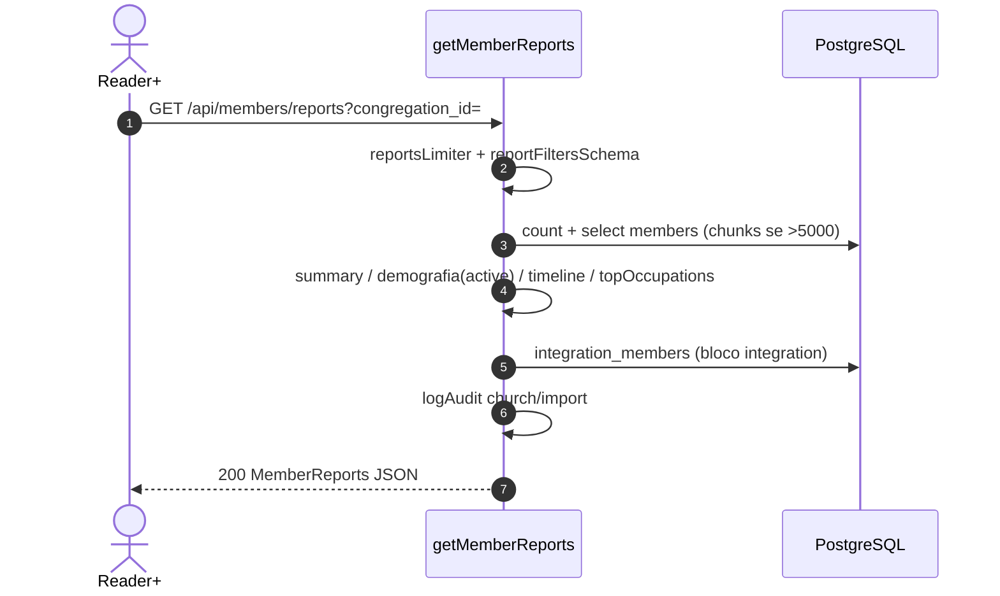
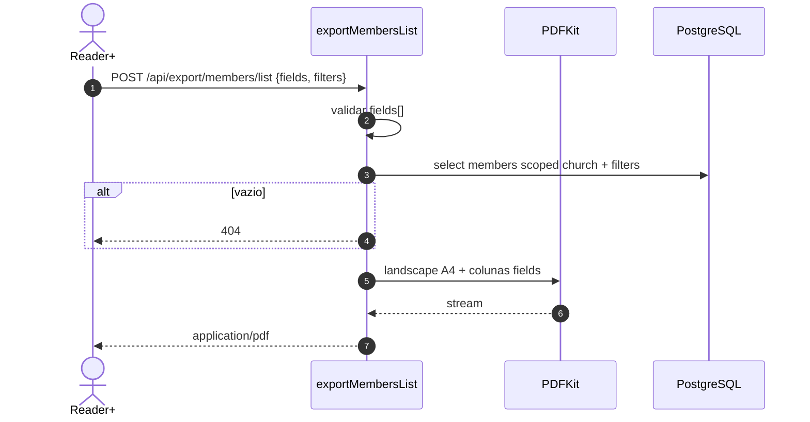
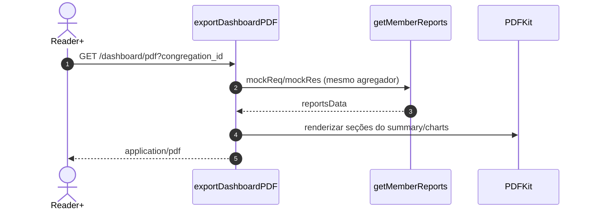
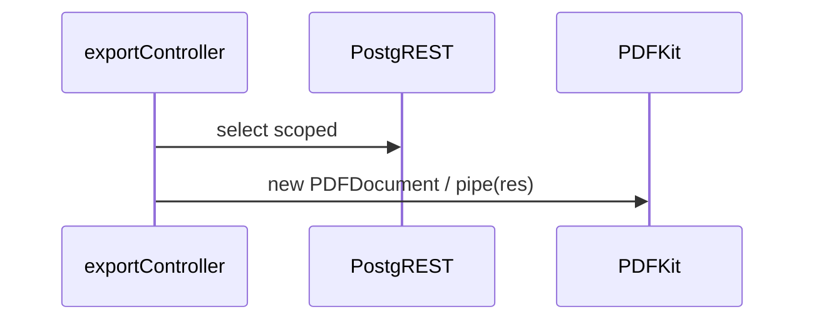
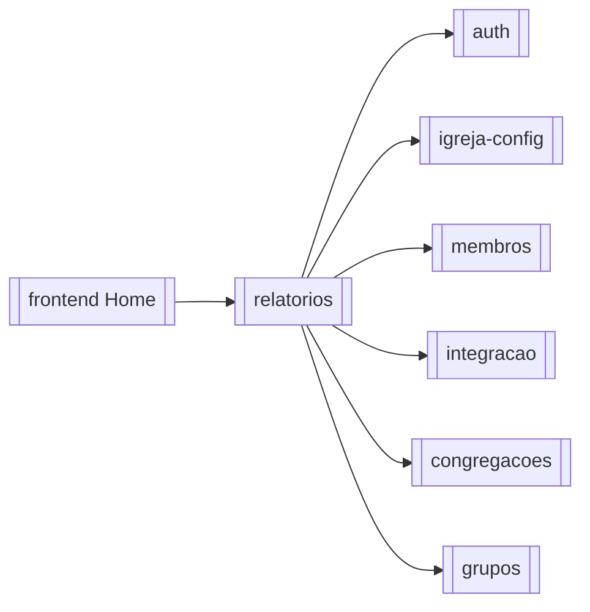

# Módulo — Relatórios

> Painel demográfico/operacional (`GET /api/members/reports`), aniversariantes e exportações PDF/CSV (`/api/export/*`) sobre membros, integração, grupos e congregações.  
> **Não possui tabelas próprias** — é camada de leitura/agregação + geração de arquivos.  
> Regras: [[02_regras-de-negocio/regras-por-modulo/relatorios]] · Índice: [[04_modulos/index]] · Export calendário mensal: [[04_modulos/calendario]].

---

## 1. 📌 Visão Geral

Oferece visão executiva da igreja (totais, demografia, estrutura, timeline, integração) e exportações sob demanda (ficha/lista PDF, CSV, dashboard PDF).

Resolve a necessidade de indicadores e extratos imprimíveis/compartilháveis sem planilhas manuais.

No sistema é **consumidor read-only** dos módulos de domínio; a Home do frontend (`page.tsx`) é a UI principal do painel.  
Produto: [[01_produto/visao-do-produto]].

---

## 2. ⚖️ Bounded Context

### ✅ Este módulo É responsável por:

- Agregar indicadores de membros + integração (`getMemberReports`)
- Endpoints de aniversariantes (count/list) no escopo de reports de UX
- Rate limit específico em `GET /members/reports` (10/IP/min)
- Export PDF: ficha membro, ficha integração, dashboard, listas (membros / integração / grupo / grupos / congregações)
- Export CSV de lista de membros (campos selecionáveis)
- Escopo sempre `church_id` do contexto autenticado
- Validação Joi de filtros de relatório (`reportFiltersSchema`)

### ❌ Este módulo NÃO é responsável por:

- CRUD de membros/grupos/congregações/integração
- Persistência de “relatórios salvos” ou histórico de exports
- PDF mensal do calendário (`GET /api/calendar/export/pdf` → [[04_modulos/calendario]])
- Import CSV (→ [[04_modulos/membros]])
- Jobs assíncronos / filas de geração
- Materialized views / BI externo

---

## 3. 📁 Estrutura de Arquivos

```
backend/src/
├── routes/
│   ├── export.ts                 → 9 rotas /api/export/*
│   └── members.ts                → /reports + /birthdays/* (também CRUD membros)
├── controllers/
│   ├── exportController.ts       → PDFs/CSV (PDFKit) — arquivo grande
│   └── memberController.ts       → getMemberReports, getBirthdaysCount/List
├── validators/
│   └── reportValidator.ts        → reportFiltersSchema (Joi)
└── utils/
    └── ageCalculator.ts          → idade nos aggregados

frontend/src/
├── app/page.tsx                  → Home = painel Vision UI
├── components/reports/           → cards, charts, filters, skeleton
├── types/reports.ts              → MemberReports*
└── components/*/Export*Modal.tsx → dispara /api/export

App mounts:
  app.use('/api/export', exportRoutes)
  app.use('/api/members', memberRoutes)  // reports/birthdays aqui

Testes: inexistentes.
Migrations: N/A — sem schema próprio.
```

---

## 4. 🗄️ Entidades e Models

N/A — **este módulo não gerencia entidades persistidas**.

Consome (leitura):

| Fonte | Uso |
| --- | --- |
| `members` (+ `congregations`) | Aggregados, aniversários, listas PDF/CSV, ficha PDF |
| `integration_members` | Bloco `integration` no report + PDF list/ficha |
| `groups` / `member_groups` | Export lista de grupos / membros do grupo |
| `congregations` | Export lista + filtro sede |
| `churches` | Cabeçalho PDF (nome) |

### Contratos de saída (DTO em memória)

Tipos espelhados em `frontend/src/types/reports.ts`:

```typescript
// GET /api/members/reports → 200
{
  summary: {
    totalMembers: number;
    activeMembers: number;
    inactiveMembers: number;
    recentMembers: number;
    recentBaptisms: number;
    activePercentage: number;
  };
  demographics: {
    gender: Record<string, number>;
    maritalStatus: Record<string, number>;
    ageRanges: { '0-12'|...|'65+': number };
    cities: Record<string, number>;
    states: Record<string, number>;
  };
  churchStructure: { congregations: Record<string, { count; id }> };
  timeline: { baptismsByYear; admissionsByYear; baptismsByMonth; admissionsByMonth; membersByYear?; membersByMonth? };
  integration?: { totals; timeline } | null;
  integrationMeta?: { available?: boolean; error?: string };
  topOccupations: Array<{ occupation; count }>;
  filters: { congregation_id: string | null };
  generatedAt: string; // ISO
}
```

**Soft delete / auditoria de entidade:** N/A.  
`getMemberReports` registra `logAudit` com `entity: 'church'`, `action: 'import'` (rótulo impreciso — ver §14).

---

## 5. 🌐 Interface Pública

Auth: `authMiddleware` + `requireRole('reader')` em todas as rotas deste módulo.  
**Sem** mutações de domínio; exports são POST que **geram arquivo**, não alteram dados (exceto audit log).

### Agregados e aniversários — `/api/members`

| Método | Rota | Auth | Role | Descrição |
| --- | --- | --- | --- | --- |
| GET | `/api/members/reports` | ✅ | ≥ reader | Painel agregado (+ RL 10/min) |
| GET | `/api/members/birthdays/count` | ✅ | ≥ reader | Contagem aniversariantes |
| GET | `/api/members/birthdays/list` | ✅ | ≥ reader | Lista aniversariantes |

### Exportações — `/api/export`

| Método | Rota | Auth | Role | Descrição |
| --- | --- | --- | --- | --- |
| GET | `/api/export/member/:id/pdf` | ✅ | ≥ reader | Ficha PDF membro |
| GET | `/api/export/integration/:id/pdf` | ✅ | ≥ reader | Ficha PDF integração |
| GET | `/api/export/dashboard/pdf` | ✅ | ≥ reader | Dashboard PDF (reusa getMemberReports) |
| POST | `/api/export/members/list` | ✅ | ≥ reader | Lista membros PDF |
| POST | `/api/export/members/list/csv` | ✅ | ≥ reader | Lista membros CSV |
| POST | `/api/export/integration/list` | ✅ | ≥ reader | Lista integração PDF |
| POST | `/api/export/group/members/list` | ✅ | ≥ reader | Membros de um grupo PDF |
| POST | `/api/export/groups/list` | ✅ | ≥ reader | Lista grupos PDF |
| POST | `/api/export/congregations/list` | ✅ | ≥ reader | Lista congregações PDF |

**Total:** **12** endpoints (3 reports + 9 export).

### Rate limit — `GET /reports`

```typescript
// express-rate-limit
windowMs: 60_000
max: 10 // por IP
// 429: { error: 'Muitas requisições de relatórios', details: '...' }
```

### Contrato — `GET /api/members/reports`

```typescript
// Query (reportFiltersSchema) — aceitos pelo Joi:
{
  congregation_id?: string | 'sede' | '';
  gender?: 'Masculino'|'Feminino'|'Outro'|'Não informado';
  marital_status?: 'Solteiro(a)'|...; // ⚠ divergente do enum de members (ver §14)
  nationality?, occupation?, city?, state?;
  birth_date_from/to?, baptism_date_from/to?, admission_date_from/to?; // YYYY-MM-DD
  age_from?, age_to?; // 0–150
  search?: string;
}

// ⚠ IMPLEMENTAÇÃO ATUAL: na query SQL só aplica congregation_id / sede.
// Demais filtros são validados/stripped mas NÃO filtrados no getMemberReports.

// Response 200: MemberReports (ver §4)
// 400 — Filtros inválidos
// 429 — rate limit
// 500 — erro de query/agregação
```

### Aniversários

```typescript
// GET /birthdays/count|list?month=1-12&year=&congregation_id=uuid|sede
// members: active=true AND birth IS NOT NULL
```

### Contrato — `POST /api/export/members/list` (e CSV análogo)

```typescript
// Request:
{
  fields: string[];           // obrigatório, não vazio
  filters?: {
    search?, status?: 'all'|'active'|'inactive',
    congregation_id?: uuid|'sede',
    gender?, marital_status?, nationality?, state?, city?, neighborhood?, occupation?,
    age_from?, age_to?, birth_date_from/to?, baptism_date_from/to?, ...
  };
  // CSV only:
  delimiter?: string;         // default ','
  includeHeaders?: boolean;   // default true
}

// Response: application/pdf | text/csv; charset=utf-8 (BOM UTF-8 no CSV)
// 400 — fields vazio
// 404 — Nenhum membro encontrado (lista vazia após filtro)
```

### Dashboard PDF

```typescript
// GET /api/export/dashboard/pdf?congregation_id=uuid|sede
// Internamente: mock res + await getMemberReports(...) → PDFKit
```

### Grupo / grupos / congregações

```typescript
// POST /group/members/list { groupId, fields: string[] }
// POST /groups/list { filters?: { congregation_id, type, status, search } }  // campos PDF fixos
// POST /congregations/list { } // lista do tenant
```

---

## 6. ⚙️ Regras de Negócio

Detalhe: [[02_regras-de-negocio/regras-por-modulo/relatorios]] (**9** regras).

| ID | Declaração curta |
| --- | --- |
| BR-REL-001 | Reports, birthdays e exports exigem reader+ |
| BR-REL-002 | `GET /members/reports` ≤ 10 req/IP/min → 429 |
| BR-REL-003 | Demografia usa `active=true`; summary inclui inativos |
| BR-REL-004 | Birthdays: ativos, birth não nulo; mês 1–12; filtro cong/sede |
| BR-REL-005 | Filtros de report passam `reportFiltersSchema` |
| BR-REL-006 | Exports scoped ao `church_id` do contexto |
| BR-REL-007 | PDF/CSV de lista exige `fields[]` não vazio |
| BR-REL-008 | Lista vazia no filtro → **404** “Nenhum membro encontrado” |
| BR-REL-009 | Home filtra all/sede/congregation antes do dashboard |

---

## 7. 🔄 Fluxos do Módulo

### Fluxo: Gerar painel de relatórios



### Fluxo: Export lista de membros PDF



### Fluxo: Dashboard PDF



### Estados

N/A — sem entidade com máquina de estados. Outputs são transientes (JSON/arquivo HTTP).

---

## 8. 🔗 Integrações

Sem Stripe/Resend/S3. Persistência + PDF local.

### Supabase PostgreSQL

- Propósito: leitura massiva para aggregados e listas  
- Falha: 500 / 404 conforme handler  
- Config: `SUPABASE_*` (service_role)

### PDFKit (in-process)

- Propósito: todos os PDFs de `/api/export/*`  
- Stream direto no `res` (`Content-Type: application/pdf`)  
- Sem env próprio  
- CSV: string montada no controller (+ BOM UTF-8)



---

## 9. ⚙️ Operações em Background

N/A — este módulo não possui operações assíncronas. Tudo é **request-response síncrono** (incluindo PDFs grandes e reports chunked).

---

## 10. 🚨 Tratamento de Erros

| Situação | HTTP | `error` típico | Quando |
| --- | --- | --- | --- |
| Não autenticado | 401 | `Não autorizado` | handlers |
| Role | 403 | requireRole | < reader |
| Filtros report | 400 | `Filtros inválidos` | Joi |
| Rate limit reports | 429 | `Muitas requisições de relatórios` | >10/min |
| Mês birthday | 400 | `Parâmetro inválido` | month fora 1–12 |
| fields vazio | 400 | `Campos inválidos` / `Dados inválidos` | list exports |
| Lista vazia | 404 | Nenhum membro / recurso | export lists |
| Membro/grupo não achado | 404 | PDF ficha / group export | scoped miss |
| Aggregação/export fail | 500 | operacional | catch / DB |

Sem enum de código interno — `{ error, details }`.

---

## 11. 🔐 Segurança e Autorização

| Controle | Detalhe |
| --- | --- |
| Auth | JWT + church context |
| Role mínimo | **reader+** (inclui exports de PII) |
| Rate limit | só `GET /reports` (export **sem** limit dedicado) |
| Tenant | sempre `eq('church_id', churchId)` |
| Dados | PDFs/CSV podem incluir documento, endereço, contatos, filhos — **PII sensível** |

Não há watermark de acesso nem restrição por papel “admin only” nos exports.

---

## 12. 🧪 Testes

| Tipo | Arquivo | Cobertura | O que testa |
| --- | --- | --- | --- |
| — | — | 0% | Nenhum teste dedicado |

**Gaps:** rate limit 429; demografia só ativos; gap filtros Joi vs query; 404 lista vazia; CSV BOM/delimiter; dashboard mockRes; idade/timezone; isolamento tenant; perf >5000 membros.

---

## 13. 🔗 Dependências

**Consome:**

- [[04_modulos/auth]] — sessão/RBAC  
- [[04_modulos/igreja-config]] — nome igreja nos PDFs  
- [[04_modulos/membros]] — fonte principal + handlers reports/birthdays no mesmo controller  
- [[04_modulos/integracao]] — bloco integration + PDF  
- [[04_modulos/congregacoes]] — estrutura/export lista  
- [[04_modulos/grupos]] — export grupos/membros do grupo  

**Dependem deste:**

- Frontend Home (`page.tsx`) e modais de export  
- (Indireto) docs/produto Vision UI  



**Relacionado, fora deste bounded context:** PDF calendário → [[04_modulos/calendario]].

---

## 14. ⚠️ Pontos de Atenção

1. **Filtros mortos no report:** Joi aceita gender/idade/datas/search, mas `getMemberReports` só aplica `congregation_id`. Front pode achar que filtra.  
2. **Enums desalinhados:** `reportFiltersSchema` usa `Solteiro(a)` / gender `Outro`; members tipicamente `Solteiro` / sem `Outro` — impacto se os filtros forem ligados um dia.  
3. **CPU/memória:** carrega membros (chunks de 1000 se >5000) e agrega em Node; PDFs síncronos sem fila — risco de timeout em tenants grandes.  
4. **Exports sem rate limit** — flood de PDF/CSV possível (só reports tem RL).  
5. **404 em lista vazia** — UX confunde com “recurso inexistente”; é regra BR-REL-008.  
6. **Audit log** de reports usa `action: 'import'` em entity `church` — ruído em auditoria.  
7. **`exportDashboardPDF` acopla** a `getMemberReports` via mock Response — frágil a mudanças de assinatura.  
8. Handler de reports/birthdays vive em `memberController` / rota `members` — ao alterar membros, não quebrar contrato do painel.  
9. `console.log` verbosos no exportController em produção.

---

## 15. 📝 Histórico de Mudanças

| Data | Versão | Descrição | Issue |
| --- | --- | --- | --- |
| 2026-07-14 | 1.0 | Documentação inicial do módulo relatórios | — |

---

## Confirmação

| Item | Valor |
| --- | --- |
| Módulo documentado | **relatorios** ✅ |
| Endpoints | **12** (3 agregados/aniversários + 9 export) |
| Regras BR-REL | **9** |
| Entidades próprias | **0** (read-only) |
| Integrações | Supabase + PDFKit |
| Jobs | Nenhum |
| Testes | Nenhum dedicado |
