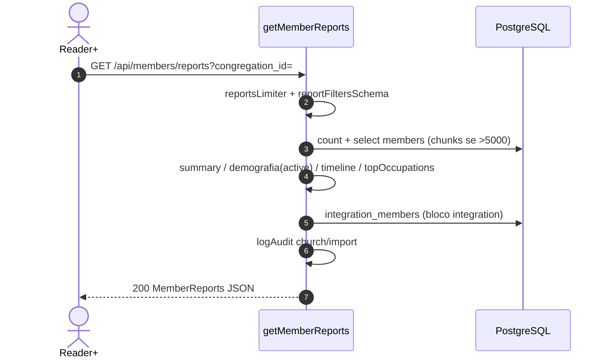
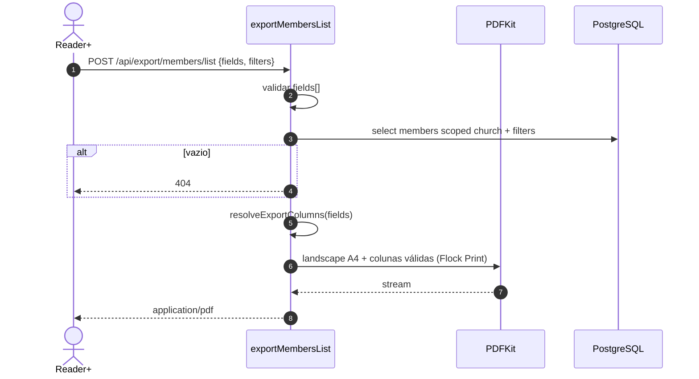
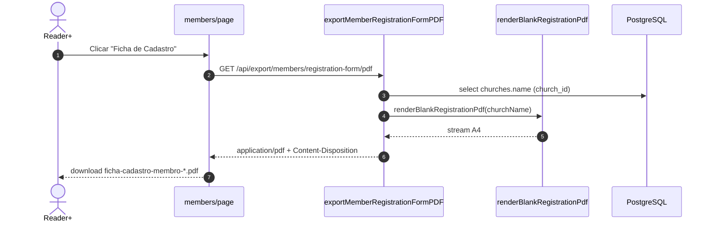
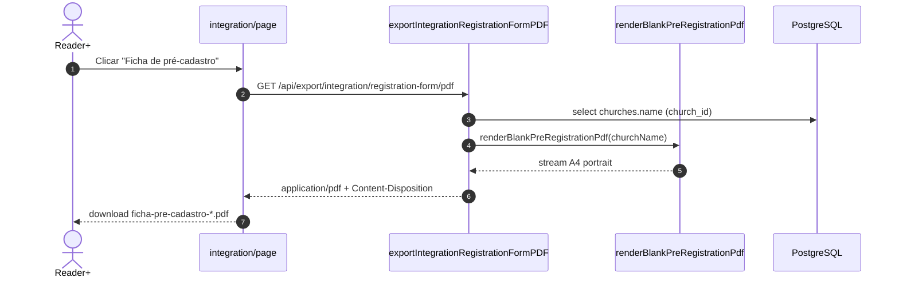
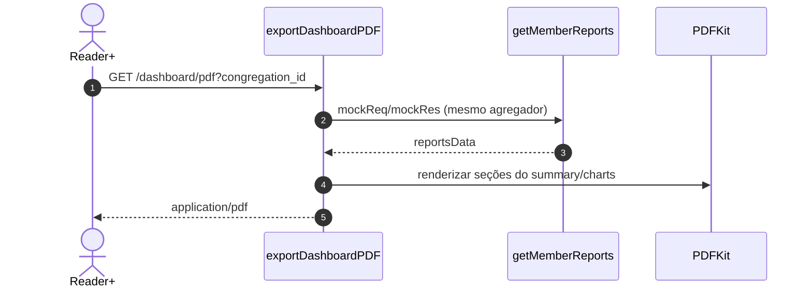
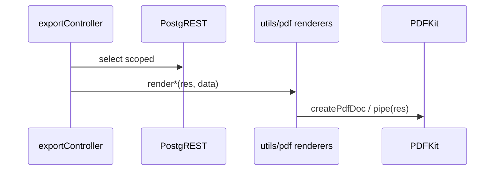
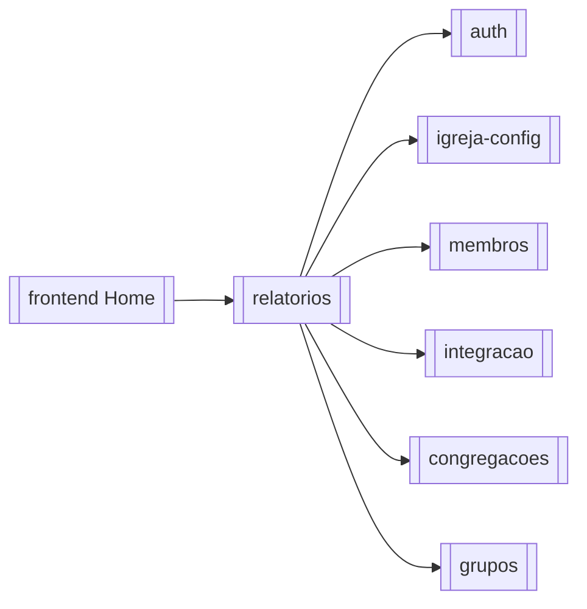

# Módulo — Relatórios

> Painel demográfico/operacional (`GET /api/members/reports`), aniversariantes e exportações PDF/CSV (`/api/export/*`) sobre membros, integração, grupos e congregações.  
> **Não possui tabelas próprias** — é camada de leitura/agregação + geração de arquivos.  
> Regras: [[02_regras-de-negocio/regras-por-modulo/relatorios]] · Índice: [[04_modulos/index]] · Export calendário mensal: [[04_modulos/calendario]].

---

## 1. 📌 Visão Geral

Oferece visão executiva da igreja (totais, demografia, estrutura, timeline, integração) e exportações sob demanda (ficha/lista PDF, CSV, dashboard PDF).

Resolve a necessidade de indicadores e extratos imprimíveis/compartilháveis sem planilhas manuais.

No sistema é **consumidor read-only** dos módulos de domínio; a Home do frontend (`app/(main)/page.tsx`) é a UI principal do painel.  
Produto: [[01_produto/visao-do-produto]].

**Responsividade (mobile/tablet):** hub com `ViewSelector` e CTAs Atualizar / Exportar PDF tocáveis (`min-h-11`; label curta “PDF” no mobile). Seções (SummaryCards, Timeline, Demographics, Groups, ChurchStructure, Geography, Occupations) empilham em viewport estreita. Drill-downs usam modais custom em sheet/`dvh` no mobile:

- **`MembersModal` (sideLayout — demografia):** em `<md`, categorias como chips horizontais scrolláveis; em `md+`, sidebar `w-80` (layout desktop).
- **`MemberModalWithSelect` (geografia / ocupações):** filtros stack + lista scrollável; CTAs Exportar/Fechar tocáveis.
- **`ReportsFilters`:** componente existe mas **não está montado** na Home — não documentar como ação de tela.

Desktop (`md+`/`sm` conforme componente) permanece equivalente. Sem rota pública neste módulo.

---

## 2. ⚖️ Bounded Context

### ✅ Este módulo É responsável por:

- Agregar indicadores de membros + integração (`getMemberReports`)
- Endpoints de aniversariantes (count/list) no escopo de reports de UX
- Rate limit específico em `GET /members/reports` (10/IP/min)
- Export PDF: ficha membro (preenchida), **ficha de cadastro em branco** (membro), **ficha de pré-cadastro em branco** (integrante), ficha integração preenchida, dashboard, listas (membros / integração / grupo / grupos / congregações / **membros da congregação**)
- Export CSV de lista de membros (único CSV do produto; campos selecionáveis alinhados ao cadastro operacional)
- Escopo sempre `church_id` do contexto autenticado
- Validação Joi de filtros de relatório (`reportFiltersSchema`)

### ❌ Este módulo NÃO é responsável por:

- CRUD de membros/grupos/congregações/integração
- Persistência de “relatórios salvos” ou histórico de exports
- PDF mensal do calendário (`GET /api/calendar/export/pdf` → [[04_modulos/calendario]])
- Import CSV (→ [[04_modulos/membros]])
- Jobs assíncronos / filas de geração
- Materialized views / BI externo

---

## 3. 📁 Estrutura de Arquivos

```
backend/src/
├── routes/
│   ├── export.ts                 → 12 rotas /api/export/*
│   └── members.ts                → /reports + /birthdays/* (também CRUD membros)
├── controllers/
│   ├── exportController.ts       → fetch/validate + orquestra renderers
│   └── memberController.ts       → getMemberReports, getBirthdaysCount/List
├── validators/
│   ├── reportValidator.ts        → reportFiltersSchema (Joi)
│   └── congregationValidator.ts  → schema do POST /export/congregation/members/list (módulo congregações)
└── utils/
    ├── ageCalculator.ts          → idade nos aggregados
    └── pdf/                      → kit **Flock Print** (PDFKit)
        ├── tokens.ts / document.ts / sections.ts / table.ts / formFields.ts
        ├── listFields.ts         → colunas, labels PDF/CSV (`memberCsvFieldLabels`), resolveExportColumns
        ├── integrationLabels.ts
        ├── render*.ts            → ficha, lista, dashboard, blank (membro + pré-cadastro), calendário (usado pelo módulo calendário)
        └── __tests__/listFields.test.ts, renderBlankPreRegistration.test.ts

frontend/src/
├── app/page.tsx                  → Home = painel Vision UI
├── components/reports/           → cards, charts, filters, skeleton
├── types/reports.ts              → MemberReports*
└── components/*/Export*Modal.tsx → dispara /api/export
    members/ExportMemberFieldsModal.tsx → picker compartilhado (grupo + congregação)

App mounts:
  app.use('/api/export', exportRoutes)
  app.use('/api/members', memberRoutes)  // reports/birthdays aqui

Testes: unitários leves em `utils/pdf/__tests__/listFields.test.ts` (Jest; inclui labels CSV e flags de família), `renderBlankPreRegistration.test.ts` (título/filename/A4) e `validators/__tests__/congregationValidator.test.ts` (body do export de membros da congregação).
Migrations: N/A — sem schema próprio.
```

---

## 4. 🗄️ Entidades e Models

N/A — **este módulo não gerencia entidades persistidas**.

Consome (leitura):

| Fonte | Uso |
| --- | --- |
| `members` (+ `congregations`) | Aggregados, aniversários, listas PDF/CSV, ficha PDF preenchida |
| `churches` | Cabeçalho PDF (nome) + ficha em branco |
| `integration_members` | Bloco `integration` no report + PDF list/ficha |
| `groups` / `member_groups` | Export lista de grupos / membros do grupo |
| `congregations` | Export lista de unidades + export membros da congregação + filtro por UUID |

### Contratos de saída (DTO em memória)

Tipos espelhados em `frontend/src/types/reports.ts`:

```typescript
// GET /api/members/reports → 200
{
  summary: {
    totalMembers: number;
    activeMembers: number;
    inactiveMembers: number;
    recentMembers: number;
    recentBaptisms: number;
    activePercentage: number;
  };
  demographics: {
    gender: Record<string, number>;
    maritalStatus: Record<string, number>;
    ageRanges: { '0-12'|...|'65+': number };
    cities: Record<string, number>;
    states: Record<string, number>;
  };
  churchStructure: { congregations: Record<string, { count; id }> };
  timeline: { baptismsByYear; admissionsByYear; baptismsByMonth; admissionsByMonth; membersByYear?; membersByMonth? };
  integration?: { totals; timeline } | null;
  integrationMeta?: { available?: boolean; error?: string };
  topOccupations: Array<{ occupation; count }>;
  filters: { congregation_id: string | null };
  generatedAt: string; // ISO
}
```

**Soft delete / auditoria de entidade:** N/A.  
`getMemberReports` registra `logAudit` com `entity: 'church'`, `action: 'import'` (rótulo impreciso — ver §14).

---

## 5. 🌐 Interface Pública

Auth: `authMiddleware` + `requireRole('reader')` em todas as rotas deste módulo.  
**Sem** mutações de domínio; exports são POST que **geram arquivo**, não alteram dados (exceto audit log).

### Agregados e aniversários — `/api/members`

| Método | Rota | Auth | Role | Descrição |
| --- | --- | --- | --- | --- |
| GET | `/api/members/reports` | ✅ | ≥ reader | Painel agregado (+ RL 10/min) |
| GET | `/api/members/birthdays/count` | ✅ | ≥ reader | Contagem aniversariantes |
| GET | `/api/members/birthdays/list` | ✅ | ≥ reader | Lista aniversariantes |

### Exportações — `/api/export`

| Método | Rota | Auth | Role | Descrição |
| --- | --- | --- | --- | --- |
| GET | `/api/export/members/registration-form/pdf` | ✅ | ≥ reader | Ficha de cadastro **em branco** (A4, form v2) |
| GET | `/api/export/member/:id/pdf` | ✅ | ≥ reader | Ficha PDF membro **preenchida** |
| GET | `/api/export/integration/registration-form/pdf` | ✅ | ≥ reader | Ficha de pré-cadastro **em branco** (A4) |
| GET | `/api/export/integration/:id/pdf` | ✅ | ≥ reader | Ficha PDF integração **preenchida** |
| GET | `/api/export/dashboard/pdf` | ✅ | ≥ reader | Dashboard PDF (reusa getMemberReports) |
| POST | `/api/export/members/list` | ✅ | ≥ reader | Lista membros PDF |
| POST | `/api/export/members/list/csv` | ✅ | ≥ reader | Lista membros CSV |
| POST | `/api/export/integration/list` | ✅ | ≥ reader | Lista integração PDF |
| POST | `/api/export/group/members/list` | ✅ | ≥ reader | Membros de um grupo PDF |
| POST | `/api/export/groups/list` | ✅ | ≥ reader | Lista grupos PDF (`filters.types[]` obrigatório) |
| POST | `/api/export/congregations/list` | ✅ | ≥ reader | Lista congregações PDF |
| POST | `/api/export/congregation/members/list` | ✅ | ≥ reader | Membros ativos de uma congregação PDF |

**Total:** **15** endpoints (3 reports + 12 export).

### Contrato — `GET /api/export/members/registration-form/pdf`

```typescript
// Sem query/body — gera template em branco da igreja autenticada.
// Response: application/pdf
// Content-Disposition: attachment; filename="ficha-cadastro-membro-{slug-igreja}-{YYYY-MM-DD}.pdf"
// 401 — não autenticado
// 404 — igreja não encontrada
// 500 — erro na geração PDF
```

Template alinhado ao formulário de membros v2: Informações Básicas, Família (até 3 filhos + nota para folha adicional), Contato e Endereço, Informações Eclesiásticas, Informações de Recebimento. Campos com linhas/checkboxes para preenchimento manuscrito; cabeçalho com nome da igreja. **Não** pré-preenche dados de membro existente (MVP). Sem questionário eclesiástico (esse bloco vive no integrante — BR-REL-013).

### Contrato — `GET /api/export/integration/registration-form/pdf`

```typescript
// Sem query/body — gera template em branco da igreja autenticada.
// Path estático **antes** de GET /integration/:id/pdf (senão `registration-form` vira :id).
// Response: application/pdf
// Content-Disposition: attachment; filename="ficha-pre-cadastro-{slug-igreja}-{YYYY-MM-DD}.pdf"
// Título visível no PDF: "Ficha de pré-cadastro"
// 401 — não autenticado
// 404 — igreja não encontrada
// 500 — erro na geração PDF
```

Template alinhado ao formulário de integrante: data do preenchimento, Informações pessoais, Informações eclesiásticas (tipo de recebimento previsto, congregação prevista, questionário completo no papel). **Não** inclui Acompanhamento (mentor/status/observações) nem campos de membro (família, endereço, e-mail). **Não** pré-preenche dados de integrante existente (BR-REL-013).

### Rate limit — `GET /reports`

```typescript
// express-rate-limit
windowMs: 60_000
max: 10 // por IP
// 429: { error: 'Muitas requisições de relatórios', details: '...' }
```

### Contrato — `GET /api/members/reports`

```typescript
// Query (reportFiltersSchema) — aceitos pelo Joi:
{
  congregation_id?: string | ''; // UUID; 'sede' rejeitado
  gender?: 'Masculino'|'Feminino'|'Outro'|'Não informado';
  marital_status?: 'Solteiro(a)'|...; // ⚠ divergente do enum de members (ver §14)
  nationality?, occupation?, city?, state?;
  birth_date_from/to?, baptism_date_from/to?, admission_date_from/to?; // YYYY-MM-DD
  age_from?, age_to?; // 0–150
  search?: string;
}

// ⚠ IMPLEMENTAÇÃO ATUAL: na query SQL só aplica congregation_id (UUID).
// Demais filtros são validados/stripped mas NÃO filtrados no getMemberReports.

// Response 200: MemberReports (ver §4)
// 400 — Filtros inválidos
// 429 — rate limit
// 500 — erro de query/agregação
```

### Aniversários

```typescript
// GET /birthdays/count|list?month=1-12&year=&congregation_id=uuid
// members: active=true AND birth IS NOT NULL
```

### Contrato — `POST /api/export/members/list` (e CSV análogo)

```typescript
// Request:
{
  fields: string[];           // obrigatório, não vazio
  filters?: {
    search?, status?: 'all'|'active'|'inactive',
    congregation_id?: uuid,
    gender?, marital_status?, nationality?, state?, city?, neighborhood?, occupation?,
    age_from?, age_to?, birth_date_from/to?, baptism_date_from/to?, ...
  };
  // CSV only:
  delimiter?: string;         // default ','
  includeHeaders?: boolean;   // default true
}

// Response: application/pdf | text/csv; charset=utf-8 (BOM UTF-8 no CSV)
// 400 — fields vazio OU só campos deprecated (baptism_date / document) após filtro
// 404 — Nenhum membro encontrado (lista vazia após filtro)
```

CSV de lista de membros (`POST /api/export/members/list/csv`):

- Catálogo e labels reimportáveis: `memberCsvFieldLabels` / `memberCsvFieldValue` (`listFields.ts`); UI em `MEMBER_EXPORT_FIELD_OPTIONS`.
- Inclui flags de família (`spouse_is_member`, `father_is_member`, `mother_is_member`). Sem questionário eclesiástico.
- UI **não** oferece `nationality`, `document` nem `baptism_date`. `resolveExportColumns` ignora `baptism_date`/`document` (BR-REL-007).
- Idade / Status / Congregação podem sair no arquivo; o import os ignora (BR-MEM-018).
- Grupos, integração, congregações e calendário exportam **só PDF**.

### Dashboard PDF

```typescript
// GET /api/export/dashboard/pdf?congregation_id=uuid
// Internamente: mock res + await getMemberReports(...) → PDFKit
```

### Grupo / grupos / congregações

```typescript
// POST /group/members/list { groupId, fields: string[] }
// POST /groups/list {
//   filters: {
//     types: GroupType[];           // obrigatório, min 1 (BR-REL-010)
//     congregation_id?: string;
//     status?: 'active'|'inactive'|'all';
//     search?: string;
//   }
// }  // campos PDF fixos: name, congregation, responsible_name, member_count
// POST /congregations/list { } // lista do tenant (hub /congregations)
// POST /congregation/members/list { congregationId: uuid, fields: string[] }
//   — só active=true; busca do modal não entra (BR-REL-012)
//   — 404 congregação inexistente ≠ 404 sem membros ativos
//   — filename: congregacao-{slug}-membros-{YYYY-MM-DD}.pdf
//   — título: "Lista de membros da congregação"; nome completo (BR-CON-014)
```

UI: modal `ExportGroupsTypesModal` na tela `/groups` — multi-seleção de tipos antes do PDF (pré-seleciona o tipo do filtro da listagem, se houver).  
UI congregação: `CongregationModal` → **Exportar lista** → `ExportCongregationMembersModal` (picker `ExportMemberFieldsModal`, compartilhado com o grupo). Hub permanece **Exportar PDF** da lista de unidades.

---

## 6. ⚙️ Regras de Negócio

Detalhe: [[02_regras-de-negocio/regras-por-modulo/relatorios]] (**13** regras).

| ID | Declaração curta |
| --- | --- |
| BR-REL-001 | Reports, birthdays e exports exigem reader+ |
| BR-REL-002 | `GET /members/reports` ≤ 10 req/IP/min → 429 |
| BR-REL-003 | Demografia usa `active=true`; summary inclui inativos |
| BR-REL-004 | Birthdays: ativos, birth não nulo; mês 1–12; filtro cong UUID |
| BR-REL-005 | Filtros de report passam `reportFiltersSchema` |
| BR-REL-006 | Exports scoped ao `church_id` do contexto |
| BR-REL-007 | PDF/CSV de lista exige `fields[]` com ≥1 campo **válido** (deprecated ignorados) |
| BR-REL-008 | Lista vazia no filtro → **404** (inclui grupo/congregação sem membros) |
| BR-REL-009 | Home: `all` \| `congregation`; 1 cong. → texto; sem Estrutura no filtro |
| BR-REL-010 | Export grupos exige `filters.types[]` (min 1, GroupType) |
| BR-REL-011 | PDFs do tenant usam kit Flock Print (header/footer/orientação) |
| BR-REL-012 | Export de membros da congregação: endpoint dedicado, só ativos, nome completo |
| BR-REL-013 | Ficha de pré-cadastro em branco: template da igreja, sem dados de integrante |

---

## 7. 🔄 Fluxos do Módulo

### Fluxo: Gerar painel de relatórios


```mermaid
sequenceDiagram
  autonumber
  actor U as Reader+
  participant API as getMemberReports
  participant DB as PostgreSQL

  U->>API: GET /api/members/reports?congregation_id=
  API->>API: reportsLimiter + reportFiltersSchema
  API->>DB: count + select members (chunks se >5000)
  API->>API: summary / demografia(active) / timeline / topOccupations
  API->>DB: integration_members (bloco integration)
  API->>API: logAudit church/import
  API-->>U: 200 MemberReports JSON
```

### Fluxo: Export lista de membros PDF


```mermaid
sequenceDiagram
  autonumber
  actor U as Reader+
  participant API as exportMembersList
  participant PDF as PDFKit
  participant DB as PostgreSQL

  U->>API: POST /api/export/members/list {fields, filters}
  API->>API: validar fields[]
  API->>DB: select members scoped church + filters
  alt vazio
    API-->>U: 404
  end
  API->>API: resolveExportColumns(fields)
  API->>PDF: landscape A4 + colunas válidas (Flock Print)
  PDF-->>API: stream
  API-->>U: application/pdf
```

### Fluxo: Ficha de cadastro em branco (PDF)


```mermaid
sequenceDiagram
  autonumber
  actor U as Reader+
  participant UI as members/page
  participant API as exportMemberRegistrationFormPDF
  participant PDF as renderBlankRegistrationPdf
  participant DB as PostgreSQL

  U->>UI: Clicar "Ficha de Cadastro"
  UI->>API: GET /api/export/members/registration-form/pdf
  API->>DB: select churches.name (church_id)
  API->>PDF: renderBlankRegistrationPdf(churchName)
  PDF-->>API: stream A4
  API-->>UI: application/pdf + Content-Disposition
  UI-->>U: download ficha-cadastro-membro-*.pdf
```

### Fluxo: Ficha de pré-cadastro em branco (PDF)


```mermaid
sequenceDiagram
  autonumber
  actor U as Reader+
  participant UI as integration/page
  participant API as exportIntegrationRegistrationFormPDF
  participant PDF as renderBlankPreRegistrationPdf
  participant DB as PostgreSQL

  U->>UI: Clicar "Ficha de pré-cadastro"
  UI->>API: GET /api/export/integration/registration-form/pdf
  API->>DB: select churches.name (church_id)
  API->>PDF: renderBlankPreRegistrationPdf(churchName)
  PDF-->>API: stream A4 portrait
  API-->>UI: application/pdf + Content-Disposition
  UI-->>U: download ficha-pre-cadastro-*.pdf
```

### Fluxo: Dashboard PDF


```mermaid
sequenceDiagram
  autonumber
  actor U as Reader+
  participant EXP as exportDashboardPDF
  participant RPT as getMemberReports
  participant PDF as PDFKit

  U->>EXP: GET /dashboard/pdf?congregation_id
  EXP->>RPT: mockReq/mockRes (mesmo agregador)
  RPT-->>EXP: reportsData
  EXP->>PDF: renderizar seções do summary/charts
  EXP-->>U: application/pdf
```

### Estados

N/A — sem entidade com máquina de estados. Outputs são transientes (JSON/arquivo HTTP).

---

## 8. 🔗 Integrações

Sem Stripe/Resend/S3. Persistência + PDF local.

### Supabase PostgreSQL

- Propósito: leitura massiva para aggregados e listas  
- Falha: 500 / 404 conforme handler  
- Config: `SUPABASE_*` (service_role)

### PDFKit (in-process) — kit Flock Print

- Propósito: todos os PDFs de `/api/export/*` via `backend/src/utils/pdf/`  
- Tokens + header/footer com `bufferPages` + page numbers; listas densas em **landscape**  
- Stream direto no `res` (`Content-Type: application/pdf`)  
- Sem env próprio; sem dependência tipo `pdfkit-table`  
- CSV: string montada no controller via `memberCsvFieldValue` (+ BOM UTF-8)


```mermaid
sequenceDiagram
  participant CTL as exportController
  participant DB as PostgREST
  participant KIT as utils/pdf renderers
  participant PDF as PDFKit
  CTL->>DB: select scoped
  CTL->>KIT: render*(res, data)
  KIT->>PDF: createPdfDoc / pipe(res)
```

---

## 9. ⚙️ Operações em Background

N/A — este módulo não possui operações assíncronas. Tudo é **request-response síncrono** (incluindo PDFs grandes e reports chunked).

---

## 10. 🚨 Tratamento de Erros

| Situação | HTTP | `error` típico | Quando |
| --- | --- | --- | --- |
| Não autenticado | 401 | `Não autorizado` | handlers |
| Role | 403 | requireRole | < reader |
| Filtros report | 400 | `Filtros inválidos` | Joi |
| Rate limit reports | 429 | `Muitas requisições de relatórios` | >10/min |
| Mês birthday | 400 | `Parâmetro inválido` | month fora 1–12 |
| fields vazio / só deprecated | 400 | `Campos inválidos` / `Dados inválidos` | list exports |
| Lista vazia | 404 | Nenhum membro / recurso | export lists |
| Grupo sem membros | 404 | `Este grupo não possui membros` | group members PDF |
| Membro/grupo não achado | 404 | PDF ficha / group export | scoped miss |
| Aggregação/export fail | 500 | operacional | catch / DB |

Sem enum de código interno — `{ error, details }`.

---

## 11. 🔐 Segurança e Autorização

| Controle | Detalhe |
| --- | --- |
| Auth | JWT + church context |
| Role mínimo | **reader+** (inclui exports de PII) |
| Rate limit | só `GET /reports` (export **sem** limit dedicado) |
| Tenant | sempre `eq('church_id', churchId)` |
| Dados | PDFs/CSV incluem endereço, contatos, filhos e flags de família — **PII**. CSV de lista **não** serializa `document` nem `baptism_date` |

Não há watermark de acesso nem restrição por papel “admin only” nos exports.

---

## 12. 🧪 Testes

| Tipo | Arquivo | Cobertura | O que testa |
| --- | --- | --- | --- |
| Unit | `utils/pdf/__tests__/listFields.test.ts` | parcial | `columnsFromFields`, deprecated, `resolveExportColumns`, labels CSV, flags de família |
| Unit | `validators/__tests__/congregationValidator.test.ts` | parcial | Body `{ congregationId, fields }` do export de membros da congregação |

**Gaps:** rate limit 429; demografia só ativos; gap filtros Joi vs query; 404 lista vazia; CSV BOM/delimiter; dashboard mockRes; idade/timezone; isolamento tenant; perf >5000 membros; snapshots PDF.

---

## 13. 🔗 Dependências

**Consome:**

- [[04_modulos/auth]] — sessão/RBAC  
- [[04_modulos/igreja-config]] — nome igreja nos PDFs  
- [[04_modulos/membros]] — fonte principal + handlers reports/birthdays no mesmo controller  
- [[04_modulos/integracao]] — bloco integration + PDF  
- [[04_modulos/congregacoes]] — estrutura, export lista de unidades e export de membros da congregação  

- [[04_modulos/grupos]] — export grupos/membros do grupo  

**Dependem deste:**

- Frontend Home (`page.tsx`) e modais de export  
- (Indireto) docs/produto Vision UI  


```mermaid
graph LR
  REL[[relatorios]]
  REL --> AUTH[[auth]]
  REL --> CFG[[igreja-config]]
  REL --> MEM[[membros]]
  REL --> INT[[integracao]]
  REL --> CON[[congregacoes]]
  REL --> GRP[[grupos]]
  UI[[frontend Home]] --> REL
```

**Relacionado, fora deste bounded context:** PDF calendário → [[04_modulos/calendario]].

---

## 14. ⚠️ Pontos de Atenção

1. **Filtros mortos no report:** Joi aceita gender/idade/datas/search, mas `getMemberReports` só aplica `congregation_id`. Front pode achar que filtra.  
2. **Enums desalinhados:** `reportFiltersSchema` usa `Solteiro(a)` / gender `Outro`; members tipicamente `Solteiro` / sem `Outro` — impacto se os filtros forem ligados um dia.  
3. **CPU/memória:** carrega membros (chunks de 1000 se >5000) e agrega em Node; PDFs síncronos sem fila — risco de timeout em tenants grandes.  
4. **Exports sem rate limit** — flood de PDF/CSV possível (só reports tem RL).  
5. **404 em lista vazia** — UX confunde com “recurso inexistente”; é regra BR-REL-008.  
6. **Audit log de reports:** removido (DEV-16). Geração de relatório **não** grava em `audit_logs`. Import/export de lista de membros usam log genérico separado.  
7. **`exportDashboardPDF` acopla** a `getMemberReports` via mock Response — frágil a mudanças de assinatura.  
8. Handler de reports/birthdays vive em `memberController` / rota `members` — ao alterar membros, não quebrar contrato do painel.  
9. **Não logar PII** (`filters`/`fields`/search) em exports — preferir metadados agregados ou silêncio.  
10. **Modais de drill-down** são custom (não usam `Modal` base compartilhado); no mobile usam sheet/`dvh` próprio.  
11. **`ReportsFilters`** não montado na Home — não reativar sem Issue de produto.  
12. Contagem de membros em export de grupos/dashboard: preferir **uma** query `.in('group_id')` (evitar N+1).

---

## 15. 📝 Histórico de Mudanças

| Data | Versão | Descrição | Issue |
| --- | --- | --- | --- |
| 2026-08-31 | 1.8 | Ficha em branco e ficha de membro sem questionário; ficha de integrante inclui o bloco | DEV-91 |
| 2026-08-25 | 1.7 | POST `/export/congregation/members/list` + BR-REL-012 (rol ativo no modal) | DEV-47 |
| 2026-08-25 | 1.6 | CSV de membros: catálogo operacional, flags de família, BR-REL-007 no CSV; grupos só PDF | DEV-49 |
| 2026-08-20 | 1.5 | Kit Flock Print (`utils/pdf`), BR-REL-011, fields deprecated → 400, testes listFields | DEV-25 |
| 2026-07-31 | 1.4 | UX mobile/tablet: hub CTAs/ViewSelector touch, sideLayout chips, drill-down sheet/dvh | DEV-33 |
| 2026-07-14 | 1.0 | Documentação inicial do módulo relatórios | — |
| 2026-07-15 | 1.1 | Endpoint ficha de cadastro em branco (`GET /export/members/registration-form/pdf`) | DEV-10 |
| 2026-07-20 | 1.2 | Removido audit log indevido na geração de relatório | DEV-16 |
| 2026-07-21 | 1.3 | Painel: UI single-congregation + ocultar Estrutura da Igreja no filtro (BR-REL-009) | DEV-21 |

---

## Confirmação

| Item | Valor |
| --- | --- |
| Módulo documentado | **relatorios** ✅ |
| Endpoints | **15** (3 agregados/aniversários + 12 export) |
| Regras BR-REL | **13** |
| Entidades próprias | **0** (read-only) |
| Integrações | Supabase + PDFKit (Flock Print) |
| Jobs | Nenhum |
| Testes | Unitários leves (`listFields`, labels CSV, validator do export de congregação, renderer da ficha de pré-cadastro) |
