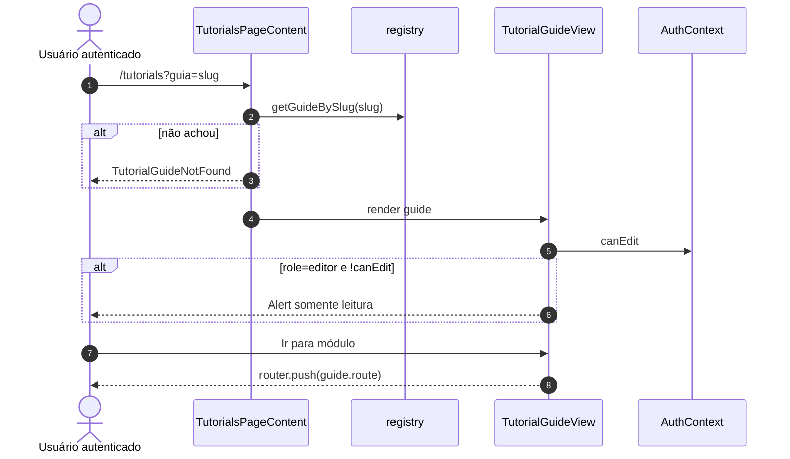
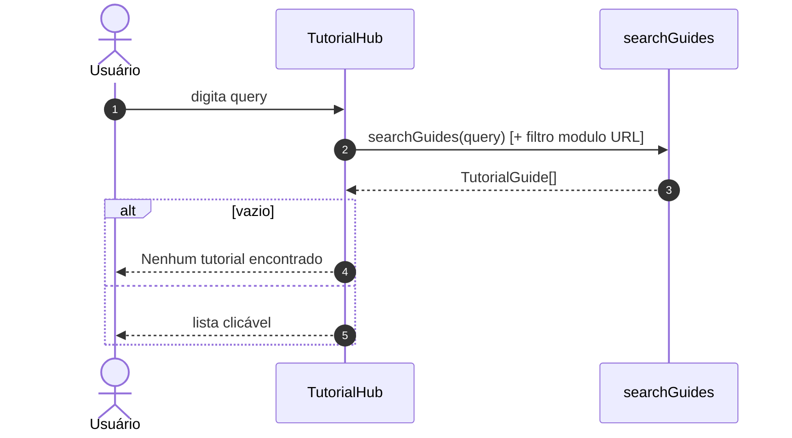
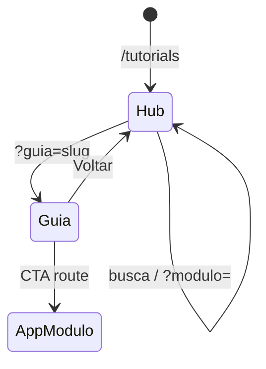
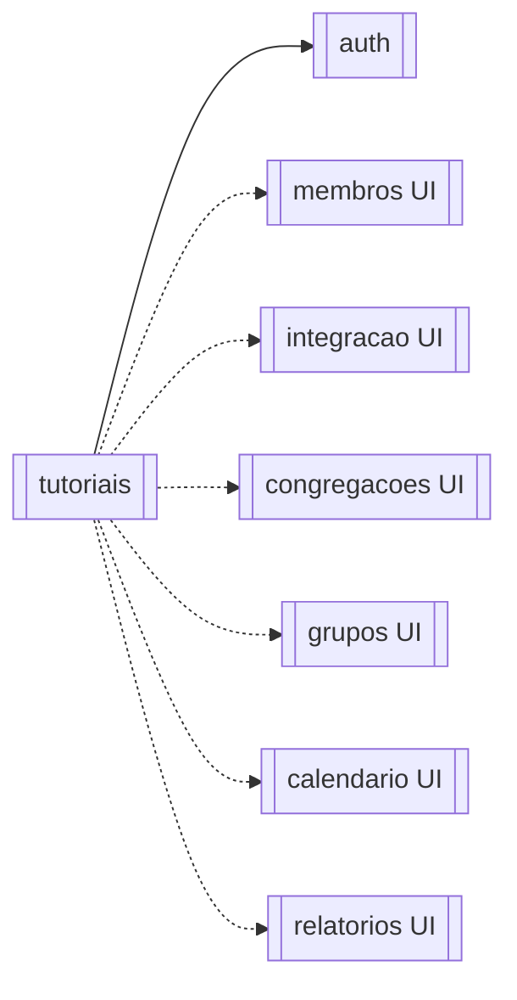

# Módulo — Tutoriais

> Hub in-app de guias estáticos no **frontend** (`/tutorials`): conteúdo tipado por módulo/papel, trilha “Primeiros passos”, busca local e deep-link por querystring.  
> **Sem API backend, sem tabelas, sem jobs.**  
> Regras: [[02_regras-de-negocio/regras-por-modulo/tutoriais]] · Índice: [[04_modulos/index]].

---

## 1. 📌 Visão Geral

Orienta usuários autenticados a operar o Flock (painel, membros, integração, congregações, grupos, calendário) com passos curtos e CTA “Ir para [módulo]”.

Resolve onboarding de produto sem LMS externo nem conteúdo no CMS.

É camada de **ajuda UX** acoplada às rotas do app; não altera dados de domínio.  
Produto: [[01_produto/visao-do-produto]].

---

## 2. ⚖️ Bounded Context

### ✅ Este módulo É responsável por:

- Página `/tutorials` (hub + detalhe via `?guia=` / filtro `?modulo=`)
- Registry estático de guias (`TutorialGuide`) e módulos (`TUTORIAL_MODULES`)
- Trilha ordenada (`trailOrder`) com prev/next
- Busca client-side (normalização NFD, título/tags/steps/details)
- Badge de audiência `reader` \| `editor`
- Aviso UX quando guia exige editor e `canEdit === false` (não bloqueia leitura)
- Links relacionados entre guias
- Entrada no Sidebar (“Tutoriais”)

### ❌ Este módulo NÃO é responsável por:

- Persistência de progresso/conclusão
- CMS / edição de conteúdo no runtime
- API REST / GraphQL de tutoriais
- Restringir hub por role (todos veem todos os guias)
- Autoria de regras dos módulos documentados (só descreve UX)
- Tours overlay (tooltip walkthrough) — são páginas de guia, não product-tour engine

---

## 3. 📁 Estrutura de Arquivos

```
frontend/src/
├── app/(main)/tutorials/page.tsx          → Rota Next (Suspense + header)
├── components/tutorials/
│   ├── TutorialsPageContent.tsx           → Hub vs guia (searchParams)
│   ├── TutorialHub.tsx                    → Lista + busca + trail banner
│   ├── TutorialGuideView.tsx              → Detalhe + warning reader
│   ├── TutorialSearch.tsx
│   ├── TrailBanner.tsx / ModuleCard.tsx
│   ├── GuideStepList / GuideDetailsAccordion
│   ├── RelatedGuides / RoleBadge
├── lib/tutorials/
│   ├── types.ts                           → TutorialGuide, ModuleId, Role
│   ├── modules.ts                         → TUTORIAL_MODULES + labels
│   ├── registry.ts                        → getters trail/module/related
│   ├── searchGuides.ts                    → search + filterHubGuides
│   └── guides/
│       ├── index.ts                       → ALL_TUTORIAL_GUIDES
│       ├── primeiros-passos.ts            → trailOrder 1..6
│       ├── relatorios.ts / membros.ts / integracao.ts
│       ├── congregacoes.ts / grupos.ts / calendario.ts
└── components/main/Sidebar.tsx            → link /tutorials

backend/: N/A — zero arquivos.
Testes: inexistentes.
Migrations: N/A.
```

---

## 4. 🗄️ Entidades e Models

N/A — **sem entidades de banco**.

Modelo de domínio **em memória / código** (TypeScript):

### TutorialGuide (conteúdo)

| Campo | Tipo | Nullable | Default | Descrição |
| --- | --- | --- | --- | --- |
| slug | string | NOT NULL | — | ID unique lógico (query `guia`) |
| title | string | NOT NULL | — | Título |
| module | TutorialModuleId | NOT NULL | — | relatorios…calendario |
| role | reader \| editor | NOT NULL | — | Audiência sugerida |
| route | string | NOT NULL | — | Rota app no CTA |
| estimatedMinutes | number | NOT NULL | — | Tempo estimado |
| tags | string[] | NOT NULL | — | Busca |
| steps | string[] | NOT NULL | — | Passos principais |
| details | string[] | opcional | — | Accordion extra |
| related | string[] | NOT NULL | — | Slugs relacionados |
| trailOrder | number | opcional | — | Se set → entra na trilha |

### TutorialModule

| Campo | Tipo | Descrição |
| --- | --- | --- |
| id | TutorialModuleId | Chave |
| label | string | Label hub |
| route | string | Rota do módulo no app |

**TutorialModuleId:** `relatorios` \| `membros` \| `integracao` \| `congregacoes` \| `grupos` \| `calendario`.

**Inventory atual (~28 guias):**

| Fonte | Slugs (aprox.) |
| --- | --- |
| primeiros-passos | pp-01…pp-06 (trail) |
| relatorios | filtrar, exportar, interpretar |
| membros | cadastrar, editar, desativar, filtrar, importar, exportar |
| integracao | cadastrar, converter, filtrar, descartar |
| congregacoes | cadastrar, editar, exportar |
| grupos | cadastrar, membros, filtrar |
| calendario | criar, filtrar, aniversariantes |

**Soft delete / auditoria:** N/A.

```typescript
// types.ts (conceitual)
type TutorialGuide = {
  slug: string;
  title: string;
  module: TutorialModuleId;
  role: 'reader' | 'editor';
  route: string;
  estimatedMinutes: number;
  tags: string[];
  steps: string[];
  details?: string[];
  related: string[];
  trailOrder?: number;
};
```

---

## 5. 🌐 Interface Pública

### Backend REST

N/A — **este módulo não possui endpoints HTTP** (BR-TUT-004).

### Frontend (única “API” de produto)

| Método | Rota | Auth | Role | Descrição |
| --- | --- | --- | --- | --- |
| GET (page) | `/tutorials` | ✅ (shell `(main)`) | qualquer autenticado | Hub |
| GET (page) | `/tutorials?guia={slug}` | ✅ | qualquer | Detalhe do guia |
| GET (page) | `/tutorials?modulo={id}` | ✅ | qualquer | Hub filtrado / expandido |

**Total:** **~1** superfície de produto (página + query variants). Catálogo: ≈1.

### Contrato de navegação (query)

```typescript
// Hub
/tutorials
/tutorials?modulo=membros          // modulo ∈ TutorialModuleId

// Detalhe
/tutorials?guia=pp-01-conhecer-painel
/tutorials?guia=membros-importar

// slug inválido → TutorialGuideNotFound (UI, não 404 HTTP Next dedicado)
```

### API interna (lib — para agentes)

```typescript
getGuideBySlug(slug)
getTrailGuides()
getGuidesByModule(id)        // exclui trail (trailOrder != null)
getAllGuidesForModule(id)
getAdjacentTrailGuide(g, 'prev'|'next')
getRelatedGuides(guide)
searchGuides(query)
filterHubGuides(query, module?)
```

---

## 6. ⚙️ Regras de Negócio

Detalhe: [[02_regras-de-negocio/regras-por-modulo/tutoriais]] (**4** regras).

| ID | Declaração curta |
| --- | --- |
| BR-TUT-001 | Guias declaram `role` reader\|editor (metadado) |
| BR-TUT-002 | Hub **não** filtra por role do usuário |
| BR-TUT-003 | Guia editor + `canEdit=false` → aviso, sem bloquear |
| BR-TUT-004 | Conteúdo estático front — sem persistência |

`canEdit` vem do AuthContext: `currentRole !== 'reader'` (owner/admin/editor = true).

---

## 7. 🔄 Fluxos do Módulo

### Fluxo: Abrir guia



### Fluxo: Busca no hub



### Estados

N/A — sem progresso persistido. UI local: hub ↔ detalhe; expand de ModuleCard; query de busca em state React.



---

## 8. 🔗 Integrações

Este módulo não possui integrações externas diretas.

Conteúdo e busca são 100% client-side. Auth/session indiretos via [[04_modulos/auth]] / shell `(main)`.

---

## 9. ⚙️ Operações em Background

N/A — este módulo não possui operações assíncronas.

---

## 10. 🚨 Tratamento de Erros

| Situação | HTTP / UI | Quando |
| --- | --- | --- |
| Sem sessão | redirect login (layout main) | acesso `/tutorials` |
| Slug inexistente | UI “Tutorial não encontrado” | `?guia=` inválido |
| `modulo` inválido | trata como null | parse VALID_MODULES |
| Módulo tutorial id desconhecido em `getModuleById` | throw Error | bug de conteúdo |

Sem códigos internos de API.

---

## 11. 🔐 Segurança e Autorização

| Controle | Detalhe |
| --- | --- |
| Auth | Página sob `(main)` — exige login |
| RBAC hub | **sem** filtro — reader vê guias editor |
| RBAC conteúdo | só Warning (BR-TUT-003); ações reais nas telas alvo |
| Dados sensíveis | nenhum PII — texto estático |
| XSS | conteúdo hardcoded TS (confiança no deploy) |

Não há sanitização especial além do React escaping padrão.

---

## 12. 🧪 Testes

| Tipo | Arquivo | Cobertura | O que testa |
| --- | --- | --- | --- |
| — | — | 0% | Nenhum teste dedicado |

**Gaps:** searchGuides (acentos); trail prev/next; related slugs quebrados; warning reader; parse modulo/guia.

---

## 13. 🔗 Dependências

**Consome:**

- [[04_modulos/auth]] — sessão + `canEdit`  
- Rotas UI dos módulos (apenas navegação): relatorios (home `/`), membros, integração, congregações, grupos, calendário  

**Dependem deste:**

- Nenhum módulo de domínio  
- Sidebar / UX onboarding informal  



---

## 14. ⚠️ Pontos de Atenção

1. Conteúdo versionado no git — mudar copy = deploy front.  
2. `related` / `trailOrder` quebrados só aparecem em runtime (related filtra undefined).  
3. Primeiros passos usam `module` do domínio alvo mas também `trailOrder` — `getGuidesByModule` **exclui** trail da lista modular; `getAllGuidesForModule` inclui.  
4. Sem analytics de conclusão — não sabem se usuário completou.  
5. Documentação de módulos em `docs/04_modulos/*` pode divergir dos textos dos guides — sync manual.  
6. `filterHubGuides` existe na lib mas o Hub implementa filtro inline — possível duplicação.  
7. Não há guia para billing/config/auth/onboarding no `TutorialModuleId`.

---

## 15. 📝 Histórico de Mudanças

| Data | Versão | Descrição | Issue |
| --- | --- | --- | --- |
| 2026-07-14 | 1.0 | Documentação inicial do módulo tutoriais | — |

---

## Confirmação

| Item | Valor |
| --- | --- |
| Módulo documentado | **tutoriais** ✅ |
| Endpoints backend | **0** |
| Superfície UI | **1** (`/tutorials` + query) |
| Regras BR-TUT | **4** |
| Guias estáticos | **~28** |
| Entidades DB | **0** |
| Integrações | nenhuma |
| Jobs | nenhum |
| Testes | nenhum dedicado |
