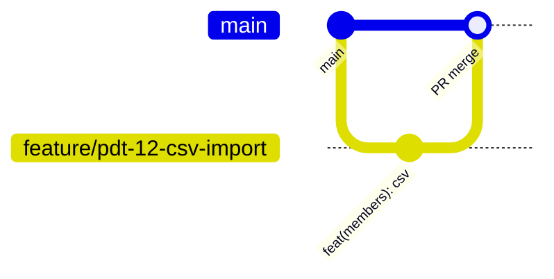

# Padrões de Git — Flock

> Convenções de branches, commits e PRs. Extraídas do histórico real (`git log`) e do skill interno `caveman-commit`.  
> **Não há** `.github/workflows`, `commitlint` nem `pull_request_template` versionados no monorepo (2026-07-14) — regras abaixo são o padrão a seguir / em adoção.

Agentes: alinhar mensagens a [[.agents/skills/caveman-commit]] (Conventional Commits, subject ≤50–72).

---

## 1. 🌿 Estratégia de Branches



Fluxo observado: branches de trabalho → merge em **`main`**. Também existem `dev/*`, `qa-*`, `refinements-*`, `docs/*`, `fix/*`, `feature/*`, `vinisouzadev/pdt-*`.

| Branch | Propósito | Merge para |
| --- | --- | --- |
| `main` | Produção / linha principal | — |
| `feature/*` ou `vinisouzadev/pdt-N-...` | Feature / ticket | `main` |
| `fix/*` | Correção | `main` |
| `dev/*` | Spike/experimento | `main` (ou descartar) |
| `docs/*` | Só documentação | `main` |
| `qa-*` / `refinements-*` | Lotes QA (legado de naming) | Preferir migrar para `fix/` ou `feature/` |

### GIT-001: Nomenclatura
- **Nível:** 🔴
- ✅ `feature/members-csv-export` · `fix/calendar-timezone` · `docs/knowledgebase`
- ❌ `asdf`, `WIP`, branch sem contexto

### GIT-002: Vida curta — merge em ≤7–10 dias quando possível
- **Nível:** 🟡

### GIT-003: Branches pessoais ok se prefixadas (`vinisouzadev/...`); preferir ticketing `pdt-N`
- **Nível:** 🟡

### GIT-004: Nunca commit direto em `main` no fluxo normal
- **Nível:** 🔴 (protege via disciplina / branch protection quando disponível)
- ✅ PR → review → merge
- ❌ `git push origin main` com feature crua

---

## 2. 💬 Conventional Commits

Formato (em adoção a partir de 2026-07; histórico mistura `feat:` sem scope e subjects vagos como `feat: qa`):

```text
<type>(<scope>): <description>

[body opcional]

[footer opcional]
```

| Type | Uso |
| --- | --- |
| feat | Funcionalidade |
| fix | Bug |
| docs | Só docs |
| style | Formatação |
| refactor | Sem feat/fix externos |
| test | Testes |
| chore | Tooling/deps |
| perf | Performance |
| ci | CI (quando existir) |
| revert | Revert |

### GIT-005: Scopes válidos (módulos)
> Preferir slugs de [[04_modulos/index]]:

`auth` · `onboarding` · `membros`/`members` · `integracao` · `congregacoes` · `grupos` · `calendario`/`calendar` · `relatorios` · `config` · `billing` · `aquisicao`/`landing` · `tutoriais` · `api` · `db`

Histórico recente usou pouco scope (`members`, `landing`, `calendar`, `dashboard`) — **passar a usar**.

### GIT-006: Description inglês imperativo, sem ponto final
- **Nível:** 🔴 (direção; histórico PT às vezes — novos commits EN)
- ✅ `fix(calendar): correct timezone on list expansion`
- ❌ `fix bug.` · `Fixed the calendar.`

### GIT-007: Subject ≤72 chars (alvo ≤50)
- **Nível:** 🔴 via caveman-commit

### GIT-008: Body só para o *porquê*
- **Nível:** 🟡

### GIT-009: Breaking → `!` no type ou footer `BREAKING CHANGE:`
- **Nível:** 🔴 quando aplicável

**✅ Exemplos bons (estilo alvo + commits reais enxutos):**

```text
feat(members): align CSV import/export with form
fix(calendar): correct timezone handling
docs(padroes): add API and DB conventions
```

**❌ Ruins (aparecem no histórico — não repetir):**

```text
feat: qa
fix: refinements
feat: general improvements
WIP
```

---

## 3. 🔃 Pull Requests

### GIT-010: Preferir PRs < ~400 linhas líquidas quando possível
> Controllers monolíticos forçam PRs maiores — fatiar por concern.
- **Nível:** 🟡

### GIT-011: Template mínimo (adotar mesmo sem arquivo GitHub)

```markdown
## O que muda
## Por que muda
## Como testar
## Checklist
- [ ] Testes / justificativa
- [ ] Docs 04_modulos / 05_padroes se API/schema
- [ ] Self-review
## Issues
Closes #
```

### GIT-012: ≥1 aprovação recomendada (quando houver segundo reviewer)
- **Nível:** 🟡 (time pequeno pode self-merge com disciplina)

### GIT-013: Checks — hoje **sem** CI GitHub Actions no repo
> Quando adicionar CI: `build` backend+frontend + `test` quando suíte existir.
- **Nível:** 🔴 configurar CI; até lá: build local obrigatório

### GIT-014: Preferir squash merge em feature branches
> Histórico `main` já parece linearizado por features.
- **Nível:** 🟡
- ✅ Squash com mensagem Conventional
- ❌ Deixar 20 commits `fix: refinements` no main

### GIT-015: Self-review antes de pedir review
- **Nível:** 🔴

---

## 4. 🏷️ Versionamento e Tags

### GIT-016: SemVer para releases de produto
> `backend` package `1.0.0`; changelog legado em `backend/CHANGELOG.md` (desatualizado).
- **Nível:** 🟡
- ✅ Tag `vMAJOR.MINOR.PATCH` em releases
- ❌ Tags aleatórias

### GIT-017: Tag em release para produção, não em todo merge
- **Nível:** 🟡

### GIT-018: Release manual (sem semantic-release no repo)
- **Nível:** 🟢 documentar checklist deploy Railway

### GIT-019: CHANGELOG — atualizar em releases relevantes (feat/fix user-facing)
- **Nível:** 🟡
- ✅ Entrada sob Unreleased → versão
- ❌ Changelog só com sonar interno nunca publicado

---

## 5. 🚨 Situações Especiais

### GIT-020: Hotfix
> Branch `hotfix/...` from `main` → PR rápido → deploy → cherry-pick se houver release branch futura.
- **Nível:** 🔴

### GIT-021: Reverter prod
> `git revert <sha>` + PR (não hard reset em main compartilhado).
- **Nível:** 🔴

### GIT-022: Conflitos — autor da feature resolve; rebase só em branch própria
- **Nível:** 🔴

### GIT-023: Force push
> Proibido em `main`. Permitido em branch própria não compartilhada (`--force-with-lease`).
- **Nível:** 🔴

### GIT-024: Secret commitado
1. Rotacionar secret imediatamente (Supabase/Stripe/Resend)
2. Remover do histórico (`git filter-repo` / suporte GitHub) se foi push
3. Nunca “só apagar no commit seguinte”
- **Nível:** 🔴

---

## Confirmação

Regras **GIT-001…024** · workflow GitHub Flow → `main` · Conventional Commits **em adoção** · sem CI GitHub ainda.
