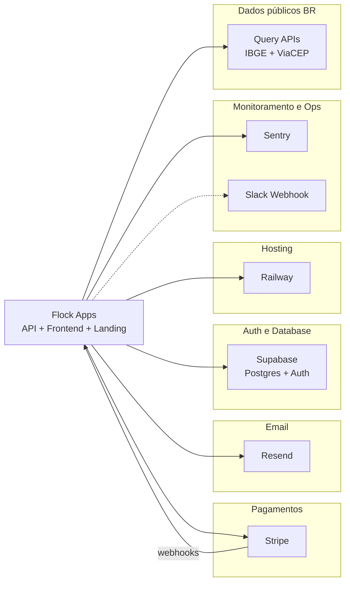

# Índice de Integrações

> Mapa de **serviços externos** (conta, config fora do código e/ou custo).  
> Não inclui pacotes npm puros (Express, Joi, PDFKit, etc.).  
> Detalhe por serviço: arquivos `docs/06_integracoes/[servico].md` (Prompt 2).  
> Env legado: [[ENVIRONMENT-VARIABLES]] · Infra: [[03_arquitetura/infraestrutura]] · Billing: [[04_modulos/billing]].

---

## Mapa de Serviços Externos

---

## Catálogo de Serviços

| Serviço | Categoria | Propósito no Projeto | Env Vars principais | Status |
| --- | --- | --- | --- | --- |
| **Stripe** | 💳 Pagamentos | Checkout, Portal, assinaturas, webhooks, price IDs 200/500/800 | `STRIPE_SECRET_KEY`, `STRIPE_WEBHOOK_SECRET`, `STRIPE_PRICE_ID_M200/M500/M800` | ✅ Ativo |
| **Resend** | 📧 Email | Transacional (auth, waitlist, billing, convites, avisos) | `RESEND_API_KEY`, `RESEND_FROM_EMAIL`, `RESEND_FROM_NAME`, `ADMIN_EMAIL` | ✅ Ativo (degrada se key ausente) |
| **Supabase** | 🔐 Auth + 🗄️ Database | Postgres 17 multi-tenant, Auth JWT/cookies, Admin API | `SUPABASE_URL`, `SUPABASE_KEY`, `SUPABASE_SERVICE_ROLE_KEY` | ✅ Ativo |
| **Railway** | 🚀 Hosting/Deploy | PaaS: API, app Next, landing (`start:railway`) | `PORT` (+ secrets injetados no painel) | ✅ Ativo (docs/scripts) |
| **Sentry** | 📊 Monitoramento | Erros/telemetria backend (`@sentry/node`) e frontend (`@sentry/nextjs`) | `SENTRY_DSN`, `SENTRY_*`, `NEXT_PUBLIC_SENTRY_*`, `SENTRY_ORG`, `SENTRY_PROJECT` | ✅ Integrado (opcional se DSN vazio) |
| **Slack** | 🔔 Notificações ops | Alertas de jobs/integrity (`opsAlertService`) | `SLACK_OPS_WEBHOOK_URL`, `OPS_ALERTS_ENABLED` | ⚠️ Opcional |
| **Query APIs** (IBGE + ViaCEP) | 🌐 Dados públicos | UFs/municípios + autocomplete CEP | — (URL pública, sem key) | ✅ Ativo · [[06_integracoes/query-apis]] |

**Não encontrados como integração account-based no código:** Clerk/Auth0, AWS S3/R2, Cloudflare CDN/DNS (provedor de domínio não versionado), Twilio, Algolia, PostHog, Datadog, Redis gerenciado, CI GitHub Actions.

**Relacionados mas não contados como SaaS de conta:**

| Item | Nota |
| --- | --- |
| Prometheus (`prom-client`) | Expõe `/metrics` — scraper externo não configurado no repo |
| Google Fonts (`next/font/google`) | CDN tipográfica; sem API key |
| GitHub | Hosting do código; **sem** workflows CI |
| Domínio `flock.com.br` / `flockapp.com.br` | Referenciados em docs; registrador DNS **não** identificado no código |

---

## Variáveis de Ambiente por Serviço

| Variável | Serviço | Tipo | Obrigatória |
| --- | --- | --- | --- |
| `SUPABASE_URL` | Supabase | 🔏/🌐 Project URL | ✅ |
| `SUPABASE_KEY` | Supabase | 🌐 Anon/public | ✅ |
| `SUPABASE_SERVICE_ROLE_KEY` | Supabase | 🔏 Secret | ✅ |
| `STRIPE_SECRET_KEY` | Stripe | 🔏 Secret | ✅ (boot API) |
| `STRIPE_WEBHOOK_SECRET` | Stripe | 🔏 Secret | ✅ |
| `STRIPE_PRICE_ID_M200` | Stripe | 🌐 Price ID | ✅ |
| `STRIPE_PRICE_ID_M500` | Stripe | 🌐 Price ID | ✅ |
| `STRIPE_PRICE_ID_M800` | Stripe | 🌐 Price ID | ✅ |
| `RESEND_API_KEY` | Resend | 🔏 Secret | ⚠️ Soft (warn se ausente) |
| `RESEND_FROM_EMAIL` | Resend | 🌐 From | ⬜ Default |
| `RESEND_FROM_NAME` | Resend | 🌐 From name | ⬜ Default |
| `ADMIN_EMAIL` | Resend / ops | 🌐 Destinatário | ⬜ Default `contato@flockapp.com.br` |
| `SENTRY_DSN` | Sentry (API) | 🔏/🌐 DSN | ⬜ Opcional |
| `SENTRY_ENABLED` | Sentry | 🌐 Flag | ⬜ Default on se DSN |
| `SENTRY_TRACES_SAMPLE_RATE` | Sentry | 🌐 | ⬜ Default `0.1` |
| `NEXT_PUBLIC_SENTRY_DSN` | Sentry (app) | 🌐 | ⬜ Opcional |
| `NEXT_PUBLIC_SENTRY_ENABLED` | Sentry (app) | 🌐 | ⬜ |
| `NEXT_PUBLIC_SENTRY_TRACES_SAMPLE_RATE` | Sentry (app) | 🌐 | ⬜ |
| `SENTRY_ORG` / `SENTRY_PROJECT` | Sentry build | 🔏/🌐 | ⬜ Upload source maps |
| `SLACK_OPS_WEBHOOK_URL` | Slack | 🔏 Webhook | ⬜ Opcional |
| `OPS_ALERTS_ENABLED` | Slack/ops | 🌐 Flag | ⬜ Default on |
| `FRONTEND_URL` | App URLs (CORS/links) | 🌐 | ⬜ Default localhost |
| `LANDING_URL` | CORS / checkout redirects | 🌐 | ⬜ |
| `NEXT_PUBLIC_API_URL` | Frontend→API | 🌐 | ⬜ Default |
| `NEXT_PUBLIC_LANDING_URL` | Frontend links | 🌐 | ⬜ |
| `NEXT_PUBLIC_FRONTEND_URL` | Landing CTAs | 🌐 | ⬜ |
| `NEXT_PUBLIC_SITE_URL` | Landing SEO/sitemap | 🌐 | ⬜ |
| `PORT` | Railway/runtime | 🌐 | ⬜ Default 4000 |
| `NODE_ENV` | Runtime | 🌐 | ⬜ |
| `ENABLE_CRON_JOBS` | Runtime (API) | 🌐 | ⬜ |
| `METRICS_TOKEN` | Ops `/metrics` | 🔏 | ⬜ Se scrape |
| `INTERNAL_BILLING_TOKEN` | Ops billing stats | 🔏 | ⬜ |
| `HEALTH_CHECK_TOKEN` | Ops health Stripe | 🔏 | ⬜ |

Legenda: ✅ obrigatório no boot crítico · ⚠️ soft-fail · ⬜ opcional/default.

---

## Onde cada serviço aparece no código

| Serviço | Pontos de contato |
| --- | --- |
| Stripe | `backend/src/services/stripe.ts`, `stripeWebhookService.ts`, `routes/stripe.ts`, landing `@stripe/stripe-js` (SDK presente) |
| Resend | `backend/src/services/emailService.ts` |
| Supabase | `backend/src/services/supabase.ts` (anon + service_role) |
| Railway | scripts `start:railway`, Dockerfile backend, docs infra; trust proxy Express |
| Sentry | `backend/src/utils/sentryBilling.ts`, `frontend/sentry.*.config.ts`, `next.config.ts` |
| Slack | `backend/src/services/opsAlertService.ts` |
| Query APIs | IBGE: `useIbgeData.ts` (+ register/waitlist); ViaCEP: `validations.ts` (`fetchCEPData`) · [[06_integracoes/query-apis]] |

---

## Links de Acesso Rápido

- [Stripe Dashboard](https://dashboard.stripe.com)
- [Resend Dashboard](https://resend.com)
- [Supabase Dashboard](https://supabase.com/dashboard) — projeto `flock-app-01` (sa-east-1)
- [Railway Dashboard](https://railway.app)
- [Sentry](https://sentry.io)
- [Slack Apps / Incoming Webhooks](https://api.slack.com/messaging/webhooks)
- [Query APIs (IBGE + ViaCEP)](query-apis.md) · [IBGE](https://servicodados.ibge.gov.br/api/docs/localidades) · [ViaCEP](https://viacep.com.br)

---

## Docs por integração

| Slug | Arquivo |
| --- | --- |
| stripe | [[06_integracoes/stripe]] |
| resend | [[06_integracoes/resend]] |
| supabase | [[06_integracoes/supabase]] |
| railway | [[06_integracoes/railway]] |
| sentry | [[06_integracoes/sentry]] |
| query-apis | [[06_integracoes/query-apis]] (IBGE + ViaCEP) |
| slack | (opcional — ainda não) |
