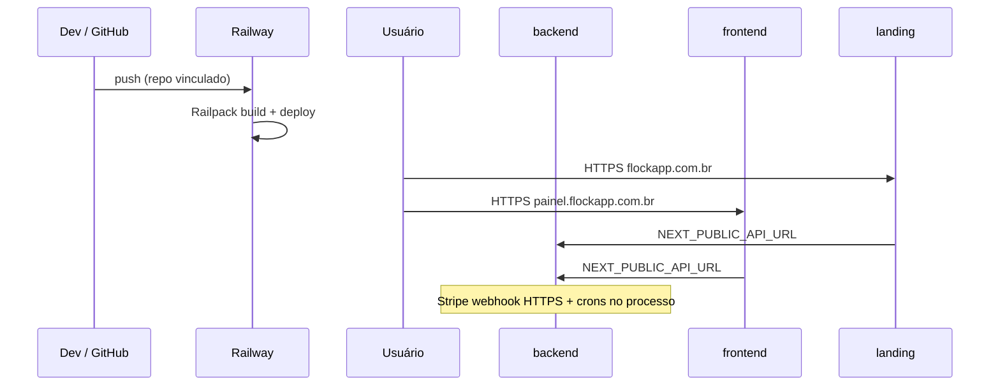

# Integração — Railway

> Índice: [[06_integracoes/index]] · Infra: [[03_arquitetura/infraestrutura]].  
> Snapshot MCP Railway em 2026-07-14 (conta `vinisouza.dev@gmail.com`).

---

## 1. 📌 Visão Geral

**O que é:** PaaS (build + deploy + HTTPS + variáveis) usado para hospedar os três processos Node do Flock.

**Por que usamos:** publicar API, app e landing sem gerenciar VMs; injetar `PORT`/`HTTPS`; conectar o repo GitHub; domínios custom com TLS.

**Projeto Railway:**

| Campo | Valor (MCP) |
| --- | --- |
| Nome | `flock` |
| Project ID | `301d94a5-48af-4640-b023-86ce13608e2c` |
| Environment | **production** (`5083b213-863f-4575-879f-56fc1fdf609f`) |
| Staging Railway | **Não existe** (só `production`) |
| Repo fonte | `vinic-asouza/flock` |
| Builder | **RAILPACK** (sem `railway.toml` no monorepo) |
| SDK npm | **Nenhum** — integração via plataforma + scripts `start:railway` |

**Serviços:**

| Serviço | ID | Root | Build | Start | Domínios |
| --- | --- | --- | --- | --- | --- |
| **backend** | `0127db7f-…` | `/backend` | `npm install && npm run build` | `npm start` | `backend-production-2ec4.up.railway.app` (:4000) |
| **frontend** | `d1fd82b3-…` | `/frontend` | `npm install && npm run build` | `npm run start:railway` | `frontend-test-production-6b4c.up.railway.app` + **painel.flockapp.com.br** (:8080) |
| **landing page** | `fff79d81-…` | `/landing` | `npm install && npm run build` | `npm run start:railway` | `landing-page-production-d1c1.up.railway.app` + **flockapp.com.br** (:8080) |

⚠️ Em 2026-07-14 o MCP reportou **status FAILED** e **0 active deployments** nos três serviços (últimos deploys: backend 2025-12-05, frontend 2026-01-16, landing 2026-06-16). Domínios/certs ainda constam ACTIVE — **validar se produção está de fato no ar** e redeployar se necessário.

**Módulos / superfícies:**

| Superfície | Papel no Railway |
| --- | --- |
| Toda a API (auth, billing, módulos) | Serviço **backend** — webhooks Stripe, crons no mesmo processo |
| App Next (painel) | Serviço **frontend** |
| Landing / waitlist / pricing | Serviço **landing page** |
| Banco | **Não** hospedado no Railway → [[06_integracoes/supabase]] |

**Plano Railway:** <!-- PREENCHER MANUALMENTE: Hobby / Pro e workspace -->

---

## 2. 🌍 Ambientes

| Ambiente | Modo | Onde configurar | Observação |
| --- | --- | --- | --- |
| Development | Local | `backend/.env`, `frontend/.env.local`, `landing/.env.local` | `docker-compose` opcional; **não** depende do Railway |
| Staging | — | — | **Ausente** no projeto Railway (só env `production`) |
| Production | Live | Railway → projeto `flock` → env `production` → Variables por serviço | Domínios `*.flockapp.com.br` + `*.up.railway.app` |

### Distinção local vs Railway

| Sinal | Local | Railway prod |
| --- | --- | --- |
| `NODE_ENV` | `development` | `production` (setado nos serviços) |
| `PORT` | 4000 / 3001 / 3000 | Backend `4000`; Next tipicamente **8080** no edge Railway |
| URLs | localhost | `FRONTEND_URL=https://painel.flockapp.com.br`, `LANDING_URL=https://flockapp.com.br` |
| Injetadas pela plataforma | — | `RAILWAY_*` (`RAILWAY_PUBLIC_DOMAIN`, `RAILWAY_PRIVATE_DOMAIN`, …) |

⚠️ Credenciais live (Stripe `sk_live_`, Supabase service_role, Resend) ficam **só** nas Variables do serviço **backend** em production. Não copiar para `.env` de desenvolvimento sem necessidade.

---

## 3. 🔑 Credenciais e Variáveis de Ambiente

Railway **não** exige API key no código da app. Credenciais = Variables do painel + (opcional) token CLI/`railway login`.

### Variáveis injetadas pela plataforma (todos os serviços)

Exemplos observados: `RAILWAY_ENVIRONMENT`, `RAILWAY_ENVIRONMENT_ID`, `RAILWAY_PROJECT_ID`, `RAILWAY_SERVICE_ID`, `RAILWAY_PUBLIC_DOMAIN`, `RAILWAY_PRIVATE_DOMAIN`, `RAILWAY_SERVICE_*_URL`.

### Backend (secrets de integração — **apenas nomes**)

Configuradas no serviço (além das `RAILWAY_*`):

| Variável | Descrição | Onde obter |
| --- | --- | --- |
| `PORT` | Porta listen (prod: `4000`) | Service Settings / Variable |
| `NODE_ENV` | `production` | Variable |
| `FRONTEND_URL` | Painel (CORS/redirects) | Domínio custom frontend |
| `LANDING_URL` | Landing (CORS/checkout) | Domínio custom landing |
| `SUPABASE_URL` / `SUPABASE_KEY` / `SUPABASE_SERVICE_ROLE_KEY` | [[06_integracoes/supabase]] | Dashboard Supabase |
| `STRIPE_SECRET_KEY` / `STRIPE_WEBHOOK_SECRET` / `STRIPE_PRICE_ID_M*` / `STRIPE_PUBLISHABLE_KEY` | [[06_integracoes/stripe]] | Dashboard Stripe |
| `RESEND_API_KEY` / `RESEND_FROM_EMAIL` / `RESEND_FROM_NAME` | [[06_integracoes/resend]] | Dashboard Resend |

> Valores **nunca** documentados aqui. `ADMIN_EMAIL` / Sentry **não** apareceram no dump de Variables do backend em 2026-07-14 — confirmar se intencional.

### Frontend

| Variável | Descrição |
| --- | --- |
| `NODE_ENV` | `production` |
| `NEXT_PUBLIC_API_URL` | URL da API (`…/api`) |
| `NEXT_PUBLIC_LANDING_URL` | Link para landing |

⚠️ MCP mostrou `NEXT_PUBLIC_API_URL` com **espaço à esquerda** no valor — pode quebrar fetch; trimar na Variable.

### Landing

| Variável | Descrição |
| --- | --- |
| `NODE_ENV` | `production` |
| `NEXT_PUBLIC_API_URL` | URL da API (`…/api`) — mesmo cuidado com espaço |
| `NEXT_PUBLIC_FRONTEND_URL` | CTA → painel |
| `NEXT_PUBLIC_SITE_URL` | SEO / site canônico |

### Caminho no Dashboard

```
Variáveis
  → https://railway.app/project/301d94a5-48af-4640-b023-86ce13608e2c
  → Environment: production
  → Service (backend | frontend | landing page)
  → Variables → New Variable / Raw Editor
  → (redeploy automático salvo configuração)

Token CLI / MCP (conta)
  → railway.app → Account → Tokens
  → (não vai no código da app)
```

---

## 4. 🚀 Setup do Zero (Guia Completo)

### Pré-requisitos

- [ ] Conta [https://railway.app](https://railway.app)
- [ ] GitHub App Railway com acesso a `vinic-asouza/flock` (ou fork)
- [ ] Projeto Supabase + keys ([[06_integracoes/supabase]])
- [ ] Stripe live/test + webhook apontando para URL pública da API ([[06_integracoes/stripe]])
- [ ] Resend + domínio ([[06_integracoes/resend]])
- [ ] DNS do domínio `flockapp.com.br` (e `painel`)

### Configuração da Conta / Projeto

1. New Project → **Deploy from GitHub** → selecionar monorepo `flock`.
2. Criar **3 services** no mesmo projeto (não usar Postgres Railway — DB é Supabase).
3. Por serviço, configurar Root Directory / Build / Start (valores da tabela §1).
4. Gerar domínio Railway (`*.up.railway.app`) em cada um; ajustar **target port** (API `4000`; Next costuma `8080` com `PORT` injetado).
5. Preencher Variables (backend com todos os secrets; fronts só `NEXT_PUBLIC_*` + `NODE_ENV`).
6. Custom domains + DNS (§ DNS).
7. Atualizar Stripe webhook para `https://<api-public>/api/stripe/webhook`.
8. Deploy / verificar logs e `GET /health`.

### Configuração de Desenvolvimento

Railway não é obrigatório em local:

```bash
# API
cd backend && npm run dev   # :4000

# App
cd frontend && npm run dev  # :3001

# Landing
cd landing && npm run dev   # :3000
```

Opcional: `docker-compose.yml` (API com Dockerfile; frontend compose pode estar desatualizado).

### Configuração de Produção (resumo)

1. Environment **production** (já existente no projeto `flock`).
2. Variables por serviço no painel (nunca no Git).
3. Custom domains: `flockapp.com.br` → landing; `painel.flockapp.com.br` → frontend.
4. Confirmar `FRONTEND_URL` / `LANDING_URL` no backend batem com os custom domains.
5. Redeploy se status FAILED.

### Verificação

- [ ] Deploy SUCCESS nos 3 serviços (Deployments)
- [ ] `curl https://backend-production-2ec4.up.railway.app/health` → `{ "status": "ok" }`
- [ ] Abrir `https://painel.flockapp.com.br` e `https://flockapp.com.br`
- [ ] Certificados Valid (domínio custom)
- [ ] Login / waitlist bater na API correta
- [ ] Stripe Dashboard → webhook attempts 200 na URL Railway/custom da API

---

## 5. ⚙️ Configurações Importantes (Dashboard)

### Serviços e build (Railpack)

- Sem `railway.toml` / `Dockerfile` no path de deploy Railway atual (backend tem `Dockerfile` para compose/local; prod MCP usa **RAILPACK** + `npm`).
- Frontend: `output: 'standalone'` comentado — start via `start:railway` (`0.0.0.0` + `PORT`).
- Como alterar: Service → Settings → Build / Deploy → Build Command, Start Command, Root Directory → Redeploy.

### Networking / proxy

- Express: `trust proxy = 1` em produção (`app.ts`) — necessário atrás do proxy Railway (rate limit / IP).
- Health: `GET /health` (público); Compose local também usa esse path.

### Plugins / addons

| Addon | Status |
| --- | --- |
| Postgres / Redis Railway | **Não** usados |
| Volumes | **Não** (stateless Node) |
| Cron schedule Railway | **Não** — crons na API (`node-cron`) |
| Private network | Hostnames `*.railway.internal` presentes (`backend.railway.internal`, etc.) — app ainda usa URLs públicas nas `NEXT_PUBLIC_*` |

### Domínios e TLS

| Host | Serviço | Cert (MCP) |
| --- | --- | --- |
| `painel.flockapp.com.br` | frontend | Valid · CNAME → `rvjzynfi.up.railway.app` |
| `flockapp.com.br` | landing | Valid · CNAME apex → `0kexovsh.up.railway.app` |
| `*.up.railway.app` | cada serviço | Gerenciado Railway |

Backend **sem** custom domain no MCP — API pública = `backend-production-2ec4.up.railway.app` (docs às vezes citam `api.flock.com.br` — **não** observado no Railway atual).

### Auto-deploy GitHub

- Source: repo `vinic-asouza/flock` nos 3 serviços.
- Sem GitHub Actions no monorepo — deploy = conexão Railway ↔ GitHub.
- Branch: <!-- PREENCHER MANUALMENTE: branch de produção (ex. main) -->

---

## 6. 🌐 Configuração de DNS

| Tipo | Host | Valor (Railway) | Propósito |
| --- | --- | --- | --- |
| CNAME | `painel` | `rvjzynfi.up.railway.app` | App → frontend |
| CNAME / ALIAS | `@` (`flockapp.com.br`) | `0kexovsh.up.railway.app` | Landing |
| CNAME (opcional) | `api` ou similar | <!-- se criar custom domain no backend --> | API amigável |

**Onde configurar:** <!-- PREENCHER MANUALMENTE: registrador / DNS de flockapp.com.br -->

**Verificar:**

```bash
dig CNAME painel.flockapp.com.br
dig flockapp.com.br
# Painel: Service → Settings → Networking → Domain → status Verified + cert
```

Railway Dashboard → Domain → **Retry certificate** se TLS falhar.

---

## 7. 🔄 Fluxo Operacional



Deploy local “manual” possível via CLI/`railway up`, mas o fluxo documentado é GitHub → Railway.

---

## 8. 💰 Plano e Limites

| Item | Limite atual | Plano | Notas |
| --- | --- | --- | --- |
| Uso $/mês | <!-- PREENCHER MANUALMENTE --> | <!-- Hobby/Pro --> | Usage no workspace |
| Réplicas | 1 por serviço (padrão) | | Scale via Settings / MCP `scale_service` |
| Sleep / idle | <!-- PREENCHER --> | | Planos podem sleep |

- **Plano atual:** <!-- PREENCHER MANUALMENTE -->
- **Custo estimado:** <!-- PREENCHER MANUALMENTE -->
- **Quando upgrade:** OOM, cold starts, necessidade de HA/métricas
- **Preços:** https://railway.com/pricing

---

## 9. 🚨 Troubleshooting

### Deploy FAILED / 0 active deployments

- **Sintoma:** MCP/Dashboard mostra FAILED; site offline ou antigo.
- **Solução:**
  1. Railway → Deployments → logs **Build** e **Deploy**.
  2. Conferir Root Directory / Start Command.
  3. Redeploy manual (ou push).
  4. Validar Variables obrigatórias do backend (Supabase/Stripe).

### App sobe e cai / crash loop

- **Causa:** missing env (Stripe/Supabase throw no boot); `PORT` errado vs domain target port.
- **Checklist:** logs Deploy; `PORT` backend 4000 alinhado ao domain target; Next escuta `0.0.0.0` (`start:railway`).

### CORS / frontend não fala com API

- **Checklist:** `FRONTEND_URL` / `LANDING_URL` no backend = origens reais; `NEXT_PUBLIC_API_URL` sem espaço e com sufixo `/api`.

### Domínio custom / certificado

- **Checklist:** CNAME propagado; Domain Verified; Certificate Valid; Retry certificate no painel.

### Webhook Stripe 4xx/timeout

- Não é webhook do Railway. Verificar URL pública da **API** Railway e secret — [[06_integracoes/stripe]].

### Credenciais / Variables “sumiram” após redeploy

- Variables são por **service + environment**; copiar só para o serviço certo (secrets só no **backend**).

---

## 10. 📋 Checklist de Manutenção

**Mensal:**

- [ ] Usage / fatura Railway
- [ ] Deployments recentes SUCCESS
- [ ] `GET /health` na URL pública da API
- [ ] Certificados custom domains Valid

**Trimestral:**

- [ ] Revisar Variables (rotacionar secrets externos; Railway só armazena)
- [ ] Confirmar branch de auto-deploy e acessos GitHub App
- [ ] Avaliar se API merece custom domain (`api.…`)

**Anual / quando necessário:**

- [ ] Plano (Hobby → Pro) e limites de recursos
- [ ] Alinhar docs `flock.com.br` vs `flockapp.com.br` com DNS real
- [ ] Considerar environment **staging** no mesmo projeto

---

## 11. 🔗 Referências

- **Dashboard projeto:** https://railway.app/project/301d94a5-48af-4640-b023-86ce13608e2c
- **Documentação:** https://docs.railway.com
- **Domínios:** https://docs.railway.com/guides/public-networking
- **Variables:** https://docs.railway.com/guides/variables
- **Status:** https://status.railway.com
- **Pricing:** https://railway.com/pricing
- **Suporte:** https://station.railway.com
- **No repo:** [[03_arquitetura/infraestrutura]] · `landing/SETUP.md` · `frontend/package.json` (`start:railway`) · `backend/Dockerfile` (local/compose)
