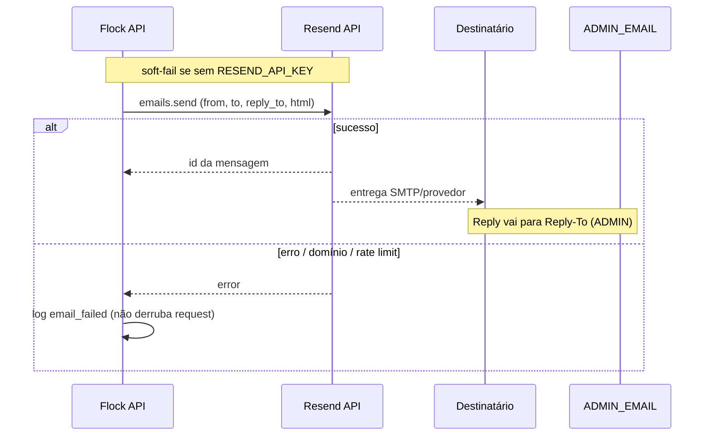

# Integração — Resend

> Índice: [[06_integracoes/index]] · Billing: [[04_modulos/billing]] · Infra: [[03_arquitetura/infraestrutura]].

---

## 1. 📌 Visão Geral

**O que é:** API de e-mail transacional (HTTP). Substitui SMTP/`nodemailer` no Flock.

**Por que usamos:** enviar e-mails do produto (boas-vindas, billing, convites, waitlist, avisos de conta/quota) de forma confiável em PaaS (Railway), sem abrir porta SMTP.

**Módulos que utilizam:**

| Módulo | Uso |
| --- | --- |
| [[04_modulos/auth]] / onboarding | Boas-vindas ao usuário; notificação a `ADMIN_EMAIL` |
| [[04_modulos/billing]] | Pagamento ok/falha, cancelamento, reativação, mudança de plano, expiração (7/3/1) |
| [[04_modulos/aquisicao]] | Confirmação de waitlist + aviso admin |
| [[04_modulos/config]] / conta | Senha/e-mail alterados, exclusão de conta |
| Convites de usuários | Convite para `church_users` |
| Quotas / membros | Aviso de limite de membros |
| Ops | `sendAdminEmail` (alertas em `opsAlertService`, além de Slack opcional) |

**SDK (código):**

| Item | Valor |
| --- | --- |
| Pacote | `resend` `^3.5.0` (`backend/package.json`) |
| Cliente | singleton em `emailService.ts` → `client.emails.send` |
| Comportamento se sem key | **Soft-fail**: warn + `email_skipped`; API **não** falha o boot |

**Plano atual (conta Resend):** <!-- PREENCHER MANUALMENTE: Free / Pro / Scale e cota mensal -->

---

## 2. 🌍 Ambientes

O Resend **não** tem “Test mode / Live mode” como o Stripe. Isolamento = **API keys distintas** + (opcional) domínio/`from` diferente.

| Ambiente | Modo | Onde configurar | Observação |
| --- | --- | --- | --- |
| Development | Key de dev / mesmo domínio verificado | `backend/.env` | Sem key → e-mails só logados (skipped). Domínio não verificado: só envio para o e-mail da conta Resend (limite onboarding) |
| Staging | Key dedicada (recomendado) | Railway staging Variables | <!-- PREENCHER MANUALMENTE: existe staging? senão N/A --> |
| Production | Key de produção | Railway → serviço API → Variables | `from` deve ser domínio **verificado**; envios reais aos usuários |

### Como distinguir ambientes

| Sinal | Significado |
| --- | --- |
| Prefixo `re_…` | API key Resend (todas as keys usam esse formato) |
| Nome no Dashboard | Ex.: `Flock Local` vs `Flock Production` — **única** distinção prática |
| Domínio verificado | Necessário para `from` em produção (`@flockapp.com.br` nos defaults) |
| Sem `RESEND_API_KEY` | App sobe; e-mails não saem |

⚠️ Evite reutilizar a key de produção no laptop se houver risco de spam em usuários reais. Prefira key restrita a Sending + domínio de teste, ou deixe key vazia em dev quando não precisar validar e-mail.

---

## 3. 🔑 Credenciais e Variáveis de Ambiente

| Variável | Descrição | Onde obter | Ambiente |
| --- | --- | --- | --- |
| `RESEND_API_KEY` | API key (Sending) | API Keys → Create | Soft-obrigatória: sem ela, skip |
| `RESEND_FROM_EMAIL` | Remetente | Domínio verificado + endereço escolhido | Default código: `contato@flockapp.com.br` · doc legado sugere `noreply@…` |
| `RESEND_FROM_NAME` | Nome do From | Livre | Default: `Flock App` |
| `ADMIN_EMAIL` | Destino de alertas admin + Reply-To padrão | Caixa real (ex. Umbler) | Default: `contato@flockapp.com.br` |

### Caminhos no Dashboard

```
RESEND_API_KEY
  → https://resend.com/api-keys
  → Create API Key
  → Name + Permission: Sending access
  → Create → copiar re_… (só aparece uma vez)

RESEND_FROM_EMAIL
  → Domains → [domínio verificado]
  → Usar endereço @esse-domínio (ex. noreply@flockapp.com.br)

RESEND_FROM_NAME
  → Não vem do Dashboard; só variável de ambiente / default no código

ADMIN_EMAIL
  → Não é credencial Resend; e-mail operacional da equipe Flock
  → Reply-To dos envios aponta para cá (recebimento fora do Resend, ex. Umbler)
```

Exemplo:

```env
RESEND_API_KEY=re_xxxxxxxxxxxxxxxxxxxxxxxxxxxxx
RESEND_FROM_EMAIL=noreply@flockapp.com.br
RESEND_FROM_NAME=Flock App
ADMIN_EMAIL=contato@flockapp.com.br
```

---

## 4. 🚀 Setup do Zero (Guia Completo)

### Pré-requisitos

- [ ] Conta em [https://resend.com/signup](https://resend.com/signup)
- [ ] Acesso ao Dashboard (owner/admin)
- [ ] Controle DNS do domínio de envio (ex. `flockapp.com.br`)
- [ ] <!-- PREENCHER MANUALMENTE: provedor DNS (Cloudflare / registrador / Umbler DNS) -->
- [ ] Caixa para `ADMIN_EMAIL` (recebimento — não precisa ser Resend)

### Configuração da Conta

1. Criar conta Resend.
2. **Domains** → **Add Domain** → `flockapp.com.br` (ou domínio escolhido).
3. Publicar registros DNS (SPF / DKIM / opcional DMARC) — ver § DNS.
4. Aguardar status **Verified** (minutos a ~48h).
5. **API Keys** → Create (`Sending access`) → guardar `re_…`.
6. Definir endereço From (ex. `noreply@…`) alinhado ao domínio verificado.

### Configuração de Desenvolvimento

1. Criar key nomeada `Flock Dev` (ou usar sem key se não for testar e-mail).
2. Em `backend/.env`:

```env
RESEND_API_KEY=re_...
RESEND_FROM_EMAIL=noreply@flockapp.com.br
RESEND_FROM_NAME=Flock App
ADMIN_EMAIL=seu-email@...
```

3. Se domínio ainda não verificado: enviar só para o e-mail da conta Resend (restrição da plataforma).
4. Disparar um fluxo do app (ex. waitlist / register) e conferir **Emails** no Dashboard + logs `email_sent` / `email_failed`.

### Configuração de Produção

1. Domínio verificado em produção.
2. Key dedicada `Flock Production`.
3. Railway → Projeto → serviço **API** → Variables:

   - `RESEND_API_KEY`
   - `RESEND_FROM_EMAIL`
   - `RESEND_FROM_NAME`
   - `ADMIN_EMAIL`

4. Redeploy / restart da API.
5. <!-- PREENCHER MANUALMENTE: confirmar From/nome exatos usados em prod -->

### Verificação

- [ ] Dashboard Resend → Domains → **Verified**
- [ ] Enviar e-mail de teste (fluxo waitlist ou register em staging/dev)
- [ ] Aparece em Resend → Emails com status Delivered (ou bounce claro)
- [ ] Reply-To abre em `ADMIN_EMAIL` / caixa Umbler
- [ ] Sem `RESEND_API_KEY`: API sobe e loga `email_skipped` (comportamento esperado)

---

## 5. ⚙️ Configurações Importantes (Dashboard)

### Domínio verificado

- **Esperado:** domínio de From usado pelo app (docs: `flockapp.com.br`).
- **Status atual:** <!-- PREENCHER MANUALMENTE: domínio(s) e status Verified/Pending -->
- **Como alterar:** Domains → Add / Remove; atualizar DNS; trocar `RESEND_FROM_EMAIL` se mudar o endereço.

### API Keys

- Permissão usada: **Sending access**.
- Rotacionar: Create nova → atualizar Railway → revogar antiga.
- <!-- PREENCHER MANUALMENTE: nomes das keys ativas e data da última rotação -->

### Remetente e Reply-To

| Campo | Valor típico | Notas |
| --- | --- | --- |
| From e-mail | `RESEND_FROM_EMAIL` ou default `contato@flockapp.com.br` | Preferir `noreply@` / `notificacoes@` (doc legado) |
| From nome | `Flock App` | |
| Reply-To | `ADMIN_EMAIL` | Respostas **não** passam pelo Resend inbound |

### Recursos **não** usados no código atual

- Webhooks Resend (delivered/bounced/complained) — **sem** endpoint no Flock
- Inbound / Receiving
- Audiences / Broadcasts / Marketing
- Templates hospedados no Resend (HTML é gerado no backend)

### Tipos de e-mail que o produto dispara

| Categoria | Exemplos |
| --- | --- |
| Auth / onboarding | Welcome; notificação de novo registro (admin) |
| Conta | Senha alterada; e-mail alterado; conta deletada |
| Equipe | Convite `church_user` |
| Aquisição | Waitlist (user + admin) |
| Billing | Pagamento ok/falha; cancelada; reativada; plan changed; expirando |
| Quota | Aviso limite de membros |
| Ops | Alertas admin (`sendAdminEmail`) |

---

## 6. 🌐 Configuração de DNS

Necessária para From em domínio próprio. Valores **exatos** vêm do Resend ao adicionar o domínio.

| Tipo | Host | Valor | TTL | Propósito |
| --- | --- | --- | --- | --- |
| TXT / MX* | <!-- PREENCHER: host SPF do painel --> | Tipicamente inclui `include:resend.com` (doc legado: `v=spf1 include:resend.com ~all`) | 3600 | SPF |
| CNAME ou TXT | <!-- PREENCHER: hosts DKIM do painel --> | <!-- PREENCHER: valores DKIM Resend --> | 3600 | DKIM |
| TXT | `_dmarc` ou host indicado | <!-- PREENCHER: política DMARC --> | 3600 | DMARC (recomendado) |

\*O Resend mostra o conjunto atual no wizard do domínio — copiar **literalmente** do Dashboard.

**Onde configurar:** <!-- PREENCHER MANUALMENTE: Cloudflare / registrador / Umbler DNS de flockapp.com.br -->

**Como verificar:**

```bash
# Ajuste host/domínio conforme o painel Resend
dig TXT flockapp.com.br
dig CNAME <!-- host-dkim -->.flockapp.com.br
nslookup -type=TXT flockapp.com.br
```

Também: Dashboard Resend → Domains → **Verify** / status Verified.

**Recebimento:** caixa `ADMIN_EMAIL` pode ficar na Umbler (ou outro); só o **envio** é Resend.

---

## 7. 🔄 Fluxo Operacional



Billing usa `fireAndForgetEmail`: falha de e-mail **não** reverte o webhook Stripe.

---

## 8. 💰 Plano e Limites

| Item | Limite atual | Plano | Notas |
| --- | --- | --- | --- |
| E-mails / mês | <!-- PREENCHER MANUALMENTE --> | <!-- PREENCHER: Free 3k/mês citação doc legado — confirmar no site --> | Ver Usage no Dashboard |
| Domínios | <!-- PREENCHER --> | | |
| Rate limit | <!-- PREENCHER --> | | Erro “Rate limit exceeded” |

- **Plano atual:** <!-- PREENCHER MANUALMENTE -->
- **Custo estimado:** <!-- PREENCHER MANUALMENTE -->
- **Quando fazer upgrade:** bounce/rate limit frequentes; volume > cota Free; necessidade de features Pro
- **Preços:** https://resend.com/pricing

---

## 9. 🚨 Troubleshooting

### Domain not verified

- **Sintoma:** API error / e-mails não saem; message no Dashboard.
- **Causa:** DNS incompleto ou From fora do domínio verificado.
- **Solução:**
  1. Conferir Domains → status.
  2. Conferir SPF/DKIM com `dig`.
  3. Ajustar `RESEND_FROM_EMAIL` para `@domínio-verificado`.

### Unauthorized / API key inválida

- **Sintoma:** `email_failed` com Unauthorized; 401 no Resend.
- **Checklist:**
  - [ ] `RESEND_API_KEY` no serviço **API** do Railway?
  - [ ] Key não revogada?
  - [ ] Permissão Sending?
  - [ ] Sem espaços/aspas extras na Variable?

### E-mails não chegam

- **Checklist:**
  - [ ] Aparece em Resend → Emails? (Delivered / Bounced / Complained)
  - [ ] Pasta spam?
  - [ ] Destinatário correto (redacted nos logs — usar Dashboard)?
  - [ ] Soft-fail: key ausente → só `email_skipped` nos logs

### Rate limit exceeded

- **Causa:** cota do plano.
- **Solução:** Usage no Dashboard; upgrade; reduzir retries manuais / jobs.

### Respostas do usuário não chegam

- **Causa:** Reply-To / `ADMIN_EMAIL` / caixa Umbler, **não** o Resend.
- **Solução:** validar `ADMIN_EMAIL` e MX da caixa de recebimento.

### “Webhook Resend não chega”

**Não aplicável.** O Flock **não** implementa webhooks Resend. Se precisar de bounce tracking no produto, seria trabalho novo (endpoint + assinatura).

---

## 10. 📋 Checklist de Manutenção

**Mensal:**

- [ ] Usage vs cota do plano
- [ ] Taxa de bounce / complaint no Dashboard
- [ ] Amostra de e-mails críticos (billing / auth) Delivered

**Trimestral:**

- [ ] Rotacionar `RESEND_API_KEY`
- [ ] Revisar versão do SDK `resend`
- [ ] Confirmar DNS ainda válido após mudanças de domínio

**Anual / quando necessário:**

- [ ] Adequação do plano (Free → Pro)
- [ ] Revisar From / branding / DMARC
- [ ] Confirmar que recebimento `ADMIN_EMAIL` ainda está no provedor certo

---

## 11. 🔗 Referências

- **Dashboard:** https://resend.com/emails
- **API Keys:** https://resend.com/api-keys
- **Domains:** https://resend.com/domains
- **Documentação:** https://resend.com/docs
- **Node SDK:** https://resend.com/docs/send-with-nodejs
- **Pricing:** https://resend.com/pricing
- **Status:** https://resend.com/status (ou status page oficial atual)
- **Suporte:** https://resend.com/docs (contato no Dashboard)
- **No repo:** [[06_integracoes/index]] · [[04_modulos/billing]] · [[04_modulos/auth]] · [[04_modulos/aquisicao]] · [[03_arquitetura/infraestrutura]]
