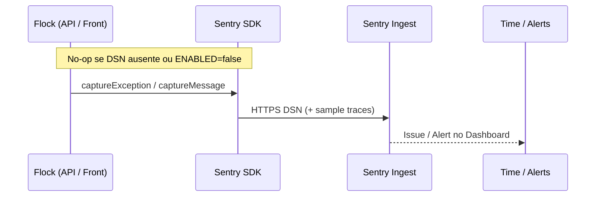
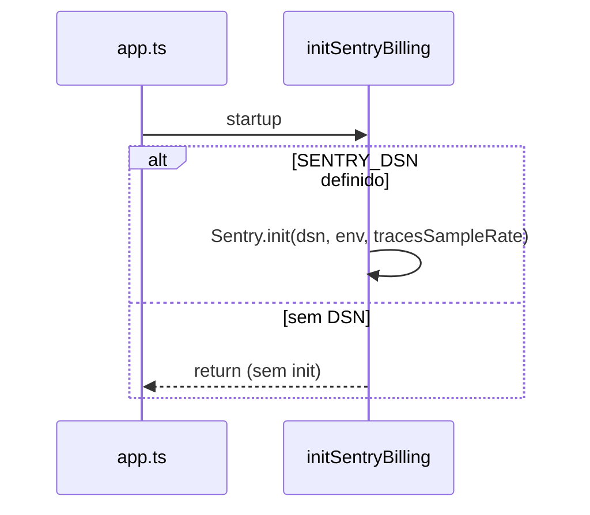

# Integração — Sentry

> Índice: [[06_integracoes/index]] · Infra: [[03_arquitetura/infraestrutura]] · Billing: [[04_modulos/billing]] · Railway: [[06_integracoes/railway]].

---

## 1. 📌 Visão Geral

**O que é:** plataforma de error tracking / performance (APM leve). O Flock envia eventos via SDK; o Dashboard agrega Issues, Releases e (se ligado) traces.

**Por que usamos:** visibilidade de falhas de **billing** (webhooks Stripe, sync no painel) sem depender só de logs do Railway — com tag `domain: billing`.

**Escopo real no código (não é APM full da API):**

| App | SDK | Pacote | Foco |
| --- | --- | --- | --- |
| Backend API | `@sentry/node` `^10.56.0` | `sentryBilling.ts` | Init + `captureBillingException` (webhooks) / `captureBillingMessage` |
| Frontend (painel) | `@sentry/nextjs` `^10.56.0` | `sentry.*.config.ts`, `billingTelemetry.ts` | Init client/server + avisos de sync billing |
| Landing | — | — | **Sem** Sentry |

**Módulos:**

| Módulo | Uso |
| --- | --- |
| [[04_modulos/billing]] | Exceções no processamento de webhook; telemetria UI (`billing_sync_failed`) |
| App Express | `initSentryBilling()` no boot (`app.ts`) — só efetiva se houver DSN |

**Plano Sentry (org):** <!-- PREENCHER MANUALMENTE: Developer / Team / Business; org slug e project names -->

> **Estado operacional:** SDKs e wrappers estão no repo. Em snapshot Railway (2026-07-14) as Variables **não** incluíam `SENTRY_*` / `NEXT_PUBLIC_SENTRY_*` — sem DSN, o SDK fica **no-op** (enabled só com DSN e flag ≠ `false`).

---

## 2. 🌍 Ambientes

Não há “Test mode” tipo Stripe. Isolamento = **projetos/environments** no Sentry (`environment` = `NODE_ENV`) + DSNs distintos.

| Ambiente | Modo | Onde configurar | Observação |
| --- | --- | --- | --- |
| Development | Opcional / off | `backend/.env`, `frontend/.env.local` | Sem DSN → silencioso; frontend ainda `console.warn` em billing |
| Staging | Projeto ou env Sentry staging | Railway staging (se existir) | Staging Railway **ausente** hoje |
| Production | Live | Railway → `backend` + `frontend` Variables | Usar DSN do projeto prod; `NODE_ENV=production` vira `environment` no evento |

### Distinguir credenciais

| Sinal | Significado |
| --- | --- |
| DSN (`https://…@o….ingest.sentry.io/…`) | Endpoint do **projeto** Sentry (público no browser se `NEXT_PUBLIC_`) |
| `SENTRY_ORG` / `SENTRY_PROJECT` | Slugs para upload de source maps no **build** |
| `SENTRY_AUTH_TOKEN` | Token de build (auth) — **não** commitado; <!-- confirmar se usado no CI/Railway --> |
| `SENTRY_ENABLED=false` / `NEXT_PUBLIC_SENTRY_ENABLED=false` | Desliga envio mesmo com DSN |

⚠️ Evite DSN de produção em notebooks se o volume de erros de dev poluir Issues. Prefira projeto Sentry “flock-dev” ou deixe DSN vazio localmente.

---

## 3. 🔑 Credenciais e Variáveis de Ambiente

| Variável | Descrição | Onde obter | Ambiente |
| --- | --- | --- | --- |
| `SENTRY_DSN` | DSN do projeto backend | Project → Settings → Client Keys (DSN) | Backend |
| `SENTRY_ENABLED` | Gate (`false` desliga) | Manual | Backend · default on se DSN |
| `SENTRY_TRACES_SAMPLE_RATE` | Sample de traces (default `0.1`) | Manual | Backend |
| `NEXT_PUBLIC_SENTRY_DSN` | DSN browser + server Next | Mesmo ou projeto front separado | Frontend |
| `NEXT_PUBLIC_SENTRY_ENABLED` | Gate front | Manual | Frontend |
| `NEXT_PUBLIC_SENTRY_TRACES_SAMPLE_RATE` | Sample front (default `0.1`) | Manual | Frontend |
| `SENTRY_ORG` | Org slug (webpack/`withSentryConfig`) | Settings → Organization | Build frontend |
| `SENTRY_PROJECT` | Project slug source maps | Project settings | Build frontend |
| `SENTRY_AUTH_TOKEN` | Token para upload de artefatos | Settings → Auth Tokens | Build (recomendado) · <!-- PREENCHER se já criado --> |
| `CI` | Controla `silent` do plugin Sentry | Railway/CI | Build (`silent: !process.env.CI`) |

### Caminhos no Dashboard

```
SENTRY_DSN / NEXT_PUBLIC_SENTRY_DSN
  → https://sentry.io → [Organization] → [Project]
  → Settings → Client Keys (DSN) → DSN

SENTRY_ORG
  → Organization Settings → slug na URL (sentry.io/organizations/<org>/)

SENTRY_PROJECT
  → Project Settings → General → Project slug

SENTRY_AUTH_TOKEN
  → User/Org Settings → Auth Tokens → Create Token
  → Scopes típicos: project:releases, org:read (conforme docs atuais do Next.js wizard)
```

Exemplo local (valores fictícios):

```env
# backend/.env
SENTRY_DSN=https://xxxx@o000.ingest.sentry.io/000
SENTRY_ENABLED=true
SENTRY_TRACES_SAMPLE_RATE=0.1

# frontend/.env.local
NEXT_PUBLIC_SENTRY_DSN=https://xxxx@o000.ingest.sentry.io/000
NEXT_PUBLIC_SENTRY_ENABLED=true
NEXT_PUBLIC_SENTRY_TRACES_SAMPLE_RATE=0.1
SENTRY_ORG=sua-org
SENTRY_PROJECT=flock-frontend
# SENTRY_AUTH_TOKEN=sntrys_...
```

---

## 4. 🚀 Setup do Zero (Guia Completo)

### Pré-requisitos

- [ ] Conta em [https://sentry.io/signup](https://sentry.io/signup)
- [ ] Acesso Admin/Owner na organization
- [ ] Decisão: 1 projeto (monolito) vs 2 (`flock-api` + `flock-frontend`)
- [ ] Railway vars nos serviços **backend** e **frontend**

### Configuração da Conta

1. Criar Organization (ou usar existente).
2. **Create Project** → plataforma **Node** (API) e/ou **Next.js** (painel).
3. Copiar DSN(s).
4. (Opcional) Criar segundo projeto se quiser separar Issues API vs browser.
5. Configurar alertas (e-mail/Slack) no Sentry — <!-- PREENCHER MANUALMENTE: regras atuais -->
6. Auth Token para source maps se for habilitar upload no build Railway.

### Configuração de Desenvolvimento

1. Colar DSN de **dev** (ou omitir para silence).
2. Backend: vars `SENTRY_*` → `npm run dev` → `initSentryBilling` só inicia com DSN.
3. Frontend: vars `NEXT_PUBLIC_SENTRY_*` → rebuild Next (vars públicas embutidas no client).
4. Testar: forçar erro de sync billing na UI ou exception controlada no webhook path.
5. Conferir Issue em Issues → filtrar `environment:development` e tag `domain:billing`.

### Configuração de Produção

1. DSN(s) do projeto **production**.
2. Railway → **backend** → Variables: `SENTRY_DSN`, opcional `SENTRY_ENABLED`, `SENTRY_TRACES_SAMPLE_RATE`.
3. Railway → **frontend** → Variables: `NEXT_PUBLIC_SENTRY_DSN`, gates/sample; build: `SENTRY_ORG`, `SENTRY_PROJECT`, `SENTRY_AUTH_TOKEN`, idealmente `CI=true`.
4. Redeploy ambos (front precisa rebuild para embutir `NEXT_PUBLIC_*`).
5. Confirmar que landing **não** precisa de Sentry.

### Verificação

- [ ] Issue de teste aparece no projeto correto
- [ ] Tag `domain` = `billing`
- [ ] `environment` = `production` em prod
- [ ] Sem DSN: API sobe normalmente; zero spam Sentry
- [ ] (Opcional) Release/source maps: stack legível no Issue após deploy com `SENTRY_AUTH_TOKEN`

---

## 5. ⚙️ Configurações Importantes (Dashboard)

### Projetos e plataformas

- Esperado: projeto(s) para Node e/ou Next.js alinhados aos DSNs.
- <!-- PREENCHER MANUALMENTE: nomes exatos org/project e se API e front compartilham DSN -->

### Inbound filters / rate limits

- Configurar no Sentry para evitar ruído (bots, erros de extensão browser).
- <!-- PREENCHER MANUALMENTE: filtros ativos -->

### Alertas e integrações

- Slack/e-mail de Issues — complementar a `opsAlertService` (Resend/Slack webhook do app).
- <!-- PREENCHER MANUALMENTE: canais de alerta -->

### Releases e source maps

- Front usa `withSentryConfig` (`org`, `project`, `silent: !CI`, `disableLogger: true`).
- Upload efetivo depende de token + org/project no **build**.
- Backend Node: sem plugin de source maps dedicado no repo.

### Escopo de captura no produto (o que o Dashboard deve esperar)

| Origem | O que chega | Tag / nível |
| --- | --- | --- |
| Backend webhook Stripe (falha processada) | `captureException` | `domain=billing` |
| Frontend sync falho | `captureMessage` warning | `domain=billing`, `billing_event=…` |
| Resto da API | **Não** instrumentada globalmente (sem `Sentry.setupExpressErrorHandler` no código atual) | — |
| Session Replay / Feedback UI | Pacotes transitivos do `@sentry/nextjs`; **não** habilitados explicitamente no `init` | — |

### Privacy

- Frontend hasheia `church_id` → `church_hash` antes de enviar extras (`billingTelemetry.ts`).
- Evitar PII em `setExtra` (e-mails, cartões) ao estender telemetria.

---

## 6. 🔄 Fluxo Operacional



Boot API:



---

## 7. 💰 Plano e Limites

| Item | Limite atual | Plano | Notas |
| --- | --- | --- | --- |
| Erros / mês | <!-- PREENCHER MANUALMENTE --> | <!-- Developer/Team… --> | Usage no Billing Sentry |
| Attachments / replays | <!-- PREENCHER --> | | Replay não ligado no init |
| Retention | <!-- PREENCHER --> | | |

- **Plano atual:** <!-- PREENCHER MANUALMENTE -->
- **Custo estimado:** <!-- PREENCHER MANUALMENTE -->
- **Quando fazer upgrade:** quota de eventos estourando; necessidade de Seer/Quota maior; mais seats
- **Preços:** https://sentry.io/pricing/

---

## 8. 🚨 Troubleshooting

### Nenhum evento no Dashboard

- **Sintoma:** erros no app, Issues vazias.
- **Checklist:**
  - [ ] `SENTRY_DSN` / `NEXT_PUBLIC_SENTRY_DSN` no serviço Railway certo?
  - [ ] Front redeployado após mudar `NEXT_PUBLIC_*`?
  - [ ] `SENTRY_ENABLED` / `NEXT_PUBLIC_SENTRY_ENABLED` ≠ `false`?
  - [ ] Filtro de environment/projeto errado na UI?
  - [ ] Evento está fora do escopo billing (API geral não captura sozinha)?

### Too many events / quota

- Baixar `*_TRACES_SAMPLE_RATE`; ligar inbound filters; `ENABLED=false` emergencial.

### Source maps não sobem / stack minificada

- **Checklist:** `SENTRY_ORG`, `SENTRY_PROJECT`, `SENTRY_AUTH_TOKEN` no build; `CI` setado; logs do plugin (`silent` false em CI).
- Sem token: app funciona; Issues sem unminify.

### Credenciais / DSN inválido

- **Sintoma:** falha de ingest / projeto 404 no Sentry.
- **Checklist:** DSN do projeto certo; key não rotacionada/desativada em Client Keys.

### “Webhook Sentry não chega”

**Não aplicável** — o Flock **não** expõe endpoint para webhooks do Sentry. O fluxo é **app → Sentry** (outbound). Alertas externos configuram-se **no** Dashboard Sentry (Slack etc.), não na API Flock.

---

## 9. 📋 Checklist de Manutenção

**Mensal:**

- [ ] Usage vs quota do plano
- [ ] Issues abertas com tag `billing` (triagem)
- [ ] Confirmar DSNs ainda presentes no Railway após mudanças de Variables

**Trimestral:**

- [ ] Atualizar `@sentry/node` / `@sentry/nextjs` (hoje ambos `^10.56.0`)
- [ ] Revisar sample rate de traces
- [ ] Rotacionar `SENTRY_AUTH_TOKEN` se usado

**Anual / quando necessário:**

- [ ] Adequação do plano
- [ ] Avaliar Error Handler Express global vs escopo só-billing
- [ ] Alerts e integração Slack oficiais no Sentry

---

## 10. 🔗 Referências

- **Dashboard:** https://sentry.io
- **Docs Node:** https://docs.sentry.io/platforms/node/
- **Docs Next.js:** https://docs.sentry.io/platforms/javascript/guides/nextjs/
- **Pricing:** https://sentry.io/pricing/
- **Status:** https://status.sentry.io
- **Changelog:** https://sentry.io/changelog/
- **Suporte:** https://sentry.io/support/
- **No repo:** `backend/src/utils/sentryBilling.ts` · `frontend/sentry.client.config.ts` · `frontend/sentry.server.config.ts` · `frontend/next.config.ts` · [[04_modulos/billing]] · [[06_integracoes/index]]
