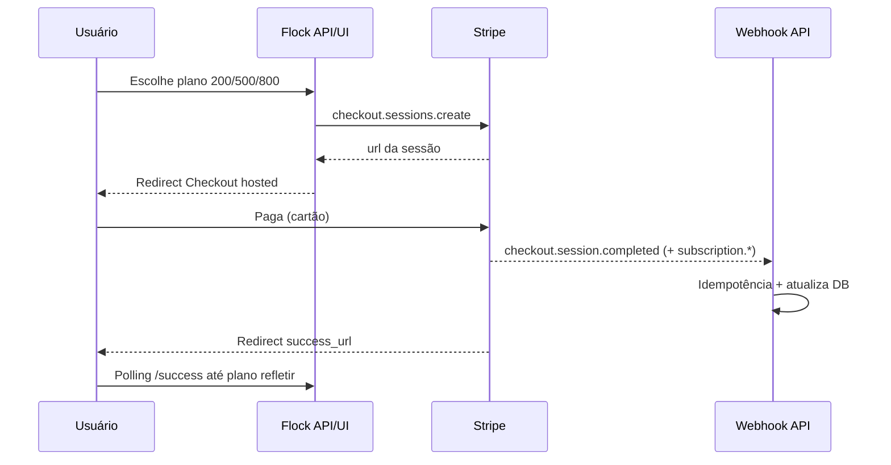
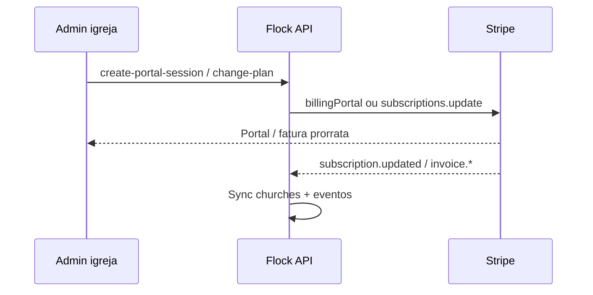

# Integração — Stripe

> Índice: [[06_integracoes/index]] · Módulo de domínio: [[04_modulos/billing]] · Infra: [[03_arquitetura/infraestrutura]].

---

## 1. 📌 Visão Geral

**O que é:** plataforma de pagamentos usada pelo Flock para assinaturas recorrentes (Billing + Checkout Session hosted + Customer Portal).

**Por que usamos:** cobrança de planos pagos (200/500/800 membros), gestão de cartão/faturas pelo portal Stripe, e eventos (webhooks) para manter `churches` / `pending_subscriptions` sincronizados — sem armazenar cartão no nosso banco.

**Módulos que utilizam:**

| Módulo | Uso |
| --- | --- |
| [[04_modulos/billing]] | Checkout autenticado, portal, change-plan, sync, webhooks, health |
| [[04_modulos/onboarding]] | Checkout público pós-interesse / pending → igreja |
| [[04_modulos/aquisicao]] | Landing → `/checkout?plan=…` → sessão Stripe |
| [[04_modulos/auth]] / conta | Bloqueio de exclusão se assinatura paga ativa; resolve session no register |
| [[04_modulos/config]] | Quotas de membros ligadas ao plano efetivo |

**SDK / API (código):**

| Item | Valor |
| --- | --- |
| Pacote backend | `stripe` `^20.0.0` (`backend/package.json`) |
| API version pinada | `2025-11-17.clover` |
| Landing | `@stripe/stripe-js` / `@stripe/react-stripe-js` presentes no `package.json` — fluxo principal é **redirect** via API (sem publishable key nas env documentadas) |

**Plano Stripe (conta):** <!-- PREENCHER MANUALMENTE: plano da conta Stripe (Standard / etc.) e país da conta -->

---

## 2. 🌍 Ambientes

| Ambiente | Modo Stripe | Onde configurar | Observação |
| --- | --- | --- | --- |
| Development | **Test** | `backend/.env` | `sk_test_…` + `whsec_…` do **Stripe CLI** (`stripe listen`) |
| Staging | **Test** (recomendado) | Railway staging Variables | <!-- PREENCHER MANUALMENTE: se existe staging isolado; senão, anotar “N/A” --> |
| Production | **Live** | Railway production Variables | `sk_live_…` + webhook endpoint público + price IDs **live** |

### Como distinguir chaves

| Prefixo / ID | Significado |
| --- | --- |
| `sk_test_…` | Secret key — **teste** (sem cobrança real) |
| `sk_live_…` | Secret key — **produção** (⚠️ cobrança real) |
| `pk_test_…` / `pk_live_…` | Publishable — **não usado** nas variáveis obrigatórias atuais do backend |
| `whsec_…` | Signing secret do endpoint webhook (CLI ou Dashboard) |
| `price_…` | Price ID — **diferente** entre Test e Live; nunca misturar |
| `cus_…` / `sub_…` / `cs_…` | Customer / Subscription / Checkout Session |

⚠️ **NUNCA** use `sk_live_` / prices live em desenvolvimento. No Dashboard, o toggle **Test mode / Live mode** (canto superior) define qual conjunto de keys/products/webhooks você está vendo.

Toggle CLI live (evitar em dev):

```bash
# Não recomendado em desenvolvimento local
stripe listen --forward-to localhost:4000/api/stripe/webhook --api-key sk_live_xxxxx
```

---

## 3. 🔑 Credenciais e Variáveis de Ambiente

Obrigatórias no **boot** da API (`validateStripeConfig` em `backend/src/services/stripe.ts`). Sem elas o servidor **não sobe**.

| Variável | Descrição | Onde obter | Ambiente |
| --- | --- | --- | --- |
| `STRIPE_SECRET_KEY` | Secret key da API | Dashboard → Developers → API keys → Secret key | Test: `sk_test_` · Prod: `sk_live_` |
| `STRIPE_WEBHOOK_SECRET` | Valida assinatura `Stripe-Signature` | Dashboard → Developers → Webhooks → endpoint → Signing secret **ou** saída do `stripe listen` | Dev: CLI · Prod: endpoint live |
| `STRIPE_PRICE_ID_M200` | Price do plano 200 (R$ 29,99/mês no `PLAN_CONFIG`) | Products → produto plano 200 → Price ID | Mesmo modo da secret key |
| `STRIPE_PRICE_ID_M500` | Price do plano 500 (R$ 59,99) | idem | idem |
| `STRIPE_PRICE_ID_M800` | Price do plano 800 (R$ 89,99) | idem | idem |

**Relacionadas (não são credenciais Stripe, mas exigidas pelo fluxo):**

| Variável | Papel |
| --- | --- |
| `FRONTEND_URL` | success/cancel/return do app autenticado |
| `LANDING_URL` | checkout público / CORS / redirects da aquisição |
| `HEALTH_CHECK_TOKEN` | opcional em `GET /api/health/stripe` |

**Não há** `STRIPE_PRICE_ID_M100` — plano 100 é gratuito no app (sem Price Stripe).

### Caminhos no Dashboard

```
STRIPE_SECRET_KEY
  → https://dashboard.stripe.com → Developers → API keys
  → Reveal live/test key → Secret key

STRIPE_WEBHOOK_SECRET
  → Developers → Webhooks → [endpoint] → Signing secret → Reveal
  (dev) stripe listen → “Your webhook signing secret is whsec_…”

STRIPE_PRICE_ID_M200 / M500 / M800
  → Product catalog → Products → [produto do plano]
  → Pricing → copiar Price ID (price_…)
```

---

## 4. 🔔 Webhooks

### Endpoint do projeto

| Ambiente | URL |
| --- | --- |
| Production | `https://<!-- PREENCHER MANUALMENTE: host da API em prod, ex. api.flock… -->/api/stripe/webhook` |
| Development | `http://localhost:4000/api/stripe/webhook` (via Stripe CLI) |

Rota: `POST /api/stripe/webhook` — body **raw** (montada **antes** de `express.json()`), validação `stripe.webhooks.constructEvent`, rate limit ~300/min.

### Eventos tratados no código

Fonte: `HANDLED_EVENT_TYPES` / `switch` em `stripeWebhookService.ts`.

| Evento | Quando dispara | O que o sistema faz |
| --- | --- | --- |
| `checkout.session.completed` | Checkout Session paga/concluída | Vincula customer/subscription à igreja ou cria pending; define plano pelo price ID |
| `customer.subscription.created` | Assinatura criada | Atualiza se ainda não vinculada; **no-op** se checkout já processou (anti-duplicata) |
| `customer.subscription.updated` | Mudança de plano/status/`cancel_at_period_end` | Atualiza status, plano, datas; pode forçar plano 100 se cancelada/expirada |
| `customer.subscription.deleted` | Assinatura cancelada/removida | Marca cancelada; caminho para plano free quando aplicável |
| `invoice.payment_succeeded` | Fatura paga (incl. renovação) | Reforça status ativo / sync plano |
| `invoice.payment_failed` | Cobrança falhou | Status `past_due` + efeitos de quota no produto |

Outros tipos chegam → log “não tratado”; não falham o claim de forma a quebrarem o endpoint de forma esperada (ver serviço).

Idempotência: tabela `processed_webhook_events` (claim atômico). Falha de processamento → release + HTTP 500 para retry Stripe.

### Como configurar no Dashboard

1. Abrir [Webhooks](https://dashboard.stripe.com/webhooks) no modo correto (Test vs Live).
2. **Add endpoint**.
3. URL: `https://<api-host>/api/stripe/webhook`.
4. Selecionar os 6 eventos da tabela acima (ou “Select events” equivalentes).
5. Salvar → copiar **Signing secret** → `STRIPE_WEBHOOK_SECRET=whsec_…` no Railway (prod) / `.env` (dev).
6. Deploy/restart da API para carregar o secret.

### Como testar em desenvolvimento

```bash
# Terminal 1 — API
cd backend && npm run dev

# Terminal 2 — forward de eventos
stripe login
stripe listen --forward-to localhost:4000/api/stripe/webhook
# Copiar whsec_… → STRIPE_WEBHOOK_SECRET no .env e reiniciar a API se necessário

# Terminal 3 — dispara eventos sintéticos
stripe trigger checkout.session.completed
stripe trigger customer.subscription.updated
stripe trigger invoice.payment_failed
```

Checkout E2E com cartão de teste: [Testing cards](https://docs.stripe.com/testing#cards) — ex. `4242 4242 4242 4242`.

Health:

```bash
curl http://localhost:4000/api/health/stripe
```

---

## 5. 🚀 Setup do Zero (Guia Completo)

### Pré-requisitos

- [ ] Conta em [https://dashboard.stripe.com/register](https://dashboard.stripe.com/register)
- [ ] Acesso com permissão de Developer / Admin na conta
- [ ] Backend Flock e Railway (ou host) acessíveis
- [ ] Stripe CLI instalada (dev): [docs.stripe.com/stripe-cli](https://docs.stripe.com/stripe-cli)
- [ ] Conta com capacidade de receber em **BRL** (assinaturas mensais)  
  <!-- PREENCHER MANUALMENTE: país da conta Stripe e status de ativação (payouts) -->

### Configuração da Conta (Dashboard)

1. Ativar **Test mode**.
2. Completar dados da conta / negócio o quanto for necessário para testar Billing.
3. **Customer Portal** (Settings → Billing → Customer portal):
   - Habilitar gestão de assinatura (cancelar, atualizar método de pagamento).
   - <!-- PREENCHER MANUALMENTE: opções exatas ativas no portal (cancel at period end, switch plans, invoices, etc.) -->
4. Criar **Products + Prices** recorrentes mensais em BRL (valores alinhados ao app):

| Plano app | Limite membros | Preço sugerido (`PLAN_CONFIG`) | Env |
| --- | --- | --- | --- |
| 200 | 200 | R$ 29,99 / mês | `STRIPE_PRICE_ID_M200` |
| 500 | 500 | R$ 59,99 / mês | `STRIPE_PRICE_ID_M500` |
| 800 | 800 | R$ 89,99 / mês | `STRIPE_PRICE_ID_M800` |

Sugestão de nomenclatura: `Flock — Plano 200 Membros` (recorrente `month`, `brl`, valor em centavos: `2999`, `5999`, `8999`).

5. Repetir Products/Prices em **Live mode** quando for a produção (IDs diferentes!).

### Configuração de Desenvolvimento

1. Dashboard Test → API keys → copiar Secret key.
2. Em `backend/.env`:

```bash
STRIPE_SECRET_KEY=sk_test_...
STRIPE_PRICE_ID_M200=price_...
STRIPE_PRICE_ID_M500=price_...
STRIPE_PRICE_ID_M800=price_...
FRONTEND_URL=http://localhost:3001
LANDING_URL=http://localhost:3000
```

3. `stripe listen --forward-to localhost:4000/api/stripe/webhook` → colocar o `whsec_…` em `STRIPE_WEBHOOK_SECRET`.
4. `npm run dev` no backend — deve logar: variáveis Stripe OK.
5. Fluxo: landing/checkout ou app → cartão `4242…` → conferir webhook nos logs + `processed_webhook_events`.

### Configuração de Produção

1. Dashboard → **Live mode** → criar/confirmar Products/Prices live.
2. API keys live → `STRIPE_SECRET_KEY=sk_live_…`.
3. Railway → Projeto → Serviço **API** → Variables:

   - `STRIPE_SECRET_KEY`
   - `STRIPE_WEBHOOK_SECRET` (do endpoint live, **não** do CLI)
   - `STRIPE_PRICE_ID_M200` / `M500` / `M800` (**IDs live**)
   - `FRONTEND_URL` / `LANDING_URL` HTTPS corretos

4. Webhooks → endpoint `https://<api>/api/stripe/webhook` com os 6 eventos → copiar signing secret.
5. Redeploy / restart do serviço API.
6. <!-- PREENCHER MANUALMENTE: checklist Go-live Stripe (conta verificada, banca, Statement Descriptor) -->

### Verificação

- [ ] `GET /api/health/stripe` → `status: ok`, `stripe_reachable: true`
- [ ] Checkout test/live com cartão de teste (ou real em live) completa e redireciona
- [ ] Dashboard → Webhooks → tentativa com HTTP **200**
- [ ] Igreja no DB com `stripe_customer_id` + `stripe_subscription_id` / plano correto
- [ ] Portal (`create-portal-session`) abre e retorna ao `FRONTEND_URL`
- [ ] (Opcional) `sync-subscription` alinha estado se webhook atrasar

---

## 6. ⚙️ Configurações Importantes (Dashboard)

### Produtos e Preços

- **Esperado:** 3 prices recorrentes mensais BRL mapeados às env `STRIPE_PRICE_ID_M*`.
- **Plano 100:** só no app; cancelamento/expiração → free via webhook/jobs, sem Price Stripe.
- **Como alterar preço:** criar **novo** Price (não editar o valor de um price existente em uso); atualizar env e fazer deploy; arquivar price antigo (`active: false`) — não deletar se houver assinaturas históricas.
- IDs reais em prod/test: <!-- PREENCHER MANUALMENTE: tabela product_id / price_id test e live -->

### Customer Portal

- Usado por `billingPortal.sessions.create` (`return_url` = frontend).
- Configuração é **só no Dashboard** (não há `configuration` ID no código).
- Como alterar: Settings → Billing → Customer portal → salvar.
- <!-- PREENCHER MANUALMENTE: screenshot/nota das opções ativas (cancelamento no fim do período, troca de plano, etc.) -->

### Checkout Session (comportamento esperado na plataforma)

Definido no código, refletir no Dashboard se aplicável:

- `mode: subscription`
- `payment_method_types: ['card']`
- `allow_promotion_codes: true` → convém ter **Promotion codes** habilitados no Dashboard se for usar cupons
- Metadata: `church_id` / tokens de pending (customer + subscription_data)

### Moeda e localização

- Moeda de catálogo: **BRL**
- <!-- PREENCHER MANUALMENTE: preferred locales / e-mails Stripe em pt-BR se configurado -->

### Webhooks e Developers

- Um endpoint por ambiente (test CLI vs live URL).
- Monitorar aba **Attempts** / falhas e ativar alertas Stripe se disponível.

---

## 7. 🔄 Fluxo Operacional

### Checkout (assinatura nova)



### Portal e mudança de plano



Prorrata em change-plan: `proration_behavior: 'always_invoice'`.

---

## 8. 💰 Plano e Limites

| Item | Limite atual | Plano Stripe | Notas |
| --- | --- | --- | --- |
| Produtos/prices usados | 3 recorrentes + free app | — | Sem Price para plano 100 |
| Volume de assinaturas | <!-- PREENCHER MANUALMENTE --> | <!-- PREENCHER MANUALMENTE --> | Ver Billing no Dashboard |
| Taxas | <!-- PREENCHER MANUALMENTE: % + R$ fixo BR --> | Standard | [Preços Stripe BR](https://stripe.com/br/pricing) |

- **Plano atual da conta:** <!-- PREENCHER MANUALMENTE -->
- **Custo estimado mensal (fees):** <!-- PREENCHER MANUALMENTE -->
- **Quando revisar:** crescimento de volume, chargebacks, ou necessidade de Tax/Connect (hoje: **sem** Connect no código)
- **Pricing oficial:** https://stripe.com/pricing

---

## 9. 🚨 Troubleshooting

### Pagamento ok, plano não muda no app

- **Sintoma:** success page / dashboard ainda free ou plano antigo.
- **Causa:** webhook atrasado/falhou; `STRIPE_WEBHOOK_SECRET` errado; price ID de outro modo (test vs live).
- **Solução:**
  1. Dashboard → Developers → Webhooks → Attempts.
  2. Logs API + `processed_webhook_events`.
  3. Conferir se `price_` do evento está mapeado nas env.
  4. Workaround: `POST /api/stripe/sync-subscription` (admin).

### Webhook não está sendo recebido

- **Sintoma:** eventos sem HTTP 200 / assinatura só no Stripe.
- **Checklist:**
  - [ ] URL `…/api/stripe/webhook` correta e HTTPS em prod?
  - [ ] Modo Test/Live do endpoint = modo das keys?
  - [ ] `STRIPE_WEBHOOK_SECRET` do **mesmo** endpoint (CLI ≠ Dashboard)?
  - [ ] Seis eventos selecionados?
  - [ ] API no ar / body raw (sem JSON parser antes)?
  - [ ] Em de: CLI `stripe listen` rodando?

### Credenciais inválidas / API error

- **Sintoma:** checkout 500; health `stripe_reachable: false`; 401 na API Stripe.
- **Checklist:**
  - [ ] `sk_test_` vs `sk_live_` no ambiente certo?
  - [ ] Key rotacionada/revogada no Dashboard?
  - [ ] Variáveis presentes no Railway do serviço **API** (não só frontend)?

### Portal não abre

- **Sintoma:** 400 / erro ao criar portal session.
- **Causa:** igreja sem `stripe_customer_id`; Customer Portal desabilitado no Dashboard.
- **Solução:** completar checkout ou criar customer; habilitar portal nas Settings.

### Assinatura `past_due` / cartão falhou

- Usuário recebe efeito de cobrança falha (`invoice.payment_failed`).
- Orientar atualização do cartão no **Customer Portal**; após sucesso, esperar `invoice.payment_succeeded`.

### Múltiplas assinaturas no mesmo customer

- Evitar checkouts duplicados; cancelar extras no Dashboard; sync manual (ver checklist §10 abaixo).

---

## 10. 📋 Checklist de Manutenção

**Mensal:**

- [ ] Revisar Webhooks → falhas / retries
- [ ] Uso de volume e receita no Dashboard
- [ ] `GET /api/health/stripe` em prod (ou monitoramento)

**Trimestral:**

- [ ] Rotacionar `STRIPE_SECRET_KEY` se política de segurança exigir
- [ ] Conferir SDK `stripe` vs API version pinada (`2025-11-17.clover`)
- [ ] Arquivar prices obsoletos; validar envs

**Anual / Go-live checks:**

- [ ] Conta legal/payouts atualizados
- [ ] Statement descriptor / branding
- [ ] Revisão de eventos de webhook ainda alinhados ao código
- [ ] Plano comercial (valores BRL) ainda batem com `PLAN_CONFIG` + prices Stripe

---

## 11. 🔗 Referências

- **Dashboard:** https://dashboard.stripe.com
- **Documentação:** https://docs.stripe.com
- **Billing / Subscriptions:** https://docs.stripe.com/billing
- **Checkout:** https://docs.stripe.com/payments/checkout
- **Customer Portal:** https://docs.stripe.com/customer-management
- **Webhooks:** https://docs.stripe.com/webhooks
- **Testing:** https://docs.stripe.com/testing
- **CLI:** https://docs.stripe.com/stripe-cli
- **Status:** https://status.stripe.com
- **Changelog API:** https://docs.stripe.com/changelog
- **Suporte:** https://support.stripe.com
- **No produto:** [[04_modulos/billing]] · [[04_modulos/onboarding]] · [[06_integracoes/index]]
