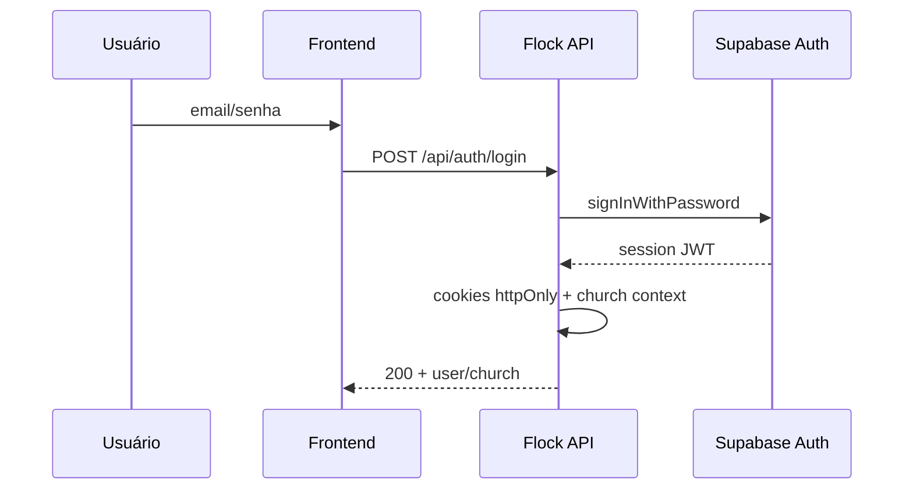
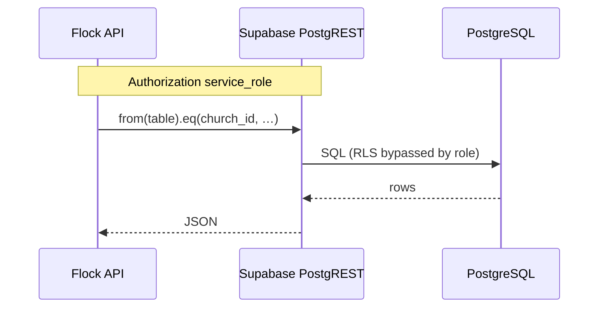
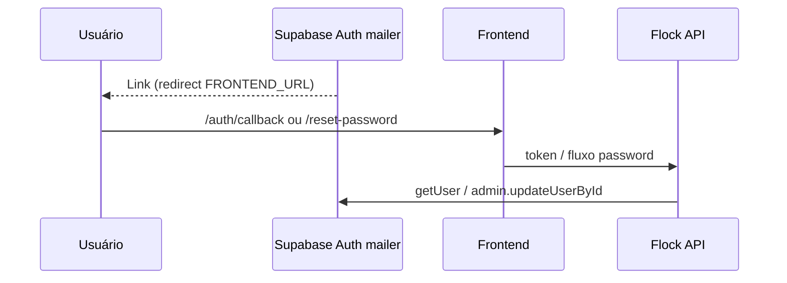

# Integração — Supabase

> Índice: [[06_integracoes/index]] · Schema: [[03_arquitetura/banco-de-dados]] · Auth: [[04_modulos/auth]] · Segurança: [[03_arquitetura/seguranca]] · Env: [[ENVIRONMENT-VARIABLES]].

---

## 1. 📌 Visão Geral

**O que é:** Backend-as-a-Service com **PostgreSQL gerenciado** + **Auth** (JWT) + API PostgREST. O Flock usa o projeto cloud; o frontend **não** fala direto com o Supabase — só a API Express.

**Por que usamos:** identidade (login/senha, confirmação, reset) e datastore multi-tenant (`church_id`) sem operar Postgres/Auth próprios no Railway.

**Projeto em uso (live):**

| Campo | Valor |
| --- | --- |
| Nome | `flock-app-01` |
| Ref / ID | `lzsybtvywrhwsxtsywbw` |
| Região | `sa-east-1` |
| Status | `ACTIVE_HEALTHY` (MCP 2026-07-14) |
| API URL | `https://lzsybtvywrhwsxtsywbw.supabase.co` |
| Postgres | **17.4** (`17.4.1.068`) |
| Host DB | `db.lzsybtvywrhwsxtsywbw.supabase.co` |
| Criado | 2025-06-06 |

**Módulos que utilizam:**

| Módulo | Uso |
| --- | --- |
| [[04_modulos/auth]] | `auth.users`, signUp/signIn, cookies via JWT Supabase, refresh, reset |
| [[04_modulos/config]] | Perfil conta, delete user admin, phone metadata |
| Quase todos os de domínio | Queries `.from` / RPC via **service_role** (membros, congregações, grupos, calendário, integração, billing tables, waitlist, etc.) |
| [[04_modulos/billing]] | Tabelas Stripe + RPCs `cleanup_old_webhook_events`, `validate_subscription_integrity` |

**SDK (código):**

| Item | Valor |
| --- | --- |
| Pacote | `@supabase/supabase-js` `^2.38.0` |
| Cliente anon | `supabase` — **somente** `supabase.auth.*` |
| Cliente admin | `supabaseAdmin` / `db` — **todas** as queries PostgREST + Auth Admin |
| Frontend | **Sem** `@supabase/*` nem `NEXT_PUBLIC_SUPABASE_*` |
| Não usado no app | Storage buckets, Realtime channels, Edge Functions, Database Webhooks inbound |

**Plano da organização/projeto:** <!-- PREENCHER MANUALMENTE: Free / Pro / Team / Enterprise no org `bhykorvxieupnbtlgars` -->

---

## 2. 🌍 Ambientes

Não há “Test mode” no Dashboard como no Stripe. Isolamento = **projetos distintos** (ou branch DB) + URLs/keys diferentes.

| Ambiente | Modo | Onde configurar | Observação |
| --- | --- | --- | --- |
| Development | Projeto shared ou local | `backend/.env` | Hoje o código aponta para o **mesmo** padrão cloud via `SUPABASE_URL` — <!-- PREENCHER: usa flock-app-01 em local ou projeto/branch separado? --> |
| Staging | Projeto/branch isolado | Railway staging Variables | <!-- PREENCHER MANUALMENTE: N/A se inexistente --> |
| Production | `flock-app-01` | Railway → API Variables | ⚠️ Dados reais de igrejas/PII |

### Como distinguir credenciais

| Sinal | Significado |
| --- | --- |
| `SUPABASE_URL` host | Projeto: `https://<ref>.supabase.co` — ref ≠ projeto diferente |
| JWT `anon` / `service_role` | Claim `role` no payload; `service_role` bypassa RLS |
| Prefixo URL `lzsybtvywrhwsxtsywbw` | Projeto de produção documentado |

⚠️ **NUNCA** coloque `SUPABASE_SERVICE_ROLE_KEY` no frontend, landing ou commits. Preferir **não** usar service_role de produção em notebook se houver risco de script destrutivo — use projeto de desenvolvimento.

Boot da API: sem `SUPABASE_URL` / `SUPABASE_KEY` / `SUPABASE_SERVICE_ROLE_KEY` → **throw** e o servidor não sobe.

---

## 3. 🔑 Credenciais e Variáveis de Ambiente

| Variável | Descrição | Onde obter | Ambiente |
| --- | --- | --- | --- |
| `SUPABASE_URL` | Project URL (API) | Settings → API → Project URL | Obrigatória |
| `SUPABASE_KEY` | Anon / publishable (JWT público) | Settings → API → `anon` `public` | Obrigatória (só Auth no backend) |
| `SUPABASE_SERVICE_ROLE_KEY` | Secret que bypassa RLS | Settings → API → `service_role` `secret` | Obrigatória |

Relacionadas ao Auth (redirects — configuradas **também** no Dashboard Auth):

| Variável | Papel |
| --- | --- |
| `FRONTEND_URL` | `emailRedirectTo` / `redirectTo` → `/auth/callback`, `/reset-password` |

Não há `DATABASE_URL` / connection string no runtime da API — acesso via PostgREST HTTPS do SDK.

### Caminhos no Dashboard

```
SUPABASE_URL
  → https://supabase.com/dashboard/project/lzsybtvywrhwsxtsywbw
  → Project Settings → API → Project URL

SUPABASE_KEY (anon)
  → Project Settings → API → Project API keys → anon public
  → Reveal / Copy

SUPABASE_SERVICE_ROLE_KEY
  → Project Settings → API → Project API keys → service_role secret
  → Reveal / Copy
  ⚠️ nunca expor no client
```

(Com UI nova de keys: Settings → API Keys — mapeie **publishable** ≈ anon e **secret** ≈ service_role conforme o painel atual.)

---

## 4. 🚀 Setup do Zero (Guia Completo)

### Pré-requisitos

- [ ] Conta em [https://supabase.com/dashboard](https://supabase.com/dashboard)
- [ ] Organização com permissão Owner/Admin
- [ ] Decisão de região (`sa-east-1` para latência BR — alinhado ao projeto atual)
- [ ] SQL/schema de referência: [[03_arquitetura/banco-de-dados]] / `backend/bd-structure.sql` (pode estar atrasado)

### Configuração da Conta / Projeto

1. **New project** → nome (ex. `flock-app-01`) → região `sa-east-1` → senha forte do DB (guardar no cofre).
2. Aguardar status Healthy.
3. **Authentication → Providers:** habilitar **Email** (senha). OAuth não é usado no código atual.
4. **Authentication → URL Configuration:**
   - Site URL = `FRONTEND_URL` de prod (ex. `https://app.flock…`)
   - Redirect URLs allowlist incluir:
     - `{FRONTEND_URL}/auth/callback`
     - `{FRONTEND_URL}/reset-password`
     - localhost equivalentes em dev
5. **Authentication → Emails:** templates / remetente Supabase para confirmação e reset  
   <!-- PREENCHER MANUALMENTE: SMTP custom vs e-mail padrão Supabase; domínio de From do Auth -->
6. Aplicar schema: migrations / SQL das tabelas `public`, RLS `deny_anon`, functions/RPCs/views de billing (ver docs de banco).
7. Copiar URL + anon + service_role para o ambiente.

### Configuração de Desenvolvimento

1. Em `backend/.env`:

```env
SUPABASE_URL=https://lzsybtvywrhwsxtsywbw.supabase.co
SUPABASE_KEY=eyJ...anon...
SUPABASE_SERVICE_ROLE_KEY=eyJ...service_role...
FRONTEND_URL=http://localhost:3001
```

2. Em Auth URL config, liberar `http://localhost:3001/**` redirects necessários.
3. `npm run dev` no backend — deve passar da validação em `supabase.ts`.
4. Testar register/login/forgot-password.

### Configuração de Produção

1. Confirmar projeto `flock-app-01` (ou o de prod) Healthy.
2. Site URL + Redirect URLs **HTTPS** do app.
3. Railway → serviço **API** → Variables:

   - `SUPABASE_URL`
   - `SUPABASE_KEY`
   - `SUPABASE_SERVICE_ROLE_KEY`
   - `FRONTEND_URL` (e `LANDING_URL` para CORS app)

4. Redeploy API.
5. <!-- PREENCHER MANUALMENTE: backups automáticos / PITR conforme plano -->

### Verificação

- [ ] Dashboard → Project status Healthy
- [ ] Register + e-mail de confirmação Auth chega e callback seta cookies
- [ ] Login + `getUser` / refresh funcionam
- [ ] Query de domínio (ex. listar membros autenticado) retorna 200
- [ ] Sem service_role: boot falha com mensagem explícita
- [ ] Table Editor / SQL: RLS ligada; anon não lê `public` à vontade

---

## 5. ⚙️ Configurações Importantes (Dashboard)

### Projeto e região

- Região **fixada** após create (hoje `sa-east-1`). Trocar região = projeto novo + migração.
- Como “alterar”: criar projeto na região desejada e migrar dados — não há move-region trivial.

### Auth — Email / senha

- Provider: **Email**.
- Fluxos no código: `signUp`, `signInWithPassword`, `resend`, `resetPasswordForEmail`, `updateUser`, Admin `createUser` / `deleteUser` / `getUserById` / `listUsers` / `signOut` / `updateUserById`.
- Confirmação de e-mail **obrigatória** no produto (login bloqueia unconfirmed).
- Como alterar: Authentication → Providers / settings de confirm email.

### Auth — URL Configuration

| Tipo | URL esperada (app) |
| --- | --- |
| Site URL | `FRONTEND_URL` |
| Confirm / change email | `{FRONTEND_URL}/auth/callback` |
| Reset password | `{FRONTEND_URL}/reset-password` |

Sem allowlist correta → link do e-mail Auth falha com redirect inválido.

### Auth — E-mails do Supabase vs Resend

| Canal | Quem envia | Quando |
| --- | --- | --- |
| Supabase Auth mailer | Plataforma Supabase (ou SMTP custom no painel) | Confirm signup, reset password, change email (links mágicos) |
| Resend (`emailService`) | Flock API | Welcome, billing, waitlist, convites, avisos de conta (HTML próprio) |

<!-- PREENCHER MANUALMENTE: se Auth usa SMTP custom / Resend como SMTP do Auth -->

### Database — RLS

- Todas as tabelas `public` com RLS; policies restritivas (**deny_anon**).
- Backend **bypassa** com service_role; isolamento tenant é **filtro `church_id` na aplicação**.
- Como alterar: Authentication não — SQL Editor / Policies. Não abrir `anon` sem ADR.

### Database — Schema / migrations

- Sem pasta `migrations/` versionada no monorepo (estado atual da KB).
- Aplicar SQL no projeto (MCP `apply_migration`, SQL Editor, ou CLI).
- Referência: [[03_arquitetura/banco-de-dados]], dump `backend/bd-structure.sql`.

### Recursos **não** configurados / não usados pelo app

| Recurso | Status no Flock |
| --- | --- |
| Storage | Não |
| Realtime | Não |
| Edge Functions | Não |
| Database Webhooks → API Flock | Não (webhooks de billing são **Stripe** → Flock) |
| Supabase Auth no browser | Não — cookies via API própria |

### Connection pooling / Postgres

- App não usa driver `pg` direto; pooling Supabase (Supavisor) só entra se alguém conectar com connection string (ex. BI, migração manual).
- <!-- PREENCHER MANUALMENTE: pooler URI guardada no cofre da equipe, se houver -->

---

## 6. 🌐 Configuração de DNS

**Padrão atual:** API em `*.supabase.co` — **sem** DNS custom obrigatório no domínio Flock.

Custom domain Supabase (opcional, plano qualificado):

| Tipo | Host | Valor | Propósito |
| --- | --- | --- | --- |
| CNAME | <!-- PREENCHER se usar custom domain --> | <!-- valor do wizard Supabase --> | API/Auth em hostname próprio |

**Onde configurar:** registrador / Cloudflare do domínio Flock.  
**Verificar:** `dig CNAME <host>` + status no painel Custom Domains.

Se Auth SMTP custom com domínio próprio, DNS de e-mail segue o provedor SMTP (pode cruzar com [[06_integracoes/resend]]) — <!-- PREENCHER se aplicável -->.

---

## 7. 🔄 Fluxo Operacional

### Auth (login)



### Dados de domínio



### Confirmação de e-mail / reset



---

## 8. 💰 Plano e Limites

| Item | Limite atual | Plano | Notas |
| --- | --- | --- | --- |
| DB size / MAU Auth / egress | <!-- PREENCHER MANUALMENTE --> | <!-- PREENCHER --> | Dashboard → Settings → Usage / Billing |
| Compute / disk | <!-- PREENCHER --> | | Pause em Free se inactivity |
| PITR / backups | <!-- PREENCHER --> | | |

- **Plano atual:** <!-- PREENCHER MANUALMENTE -->
- **Custo estimado:** <!-- PREENCHER MANUALMENTE -->
- **Quando fazer upgrade:** pausas, disk cheio, MAU Auth, necessidade de PITR / custom domain / suporte
- **Preços:** https://supabase.com/pricing

---

## 9. 🚨 Troubleshooting

### API não sobe — variáveis Supabase

- **Sintoma:** Error na inicialização sobre `SUPABASE_*` / service_role.
- **Solução:** Conferir as 3 vars no `.env` / Railway do serviço API; sem typos na URL `https://<ref>.supabase.co`.

### Credenciais inválidas / JWT expired no Auth

- **Sintoma:** 401 no login/`getUser`; “Invalid API key”.
- **Checklist:**
  - [ ] Keys do **mesmo** projeto que a URL?
  - [ ] Anon vs service_role trocadas?
  - [ ] Key rotacionada no Dashboard e Railway desatualizado?

### Redirect inválido após e-mail Auth

- **Sintoma:** erro no browser ao clicar confirmação/reset.
- **Causa:** URL fora da allowlist Auth.
- **Solução:** Authentication → URL Configuration → incluir `FRONTEND_URL` + paths `/auth/callback` e `/reset-password` (+ localhost em dev).

### E-mail de confirmação Auth não chega

- **Sintoma:** register ok, caixa vazia.
- **Checklist:** Auth → Users (usuário criado?); Providers email; rate limit Auth; spam; SMTP custom; **não** confundir com Resend (welcome Resend ≠ mail de confirm Auth).

### Queries vazias / permission denied

- **Sintoma:** erro RLS ou 0 rows inesperados.
- **Causa:** usar anon em `.from` (não é o padrão Flock) ou esquecer `church_id` com service_role.
- **Solução:** garantir `supabaseAdmin` no backend; filtrar tenant; revisar Policies.

### Projeto paused / unhealthy

- **Sintoma:** timeouts, 5xx para `*.supabase.co`.
- **Solução:** Dashboard → Restore project (planos Free); checar [status.supabase.com](https://status.supabase.com); logs MCP/Dashboard.

### Webhook Supabase não chega

**Não aplicável** ao desenho atual — nenhum endpoint Flock consome Database/Auth webhooks da Supabase.

---

## 10. 📋 Checklist de Manutenção

**Mensal:**

- [ ] Usage (DB, Auth MAU, egress) vs plano
- [ ] Logs Auth / API errors no Dashboard
- [ ] Avisos de advisors (segurança RLS)

**Trimestral:**

- [ ] Rotacionar `service_role` / anon se política exigir (atualizar Railway)
- [ ] Revisar `@supabase/supabase-js`
- [ ] Backup / export crítico; validar restore procedure

**Anual / quando necessário:**

- [ ] Adequação do plano (Pro, compute)
- [ ] Revisar Redirect URLs e Site URL após mudança de domínio
- [ ] Auditoria: service_role só no backend; sem policies `anon` perigosas

---

## 11. 🔗 Referências

- **Dashboard projeto:** https://supabase.com/dashboard/project/lzsybtvywrhwsxtsywbw
- **Documentação:** https://supabase.com/docs
- **Auth:** https://supabase.com/docs/guides/auth
- **Database / RLS:** https://supabase.com/docs/guides/database/postgres/row-level-security
- **JS Client:** https://supabase.com/docs/reference/javascript/introduction
- **Status:** https://status.supabase.com
- **Changelog:** https://supabase.com/changelog
- **Pricing:** https://supabase.com/pricing
- **Suporte:** Dashboard → Support
- **No repo:** [[03_arquitetura/banco-de-dados]] · [[04_modulos/auth]] · [[03_arquitetura/seguranca]] · [[06_integracoes/index]]
