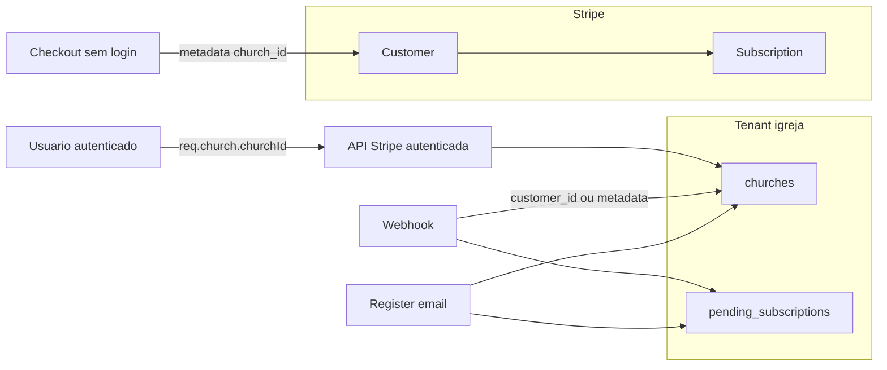

# Auditoria 02 — Multi-Tenant Stripe

**Projeto:** Flock (SaaS multi-tenant — igreja = tenant)  
**Escopo:** Separação financeira entre tenants (Stripe ↔ `churches` / `pending_subscriptions`)  
**Prompts:** [`payment-audit-general.mdc`](../prompts/PAYMENTS/payment-audit-general.mdc), [`02-multitenant.mdc`](../prompts/PAYMENTS/02-multitenant.mdc)  
**Data:** 2026-05-28  
**Modo:** Revisão estática de código (backend, webhooks, frontend, modelo de dados)  
**Contexto:** Pós-correções do tópico [01 — Webhooks](./01-audit-webhooks.md)

---

## Resumo executivo

O tenant primário é a **igreja** (`churches.id`), com contexto de sessão via `req.church.churchId` (`getChurchContextForUser`). Rotas autenticadas de gestão de plano (`sync-subscription`, `change-plan`, portal) **escopam corretamente** por `req.church.churchId` e exigem papel mínimo `admin`.

Há **riscos graves de isolamento** na fronteira checkout/webhook e no modelo **1 Stripe Customer por e-mail**:

| Severidade | Quantidade |
|------------|------------|
| CRÍTICO    | 2          |
| ALTO       | 4          |
| MÉDIO      | 4          |
| BAIXO      | 2          |

**Risco principal:** o vínculo financeiro tenant ↔ Stripe depende de `metadata.church_id` e de `stripe_customer_id` **sem constraint de unicidade** e com **reuso de Customer por e-mail** — webhooks e sync podem afetar o tenant errado ou compartilhar billing entre igrejas.

---

## Modelo multi-tenant (como está hoje)

| Conceito | Implementação |
|----------|----------------|
| Tenant | `churches` (1 registro = 1 igreja) |
| Contexto HTTP | `req.church = { churchId, role }` após `authMiddleware` |
| Membership | `church_users` (papel) + fallback `churches.user_id` (owner legado) |
| Stripe Customer | `churches.stripe_customer_id` (opcional, **sem UNIQUE**) |
| Stripe Subscription | `churches.stripe_subscription_id` (opcional, **sem UNIQUE**) |
| Pré-registro (landing) | `pending_subscriptions` por `email` → vinculado no `register` |
| Metadata Stripe | `church_id`, `customer_email`, `plan` em Checkout Session / Subscription |



---

## Pontos positivos

1. **Rotas sensíveis com auth + papel** — `sync-subscription`, `change-plan`, `create-portal-session`, `checkout-status`, `activate-free-plan` usam `authMiddleware` + `requireRole('admin')` ([`backend/src/routes/stripe.ts`](../../backend/src/routes/stripe.ts)).
2. **Checkout autenticado (caminho feliz)** — Com `optionalAuth`, `churchId` vem de `req.church.churchId`, não do body ([`stripeController.ts`](../../backend/src/controllers/stripeController.ts) L87–127).
3. **Portal e change-plan** — Leem `stripe_customer_id` / `stripe_subscription_id` apenas da igreja do contexto (`eq('id', req.church!.churchId)`).
4. **Webhooks pós-refactor** — `updateSubscriptionByStripeCustomer` atualiza `pending_subscriptions` quando ainda não há igreja (fluxo landing).
5. **Exclusão de conta** — Verifica assinatura paga ativa no `churchId` do contexto antes de deletar ([`accountController.ts`](../../backend/src/controllers/accountController.ts)).

---

## Achados

### ACHADO-MT01 — Checkout não autenticado aceita `church_id` arbitrário no body

**Severidade:** CRÍTICO  
**Categoria:** Multi-tenant · Segurança · Backend  
**Prioridade:** Imediata

**Explicação**  
`POST /api/stripe/create-checkout-session` é público (`optionalAuth`). No ramo não autenticado, `church_id` vem **diretamente do body** e é gravado em metadata da sessão Stripe sem validar se o caller é dono/admin dessa igreja.

**Impacto real**  
Atacante com UUID de outra igreja pode iniciar checkout com metadata `church_id` da vítima. Após pagamento, o webhook `checkout.session.completed` atualiza a igreja alvo via `.eq('id', churchId)` ([`stripeWebhookService.ts`](../../backend/src/services/stripeWebhookService.ts) L317–323) — **vinculação cruzada de assinatura paga** (gift attack ou sabotagem de billing).

**Cenário de falha**  
1. Obter/vazar `church_id` da igreja B.  
2. `POST /api/stripe/create-checkout-session` com `{ email, name, church_id: B, plan: "800" }`.  
3. Pagar → webhook atualiza igreja B.

**Evidência técnica**

```129:151:backend/src/controllers/stripeController.ts
      const { email, name, church_id } = req.body;
      // ...
      churchId = church_id;
      const customer = await getOrCreateCustomer(
        customerEmail,
        customerName,
        { church_id: church_id || 'pending' }
      );
```

```317:323:backend/src/services/stripeWebhookService.ts
  if (churchId && churchId !== 'pending') {
    const result = await supabase
      .from('churches')
      .update(churchUpdate)
      .eq('id', churchId)
```

**Solução recomendada**  
- Remover `church_id` do body em checkout público; usar apenas `pending`.  
- Se `church_id` for necessário, exigir autenticação + `req.church.churchId` e ignorar body.  
- No webhook: validar `session.customer` === `churches.stripe_customer_id` da igreja ou que metadata `church_id` corresponde ao customer da sessão após lookup.

---

### ACHADO-MT02 — Re-auth por cookie em `createCheckout` não preenche `req.church`

**Severidade:** CRÍTICO  
**Categoria:** Multi-tenant · Backend  
**Prioridade:** Imediata

**Explicação**  
Se `optionalAuth` não preencheu `req.user`/`req.church`, o bloco interno (L47–78) pode renovar o token e setar **apenas** `req.user`, sem chamar `getChurchContextForUser`. A condição `if (req.user && req.church)` falha e o fluxo cai no ramo **não autenticado**, aceitando `church_id` do body mesmo com usuário logado.

**Impacto real**  
Admin autenticado por cookie “parcial” pode inadvertidamente (ou via manipulação de body) criar checkout no ramo público → mesmo risco do MT01.

**Cenário de falha**  
Sessão com access token inválido mas refresh válido → `req.user` setado, `req.church` ausente → checkout landing com `church_id` arbitrário.

**Evidência técnica**

```47:78:backend/src/controllers/stripeController.ts
    if (!req.user && req.cookies) {
      // ... refresh ...
      req.user = { id: ..., email: ... };
      // req.church NÃO é preenchido aqui
    }
    if (req.user && req.church) {
      // ramo autenticado
    } else {
      const { email, name, church_id } = req.body;
```

**Solução recomendada**  
Após obter `req.user`, sempre executar `getChurchContextForUser(req.user.id)` e preencher `req.church` antes do branch; ou exigir `authMiddleware` na rota de checkout do app.

---

### ACHADO-MT03 — `getOrCreateCustomer` compartilha Stripe Customer por e-mail entre tenants

**Severidade:** ALTO  
**Categoria:** Multi-tenant · Financeiro · Arquitetura  
**Prioridade:** Alta

**Explicação**  
`getOrCreateCustomer` lista customers Stripe por **e-mail** e reutiliza o mais recente ([`stripe.ts`](../../backend/src/services/stripe.ts) L105–119). Metadata `church_id` no Customer **não** impede reuso. Duas igrejas com o mesmo e-mail de billing (ou mesmo pastor em 2 CNPJs) compartilham `cus_xxx`.

**Impacto real**  
- Segunda igreja grava o mesmo `stripe_customer_id`.  
- Webhook `updateSubscriptionByStripeCustomer` usa `.maybeSingle()` — com 2 igrejas no mesmo `customer_id`, **apenas uma** é atualizada de forma previsível.  
- Portal Stripe e `sync-subscription` operam no customer inteiro — mistura assinaturas de contextos distintos.

**Cenário de falha**  
Igreja A e B usam `pastor@email.com` → mesmo `cus_xxx` → pagamento/webhook atualiza só uma linha em `churches`.

**Evidência técnica**

```105:119:backend/src/services/stripe.ts
    const customers = await stripe.customers.list({ email, limit: 10 });
    if (customers.data.length > 0) {
      return customers.data[0];
    }
```

**Solução recomendada**  
Política **1 Customer por igreja**: buscar por metadata `church_id` ou sempre criar customer novo por igreja; nunca reutilizar só por e-mail. Documentar que um e-mail pode pagar várias igrejas com customers distintos.

---

### ACHADO-MT04 — Ausência de UNIQUE em `stripe_customer_id` / `stripe_subscription_id`

**Severidade:** ALTO  
**Categoria:** Banco · Multi-tenant  
**Prioridade:** Alta

**Explicação**  
Em [`bd-structure.sql`](../../backend/bd-structure.sql), `churches.stripe_customer_id` e `stripe_subscription_id` são `varchar` **sem UNIQUE**. Nada impede duas igrejas com o mesmo par de IDs (especialmente após MT03).

**Impacto real**  
Webhooks e queries `.maybeSingle()` por `stripe_customer_id` tornam o tenant afetado **não determinístico** — corrupção silenciosa de plano/status.

**Solução recomendada**  
`CREATE UNIQUE INDEX` parcial `WHERE stripe_customer_id IS NOT NULL` (e idem para `stripe_subscription_id`). Tratar violação na aplicação com alerta.

---

### ACHADO-MT05 — `checkCheckoutStatus` sem escopo ao tenant da sessão

**Severidade:** ALTO  
**Categoria:** Multi-tenant · Segurança · Backend  
**Prioridade:** Alta

**Explicação**  
Endpoint exige admin na igreja do contexto, mas a confirmação busca **qualquer** igreja com `stripe_subscription_id = session.subscription` — **sem** `eq('id', req.church.churchId)`.

**Impacto real**  
Admin da igreja A informa `session_id` de checkout da igreja B (vazado em URL/logs) → resposta `confirmed: true` com `plan_type` e `subscription_status` de B (**vazamento cross-tenant**). O polling não atualiza a igreja errada no banco, mas **confirma e expõe** dados de outro tenant.

**Evidência técnica**

```685:704:backend/src/controllers/stripeController.ts
    const { data: church } = await supabase
      .from('churches')
      .select('id, stripe_subscription_id, plan_type, subscription_status')
      .eq('stripe_subscription_id', session.subscription as string)
      .single();
    // sem filtro req.church.churchId
```

**Solução recomendada**  
Recuperar session → validar `metadata.church_id === req.church.churchId` (ou customer da igreja). Buscar igreja apenas por `id` do contexto + `stripe_subscription_id` coincidente.

---

### ACHADO-MT06 — Webhook confia em `metadata.church_id` sem validar Customer ↔ Igreja

**Severidade:** ALTO  
**Categoria:** Webhook · Multi-tenant  
**Prioridade:** Alta

**Explicação**  
`handleCheckoutCompleted` aplica update por `churchId` metadata sem checar se `customerId` da sessão já pertence a outra igreja ou se a igreja já tem outro customer.

**Impacto real**  
Combinado com MT01: metadata malicioso sobrescreve plano da vítima. Com metadata legítimo mas customer compartilhado (MT03): estado inconsistente entre igrejas.

**Solução recomendada**  
Antes do update: `SELECT stripe_customer_id FROM churches WHERE id = churchId` — exigir `NULL` ou igual a `customerId` da sessão; caso contrário, falhar webhook (500) para investigação.

---

### ACHADO-MT07 — Contexto de igreja único e ambíguo para multi-membership

**Severidade:** MÉDIO  
**Categoria:** Multi-tenant · Arquitetura  
**Prioridade:** Média

**Explicação**  
`getChurchContextForUser` usa `.maybeSingle()` em `church_users` sem ordenação ([`churchContext.ts`](../../backend/src/services/churchContext.ts) L10–15). Usuário em **mais de uma** igreja ativa pode ter contexto errado ou erro não tratado.

**Impacto real**  
Pagamentos, sync e portal operam na igreja “errada” sem o usuário perceber.

**Solução recomendada**  
Seleção explícita de igreja ativa (header/cookie `X-Church-Id`), ou lista de tenants no login; proibir `maybeSingle` com múltiplas memberships.

---

### ACHADO-MT08 — `GET /api/church` expõe IDs Stripe para papel `reader`

**Severidade:** MÉDIO  
**Categoria:** Multi-tenant · Segurança  
**Prioridade:** Média

**Explicação**  
`getChurch` faz `select('*')` incluindo `stripe_customer_id`, `stripe_subscription_id`, status e plano ([`churchController.ts`](../../backend/src/controllers/churchController.ts) L23–26). Rota exige apenas `requireRole('reader')`.

**Impacto real**  
Colaborador leitor pode enumerar IDs Stripe (facilita ataques em conjunto com outras falhas ou suporte social engineering).

**Solução recomendada**  
Retornar campos financeiros apenas para `admin`/`owner`, ou DTO sanitizado por papel.

---

### ACHADO-MT09 — Vinculação de `pending_subscriptions` apenas por e-mail no registro

**Severidade:** MÉDIO  
**Categoria:** Multi-tenant · Backend  
**Prioridade:** Média

**Explicação**  
No `register`, pending é buscado por `email` ([`authController.ts`](../../backend/src/controllers/authController.ts) L96–103). Qualquer registro com aquele e-mail absorve a assinatura pendente mais recente.

**Impacto real**  
Colisão intencional ou acidental: pessoa B registra com e-mail que A usou no checkout landing → igreja de B herda pagamento de A (ou vice-versa).

**Cenário de falha**  
Checkout landing com `a@x.com` → outro usuário registra `a@x.com` (conta nova) → plano pago na igreja errada.

**Solução recomendada**  
Token de vínculo (`pending_token` na session/metadata), ou exigir login com o mesmo e-mail do checkout antes de vincular; confirmar e-mail via magic link.

---

### ACHADO-MT10 — Portal Stripe no nível Customer, não no nível Igreja

**Severidade:** MÉDIO  
**Categoria:** Multi-tenant · UX · Financeiro  
**Prioridade:** Média

**Explicação**  
`createPortalSession` abre o portal do `stripe_customer_id` da igreja. Se o customer for compartilhado (MT03), o usuário vê **todas** as assinaturas daquele customer no Stripe.

**Solução recomendada**  
Resolver MT03 (1:1 igreja:customer). Opcional: configurar portal apenas para `subscription_id` específica quando a API permitir.

---

### ACHADO-MT11 — `syncSubscription` escolhe assinatura “mais recente” do Customer

**Severidade:** BAIXO  
**Categoria:** Multi-tenant · Backend  
**Prioridade:** Baixa (agravado por MT03)

**Explicação**  
Lista até 10 assinaturas do customer e escolhe a ativa mais recente ([`stripeController.ts`](../../backend/src/controllers/stripeController.ts) L284–321). Com customer compartilhado, pode sincronizar assinatura de outro contexto de negócio.

**Solução recomendada**  
Filtrar por `subscription.metadata.church_id === req.church.churchId` ou validar `stripe_subscription_id` já salvo na igreja.

---

### ACHADO-MT12 — Isolamento financeiro só na camada aplicação (Supabase anon)

**Severidade:** BAIXO  
**Categoria:** Arquitetura · Segurança  
**Prioridade:** Baixa (documentação)

**Explicação**  
Backend usa chave **anon** do Supabase ([`supabase.ts`](../../backend/src/services/supabase.ts)). RLS não foi verificado nesta auditoria como barreira; todo isolamento depende de `req.church` nos controllers.

**Solução recomendada**  
RLS em `churches` / `pending_subscriptions` por `church_users`, ou service role com políticas explícitas no backend.

---

## Matriz de cenários forçados

| Cenário | Resultado atual | Risco |
|---------|-----------------|-------|
| `church_id` de outra igreja no checkout público | Metadata + webhook atualizam vítima | Crítico |
| Usuário logado sem `req.church` no checkout | Ramo público + body `church_id` | Crítico |
| Duas igrejas, mesmo e-mail Stripe | Mesmo `cus_xxx`, webhook ambíguo | Alto |
| Admin A faz polling com `session_id` de B | Pode ver plano/status de B | Alto |
| Usuário em 2 igrejas (`church_users`) | Contexto imprevisível | Médio |
| Registro com e-mail de pending alheio | Vincula assinatura errada | Médio |
| Reader abre GET `/api/church` | Recebe IDs Stripe | Médio |

---

## APIs Stripe — resumo de escopo tenant

| Endpoint | Auth | Escopo tenant | Observação |
|----------|------|---------------|------------|
| `POST /stripe/create-checkout-session` | Opcional | OK se `req.church`; **falha** no ramo público | MT01, MT02 |
| `POST /stripe/create-portal-session` | Admin | `req.church.churchId` | OK; MT10 se customer shared |
| `POST /stripe/sync-subscription` | Admin | `req.church.churchId` | MT11 se customer shared |
| `POST /stripe/change-plan` | Admin | `req.church.churchId` | OK |
| `GET /stripe/checkout-status` | Admin | **Não valida tenant da session** | MT05 |
| `POST /stripe/webhook` | Assinatura Stripe | Por `customer_id` / metadata | MT06; ver auditoria 01 |
| `GET /api/church` | Reader+ | `req.church.churchId` | Expõe Stripe IDs — MT08 |

---

## Frontend / Landing

| Área | Isolamento |
|------|------------|
| [`frontend/.../checkout/page.tsx`](../../frontend/src/app/(auth)/checkout/page.tsx) | Envia só `{ plan }` via `apiService` — **não** envia `church_id` (bom) |
| Landing | Redireciona para login/checkout do app; não chama checkout com `church_id` diretamente |
| [`PaymentManagement.tsx`](../../frontend/src/components/settings/PaymentManagement.tsx) | Usa APIs autenticadas; depende do contexto backend |

O risco MT01 é principalmente **API abuse** (curl), não o frontend atual.

---

## Priorização de correções (Ciclo 1 sugerido)

| Ordem | Achado | Esforço |
|-------|--------|---------|
| 1 | MT01 + MT02 + MT06 | Médio — fechar checkout público + validação webhook |
| 2 | MT03 + MT04 | Médio — 1 customer/igreja + índices UNIQUE |
| 3 | MT05 | Baixo — filtrar `checkCheckoutStatus` por tenant |
| 4 | MT07 | Médio — seleção de igreja ativa |
| 5 | MT08, MT09, MT10, MT11 | Baixo a médio |

---

## Relação com auditoria 01 (Webhooks)

Correções de webhooks (claim, erros, pending) **melhoram resiliência**, mas **não substituem** isolamento tenant: `updateSubscriptionByStripeCustomer` continua keyed por `stripe_customer_id` global. MT03/MT04 devem ser tratados em conjunto com MT06.

---

## Próximo passo da série

Após Ciclo de correções multi-tenant: **03 — Checkout / assinaturas** (fluxos ponta a ponta, abandono, upgrade/downgrade).

---

_Relatório gerado por revisão estática. Validar cenários MT01–MT05 com testes manuais/API após correções._
