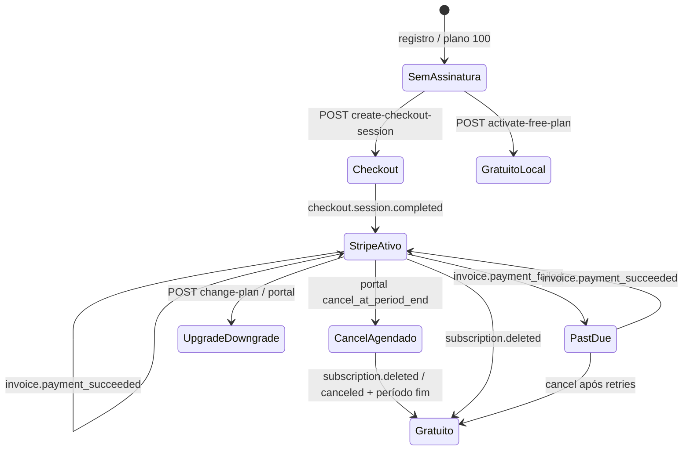

# Auditoria 04 — Ciclo de vida de assinaturas Stripe

**Projeto:** Flock (SaaS multi-tenant — igrejas)  
**Escopo:** Criação, renovação, cancelamento, upgrade/downgrade, falha de pagamento, expiração e sincronização Stripe ↔ banco  
**Prompts:** [`payment-audit-general.mdc`](../prompts/PAYMENTS/payment-audit-general.mdc), [`04-subscription-lifecycle.mdc`](../prompts/PAYMENTS/04-subscription-lifecycle.mdc)  
**Data:** 2026-05-28  
**Modo:** Revisão estática de código (backend webhooks, APIs Stripe, jobs, frontend)  
**Contexto:** Pós-correções dos tópicos [01 Webhooks](./01-audit-webhooks.md), [02 Multi-tenant](./02-audit-multitenant.md) e [03 Segurança](./03-audit-security.md)

---

## Resumo executivo

O ciclo de vida está **estruturado de forma coerente**: checkout cria assinatura no Stripe; webhooks e `sync-subscription` propagam estado para `churches` / `pending_subscriptions`; `change-plan` altera preço no Stripe com validação de downgrade; portal Stripe para cancelamento e método de pagamento; `last_stripe_event_created` reduz regressão por eventos atrasados.

Para **produção com cobrança recorrente**, há riscos de **estado financeiro inconsistente** (plano gratuito no app com assinatura paga ainda ativa no Stripe), **e-mails de cancelamento prematuros** e **lacunas em `past_due` / fim de período** sem webhook.

| Severidade | Quantidade |
|------------|------------|
| CRÍTICO    | 1          |
| ALTO       | 4          |
| MÉDIO      | 6          |
| BAIXO      | 4          |

**Recomendação imediata:** ao ativar plano 100, cancelar ou reconciliar assinatura Stripe existente; separar “agendou cancelamento” de “assinatura encerrada” nos e-mails e no `plan_type`.

---

## Modelo de estados (banco + Stripe)

### Campos em `churches`

| Campo | Papel |
|-------|--------|
| `plan_type` | Capacidade (`100`–`800`) — usado em limites de membros |
| `subscription_status` | Espelho do status Stripe (`active`, `canceled`, `past_due`, `trialing`, …) |
| `stripe_subscription_id` | Assinatura atual |
| `subscription_start_date` / `subscription_end_date` | Período / término (cancelamento) |
| `last_stripe_event_created` | Ordenação de webhooks |

### Mapa de fluxo ponta a ponta



### Entradas por fase do ciclo

| Fase | Implementação |
|------|----------------|
| **Criação** | `createCheckout` → `createCheckoutSession`; webhook `checkout.session.completed`; registro vincula `pending_subscriptions` |
| **Trial** | Não configurado em `createCheckoutSession`; status `trialing` tratado em sync e UI |
| **Renovação** | `invoice.payment_succeeded` → `subscription_status: active` + e-mail renovação |
| **Falha / retry** | `invoice.payment_failed` → `past_due` + e-mail; retry gerenciado pelo Stripe |
| **Upgrade/downgrade** | `changePlan` (API) + portal; webhook `customer.subscription.updated` |
| **Cancelamento** | Portal Stripe; webhooks `updated` / `deleted`; `shouldSetToFreePlan` → `plan_type: 100` |
| **Reativação** | Novo checkout (`handleReactivateSubscription` no FE) ou portal; lógica parcial em `handleSubscriptionUpdated` |
| **Expiração** | E-mails via cron `checkSubscriptionExpiration` (status `canceled` + `subscription_end_date`) |
| **Sincronização manual** | `POST sync-subscription` (admin), polling `checkout-status`, auto-sync na aba Plano |

---

## Pontos positivos

1. **Webhooks com claim e retry** — falha libera claim; erros propagam ([`stripeWebhookService.ts`](../../backend/src/services/stripeWebhookService.ts)).
2. **Downgrade com validação** — `changePlan` bloqueia se membros > limite do novo plano.
3. **Plano gratuito pós-cancel** — `shouldSetToFreePlan` + `handleSubscriptionDeleted` definem `plan_type: 100`.
4. **Eventos stale** — `last_stripe_event_created` evita sobrescrever estado mais novo.
5. **Sync tenant-scoped** — filtra assinatura por `stripe_subscription_id` ou `metadata.church_id`.
6. **Compensação operacional** — sync manual, polling pós-checkout, cron de aviso de expiração.
7. **Handlers de e-mail** — sucesso, falha, renovação, cancelamento, reativação (fire-and-forget).

---

## Achados

### ACHADO-SL01 — `activate-free-plan` não cancela assinatura no Stripe

**Severidade:** CRÍTICO  
**Categoria:** Financeiro · Backend  
**Prioridade:** Imediata

**Explicação**  
`POST /api/stripe/activate-free-plan` grava no banco `plan_type: 100` e `subscription_status: active` **sem** chamar `stripe.subscriptions.cancel` nem limpar `stripe_subscription_id`. Se a igreja tinha assinatura paga no Stripe, a cobrança **continua** enquanto o app trata como plano gratuito.

**Impacto financeiro**  
Cobrança indevida ou estado incoerente (cliente acredita ter cancelado/passo para grátis, Stripe segue faturando). Limites de membros passam a 100 no app, mas assinatura paga pode permanecer.

**Cenário de falha**  
Admin ativa plano 100 no checkout ou configurações após ter plano 200 ativo → DB em `100` → próxima fatura Stripe do plano 200.

**Evidência**

```734:742:backend/src/controllers/stripeController.ts
    const { error: updateError } = await supabase
      .from('churches')
      .update({
        plan_type: '100',
        subscription_status: 'active',
        subscription_start_date: new Date().toISOString(),
```

Nenhuma chamada Stripe no handler.

**Correção recomendada**  
Se existir `stripe_subscription_id`, cancelar no Stripe (imediato ou `cancel_at_period_end` conforme política) e alinhar campos; ou recusar ativação gratuita enquanto houver assinatura paga ativa.

---

### ACHADO-SL02 — E-mail de cancelamento ao **agendar** fim (não ao encerrar)

**Severidade:** ALTO  
**Categoria:** Webhook · UX · Financeiro  
**Prioridade:** Alta

**Explicação**  
Em `handleSubscriptionUpdated`, `isCanceled` é verdadeiro quando `cancel_at_period_end === true` **mesmo com** `subscription.status === 'active'`. Nesse caso dispara e-mail “Assinatura Cancelada” imediatamente, embora o cliente ainda esteja no período pago.

**Impacto**  
Comunicação incorreta; suporte confuso; usuário acredita perder acesso antes do fim do período. `plan_type` pode permanecer pago até evento `canceled` (comportamento correto de limite), mas o e-mail antecipa o cancelamento.

**Cenário de falha**  
Usuário cancela no portal “ao fim do período” → webhook `customer.subscription.updated` → e-mail de cancelamento no mesmo dia.

**Evidência**

```496:517:backend/src/services/stripeWebhookService.ts
  const isCanceled =
    subscription.status === 'canceled' ||
    sub.cancel_at_period_end === true ||
    sub.canceled_at != null ||
    sub.cancel_at != null;

  if (isCanceled) {
    // ... getSubscriptionCanceledTemplate
```

**Correção recomendada**  
E-mail de cancelamento apenas se `status === 'canceled'` ou após `current_period_end` passado; e-mail distinto para “cancelamento agendado em {data}”.

---

### ACHADO-SL03 — `customer.subscription.created` reutiliza handler de `updated`

**Severidade:** ALTO  
**Categoria:** Webhook · Arquitetura  
**Prioridade:** Média–Alta

**Explicação**  
`dispatchWebhookEvent` trata `customer.subscription.created` e `updated` com o mesmo `handleSubscriptionUpdated`. Após `checkout.session.completed`, o evento `subscription.created` pode **reprocessar** atualização e disparar lógica de cancelamento/reativação/e-mails duplicados.

**Impacto**  
E-mails duplicados (sucesso + renovação/cancelamento); escrita redundante no banco; maior superfície para bugs de detecção (`isReactivated` / `isCanceled`).

**Evidência**

```677:680:backend/src/services/stripeWebhookService.ts
    case 'customer.subscription.created':
    case 'customer.subscription.updated':
      await handleSubscriptionUpdated(event.data.object as Stripe.Subscription, eventCreated);
```

**Correção recomendada**  
Handler dedicado para `created` (no-op se checkout já vinculou) ou ignorar `created` quando `checkout.session.completed` já processou o mesmo `subscription_id`.

---

### ACHADO-SL04 — Sem garantia de downgrade para plano 100 ao fim do período sem webhook

**Severidade:** ALTO  
**Categoria:** Financeiro · Banco  
**Prioridade:** Média–Alta

**Explicação**  
Transição para `plan_type: 100` depende de webhooks (`shouldSetToFreePlan`, `subscription.deleted`) ou sync manual. Não há job que, ao passar `subscription_end_date` com `cancel_at_period_end`, force `plan_type: 100` se o Stripe não enviar evento (indisponibilidade, falha 500 histórica, etc.).

**Impacto**  
Igreja permanece com `plan_type` 200/500/800 e limites elevados após fim do direito de uso; perda de receita ou uso indevido.

**Cenário**  
Webhook `subscription.updated` final perdido → DB com `active` e plano pago após `subscription_end_date`.

**Correção recomendada**  
Cron diário: igrejas com `subscription_end_date < now()` e status cancelado/agendado → `plan_type: 100`; opcional chamada `sync-subscription` em lote.

---

### ACHADO-SL05 — `past_due`: status atualizado, plano pago e limites mantidos

**Severidade:** ALTO  
**Categoria:** Financeiro · Produto  
**Prioridade:** Média

**Explicação**  
`handlePaymentFailed` só grava `subscription_status: past_due`. `plan_type` não muda. `checkMemberLimit` usa limite do `plan_type` e só marca `hasActiveSubscription` quando `status === 'active'` — usuário em `past_due` **mantém** teto de membros do plano pago.

**Impacto**  
Uso continuado do tier pago sem pagamento válido (política de produto pode exigir bloqueio ou grace period explícito).

**Evidência**

```638:641:backend/src/services/stripeWebhookService.ts
  const updateResult = await updateSubscriptionByStripeCustomer(
    customerId,
    { subscription_status: 'past_due' },
```

```133:134:backend/src/utils/planLimits.ts
    const hasActiveSubscription = subscriptionStatus === 'active';
```

**Correção recomendada**  
Definir política: grace period com `past_due` + bloqueio de novos membros; ou downgrade automático após N dias; refletir na UI (PaymentManagement já exibe `past_due`).

---

### ACHADO-SL06 — `invoice.payment_succeeded` não atualiza `plan_type` nem datas de período

**Severidade:** MÉDIO  
**Categoria:** Webhook · Sincronização  
**Prioridade:** Média

**Explicação**  
Renovação mensal só persiste `subscription_status: active`. Se o preço/plano mudou no Stripe (portal) ou houve inconsistência anterior, renovação não reconcilia `plan_type`, `subscription_start_date`, `subscription_end_date`.

**Impacto**  
Drift silencioso entre Stripe e banco até próximo `subscription.updated` ou sync manual.

**Correção recomendada**  
Em `handlePaymentSucceeded`, reutilizar mesma lógica de `handleSubscriptionUpdated` (retrieve subscription + payload completo).

---

### ACHADO-SL07 — `sync-subscription` pode sobrescrever estado mais novo do webhook

**Severidade:** MÉDIO  
**Categoria:** Race condition · Backend  
**Prioridade:** Média

**Explicação**  
`syncSubscription` atualiza `churches` **sem** atualizar `last_stripe_event_created`. Admin dispara sync após webhook recente: dados do Stripe (possivelmente atrasados) podem sobrescrever correção já aplicada, ou o inverso — sync “ganha” sem versão.

**Cenário**  
Webhook A (novo) → admin sync lê Stripe ainda sem refletir mudança → estado regressa.

**Correção recomendada**  
Sync só aplicar se `subscription.updated` do Stripe > `last_stripe_event_created`; ou setar `last_stripe_event_created` no sync com timestamp explícito.

---

### ACHADO-SL08 — `changePlan` atualiza DB antes do webhook (janela de inconsistência)

**Severidade:** MÉDIO  
**Categoria:** Race condition · Backend  
**Prioridade:** Baixa–Média

**Explicação**  
`changePlan` chama Stripe e em seguida atualiza o banco localmente. Webhook chega depois com `last_stripe_event_created`. Em falha parcial (DB ok, webhook falha), estados podem divergir até sync.

**Mitigação existente**  
Webhook eventual + sync na aba Plano.

**Correção recomendada**  
Tratar resposta da API como “pendente” até confirmação do webhook ou retornar estado lido do Stripe após update.

---

### ACHADO-SL09 — Detecção de “reativação” frágil e nomenclatura invertida

**Severidade:** MÉDIO  
**Categoria:** Webhook · Lógica  
**Prioridade:** Baixa–Média

**Explicação**  
Variável `cancelAtPeriodEnd` na verdade testa `cancel_at_period_end === false`. `isReactivated` combina `active`, “não cancelar ao fim” e `wasCanceled` — fácil falso positivo/negativo em upgrades ou remoção de `cancel_at_period_end`.

**Evidência**

```451:465:backend/src/services/stripeWebhookService.ts
  const cancelAtPeriodEnd =
    (subscription as Stripe.Subscription & { cancel_at_period_end?: boolean }).cancel_at_period_end ===
    false;
  // ...
  const isReactivated = isNowActive && cancelAtPeriodEnd && wasCanceled;
```

**Correção recomendada**  
Detectar transição explícita: status anterior `canceled`/`past_due` → `active`, ou `cancel_at_period_end` true → false.

---

### ACHADO-SL10 — Checkout completo não preenche `subscription_end_date` para assinatura ativa normal

**Severidade:** MÉDIO  
**Categoria:** Sincronização  
**Prioridade:** Baixa

**Explicação**  
`handleCheckoutCompleted` define `subscription_end_date` apenas a partir de `cancel_at`. Assinatura ativa sem cancelamento deixa `subscription_end_date` nulo (ok para recorrente), mas cron de expiração e UI de “válido até” dependem de outros eventos.

**Impacto**  
Baixo se recorrente; confusão se produto exibir “próxima renovação” só via portal.

---

### ACHADO-SL11 — Trial não configurado no Checkout

**Severidade:** BAIXO  
**Categoria:** Produto · Stripe  
**Prioridade:** Baixa

**Explicação**  
`createCheckoutSession` não define `subscription_data.trial_period_days`. Status `trialing` é reconhecido em sync/UI, mas não há fluxo que **inicie** trial pelo produto.

**Correção**  
Adicionar trial nos Prices do Stripe ou parâmetro explícito se for requisito comercial.

---

### ACHADO-SL12 — Polling pós-checkout não trata `past_due` como confirmado

**Severidade:** BAIXO  
**Categoria:** Frontend  
**Prioridade:** Baixa

**Explicação**  
`checkCheckoutStatus` considera confirmado apenas `active` e `trialing`. Pagamento em retry ou estado intermediário pode exibir erro apesar de sessão paga.

**Evidência**

```667:671:backend/src/controllers/stripeController.ts
    const confirmedStatuses = ['active', 'trialing'];
```

**Correção**  
Incluir política para `past_due` (mensagem específica) ou aguardar `active` com mais tentativas.

---

### ACHADO-SL13 — Cron de expiração ignora `active` + `cancel_at_period_end`

**Severidade:** BAIXO  
**Categoria:** Jobs  
**Prioridade:** Baixa

**Explicação**  
`checkSubscriptionExpiration` filtra `subscription_status === 'canceled'`. Usuário com cancelamento agendado ainda aparece como `active` no banco até o fim do período — **não** recebe avisos 7/3/1 dia do cron (só e-mail de “cancelamento” do webhook SL02).

**Correção**  
Incluir query: `active` + `subscription_end_date` preenchido + data próxima.

---

### ACHADO-SL14 — `getSubscriptionEndDate` prioriza `cancel_at` sobre `current_period_end`

**Severidade:** BAIXO  
**Categoria:** Lógica  
**Prioridade:** Baixa

**Explicação**  
Ordem: `cancel_at` → `canceled_at` → `current_period_end`. Para assinatura ativa com cancelamento agendado, `subscription_end_date` reflete fim agendado (correto). Para edge cases com ambos setados, validar alinhamento com Stripe Billing.

---

## Matriz: tópico 04 vs implementação

| Requisito | Status |
|-----------|--------|
| Criação | OK (checkout + webhook + pending) |
| Trial | Parcial (UI/sync; sem criação via checkout) |
| Renovação | Parcial (status + e-mail; sem refresh completo SL06) |
| Cancelamento | Parcial (webhook; e-mail prematuro SL02) |
| Reativação | Parcial (novo checkout; detecção webhook frágil SL09) |
| Upgrade/downgrade | OK (`changePlan` + portal + webhook) |
| Falha de pagamento | Parcial (`past_due` + e-mail; limites SL05) |
| Expiração | Parcial (cron + `shouldSetToFreePlan`; gap SL04) |
| Retry Stripe | Delegado ao Stripe; app não persiste tentativas |
| Sync Stripe ↔ DB | OK com ressalvas (sync SL07, activate SL01) |

---

## Cenários extremos (análise estática)

| Cenário | Comportamento esperado | Risco atual |
|---------|------------------------|-------------|
| Cancelamento durante retry (`past_due`) | Stripe cancela ou mantém dívida | Status `past_due` + plano pago (SL05) |
| Upgrade simultâneo (API + portal) | Último evento vence | `last_stripe_event_created` mitiga parcialmente |
| Webhook atrasado | Ignorar se stale | OK |
| Pagamento falho | `past_due`, e-mail | OK; limites discutíveis |
| Refresh durante checkout | Polling + webhook | OK (backoff no FE) |
| `activate-free-plan` com sub ativa | Grátis no app | **Cobrança Stripe continua (SL01)** |

---

## Priorização sugerida (Ciclo 2 — Lifecycle)

| Ordem | ID | Esforço |
|-------|-----|---------|
| 1 | SL01 | Médio — cancelar/reconciliar Stripe no free plan |
| 2 | SL02 | Baixo — condicionar e-mail de cancelamento |
| 3 | SL04 | Médio — cron de expiração de plano |
| 4 | SL05 | Médio — política `past_due` + limites |
| 5 | SL03, SL06, SL07 | Baixo–médio — handlers e sync |

---

## Referências de código

| Área | Arquivo |
|------|---------|
| Webhooks lifecycle | `backend/src/services/stripeWebhookService.ts` |
| APIs Stripe | `backend/src/controllers/stripeController.ts` |
| Stripe SDK | `backend/src/services/stripe.ts` |
| Limites / plano | `backend/src/utils/planLimits.ts` |
| Cron expiração | `backend/src/jobs/checkSubscriptionExpiration.ts` |
| UI plano | `frontend/src/components/settings/PaymentManagement.tsx` |
| Polling sucesso | `frontend/src/app/subscription/success/page.tsx` |
| Checkout | `frontend/src/app/(auth)/checkout/page.tsx` |

---

## Relação com outros tópicos

| Tópico | Ligação |
|--------|---------|
| 01 Webhooks | Claim, stale events, handlers — base deste ciclo |
| 02 Multi-tenant | Customer/igreja 1:1 afeta qual registro o lifecycle atualiza |
| 03 Segurança | Quem pode `change-plan`, `sync`, checkout |

Este relatório é **somente levantamento**; correções ficam para `04-audit-subscription-lifecycle-dev-report.md` após implementação.
