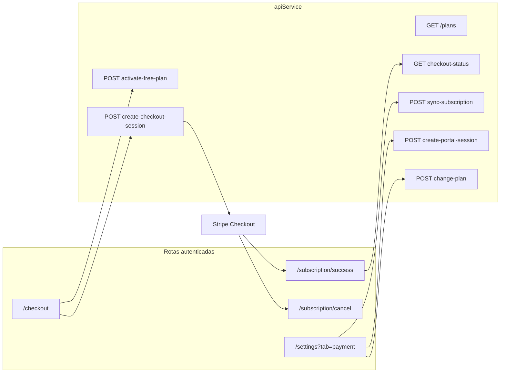

# Auditoria 05 — Frontend Billing (UX Stripe)

**Projeto:** Flock (SaaS multi-tenant — igrejas)  
**Escopo:** Checkout, portal, telas de assinatura, upgrade/downgrade, cancelamento, polling pós-pagamento, sincronização e estados na UI  
**Prompts:** [`payment-audit-general.mdc`](../prompts/PAYMENTS/payment-audit-general.mdc), [`05-frontend-billing.mdc`](../prompts/PAYMENTS/05-frontend-billing.mdc)  
**Data:** 2026-06-04  
**Modo:** Revisão estática de código (frontend Next.js + integração `api.ts`; referência backend/landing onde impacta UX)  
**Contexto:** Pós-correções dos tópicos [01 Webhooks](./01-audit-webhooks.md), [02 Multi-tenant](./02-audit-multitenant.md), [03 Segurança](./03-audit-security.md) e [04 Ciclo de vida](./04-audit-subscription-lifecycle.md)

---

## Resumo executivo

A camada de billing no frontend está **funcional e alinhada em grande parte** com o backend: checkout autenticado via `apiService`, polling com backoff na página de sucesso, aba Plano com sync automático e manual, portal Stripe em nova aba, RBAC (`admin`/`owner`) para ações sensíveis e propagação de `X-Church-Id` no cliente.

Para **produção com cobrança recorrente**, persistem riscos de **falso positivo de sucesso**, **estado stale após portal**, **UX inadequada em `past_due`**, **cache de sync sem escopo de igreja** e **fluxos divergentes para plano gratuito (100)**.

| Severidade | Quantidade |
|------------|------------|
| CRÍTICO    | 0          |
| ALTO       | 4          |
| MÉDIO      | 7          |
| BAIXO      | 5          |

**Recomendação imediata:** corrigir `/subscription/success` sem `session_id`; adicionar CTA explícito em `past_due`; escopar cache de sync por `churchId`; alinhar downgrade para plano 100 com `activate-free-plan`.

---

## Mapa de superfície (frontend billing)



### Entradas por fluxo

| Fluxo | Componente / rota | Observação |
|-------|-------------------|------------|
| **Checkout pago** | `(auth)/checkout/page.tsx` | Requer login; redireciona para Stripe |
| **Plano gratuito** | Mesmo checkout | `activateFreePlan()` + `refreshChurch()` |
| **Pós-pagamento** | `subscription/success/page.tsx` | Polling `getCheckoutStatus` (backoff) |
| **Cancelamento Stripe** | `subscription/cancel/page.tsx` | CTA volta a `/checkout` sem plano |
| **Gerenciar assinatura** | `PaymentManagement.tsx` | Portal, sync, troca de plano |
| **Conta / exclusão** | `AccountManagement.tsx` | Sync + portal antes de excluir conta |
| **Registro pós-landing** | `(auth)/register/page.tsx` | `session_id`, `link_token`, `planFunnel` |
| **Multi-igreja** | `ChurchSwitcher.tsx` | `reload` após troca — mitiga estado stale |
| **Limite membros** | `Header.tsx`, `members/page.tsx` | `GET /church/member-limit` |

Checkout **público** (visitante sem conta) usa `successUrl` para a **landing** (`/register?session_id=...`), não o app frontend — fora do escopo direto desta pasta, mas impacta funil comercial.

---

## Pontos positivos

1. **Auth antes do checkout** — guard `isAuthLoading` evita redirect prematuro para login (`checkout/page.tsx`).
2. **Polling resiliente** — backoff exponencial, cleanup em unmount, estados distintos sucesso vs. pendente (`success/page.tsx`).
3. **API centralizada** — `apiService` com `withCredentials`, interceptor `X-Church-Id`, tratamento 401.
4. **RBAC na aba Plano** — botões desabilitados para `reader` com tooltip (`PaymentManagement.tsx`).
5. **Cancelamento agendado na UI** — alerta âmbar quando `subscription_end_date` futuro (`PaymentManagement.tsx`).
6. **Funil de plano** — `planFunnel.ts` com persistência `sessionStorage` e `resolveCheckoutPath` (correções landing NG-01 documentadas em QA).
7. **Sync compensatório** — auto-sync ao abrir aba Plano + botão manual com mensagem de falha (`autoSyncFailed`).
8. **Confirmação de troca de plano** — modal com resumo antes/depois (boa UX financeira).

---

## Achados

### ACHADO-FB01 — `/subscription/success` sem `session_id` exibe sucesso falso

**Severidade:** ALTO  
**Categoria:** UX · Frontend  
**Prioridade:** Alta

**Explicação**  
Se o usuário acessar `/subscription/success` sem query `session_id`, o efeito define `isLoading = false` e **não** define `error`. A UI renderiza título **"Pagamento Confirmado!"** e ícone verde, embora nenhuma verificação tenha ocorrido.

**Impacto**  
Usuário acredita que o pagamento foi confirmado sem evidência; suporte recebe tickets de “paguei mas o plano não ativou” quando na verdade a URL estava incompleta ou houve bookmark/share incorreto.

**Cenário de falha**  
Acesso direto à URL, redirect malformado do Stripe, ou perda do query string no histórico do navegador.

**Evidência**

```30:33:frontend/src/app/subscription/success/page.tsx
    if (!sessionId) {
      setIsLoading(false);
      return;
    }
```

```131:140:frontend/src/app/subscription/success/page.tsx
              <h1 className="text-2xl font-bold text-gray-900 mb-2">
                Pagamento Confirmado!
              </h1>
              <p className="text-gray-600">
                Sua assinatura foi ativada com sucesso
              </p>
```

**Correção recomendada**  
Sem `session_id`: exibir estado neutro ou erro (“Sessão de pagamento não encontrada”) com CTA para Configurações → Plano (sync) ou checkout; nunca mostrar sucesso.

---

### ACHADO-FB02 — `past_due`: sem CTA para regularizar pagamento

**Severidade:** ALTO  
**Categoria:** UX · Financeiro  
**Prioridade:** Alta

**Explicação**  
A aba Plano exibe badge “Pagamento Atrasado”, mas **desabilita** “Trocar de Plano” (`subscriptionStatus !== 'active'`). “Gerenciar Assinatura” abre o portal — única saída implícita. Não há banner destacado nem copy orientando atualização do cartão.

Após correção SL05 no backend, `checkMemberLimit` bloqueia novos membros, mas a UI de membros não diferencia `past_due` da mensagem genérica de limite.

**Impacto**  
Admin em inadimplência não entende o próximo passo; churn silencioso ou suporte manual.

**Evidência**

```675:678:frontend/src/components/settings/PaymentManagement.tsx
              {!subscriptionEndDate && (
                <Button
                  onClick={() => setShowChangePlanModal(true)}
                  disabled={isChangingPlan || subscriptionStatus !== 'active' || ...
```

**Correção recomendada**  
Banner `past_due` com botão primário “Atualizar forma de pagamento” → portal; opcional sync após `visibilitychange` ao fechar aba do portal.

---

### ACHADO-FB03 — Cache de sync (`stripe_sync_cache`) sem escopo de igreja

**Severidade:** ALTO  
**Categoria:** Multi-tenant · Frontend  
**Prioridade:** Média–Alta

**Explicação**  
`SYNC_CACHE_KEY = 'stripe_sync_cache'` é global no `localStorage`. Usuário com duas igrejas (duas abas ou troca sem reload completo) pode ter sync manual bloqueado na igreja B porque a igreja A sincronizou há menos de 5 minutos.

**Impacto**  
Dados de billing da igreja ativa desatualizados; admin acredita que sync “não funciona”.

**Evidência**

```112:114:frontend/src/components/settings/PaymentManagement.tsx
  const SYNC_CACHE_KEY = 'stripe_sync_cache';
  const SYNC_CACHE_DURATION = 5 * 60 * 1000; // 5 minutos
```

**Correção recomendada**  
Chave `stripe_sync_cache:${activeChurchId}`; limpar cache ao `switchChurch`.

---

### ACHADO-FB04 — Plano 100 no modal “Trocar de Plano” abre portal em vez de `activate-free-plan`

**Severidade:** ALTO  
**Categoria:** UX · Financeiro  
**Prioridade:** Média

**Explicação**  
Em `/checkout`, plano 100 chama `apiService.activateFreePlan()` (cancela assinatura no Stripe após SL01). No modal de troca, selecionar plano 100 abre apenas o **Customer Portal** para cancelamento manual — fluxos divergentes.

**Impacto**  
Admin espera downgrade imediato no app; pode cancelar só no portal sem entender cobrança residual ou passos extras.

**Evidência**

```324:341:frontend/src/components/settings/PaymentManagement.tsx
    if (selectedPlan === '100') {
      ...
        const { url } = await apiService.createPortalSession();
        ...
        window.open(url, '_blank', 'noopener,noreferrer');
```

vs. `checkout/page.tsx` L84–90: `activateFreePlan()`.

**Correção recomendada**  
Reutilizar `activateFreePlan()` com confirmação explícita, ou remover opção 100 do modal e manter só portal com copy clara.

---

### ACHADO-FB05 — Estado stale após fechar portal Stripe (nova aba)

**Severidade:** MÉDIO  
**Categoria:** UX · Sincronização  
**Prioridade:** Média

**Explicação**  
Portal abre em `_blank`. Ao voltar à aba do app, `user` no AuthContext **não** atualiza até sync manual, reload ou auto-sync na próxima visita à aba Plano. Cancelamento ou troca no portal pode não refletir na UI por minutos.

**Impacto**  
Badge “Ativa” com plano já cancelado no Stripe; decisões de upgrade/downgrade com dados errados.

**Correção recomendada**  
`window.addEventListener('focus', ...)` ou `document.visibilitychange` para `refreshChurch()` / `syncSubscription()` após portal.

---

### ACHADO-FB06 — Auto-sync na aba Plano ignora cache de 5 minutos

**Severidade:** MÉDIO  
**Categoria:** Arquitetura · Frontend  
**Prioridade:** Baixa–Média

**Explicação**  
`handleSyncSubscription(false)` respeita cache; o `useEffect` de montagem **sempre** chama `apiService.syncSubscription()` na primeira visita à aba (por sessão/componente).

**Impacto**  
Requisição extra a cada navegação para Plano; possível corrida com webhooks se admin alterna abas rapidamente (mitigado parcialmente por SL07 no backend).

**Evidência**

```201:237:frontend/src/components/settings/PaymentManagement.tsx
  useEffect(() => {
    if (hasSyncedRef.current || !user) return;
    ...
        const response = await apiService.syncSubscription();
```

**Correção recomendada**  
Reutilizar `getCachedSyncResult()` no auto-sync ou aumentar intervalo; sync forçado só no botão “Sincronizar agora”.

---

### ACHADO-FB07 — Confirmação duplicada na troca de plano

**Severidade:** MÉDIO  
**Categoria:** UX  
**Prioridade:** Baixa

**Explicação**  
Fluxo: modal de seleção → modal de confirmação → `window.confirm()` nativo em `handleChangePlan`. Três camadas de confirmação; o diálogo nativo quebra consistência visual e acessibilidade.

**Evidência**

```369:376:frontend/src/components/settings/PaymentManagement.tsx
    const confirmed = window.confirm(
      `Tem certeza que deseja alterar de "${currentPlanName}" para "${newPlanName}"?...
```

**Correção recomendada**  
Remover `window.confirm`; confiar no modal de confirmação já existente.

---

### ACHADO-FB08 — `isLoading` inicial da aba Plano é fictício

**Severidade:** MÉDIO  
**Categoria:** UX  
**Prioridade:** Baixa

**Explicação**  
`isLoading` inicia `true`, mas um `useEffect` vazio define `setIsLoading(false)` imediatamente — spinner de página quase nunca aparece; dados vêm de `user` do contexto que pode ainda estar desatualizado durante `isSyncing`.

**Evidência**

```196:199:frontend/src/components/settings/PaymentManagement.tsx
  useEffect(() => {
    setIsLoading(false);
  }, []);
```

**Correção recomendada**  
`isLoading` derivado de `!user` ou `isSyncing` na primeira carga; skeleton até `refreshChurch` concluir.

---

### ACHADO-FB09 — Preços fallback hardcoded divergem da API

**Severidade:** MÉDIO  
**Categoria:** UX · Comercial  
**Prioridade:** Média

**Explicação**  
Se `getPlans()` falhar, checkout e PaymentManagement exibem R$ 29,99 / 59,99 / 89,99 fixos. Em outage da API, UI pode contradizer Stripe/landing.

**Evidência**

```47:52:frontend/src/app/(auth)/checkout/page.tsx
        setPlanOptions([
          ...
          { value: '200', name: 'Plano 200 Membros', price: 'R$ 29,99/mês', ...
```

**Correção recomendada**  
Estado de erro “Não foi possível carregar planos” com retry; evitar checkout com preços stale.

---

### ACHADO-FB10 — Página de cancelamento Stripe perde plano selecionado

**Severidade:** MÉDIO  
**Categoria:** UX  
**Prioridade:** Baixa

**Explicação**  
`/subscription/cancel` redireciona para `/checkout` sem `?plan=`, ignorando intenção anterior.

**Evidência**

```46:48:frontend/src/app/subscription/cancel/page.tsx
          <Button
            onClick={() => router.push('/checkout')}
```

**Correção recomendada**  
Preservar `plan` via query, `sessionStorage` (`planFunnel`) ou último plano do `user.plan_type`.

---

### ACHADO-FB11 — Polling de sucesso não cobre `past_due` / estados intermediários

**Severidade:** MÉDIO  
**Categoria:** UX · Sincronização  
**Prioridade:** Baixa

**Explicação**  
Backend `checkCheckoutStatus` confirma só `active` e `trialing` (SL12). Frontend trata timeout como erro genérico, sem mensagem “pagamento em processamento — aguarde ou sincronize”.

**Impacto**  
Falso negativo na tela de sucesso mesmo com sessão paga em edge cases de retry Stripe.

**Correção recomendada**  
Alinhar mensagens FE com política BE; estado intermediário dedicado na UI.

---

### ACHADO-FB12 — `hasSyncedRef` não reinicia ao trocar igreja sem remount

**Severidade:** MÉDIO  
**Categoria:** Multi-tenant · Race condition  
**Prioridade:** Baixa

**Explicação**  
`hasSyncedRef` impede segundo auto-sync no mesmo mount. `ChurchSwitcher` faz `window.location.reload()` — mitiga. Troca programática de igreja no futuro sem reload deixaria sync omitido.

**Correção recomendada**  
Resetar `hasSyncedRef` quando `activeChurchId` mudar.

---

### ACHADO-FB13 — Header não alerta `past_due` / `unpaid`

**Severidade:** BAIXO  
**Categoria:** UX  
**Prioridade:** Baixa

**Explicação**  
Header mostra alertas de limite de membros (80%+) e badge de plano, mas não destaca inadimplência globalmente — admin pode não abrir Configurações → Plano.

**Correção recomendada**  
Badge vermelho/âmbar no header quando `subscription_status === 'past_due'`.

---

### ACHADO-FB14 — Membros: bloqueio por `past_due` sem mensagem específica

**Severidade:** BAIXO  
**Categoria:** UX  
**Prioridade:** Baixa

**Explicação**  
`getMemberLimit` pode retornar `canAdd: false` com mensagem de pagamento pendente (SL05), mas `members/page.tsx` só exibe texto genérico de limite atingido.

**Correção recomendada**  
Exibir `limitData.message` ou flag `isPastDue` na UI de adicionar membro.

---

### ACHADO-FB15 — Status `trialing` / `unpaid` sem fluxo dedicado na aba Plano

**Severidade:** BAIXO  
**Categoria:** UX  
**Prioridade:** Baixa

**Explicação**  
`statusLabels` inclui `trialing` e `unpaid`, mas ações (trocar plano) dependem de `active`. Trial não pode trocar plano pela API interna sem sync prévio.

**Correção recomendada**  
Matriz de ações por status (trialing → portal; unpaid → portal + sync).

---

### ACHADO-FB16 — IDs Stripe expostos no tipo `Church` no cliente

**Severidade:** BAIXO  
**Categoria:** Segurança · Frontend  
**Prioridade:** Baixa

**Explicação**  
`Church` no frontend inclui `stripe_customer_id` e `stripe_subscription_id`. Backend sanitiza por role em alguns endpoints (MT08); se `getChurchData` / `checkAuth` vazarem para `reader`, IDs aparecem no DevTools.

**Correção recomendada**  
Confirmar DTO no BE; omitir campos Stripe no FE para roles não-admin.

---

### ACHADO-FB17 — Checkout: `window.location.href` sem proteção extra contra duplo clique

**Severidade:** BAIXO  
**Categoria:** UX  
**Prioridade:** Baixa

**Explicação**  
Botão desabilita com `isLoading`, mas duplo clique rápido antes do re-render pode disparar duas sessões de checkout (backend pode criar duas sessions).

**Correção recomendada**  
Ref `isSubmitting` síncrono ou desabilitar no primeiro click.

---

### ACHADO-FB18 — `AccountManagement`: `subscription_end_date` libera exclusão mesmo com status `active`

**Severidade:** BAIXO  
**Categoria:** UX · Produto  
**Prioridade:** Baixa

**Explicação**  
`hasActivePaidPlan()` retorna `false` sempre que `subscription_end_date` está preenchido — intencional para cancelamento agendado. Com `active` + data futura, exclusão de conta é permitida enquanto ainda há período pago (pode ser desejado).

**Correção recomendada**  
Documentar na UI ou exigir confirmação extra se ainda houver dias restantes de plano pago.

---

## Matriz: requisitos do prompt vs implementação

| Requisito | Status |
|-----------|--------|
| Estados de loading | Parcial (checkout/success OK; aba Plano frágil FB08) |
| Feedback visual | Parcial (`past_due` fraco FB02) |
| Mensagens de erro | OK na maioria; sucesso falso FB01 |
| Inconsistência de planos/preços | Parcial (fallback FB09; funil corrigido na landing) |
| Estado stale / cache | Parcial (FB03, FB05, FB06) |
| Múltiplos cliques | Parcial (FB17) |
| Refresh durante pagamento | OK (polling + cleanup) |
| Sessão expirada | OK (interceptors 401) |
| Checkout | OK com ressalvas |
| Customer portal | Parcial (stale FB05) |
| Telas de assinatura | Parcial |
| Upgrade/downgrade | OK com ressalvas (FB04, FB07) |
| Cancelamentos | Parcial (FB10, portal) |

---

## Cenários extremos (análise estática)

| Cenário | Comportamento esperado | Risco atual |
|---------|------------------------|-------------|
| Internet lenta no polling | Backoff até ~15s entre tentativas | OK |
| Falha Stripe no checkout | Mensagem de erro no card | OK |
| Refresh na página de sucesso | Polling reinicia | OK (pode duplicar chamadas) |
| Múltiplas abas — sync cache | Cache independente por aba | **Cache global FB03** |
| Múltiplas abas — checkout | Duas sessions | FB17 |
| Portal: cancelar e voltar | UI atualizada | **Stale FB05** |
| Troca de igreja | Billing da igreja correta | Reload mitiga; cache FB03 |
| URL success sem session_id | Erro ou neutro | **Sucesso falso FB01** |
| `past_due` + adicionar membro | Bloqueio + orientação | **Copy fraca FB02, FB14** |

---

## Relação com outros tópicos

| Tópico | Ligação |
|--------|---------|
| 01 Webhooks | Polling compensa atraso; timeout vira erro FE (FB11) |
| 02 Multi-tenant | `X-Church-Id`, church switcher, cache sync (FB03) |
| 03 Segurança | RBAC na UI; IDs Stripe no cliente (FB16) |
| 04 Lifecycle | `past_due`, plano 100, sync `last_stripe_event_created` |
| Landing (QA M12) | Funil `?plan=` e preços API — fora da pasta `frontend/` mas impacta checkout |

---

## Priorização sugerida (Ciclo 2 — Frontend Billing)

| Ordem | ID | Esforço |
|-------|-----|---------|
| 1 | FB01 | Baixo — guard sem `session_id` |
| 2 | FB02 | Baixo–médio — banner + CTA `past_due` |
| 3 | FB03 | Baixo — cache por `churchId` |
| 4 | FB04 | Médio — unificar plano 100 com `activate-free-plan` |
| 5 | FB05, FB06, FB07 | Baixo — foco portal, cache auto-sync, remover confirm duplo |
| 6 | FB09–FB14 | Baixo — polish |

---

## Referências de código

| Área | Arquivo |
|------|---------|
| Checkout autenticado | `frontend/src/app/(auth)/checkout/page.tsx` |
| Sucesso pós-Stripe | `frontend/src/app/subscription/success/page.tsx` |
| Cancelamento Stripe | `frontend/src/app/subscription/cancel/page.tsx` |
| Aba Plano | `frontend/src/components/settings/PaymentManagement.tsx` |
| Conta / exclusão | `frontend/src/components/settings/AccountManagement.tsx` |
| API cliente | `frontend/src/services/api.ts` |
| Funil de plano | `frontend/src/utils/planFunnel.ts` |
| Registro + checkout | `frontend/src/app/(auth)/register/page.tsx` |
| Auth / refresh | `frontend/src/context/AuthContext.tsx` |
| Troca de igreja | `frontend/src/components/main/ChurchSwitcher.tsx` |

---

Este relatório é **somente levantamento**; correções ficam para `05-audit-frontend-billing-dev-report.md` após implementação.
