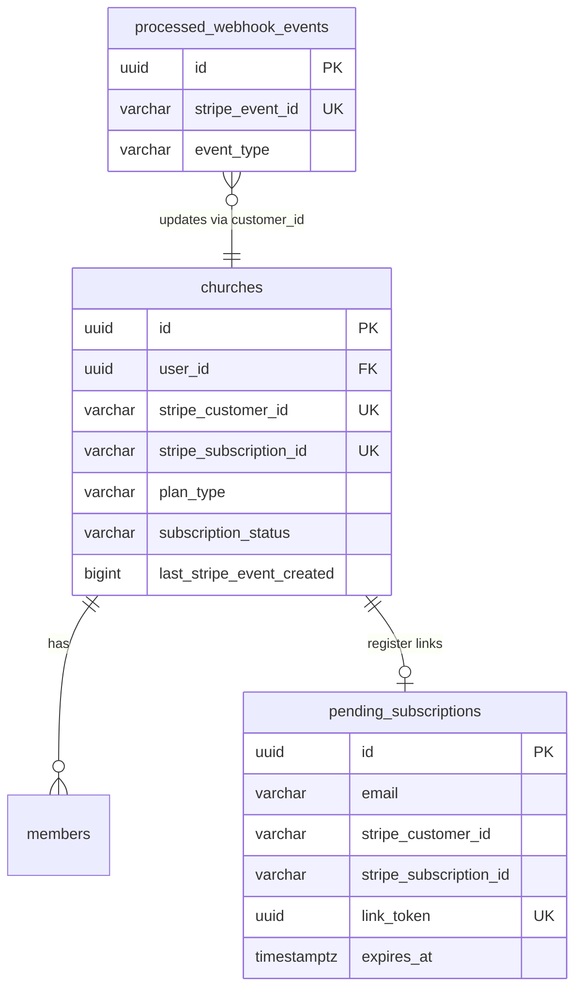

# Auditoria 06 — Banco de dados financeiro (Stripe)

**Projeto:** Flock (SaaS multi-tenant — igrejas)  
**Escopo:** Modelagem, constraints, índices, persistência e consistência Stripe ↔ PostgreSQL (Supabase)  
**Prompts:** [`payment-audit-general.mdc`](../prompts/PAYMENTS/payment-audit-general.mdc), [`06-database.mdc`](../prompts/PAYMENTS/06-database.mdc)  
**Data:** 2026-06-04  
**Modo:** Revisão estática + **validação ao vivo** (MCP Supabase, projeto `flock-app-01`)  
**Contexto:** Pós-correções dos tópicos [01 Webhooks](./01-audit-webhooks.md) a [05 Frontend billing](./05-audit-frontend-billing.md)

---

## Resumo executivo

A modelagem financeira centraliza assinaturas em **`churches`** (tenant) e usa **`pending_subscriptions`** para checkout pré-registro e **`processed_webhook_events`** para idempotência de webhooks.

**Validação ao vivo (2026-06-04):** no Supabase **`flock-app-01`** (`lzsybtvywrhwsxtsywbw`, `sa-east-1`) a maior parte dos scripts Stripe **já está aplicada** (UNIQUE em `churches`, `link_token`, `last_stripe_event_created`, RPCs/views de `stripe_refinement_migrations.sql`, trigger `subscription_updated_at`, tabela `church_users`). O banco consultado está **sem linhas** nas tabelas financeiras — útil para schema, insuficiente para drift de dados reais.

Riscos **ainda abertos no ambiente validado:** UNIQUE em `pending_subscriptions.stripe_customer_id`, índice em `subscription_end_date`, CHECK `subscription_id → customer_id`, deriva **repositório ↔ Supabase** em `bd-structure.sql`, lacunas de **código** (registro sem transação / sem copiar `last_stripe_event_created`), histórico de billing.

| Severidade | Quantidade (código + schema) | Pendente só em `flock-app-01` |
|------------|------------------------------|-------------------------------|
| CRÍTICO    | 0                            | 0                             |
| ALTO       | 5                            | 2 (DB02, DB03 parcial)        |
| MÉDIO      | 5                            | 2 (DB06, DB10)                |
| BAIXO      | 7                            | 1 (DB15 drop opcional)        |
| INFO       | 1 (DB18 RLS)                 | —                             |

**Recomendação imediata:** aplicar no Supabase o que falta (DB02, DB06, DB10); corrigir **código** (DB04, DB07, DB08); sincronizar `bd-structure.sql` com o snapshot live; manter scripts manuais até adotar migrations versionadas.

---

## Validação ao vivo — Supabase `flock-app-01`

| Item | Repositório (`bd-structure` + scripts) | `flock-app-01` (MCP) |
|------|----------------------------------------|----------------------|
| `churches.last_stripe_event_created` | Sim | Sim |
| UNIQUE parcial `stripe_customer_id` / `stripe_subscription_id` em `churches` | Documentado | Sim (`idx_churches_*_unique`) |
| `pending_subscriptions.link_token` UNIQUE | Documentado | Sim |
| UNIQUE `pending_subscriptions.stripe_customer_id` | Não | **Não** (só índice btree) |
| `pending_subscriptions.plan_type` CHECK | `200\|500\|800\|custom` (bd) vs `100\|200\|500\|800` (script) | `200\|500\|800\|custom` (igual bd) |
| `churches.plan_type` inclui `100` | Sim | Sim |
| Trigger `subscription_updated_at` | Ausente no bd | **Sim** |
| `processed_webhook_events` + UNIQUE `stripe_event_id` | Sim | Sim (+ índice redundante `idx_stripe_event_id`) |
| RPC `validate_subscription_integrity` | Script opcional | **Sim** |
| RPC `cleanup_old_webhook_events` | Script opcional | **Sim** |
| Views `vw_subscription_status`, `vw_webhook_stats` | Script opcional | **Sim** |
| Tabela `church_users` | Script separado | **Sim** (ausente em `bd-structure.sql`) |
| Índice `subscription_end_date` | Não | **Não** |
| CHECK `subscription_id` ⇒ `customer_id` | Não | **Não** |
| Migrations Supabase (`list_migrations`) | — | **Vazio** (DDL via SQL Editor) |
| Linhas em tabelas financeiras | — | **0** (ambiente vazio ou reset) |
| RLS em `public` | — | **Desabilitado** em 15 tabelas (ver DB18) |

**Consultas usadas:** `list_tables` (verbose), `pg_indexes`, `pg_trigger`, `information_schema.routines`, `validate_subscription_integrity()` (retorno vazio sem dados).

---

## Modelo de dados (financeiro)

### Tabelas e papéis

| Tabela | Papel |
|--------|--------|
| `churches` | Fonte de verdade da assinatura por tenant (igreja) |
| `pending_subscriptions` | Buffer checkout landing → registro (`link_token`) |
| `processed_webhook_events` | Idempotência / claim de webhooks Stripe |

### Campos financeiros em `churches`

| Campo | Tipo / constraint |
|-------|-------------------|
| `stripe_customer_id` | `varchar`, UNIQUE parcial (WHERE NOT NULL) |
| `stripe_subscription_id` | `varchar`, UNIQUE parcial (WHERE NOT NULL) |
| `subscription_status` | CHECK enum Stripe-like |
| `plan_type` | CHECK `100`, `200`, `500`, `800`, `custom` |
| `subscription_start_date` / `subscription_end_date` | `timestamptz` |
| `subscription_updated_at` | `timestamptz` DEFAULT now() |
| `last_stripe_event_created` | `bigint` (ordenção webhooks) |

### Diagrama de relacionamento (lógico)



_Não há FK entre IDs Stripe e objetos externos — correto para integração SaaS._

---

## Scripts e migrations (inventário)

| Script | Conteúdo relevante |
|--------|-------------------|
| `add_stripe_subscription_fields.sql` | Colunas + CHECK + trigger `subscription_updated_at` |
| `create_pending_subscriptions_table.sql` | Tabela pending + índices |
| `add_last_stripe_event_created.sql` | Coluna ordenação webhooks |
| `add_unique_stripe_tenant_ids.sql` | UNIQUE customer/subscription em `churches` |
| `add_pending_link_token.sql` | `link_token` + UNIQUE |
| `add_free_plan_support.sql` | `plan_type` inclui `100` |
| `stripe_refinement_migrations.sql` | `processed_webhook_events`, views, RPCs limpeza, `validate_subscription_integrity()` |

**Observação:** [`bd-structure.sql`](../../backend/bd-structure.sql) reflete parte das evoluções, mas **não inclui** `church_users`, triggers, views (`vw_subscription_status`), nem funções RPC de `stripe_refinement_migrations.sql`.

---

## Pontos positivos

1. **CHECK em `subscription_status` e `plan_type`** — reduz valores inválidos no banco.
2. **UNIQUE parcial** em `stripe_customer_id` / `stripe_subscription_id` em `churches` (1:1 tenant ↔ IDs Stripe quando preenchidos).
3. **`last_stripe_event_created`** em `churches` e `pending_subscriptions` — suporte a eventos stale (tópico 01).
4. **`processed_webhook_events.stripe_event_id` UNIQUE** — base de idempotência.
5. **`link_token` UNIQUE** — vínculo seguro checkout → registro (tópico 02).
6. **`expires_at` em pending** + job de limpeza — TTL de 7 dias.
7. **`stripe_refinement_migrations.sql`** — view de monitoramento e função `validate_subscription_integrity()` (se aplicada).
8. **Billing por igreja** — cada linha `churches` tem seus próprios campos Stripe (adequado a multi-tenant por igreja).

---

## Achados

### ACHADO-DB01 — `pending_subscriptions.plan_type`: drift entre scripts e `bd-structure`

**Severidade:** ALTO  
**Categoria:** Banco · Integridade  
**Prioridade:** Alta  
**Status `flock-app-01`:** CHECK em produção = `200|500|800|custom` (alinha com `bd-structure`, **não** com `create_pending_subscriptions_table.sql`)

**Explicação**  
Três fontes divergentes:

| Fonte | Valores `plan_type` em pending |
|-------|-------------------------------|
| [`bd-structure.sql`](../../backend/bd-structure.sql) + **Supabase live** | `200`, `500`, `800`, `custom` |
| [`create_pending_subscriptions_table.sql`](../../backend/scripts/create_pending_subscriptions_table.sql) | `100`, `200`, `500`, `800` |

Checkout landing só cria planos pagos (`200`+), mas rodar o script antigo em ambiente já migrado ou confiar no script para “source of truth” gera drift documental e risco em deploy greenfield.

**Impacto**  
Deploy parcial: constraint diferente entre dev/staging/prod; erro ao inserir pending se alguém usar plano `100` ou `custom`.

**Evidência**

```184:184:backend/bd-structure.sql
  plan_type character varying NOT NULL CHECK (plan_type::text = ANY (ARRAY['200'::character varying, '500'::character varying, '800'::character varying, 'custom'::character varying]::text[])),
```

**Correção recomendada**  
Unificar CHECK em todos os scripts e `bd-structure.sql` (`200`|`500`|`800` apenas em pending; remover `custom` se não usado). Script de reconciliação único “source of truth”.

---

### ACHADO-DB02 — Sem UNIQUE em `pending_subscriptions.stripe_customer_id`

**Severidade:** ALTO  
**Categoria:** Banco · Multi-tenant  
**Prioridade:** Alta  
**Status `flock-app-01`:** **Pendente** — existe `idx_pending_subscriptions_stripe_customer_id` (não único)

**Explicação**  
O webhook faz `maybeSingle()` por `stripe_customer_id`. Duas linhas pending para o mesmo customer (re-checkout, retry, bug) tornam o comportamento **não determinístico** (qual linha atualiza/vincula).

**Impacto**  
Registro com `link_token` errado; assinatura paga vinculada à pending incorreta; perda de receita ou suporte manual.

**Cenário**  
Dois checkouts landing com reuso acidental do mesmo `cus_` (improvável mas possível em testes) ou insert duplicado sem upsert atômico.

**Evidência**

```378:382:backend/src/services/stripeWebhookService.ts
  const { data: existingPending } = await supabase
    .from('pending_subscriptions')
    .select('id')
    .eq('stripe_customer_id', customerId)
    .maybeSingle();
```

Índices em [`create_pending_subscriptions_table.sql`](../../backend/scripts/create_pending_subscriptions_table.sql) são **não únicos**.

**Correção recomendada**

```sql
CREATE UNIQUE INDEX IF NOT EXISTS idx_pending_stripe_customer_id_unique
  ON pending_subscriptions (stripe_customer_id);
```

Tratar conflito 23505 no INSERT com UPDATE (upsert).

---

### ACHADO-DB03 — `bd-structure.sql` desatualizado vs produção esperada

**Severidade:** ALTO  
**Categoria:** Banco · Rastreabilidade  
**Prioridade:** Média–Alta  
**Status `flock-app-01`:** Produção **à frente** do `bd-structure.sql` (ver tabela na seção “Validação ao vivo”)

**Explicação**  
O arquivo canônico do repositório não documenta, mas **já existem em `flock-app-01`:** `church_users`, trigger `trigger_update_church_subscription_updated_at`, funções `validate_subscription_integrity` / `cleanup_old_webhook_events`, views `vw_subscription_status` / `vw_webhook_stats`. Também faltam no snapshot: enums `church_user_role`, trigger de `church_users`, índices de performance extras em `churches` (`idx_churches_plan_type`, etc.).

**Impacto**  
Novos ambientes criados só com `bd-structure.sql` ficam **sem** idempotência de webhooks, sem funções de limpeza, sem ferramentas de validação — divergência silenciosa.

**Correção recomendada**  
Atualizar `bd-structure.sql` após cada migração ou adotar ferramenta de migração versionada (Supabase migrations / Flyway). Checklist de deploy no README PAYMENTS.

---

### ACHADO-DB04 — Registro não copia `last_stripe_event_created` ao vincular pending

**Severidade:** ALTO  
**Categoria:** Banco · Sincronização  
**Prioridade:** Média

**Explicação**  
No `register`, o UPDATE em `churches` copia IDs Stripe e status, mas **não** `last_stripe_event_created` da pending. Webhooks posteriores com `event.created` menor que o já aplicado na pending (mas não copiado) podem ser ignorados incorretamente ou, inversamente, eventos antigos podem sobrescrever após registro.

**Impacto**  
Estado da igreja recém-criada desalinhado com a fila de eventos Stripe já processada na pending.

**Evidência**

```146:154:backend/src/controllers/authController.ts
        .update({
          stripe_customer_id: pendingSubscription.stripe_customer_id,
          stripe_subscription_id: pendingSubscription.stripe_subscription_id,
          subscription_status: pendingSubscription.subscription_status,
          plan_type: pendingSubscription.plan_type,
          subscription_start_date: pendingSubscription.subscription_start_date,
        })
```

**Correção recomendada**  
Incluir `last_stripe_event_created: pendingSubscription.last_stripe_event_created` no UPDATE.

**Nota (validação live):** `pending_subscriptions` **não possui** coluna `subscription_end_date` em `flock-app-01` nem em `bd-structure.sql` — copiar `subscription_end_date` no registro só faria sentido após adicionar a coluna na pending (opcional, alinhado a webhooks de cancelamento agendado).

---

### ACHADO-DB05 — Ausência de histórico / auditoria de alterações de plano

**Severidade:** ALTO  
**Categoria:** Banco · Rastreabilidade  
**Prioridade:** Média

**Explicação**  
Mudanças de `plan_type`, `subscription_status` e IDs Stripe são **sobrescritas** em `churches`. Não há `subscription_events` / `billing_audit_log`. `audit_logs` cobre entidades do app, não necessariamente cada transição Stripe.

**Impacto**  
Disputas financeiras, debug de “quem mudou o plano” e reconciliação com Stripe Dashboard ficam difíceis.

**Correção recomendada**  
Tabela `church_subscription_events` (church_id, source, event_type, payload jsonb, created_at) populada por webhooks e APIs `change-plan` / `sync`.

---

### ACHADO-DB06 — Sem CHECK: `subscription_id` implica `customer_id`

**Severidade:** MÉDIO  
**Categoria:** Integridade · Banco  
**Prioridade:** Média  
**Status `flock-app-01`:** **Pendente** — `validate_subscription_integrity()` existe, mas sem constraint

**Explicação**  
É possível persistir `stripe_subscription_id` NOT NULL com `stripe_customer_id` NULL. Webhooks e APIs assumem par consistente.

**Impacto**  
Queries por `customer_id` falham; portal/sync quebram; estado irreparável sem script manual.

**Evidência**  
Função `validate_subscription_integrity()` em [`stripe_refinement_migrations.sql`](../../backend/scripts/stripe_refinement_migrations.sql) detecta o caso, mas **não impede** INSERT/UPDATE.

**Correção recomendada**

```sql
ALTER TABLE churches ADD CONSTRAINT churches_subscription_requires_customer
  CHECK (stripe_subscription_id IS NULL OR stripe_customer_id IS NOT NULL);
```

---

### ACHADO-DB07 — Vínculo registro↔pending sem transação atômica

**Severidade:** MÉDIO  
**Categoria:** Banco · Persistência  
**Prioridade:** Média

**Explicação**  
Fluxo: criar user Auth → insert `churches` → update `churches` com Stripe → delete `pending`. Falha após insert igreja deixa igreja sem assinatura; falha após update deixa pending órfã com assinatura paga já “consumida” em parte.

**Impacto**  
Igreja sem plano pago; pending expira em 7 dias enquanto Stripe continua cobrando; suporte manual.

**Evidência**  
[`authController.ts`](../../backend/src/controllers/authController.ts) — sem `rpc` transacional; erros de link só `console.error`.

**Correção recomendada**  
Função SQL `link_pending_subscription_to_church(pending_id, church_id)` em transação única ou compensação com job que reprocessa pending por `link_token`.

---

### ACHADO-DB08 — Falha silenciosa ao vincular pending no registro

**Severidade:** MÉDIO  
**Categoria:** Banco · Financeiro  
**Prioridade:** Média

**Explicação**  
Se `linkError` no UPDATE, o código apenas loga e **não** falha o registro — usuário criado acredita ter plano pago.

**Evidência**

```157:167:backend/src/controllers/authController.ts
      if (!linkError) {
        await supabase.from('pending_subscriptions').delete()...
      } else {
        console.error('Erro ao vincular assinatura pendente:', linkError);
      }
```

**Correção recomendada**  
Retornar 500 ou estado `pending_link_failed` para o frontend; não deletar pending até confirmação.

---

### ACHADO-DB09 — Trigger `subscription_updated_at` ausente no `bd-structure.sql`

**Severidade:** BAIXO (era MÉDIO)  
**Categoria:** Banco · Timestamps / Documentação  
**Prioridade:** Baixa  
**Status `flock-app-01`:** **Aplicado** — `trigger_update_church_subscription_updated_at` + função `update_church_subscription_updated_at()`

**Explicação**  
[`add_stripe_subscription_fields.sql`](../../backend/scripts/add_stripe_subscription_fields.sql) define trigger BEFORE UPDATE; [`bd-structure.sql`](../../backend/bd-structure.sql) só documenta DEFAULT, sem trigger.

**Impacto**  
Em ambientes criados só pelo snapshot do repo, `subscription_updated_at` pode não atualizar em UPDATE. **Não afeta `flock-app-01` validado.**

**Correção recomendada**  
Incluir trigger e função no `bd-structure.sql` (espelhar produção).

---

### ACHADO-DB10 — Jobs de expiração/downgrade sem índice em `subscription_end_date`

**Severidade:** MÉDIO  
**Categoria:** Performance · Banco  
**Prioridade:** Baixa–Média  
**Status `flock-app-01`:** **Pendente** — `pg_indexes` não lista índice em `subscription_end_date`

**Explicação**  
[`downgradeExpiredSubscriptions.ts`](../../backend/src/jobs/downgradeExpiredSubscriptions.ts) e [`checkSubscriptionExpiration.ts`](../../backend/src/jobs/checkSubscriptionExpiration.ts) filtram por `subscription_end_date` sem índice dedicado no schema canônico.

**Impacto**  
Com muitas igrejas, scan completo; atraso em downgrade para plano 100.

**Correção recomendada**

```sql
CREATE INDEX IF NOT EXISTS idx_churches_subscription_end_date
  ON churches (subscription_end_date)
  WHERE subscription_end_date IS NOT NULL;
```

---

### ACHADO-DB11 — Estados logicamente inválidos permitidos pelo schema

**Severidade:** MÉDIO  
**Categoria:** Corrupção lógica · Banco  
**Prioridade:** Média

**Explicação**  
O banco permite combinações incoerentes não bloqueadas por CHECK, por exemplo:

| Combinação | Problema |
|-----------|----------|
| `plan_type = 100` + `subscription_status = active` + `stripe_subscription_id` NOT NULL | Gratuito com sub paga (view `vw_subscription_status` alerta) |
| `plan_type` 200/500/800 + `subscription_status` NULL + sem IDs Stripe | App mostra plano pago sem assinatura |
| `subscription_status = canceled` + `plan_type` pago + `subscription_end_date` futuro | Válido (cancel agendado); OK |

**Impacto**  
Limites de membros e UI baseados em `plan_type` sem status coerente (mitigado parcialmente em app com SL05).

**Correção recomendada**  
CHECKs compostos ou validação via trigger; rodar periodicamente `SELECT * FROM validate_subscription_integrity()`.

---

### ACHADO-DB12 — RPC `cleanup_old_webhook_events` depende de script opcional

**Severidade:** BAIXO (era MÉDIO)  
**Categoria:** Banco · Operações  
**Prioridade:** Baixa  
**Status `flock-app-01`:** **Aplicado** — função presente

**Explicação**  
[`cleanupWebhookEvents.ts`](../../backend/src/jobs/cleanupWebhookEvents.ts) chama `supabase.rpc('cleanup_old_webhook_events')`. Se `stripe_refinement_migrations.sql` não foi executado, o job falha silenciosamente (`return 0`).

**Impacto**  
Crescimento indefinido de `processed_webhook_events` em ambientes **sem** o script.

**Correção recomendada**  
Manter checklist de deploy para novos projetos; fallback DELETE no job se RPC ausente (defesa em código).

---

### ACHADO-DB13 — `email` em pending não é UNIQUE

**Severidade:** BAIXO  
**Categoria:** Banco  
**Prioridade:** Baixa

**Explicação**  
Vínculo por registro usa `link_token` (correto). Busca por email foi removida (S10). Múltiplas pending com mesmo email ainda podem confundir operação/support.

**Correção recomendada**  
Índice composto `(email, stripe_customer_id)` ou política 1 pending ativa por email.

---

### ACHADO-DB14 — `plan_type = 'custom'` no CHECK sem uso no código

**Severidade:** BAIXO  
**Categoria:** Modelagem  
**Prioridade:** Baixa

**Explicação**  
`churches` e `pending` permitem `custom` no `bd-structure`; backend usa apenas `100`–`800` mapeados a preços Stripe.

**Correção recomendada**  
Remover `custom` do CHECK ou documentar fluxo waitlist/enterprise.

---

### ACHADO-DB15 — Índice redundante em `stripe_event_id`

**Severidade:** BAIXO  
**Categoria:** Banco · Performance  
**Prioridade:** Baixa  
**Status `flock-app-01`:** **Confirmado** — `idx_stripe_event_id` + `processed_webhook_events_stripe_event_id_key`

**Explicação**  
`stripe_refinement_migrations.sql` cria `idx_stripe_event_id` além da constraint UNIQUE — redundante.

**Correção recomendada**  
`DROP INDEX IF EXISTS idx_stripe_event_id;` (opcional, sem impacto funcional).

---

### ACHADO-DB16 — Sem índice em `last_stripe_event_created`

**Severidade:** BAIXO  
**Categoria:** Performance  
**Prioridade:** Baixa

**Explicação**  
Campo usado só em leitura row-level após lookup por `customer_id` — impacto baixo.

---

### ACHADO-DB17 — `church_users` fora do `bd-structure.sql`

**Severidade:** BAIXO  
**Categoria:** Documentação  
**Prioridade:** Baixa  
**Status `flock-app-01`:** **Aplicado** — tabela + `UNIQUE(user_id)` + enums `church_user_role` / `church_user_status`

**Explicação**  
Multi-usuário e papéis (`admin` para Stripe) dependem de [`create_church_users_table.sql`](../../backend/scripts/create_church_users_table.sql), ausente no snapshot principal.

**Nota:** `UNIQUE(user_id)` em `church_users` limita um usuário a uma membership na tabela, mas múltiplas igrejas ainda aparecem via `churches.user_id` (owner legado) — billing continua **por igreja**, coerente com MT.

---

### ACHADO-DB18 — RLS desabilitado em todas as tabelas `public` (INFO)

**Severidade:** INFO (fora do escopo financeiro direto; relevante para tópico 03)  
**Categoria:** Segurança · Supabase  
**Prioridade:** Avaliar com produto

**Explicação**  
Validação MCP reportou **RLS desabilitado** em 15 tabelas, incluindo `churches`, `pending_subscriptions` e `processed_webhook_events`. O backend usa service role; o risco principal é exposição via **anon key** no client, não o fluxo Stripe server-side.

**Status `flock-app-01`:** RLS off em todas as tabelas listadas.

**Correção recomendada**  
Não habilitar RLS sem policies (bloqueia tudo). Planejar policies por `church_id` ou manter acesso apenas via API com service role — alinhar com auditoria 03.

---

## Matriz: requisito do prompt vs implementação

| Requisito | Status (repo + código) | `flock-app-01` |
|-----------|------------------------|----------------|
| Integridade | Parcial (CHECKs básicos; faltam compostos DB06, DB11) | RPC `validate_subscription_integrity` ok; CHECK DB06 pendente |
| Constraints | Parcial (UNIQUE churches OK; pending frágil DB02) | churches OK; pending DB02 pendente |
| Índices | Parcial (drift doc DB03; DB10 pendente) | Maioria aplicada; DB10 e DB02 pendentes |
| Relacionamentos | OK lógico (sem FK Stripe externo) | OK |
| Consistência Stripe ↔ DB | Parcial (stale mitigado; registro DB04 em código) | Colunas ok; código ainda não copia timestamp |
| Rastreabilidade / histórico | Fraco (DB05) | Sem tabela de histórico |
| Timestamps | Parcial (doc); trigger ok em prod | Trigger aplicado |
| Subscriptions órfãs | Risco DB07 (código) | N/A sem dados |
| Duplicidade | churches mitigada; pending DB02 | churches OK |
| Migrations | Scripts manuais; **zero** migrations Supabase | Confirmado vazio |
| Transações | Fraco no registro DB07 | N/A (código) |
| Segurança RLS | Fora escopo 06 | DB18 — RLS off |

---

## Cenários extremos (análise estática)

| Cenário | Comportamento esperado | Risco atual |
|---------|------------------------|-------------|
| Webhook após pending, antes do registro | Atualiza pending | OK com `last_stripe_event_created` |
| Registro sem `link_token` | Igreja plano 100 default | OK; pending expira (DB07 se pagou) |
| UNIQUE violation em `stripe_customer_id` | Erro claro | Tratado em código (`23505`) |
| Duas igrejas, mesmo customer (pré-UNIQUE) | Impossível pós-MT04 | Resolvido se índice aplicado |
| Limpeza pending expirada | DELETE após 7 dias | Stripe pode seguir cobrando se não vinculou |
| `validate_subscription_integrity()` | Lista drift | Útil se RPC deployada |

---

## Relação com outros tópicos

| Tópico | Ligação |
|--------|---------|
| 01 Webhooks | `processed_webhook_events`, `last_stripe_event_created` |
| 02 Multi-tenant | UNIQUE em `churches`, `link_token` |
| 04 Lifecycle | Estados `plan_type` / datas; job downgrade |
| 05 Frontend | UI lê campos de `churches`; depende de DB consistente |

---

## Priorização sugerida (Ciclo 2 — Database)

| Ordem | ID | Esforço | Onde aplicar |
|-------|-----|---------|--------------|
| 1 | DB02 | Baixo — UNIQUE pending customer | **SQL** (`flock-app-01` pendente) |
| 2 | DB04 | Baixo — copiar `last_stripe_event_created` no register | **Código** |
| 3 | DB06, DB10 | Baixo — CHECK + índice `subscription_end_date` | **SQL** (pendente em prod validado) |
| 4 | DB07, DB08 | Médio — transação / erro explícito no link | **Código** |
| 5 | DB03 | Médio — sincronizar `bd-structure.sql` com snapshot live | **Repo** |
| 6 | DB05 | Médio–alto — tabela de histórico | **SQL + código** |
| 7 | DB01, DB11 | Baixo — alinhar CHECKs + `validate_subscription_integrity()` | **Scripts + SQL** |
| 8 | DB15 | Baixo — drop índice redundante | **SQL** (opcional) |
| — | DB09, DB12, DB17 | Doc/deploy | Já ok em `flock-app-01` |

---

## Referências de código e SQL

| Área | Arquivo |
|------|---------|
| Schema canonico | `backend/bd-structure.sql` |
| Migrações Stripe | `backend/scripts/*.sql` |
| Persistência webhook | `backend/src/services/stripeWebhookService.ts` |
| Vínculo registro | `backend/src/controllers/authController.ts` |
| Customer 1:1 igreja | `backend/src/services/stripe.ts` |
| Jobs limpeza / downgrade | `backend/src/jobs/*.ts` |
| Validação SQL (opcional) | `backend/scripts/stripe_refinement_migrations.sql` |

---

## Checklist de deploy (consolidado)

### `flock-app-01` (validado 2026-06-04)

| Script / artefato | Status |
|-------------------|--------|
| `add_stripe_subscription_fields.sql` | Aplicado (incl. trigger) |
| `create_pending_subscriptions_table.sql` | Aplicado (CHECK difere do script — ver DB01) |
| `add_free_plan_support.sql` | Aplicado (`100` em `churches`) |
| `add_last_stripe_event_created.sql` | Aplicado |
| `stripe_refinement_migrations.sql` | Aplicado (RPCs + views; DB15 redundância) |
| `add_unique_stripe_tenant_ids.sql` | Aplicado |
| `add_pending_link_token.sql` | Aplicado |
| `create_church_users_table.sql` | Aplicado |
| `migrate_church_users_owners.sql` | Não verificável (0 linhas) |
| **Pendente:** UNIQUE `pending.stripe_customer_id` | DB02 |
| **Pendente:** CHECK subscription→customer | DB06 |
| **Pendente:** índice `subscription_end_date` | DB10 |

### Novo ambiente Supabase (ordem sugerida)

1. `add_stripe_subscription_fields.sql`
2. `create_pending_subscriptions_table.sql` — **revisar CHECK** alinhado a DB01 antes de executar
3. `add_free_plan_support.sql`
4. `add_last_stripe_event_created.sql`
5. `stripe_refinement_migrations.sql`
6. `add_unique_stripe_tenant_ids.sql` (após saneamento de duplicatas)
7. `add_pending_link_token.sql`
8. `create_church_users_table.sql` + `migrate_church_users_owners.sql`
9. Itens pendentes do Ciclo 2: DB02, DB06, DB10

**Migrations versionadas:** `list_migrations` retornou vazio — considerar `apply_migration` via MCP ou Supabase CLI para rastrear DDL após o Ciclo 2.

Este relatório é **levantamento refinado com validação live**; correções ficam para `06-audit-database-dev-report.md` após implementação.
