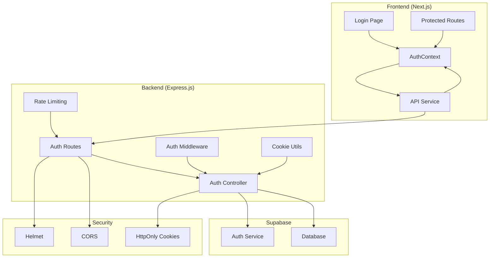
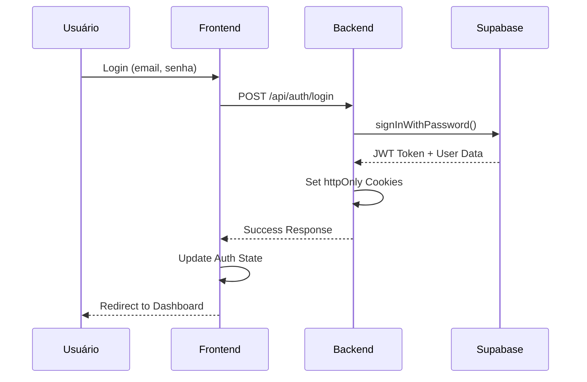
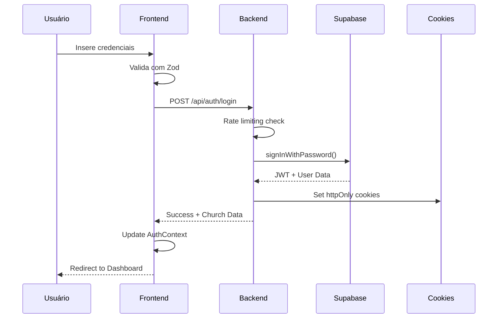
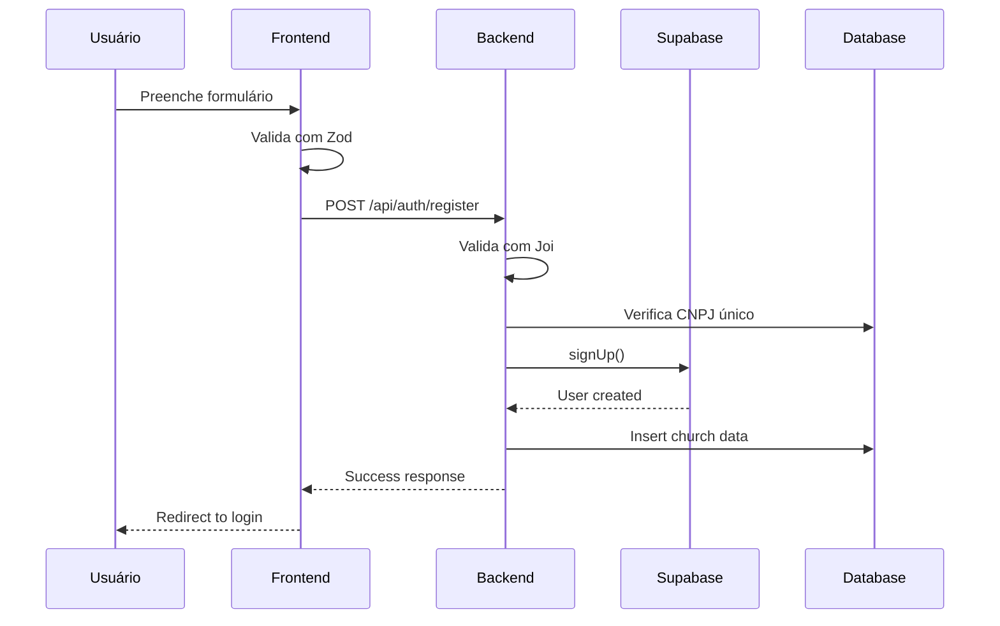
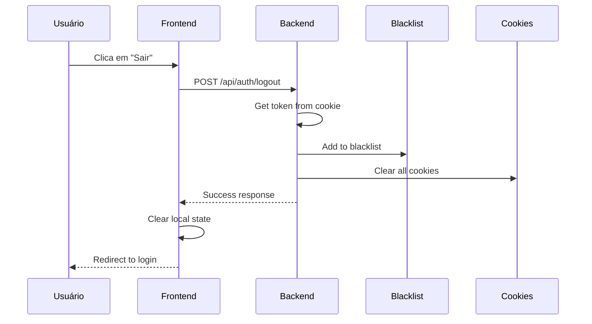
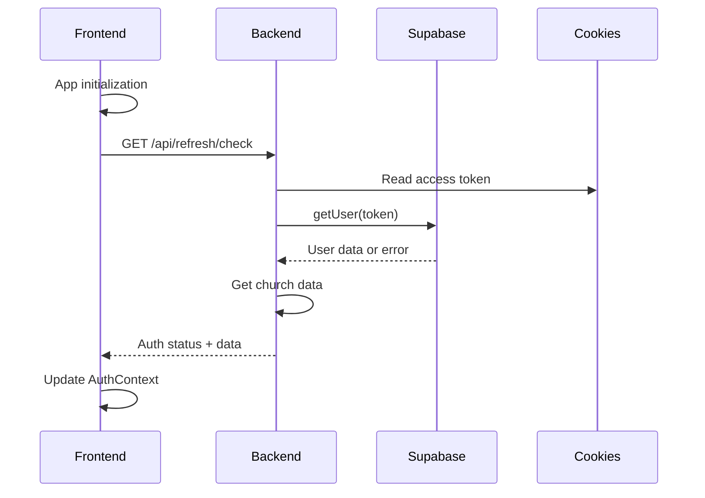

# 🔐 Guia Completo de Autenticação - Flock App

## 📋 Índice

1. [Visão Geral](#visão-geral)
2. [Arquitetura do Sistema](#arquitetura-do-sistema)
3. [Componentes do Backend](#componentes-do-backend)
4. [Componentes do Frontend](#componentes-do-frontend)
5. [Fluxos de Autenticação](#fluxos-de-autenticação)
6. [Segurança Implementada](#segurança-implementada)
7. [Configuração e Deploy](#configuração-e-deploy)
8. [Troubleshooting](#troubleshooting)
9. [Manutenção e Evolução](#manutenção-e-evolução)

---

## 🎯 Visão Geral

### Objetivo
Sistema de autenticação seguro para micro-SaaS de gestão de igrejas, implementado com **Supabase Auth** como provedor principal e **httpOnly cookies** para armazenamento seguro de tokens.

### Características Principais
- ✅ **Autenticação baseada em JWT** via Supabase
- ✅ **Armazenamento seguro** em httpOnly cookies
- ✅ **Rate limiting granular** para proteção contra ataques
- ✅ **Validação robusta** de dados (CNPJ, senhas, etc.)
- ✅ **Logout seguro** com blacklist de tokens
- ✅ **Proteção de rotas** no frontend e backend
- ✅ **Tratamento de erros** padronizado

### Público-Alvo
- **Project Managers**: Visão geral e requisitos
- **Arquitetos**: Estrutura e decisões técnicas
- **Desenvolvedores**: Implementação e manutenção
- **QA**: Testes e validação
- **DevOps**: Deploy e configuração

---

## 🏗️ Arquitetura do Sistema

### Diagrama de Alto Nível



### Fluxo de Dados



---

## 🔧 Componentes do Backend

### 1. Estrutura de Arquivos

```
backend/src/
├── controllers/
│   ├── authController.ts      # Login, registro, logout
│   ├── passwordController.ts  # Recuperação de senha
│   └── refreshController.ts   # Renovação de tokens
├── middlewares/
│   └── auth.ts               # Verificação de autenticação
├── routes/
│   ├── auth.ts              # Rotas de autenticação
│   ├── password.ts          # Rotas de senha
│   └── refresh.ts           # Rotas de renovação
├── validators/
│   ├── churchValidator.ts   # Validação de registro
│   ├── passwordValidator.ts # Validação de senhas
│   ├── cnpjValidator.ts     # Validação de CNPJ
│   └── cnpjSchema.ts        # Schema Joi para CNPJ
├── utils/
│   └── cookieUtils.ts       # Gerenciamento de cookies
└── types/
    └── global.d.ts          # Tipos globais (tokenBlacklist)
```

### 2. Controladores de Autenticação

#### `authController.ts`
**Responsabilidades:**
- Registro de novas igrejas
- Login de usuários
- Logout seguro com blacklist

**Endpoints:**
- `POST /api/auth/register` - Registro de igreja
- `POST /api/auth/login` - Login de usuário
- `POST /api/auth/logout` - Logout seguro

**Características:**
- Validação de dados com Joi
- Verificação de CNPJ duplicado
- Configuração de cookies seguros
- Blacklist de tokens no logout

#### `passwordController.ts`
**Responsabilidades:**
- Recuperação de senha
- Alteração de senha
- Reset de senha com token

**Endpoints:**
- `POST /api/password/forgot` - Solicitar recuperação
- `POST /api/password/reset` - Reset com token
- `POST /api/password/change` - Alterar senha

#### `refreshController.ts`
**Responsabilidades:**
- Renovação de tokens
- Verificação de autenticação
- Status da sessão

**Endpoints:**
- `POST /api/refresh/refresh` - Renovar token
- `GET /api/refresh/check` - Verificar autenticação

### 3. Middleware de Autenticação

#### `auth.ts`
```typescript
// Verificação de token em cookies ou headers
// Validação com Supabase
// Blacklist de tokens revogados
// Adição de usuário ao request
```

**Funcionalidades:**
- Suporte a cookies (preferido) e headers (fallback)
- Verificação de blacklist
- Validação com Supabase Auth
- Injeção de dados do usuário

### 4. Validações

#### `churchValidator.ts`
```typescript
// Validação completa de dados de registro
// Senhas com complexidade
// CNPJ com dígitos verificadores
// Telefone, email, endereço
```

#### `cnpjValidator.ts`
```typescript
// Validação de dígitos verificadores
// Formatação e limpeza
// Geração de CNPJs válidos para testes
```

### 5. Utilitários de Cookies

#### `cookieUtils.ts`
```typescript
// Configuração de cookies seguros
// httpOnly, SameSite, Secure
// Limpeza de cookies
// Diferentes configurações para dev/prod
```

---

## 🎨 Componentes do Frontend

### 1. Estrutura de Arquivos

```
frontend/src/
├── context/
│   └── AuthContext.tsx       # Estado global de autenticação
├── services/
│   └── api.ts               # Cliente HTTP com interceptors
├── components/
│   └── ProtectedRoute.tsx   # Proteção de rotas
├── app/(auth)/
│   ├── login/page.tsx       # Página de login
│   ├── register/page.tsx    # Página de registro
│   └── reset-password/      # Páginas de recuperação
└── types/
    └── index.ts             # Interfaces TypeScript
```

### 2. Context de Autenticação

#### `AuthContext.tsx`
**Responsabilidades:**
- Estado global de autenticação
- Gerenciamento de sessão
- Inicialização automática
- Métodos de login/logout

**Estados:**
- `user`: Dados da igreja
- `session`: Dados da sessão
- `isLoading`: Estado de carregamento
- `isOperationLoading`: Operações em andamento

**Métodos:**
- `login()`: Autenticação
- `register()`: Registro
- `logout()`: Logout seguro
- `forgotPassword()`: Recuperação
- `changePassword()`: Alteração
- `resetPassword()`: Reset

### 3. Serviço de API

#### `api.ts`
**Responsabilidades:**
- Cliente HTTP configurado
- Interceptors para tratamento de erros
- Gerenciamento automático de cookies
- Redirecionamento em caso de 401

**Configurações:**
- `withCredentials: true` para cookies
- Timeout de 10 segundos
- Headers padrão
- Interceptors de request/response

### 4. Proteção de Rotas

#### `ProtectedRoute.tsx`
**Funcionalidades:**
- Verificação de autenticação
- Redirecionamento automático
- Loading state
- Proteção de componentes filhos

### 5. Páginas de Autenticação

#### Login (`login/page.tsx`)
- Validação com Zod
- Senhas com complexidade
- Tratamento de erros
- Redirecionamento automático

#### Registro (`register/page.tsx`)
- Validação completa de dados
- CNPJ com validação
- Confirmação de senha
- Estados de loading

#### Recuperação de Senha
- Solicitação de reset
- Reset com token
- Validação de senhas

---

## 🔄 Fluxos de Autenticação

### 1. Fluxo de Login



### 2. Fluxo de Registro



### 3. Fluxo de Logout



### 4. Fluxo de Verificação de Auth



---

## 🛡️ Segurança Implementada

### 1. Rate Limiting

| Endpoint | Limite | Janela | Propósito |
|----------|--------|--------|-----------|
| `/api/auth/login` | 10 req | 15 min | Prevenir força bruta |
| `/api/auth/register` | 3 req | 1 hora | Prevenir spam |
| `/api/password/forgot` | 5 req | 1 hora | Prevenir abuso |
| `/api/password/change` | 5 req | 15 min | Prevenir ataques |
| Geral | 1000 req | 15 min | Proteção DDoS |

### 2. Cookies Seguros

```typescript
// Configurações de segurança
{
  httpOnly: true,        // Não acessível via JavaScript
  secure: production,    // HTTPS apenas em produção
  sameSite: 'strict',   // Proteção CSRF
  path: '/',            // Disponível em toda aplicação
  maxAge: 15 * 60 * 1000 // 15 minutos
}
```

### 3. Validações de Segurança

#### Senhas
- Mínimo 8 caracteres
- Pelo menos 1 letra minúscula
- Pelo menos 1 letra maiúscula
- Pelo menos 1 número
- Validação no frontend e backend

#### CNPJ
- Validação de dígitos verificadores
- Verificação de CNPJs inválidos (todos iguais)
- Formatação e limpeza
- Unicidade no banco de dados

#### Dados Gerais
- Sanitização de entrada
- Validação de tipos
- Tamanhos mínimos/máximos
- Formatos específicos

### 4. Headers de Segurança

```typescript
// Helmet configuração
app.use(helmet({
  contentSecurityPolicy: {
    directives: {
      defaultSrc: ["'self'"],
      styleSrc: ["'self'", "'unsafe-inline'"],
      scriptSrc: ["'self'"],
      imgSrc: ["'self'", "data:", "https:"],
    },
  },
  hsts: {
    maxAge: 31536000,
    includeSubDomains: true,
    preload: true
  }
}));
```

### 5. CORS Configurado

```typescript
// Configuração CORS
app.use(cors({
  origin: process.env.FRONTEND_URL,
  credentials: true,
  methods: ['GET', 'POST', 'PUT', 'DELETE', 'OPTIONS'],
  allowedHeaders: ['Content-Type', 'Authorization', 'Cookie'],
  optionsSuccessStatus: 200
}));
```

---

## ⚙️ Configuração e Deploy

### 1. Variáveis de Ambiente

#### Backend (.env)
```bash
# Supabase
SUPABASE_URL=your_supabase_url
SUPABASE_ANON_KEY=your_supabase_anon_key
SUPABASE_SERVICE_ROLE_KEY=your_service_role_key

# Application
NODE_ENV=production
PORT=4000
FRONTEND_URL=https://your-domain.com

# Security
JWT_SECRET=your_jwt_secret
COOKIE_SECRET=your_cookie_secret
```

#### Frontend (.env.local)
```bash
NEXT_PUBLIC_API_URL=https://your-api-domain.com/api
NEXT_PUBLIC_SUPABASE_URL=your_supabase_url
NEXT_PUBLIC_SUPABASE_ANON_KEY=your_supabase_anon_key
```

### 2. Configuração de Produção

#### Cookies Seguros
```typescript
// Em produção, cookies devem ser:
{
  secure: true,        // Apenas HTTPS
  sameSite: 'strict',  // Máxima proteção CSRF
  domain: '.yourdomain.com', // Domínio específico
  httpOnly: true       // Não acessível via JS
}
```

#### HTTPS Obrigatório
- Certificado SSL válido
- Redirecionamento HTTP → HTTPS
- HSTS habilitado
- Cookies seguros

### 3. Deploy Checklist

- [ ] Variáveis de ambiente configuradas
- [ ] HTTPS habilitado
- [ ] CORS com domínio correto
- [ ] Rate limiting ativo
- [ ] Logs de produção configurados
- [ ] Monitoramento de segurança
- [ ] Backup de dados
- [ ] Testes de integração

---

## 🔧 Troubleshooting

### 1. Problemas Comuns

#### Login não funciona
```bash
# Verificar logs
tail -f logs/app.log

# Verificar cookies
# DevTools > Application > Cookies
# Deve mostrar cookies httpOnly
```

#### Logout não limpa sessão
```bash
# Verificar blacklist
console.log(global.tokenBlacklist)

# Verificar limpeza de cookies
# DevTools > Network > Response Headers
# Deve mostrar Set-Cookie com Max-Age=0
```

#### CORS errors
```bash
# Verificar configuração
echo $FRONTEND_URL

# Verificar headers
curl -H "Origin: https://yourdomain.com" \
     -H "Access-Control-Request-Method: POST" \
     -H "Access-Control-Request-Headers: Content-Type" \
     -X OPTIONS https://your-api.com/api/auth/login
```

### 2. Debug de Autenticação

#### Verificar estado do usuário
```typescript
// Frontend
const { user, session, isAuthenticated } = useAuth();
console.log({ user, session, isAuthenticated });

// Backend
console.log('User:', req.user);
console.log('Token:', req.cookies.flock_access_token);
```

#### Verificar cookies
```typescript
// Verificar se cookies estão sendo enviados
app.get('/debug/cookies', (req, res) => {
  res.json({
    cookies: req.cookies,
    headers: req.headers.cookie
  });
});
```

### 3. Logs de Segurança

#### Monitoramento de tentativas
```typescript
// Rate limiting logs
app.use((req, res, next) => {
  if (req.rateLimit) {
    console.log(`Rate limit: ${req.rateLimit.remaining}/${req.rateLimit.limit}`);
  }
  next();
});
```

#### Logs de autenticação
```typescript
// Login attempts
console.log(`Login attempt: ${email} from ${req.ip}`);

// Failed logins
console.log(`Failed login: ${email} from ${req.ip} - ${error.message}`);
```

---

## 🔄 Manutenção e Evolução

### 1. Monitoramento

#### Métricas Importantes
- Taxa de sucesso de login
- Tentativas de login falhadas
- Uso de rate limiting
- Tempo de resposta de autenticação
- Erros de validação

#### Alertas Recomendados
- Muitas tentativas de login falhadas
- Uso excessivo de rate limiting
- Erros de validação de CNPJ
- Falhas de autenticação

### 2. Melhorias Futuras

#### Curto Prazo
- [ ] Logs estruturados (Winston)
- [ ] Métricas de performance
- [ ] Testes automatizados
- [ ] Documentação de API

#### Médio Prazo
- [ ] Redis para blacklist
- [ ] 2FA (autenticação de dois fatores)
- [ ] Auditoria de ações
- [ ] Notificações de segurança

#### Longo Prazo
- [ ] SSO (Single Sign-On)
- [ ] Integração com Active Directory
- [ ] Biometria
- [ ] Machine Learning para detecção de anomalias

### 3. Manutenção Preventiva

#### Atualizações de Segurança
- Dependências atualizadas
- Patches de segurança
- Revisão de configurações
- Testes de penetração

#### Backup e Recuperação
- Backup de configurações
- Backup de dados de usuários
- Plano de recuperação
- Testes de disaster recovery

---

## 📚 Referências e Recursos

### Documentação Técnica
- [Supabase Auth Documentation](https://supabase.com/docs/guides/auth)
- [Express.js Security Best Practices](https://expressjs.com/en/advanced/best-practice-security.html)
- [Next.js Authentication Patterns](https://nextjs.org/docs/authentication)

### Ferramentas de Segurança
- [OWASP Top 10](https://owasp.org/www-project-top-ten/)
- [Helmet.js Documentation](https://helmetjs.github.io/)
- [Rate Limiting Strategies](https://expressjs.com/en/guide/behind-proxies.html)

### Testes de Segurança
- [Security Testing Checklist](https://owasp.org/www-project-web-security-testing-guide/)
- [Authentication Testing](https://portswigger.net/web-security/authentication)
- [Cookie Security Testing](https://owasp.org/www-community/controls/SecureCookieAttribute)

---

## 📞 Suporte e Contato

### Equipe de Desenvolvimento
- **Arquitetura**: Decisões técnicas e estrutura
- **Backend**: Implementação e APIs
- **Frontend**: Interface e experiência
- **DevOps**: Deploy e infraestrutura
- **QA**: Testes e validação

### Canais de Comunicação
- **Issues**: GitHub Issues para bugs
- **Documentação**: Este guia e docs/
- **Code Review**: Pull requests
- **Monitoramento**: Logs e métricas

---

*Documentação atualizada em: $(date)*
*Versão: 1.0.0*
*Última revisão: $(date)*
