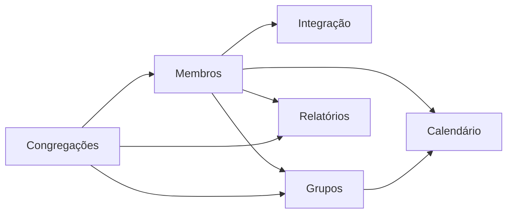

# Diagnóstico — Estado Atual do Módulo 13 e Operações do Sistema

> **Tipo:** Diagnóstico de produto  
> **Data:** Junho 2026

---

## 1. Situação do módulo Tutoriais

### O que existe hoje

| Aspecto | Estado |
|---------|--------|
| Rota | `/tutorials` em `frontend/src/app/(main)/tutorials/page.tsx` |
| Navegação | Item "Tutoriais" na sidebar (`Sidebar.tsx`, ícone `BookOpen`) |
| Conteúdo | Placeholder: ícone `Construction` + "Em desenvolvimento..." |
| API | Nenhuma |
| Banco | Nenhuma tabela |
| Permissões | Acessível a qualquer usuário autenticado (mesmo layout `(main)`) |

### Problema identificado (levantamento §5.6)

A presença do item na sidebar **cria expectativa** de ajuda, mas a página não entrega valor. Usuários iniciantes — especialmente após onboarding — não têm um ponto único de referência dentro do app.

### Lacuna de onboarding pós-login

O fluxo atual cobre bem:

1. Registro da igreja (Módulo 2)
2. Checkout/plano (Módulo 10)
3. Uso operacional dos módulos (3–8)

Porém **não há ponte educacional** entre "acabei de entrar" e "sei usar o sistema". O usuário depende de exploração por tentativa e erro ou de suporte externo.

---

## 2. Mapa das operações reais (como o app funciona hoje)

Análise baseada em `docs/levantamento-fluxos.md`, páginas frontend e documentação QA.

### 2.1 Relatórios / Analytics (`/` — Painel)

**Objetivo:** Visão analítica da membresia.

**Como o usuário opera hoje:**

1. Acessa "Painel" na sidebar (rota `/`)
2. Usa `ViewSelector` para filtrar: **Todas**, **Sede** ou **Congregação específica**
3. Visualiza seções: cards resumo, demografia, grupos, estrutura, timeline, geografia, ocupações
4. Pode **atualizar** dados (botão refresh) e **exportar PDF** do dashboard

**Padrões de UI:** `ProtectedRoute` (única rota com proteção explícita), skeleton de loading, estados de erro com retry, toast em falhas.

**Permissões:** Todos os papéis (`reader+`) — somente leitura.

**Dependências:** Dados vêm de `GET /api/members/reports`; export via `GET /api/export/dashboard/pdf`.

---

### 2.2 Gestão de Membros (`/members`)

**Objetivo:** CRUD completo da membresia.

**Como o usuário opera hoje:**

| Operação | Como acessar | Quem pode |
|----------|--------------|-----------|
| Listar / buscar / filtrar | Página principal com `MemberSearchInput`, `MemberFiltersBar`, chips de filtros ativos | Todos |
| Alternar lista/cards | `ViewModeSelector` | Todos |
| Ver detalhes | Click no membro → `ViewMemberModal` | Todos |
| Cadastrar | Botão "Adicionar membro" → `CreateMemberModal` | Editor+ |
| Editar | Modal de edição | Editor+ |
| Desativar / reativar | Modais de confirmação | Editor+ |
| Excluir | `DeleteMemberModal` | Editor+ |
| Importar CSV | Botão upload → validação + preview + import | Editor+ |
| Exportar PDF/CSV | Modais de export | Todos |
| Links de autocadastro | `RegistrationLinksModal` | Admin+ (visualizar/copiar para reader) |

**Formulário:** `MemberForm` extenso — nome, contatos, datas, gênero, estado civil, documentos, endereço (CEP com auto-complete), batismo, cargo, congregação, etc.

**Alertas:** Header exibe limite de membros do plano; evento `memberUpdated` atualiza contador.

**Permissões UI:** Botões desabilitados com tooltip `"Seu usuário tem permissão apenas de leitura nesta igreja."` quando `canEdit === false`.

---

### 2.3 Integração de Novos Membros (`/integration`)

**Objetivo:** Funil pré-membresia (visitantes/candidatos antes de virar membro formal).

**Como o usuário opera hoje:**

| Operação | Como acessar | Quem pode |
|----------|--------------|-----------|
| Listar / filtrar | Busca + `IntegrationFiltersBar` (status, congregação, mentor) | Todos |
| Cadastrar integrante | "Adicionar integrante" | Editor+ |
| Ver / editar / excluir | Modais correspondentes | Editor+ (ver: todos) |
| Converter para membro | `ConvertIntegrationModal` → preenche `MemberForm` | Editor+ |
| Descartar integrante | Ação na visão detalhada | Editor+ |
| Exportar lista PDF | Modal de export | Todos |
| Links de autointegração | `IntegrationLinksModal` | Editor+ |

**Status do integrante:** fluxo inclui estados como integrado, descartado, etc. Após conversão, integrante permanece na lista com status `integrado`.

**Relação com Membros:** conversão verifica limite do plano (`checkMemberLimit`) antes de criar membro.

---

### 2.4 Gestão de Congregações (`/congregations`)

**Objetivo:** Estrutura organizacional (filiais, pontos).

**Como o usuário opera hoje:**

| Operação | Como acessar | Quem pode |
|----------|--------------|-----------|
| Listar / buscar | Lista + campo de busca | Todos |
| Ver detalhes | Click → `CongregationModal` | Todos |
| Criar | "Adicionar congregação" | Editor+ |
| Editar / excluir | Modais | Editor+ |
| Exportar PDF | Botão na header | Todos |

**Formulário:** nome, endereço, cidade/UF (IBGE), líder (membro), telefone.

**Impacto cruzado:** congregações aparecem em membros, integração, grupos, calendário e relatórios.

---

### 2.5 Gestão de Grupos (`/groups`)

**Objetivo:** Ministérios, células, departamentos e composição.

**Como o usuário opera hoje:**

| Operação | Como acessar | Quem pode |
|----------|--------------|-----------|
| Listar / filtrar | `GroupFiltersBar` (congregação, tipo, status) + busca | Todos |
| Resumo | `GroupSummaryBar` (contagens por tipo) | Todos |
| Criar grupo | Modal com `GroupForm` | Editor+ |
| Ver / editar / excluir | `GroupModal` e modais | Editor+ |
| Gerenciar membros do grupo | Dentro do modal de detalhe | Editor+ |
| Exportar lista de grupos | Botão na header | Todos |

**Formulário:** nome, tipo (enum extenso), descrição, congregação/sede, responsável (membro), status ativo/inativo.

---

### 2.6 Calendário e Eventos (`/calendar`)

**Objetivo:** Agenda de cultos, reuniões e atividades.

**Como o usuário opera hoje:**

| Operação | Como acessar | Quem pode |
|----------|--------------|-----------|
| Visualizar mês | Aba "Calendário" → `CalendarMonth` | Todos |
| Visualizar ano | Aba "Lista" → `CalendarListView` | Todos |
| Filtrar | `CalendarFiltersHorizontal` (tipo, congregação, grupo, datas) | Todos |
| Ver aniversariantes | Badge/contador → modal de aniversários | Todos |
| Criar evento | "Novo evento" ou click em dia vazio | Editor+ |
| Ver / editar / excluir | Click no evento → modais | Editor+ |
| Participantes | Formulário com membros e convidados externos | Editor+ |
| Recorrência | Campo no `CalendarItemForm` | Editor+ |
| Exportar PDF | Botão na header | Todos |

---

## 3. Padrões transversais relevantes para tutoriais

### Permissões (Módulo transversal §4.2)

| Papel | Capacidade |
|-------|------------|
| `reader` | Visualizar tudo; botões de escrita desabilitados |
| `editor` | CRUD em membros, integração, grupos, congregações, calendário |
| `admin` | editor + church, conta, usuários, plano, logs |
| `owner` | admin + exclusão de conta |

**Implicação para tutoriais:** cada guia de "ação" deve indicar claramente o papel mínimo. Guias de "consulta" servem para todos.

### Padrões de UI recorrentes

- `PageHeader` com título + subtítulo + ações à direita
- Modais para CRUD (não páginas separadas)
- Filtros horizontais + chips de filtros ativos
- Toasts (`react-hot-toast`) para feedback
- Tooltips em botões desabilitados para readers
- Skeletons durante loading
- Exportações via download de blob PDF

### Ordem lógica sugerida para iniciantes

Congregações estruturam o restante; membros são o core; integração é o funil de entrada; grupos e calendário dependem de membros/congregações; relatórios consolidam tudo.

---

## 4. Usuários impactados

| Persona | Necessidade | Dor atual |
|---------|-------------|-----------|
| **Secretário(a) recém-cadastrado(a)** | Cadastrar membros, gerar relatórios | Não sabe por onde começar; formulário extenso intimida |
| **Pastor/líder (reader)** | Consultar relatórios e listas | Não distingue o que pode fazer vs. o que precisa pedir ao editor |
| **Admin da igreja** | Configurar estrutura (congregações, links) | Não entende ordem ideal de setup |
| **Editor voluntário** | Operar integração e grupos | Confunde integração vs. membro |

---

## 5. Riscos se o módulo continuar vazio

- Aumento de tickets de suporte para operações básicas
- Baixa adoção de features avançadas (import CSV, links públicos, filtros)
- Frustração na sidebar ("prometeu ajuda e não entregou")
- Curva de aprendizado mais longa → menor retenção nas primeiras semanas

---

## 6. Conclusão do diagnóstico

O Flock possui **fluxos maduros e bem mapeados** nos módulos 3–8, com UI consistente (modais, filtros, PageHeader). O gap não é funcional — é **educacional e de descoberta**.

A solução deve:

1. Espelhar a **navegação real** (mesmos nomes da sidebar)
2. Ser **consultável em < 2 minutos** por tarefa
3. Respeitar **papéis de permissão**
4. Não duplicar a complexidade dos formulários — focar no "como chegar lá" e nos passos essenciais
5. Preferir implementação **leve** (estático) no MVP, evitando CMS/backend prematuro
